# 网络安全系统教程：P78：65.Neo-reGeorg 🔧

在本节课中，我们将学习如何使用Neo-reGeorg工具建立HTTP隧道代理。Neo-reGeorg是reGeorg的重构增强版本，它在功能、安全性和数据传输保密性方面都有显著提升。我们将通过一个具体的实例，演示如何生成服务端脚本、上传至目标服务器，并最终建立一条通往目标内网的代理通道。

## 工具概述与对比

上一节我们介绍了reGeorg的基本用法，本节中我们来看看它的增强版——Neo-reGeorg。

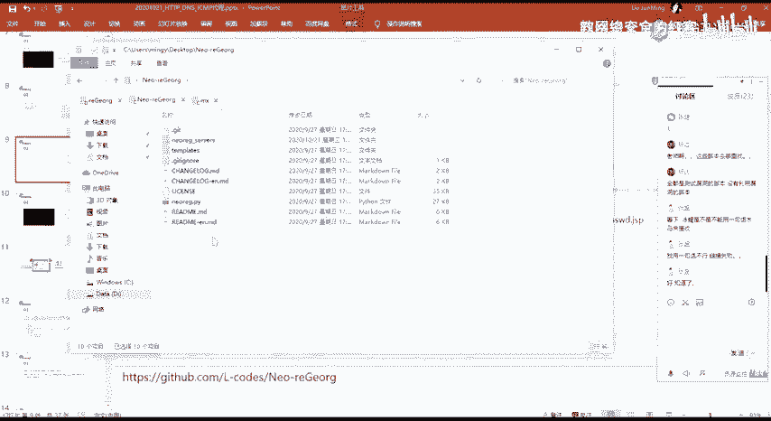

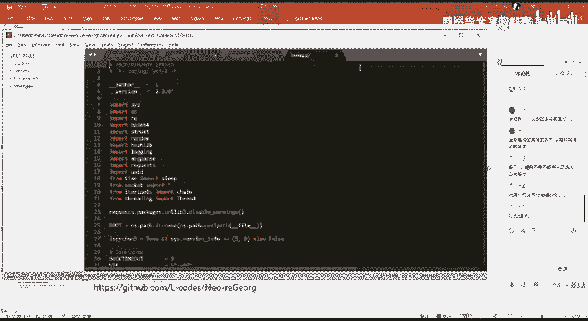

Neo-reGeorg是对reGeorg工具的重构与增强。它的核心功能与reGeorg相同，都是建立HTTP隧道代理。但Neo-reGeorg在安全性、功能以及数据传输的保密性方面都更为出色，因此在实际应用中会更推荐使用。

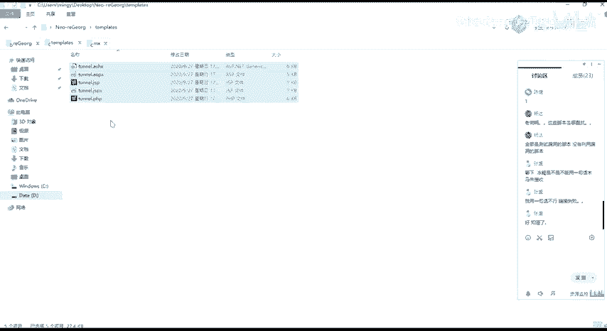

关于该工具的具体参数使用，课程PPT中已提供详细说明，大家可以自行查阅。其基本使用流程与reGeorg类似。

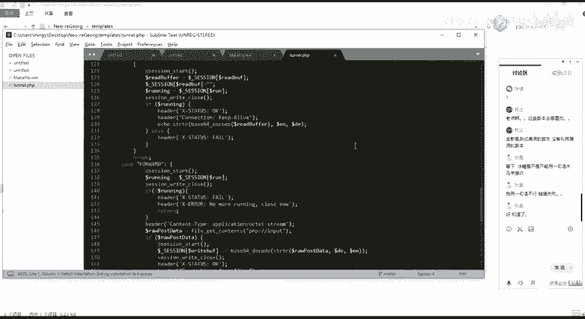

## 环境准备与脚本生成

首先，我们需要获取Neo-reGeorg工具。工具包中主要包含一个Python脚本（用于启动客户端服务）和一个`templates`目录。

`templates`目录中存放了支持的五种服务器脚本模板（如JSP、PHP等）。我们的第一步是基于这些模板，生成一个包含特定密码的服务端脚本文件。

以下是生成脚本的核心命令：
```bash
python neoreg.py generate -k <你的密码>
```
执行该命令后，会在当前目录下生成一个文件夹，里面包含了各种语言的服务端脚本文件。其中，`-k`选项指定的密码至关重要，它是客户端连接服务端时必须提供的验证凭证，这大大增强了工具的安全性。

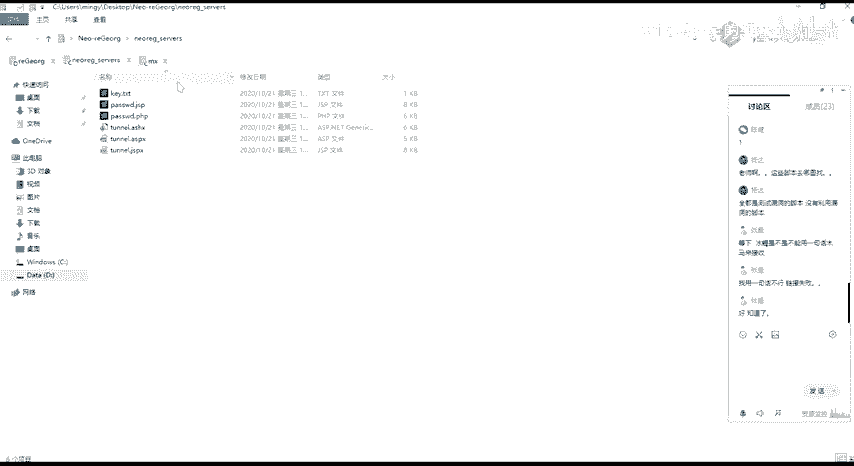

## 上传脚本与建立隧道

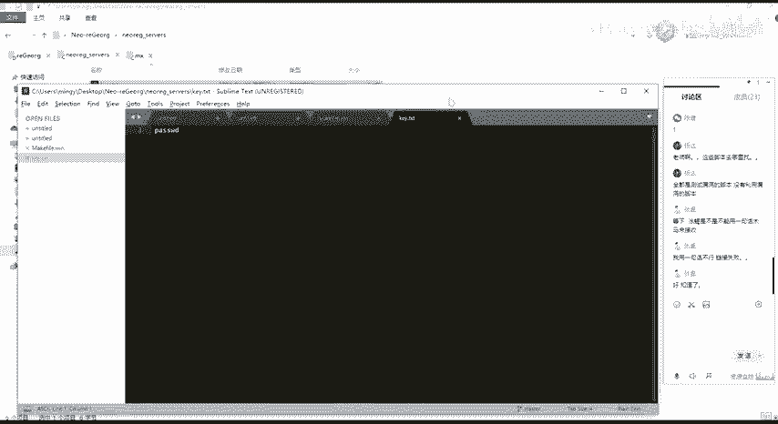

生成脚本后，我们需要将合适的服务端脚本（例如JSP文件）上传到目标Web服务器的可访问目录下。

上传成功后，应通过浏览器访问该脚本的URL，以确认脚本能被服务器正常解析且不报错。如果页面空白或返回正常，通常意味着脚本已就绪。

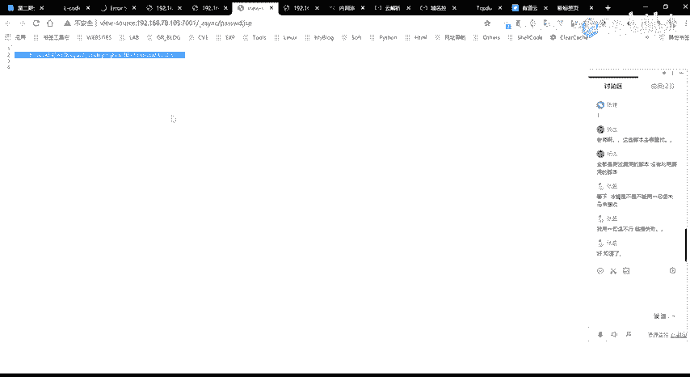

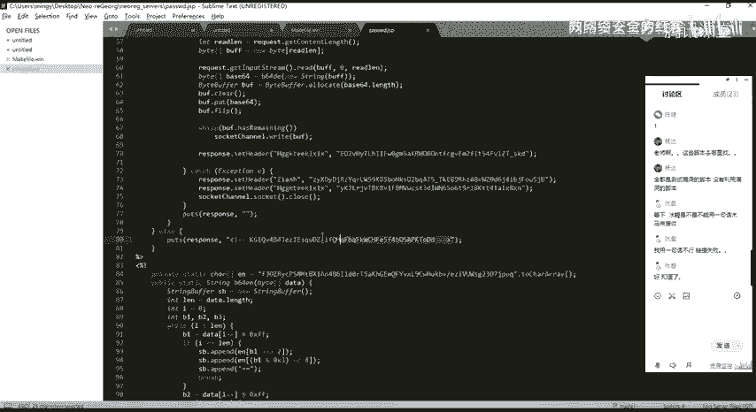

接下来，我们使用Neo-reGeorg的Python客户端脚本建立代理隧道。在此之前，请确保关闭其他占用端口的程序。

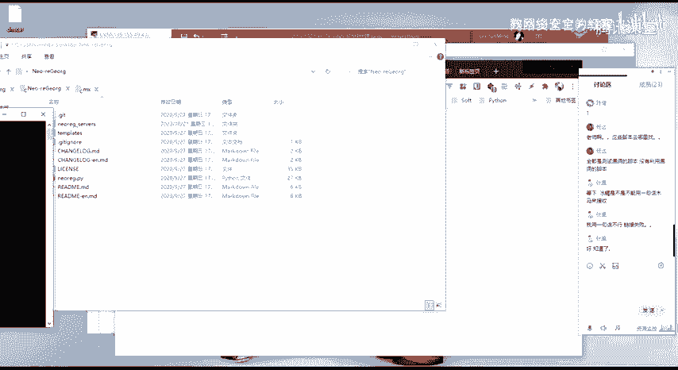

建立隧道的基本命令结构如下：
```bash
python neoreg.py -u <服务端脚本URL> -k <生成脚本时使用的密码> -p <本地监听端口>
```
以下是各参数说明：
*   `-u`: 指定上传到目标服务器的脚本访问地址。
*   `-k`: 指定生成脚本时设置的密码，用于连接验证。
*   `-p`: 指定在本地开启的SOCKS5代理端口（默认为1080）。

命令执行成功后，客户端会在本地指定端口启动一个SOCKS5代理服务。

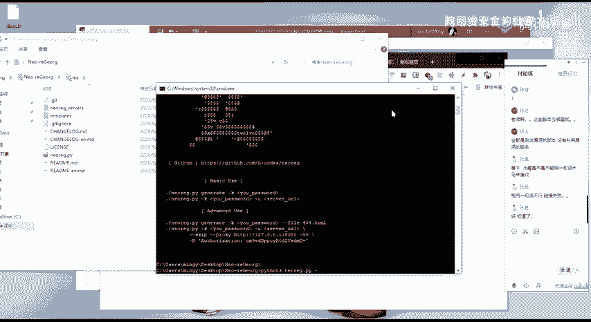

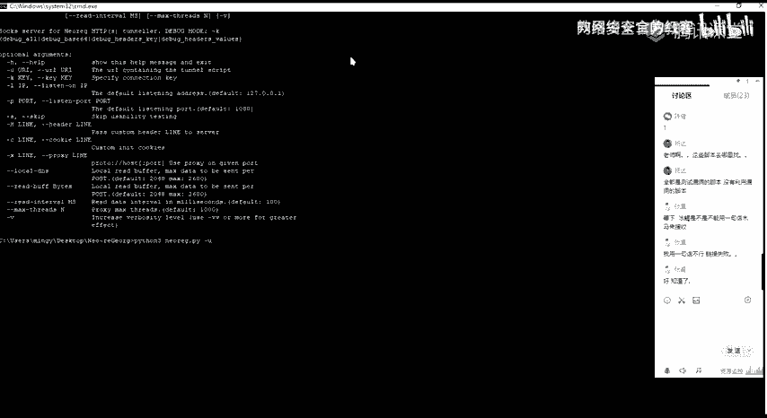

## 隧道验证与应用

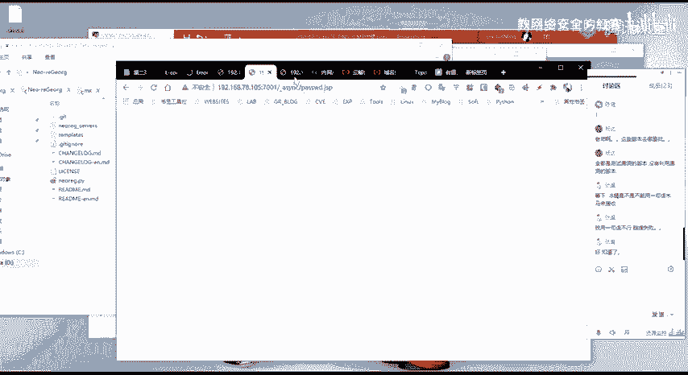

隧道建立后，我们需要验证其是否正常工作。

验证方法很简单：将浏览器或其他工具的代理设置为`127.0.0.1:1080`（即上一步指定的本地端口），然后尝试访问目标内网的IP地址或服务。

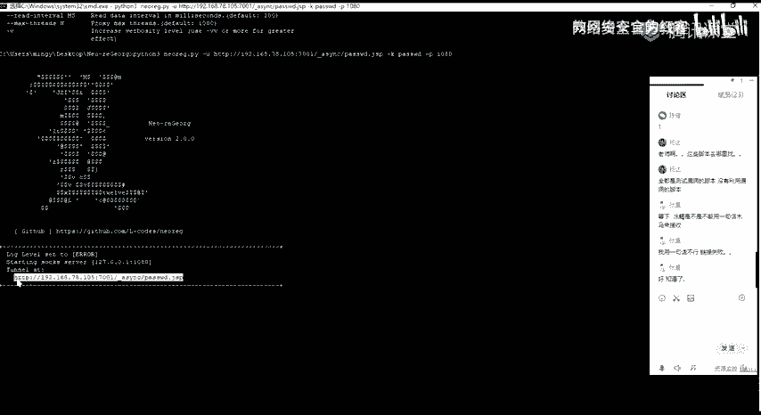

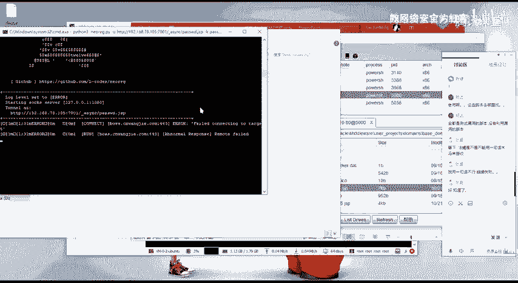

如果能够成功访问到内网资源，则证明HTTP隧道代理已成功建立，所有流量都通过目标服务器上的脚本进行了转发。

## 总结

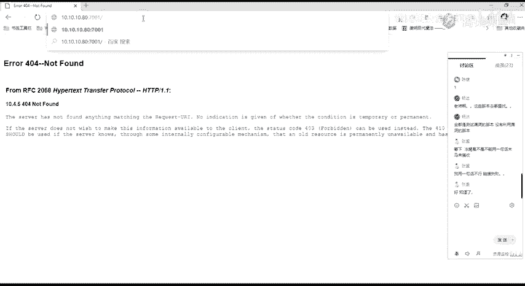

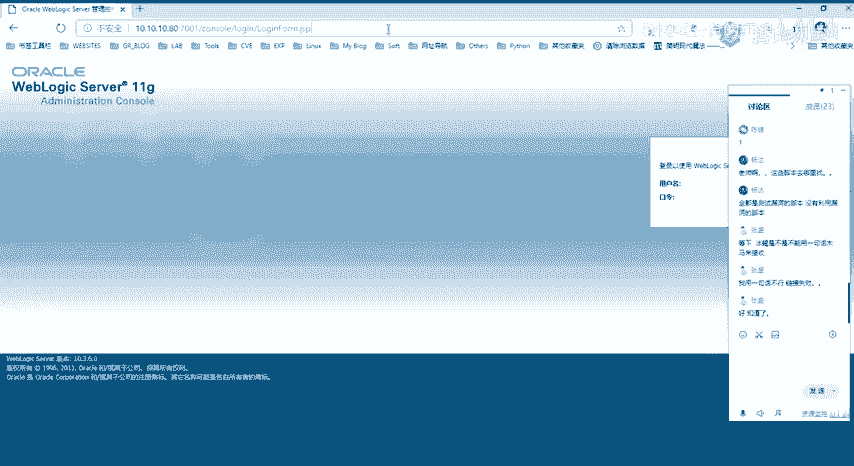

本节课中我们一起学习了Neo-reGeorg工具的使用。我们了解到它是reGeorg的增强版，通过密码验证提升了安全性。其使用流程分为三步：首先用`generate`命令生成服务端脚本；然后将脚本上传至目标服务器；最后使用客户端命令连接脚本，建立本地到目标内网的SOCKS5代理隧道。

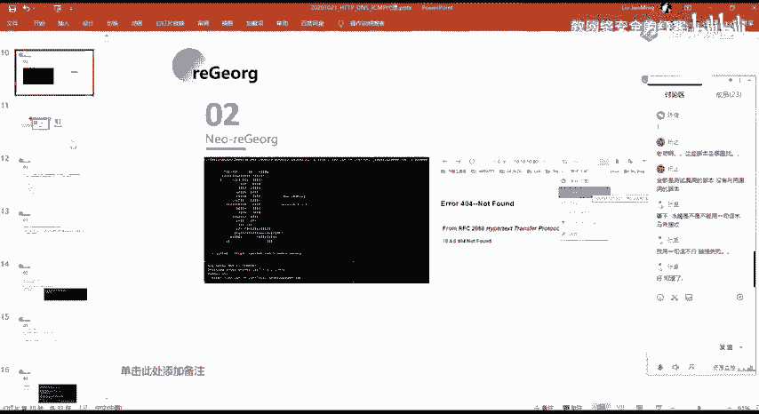

Neo-reGeorg与reGeorg的实现原理相同，都是利用HTTP隧道进行流量转发，但前者在安全性和易用性上更胜一筹，是内网穿透中非常实用的工具。