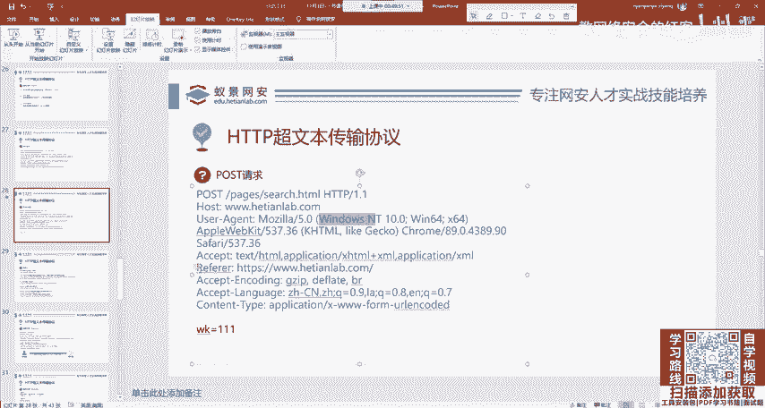
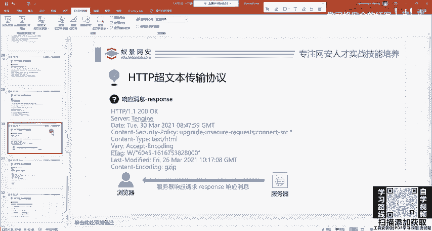
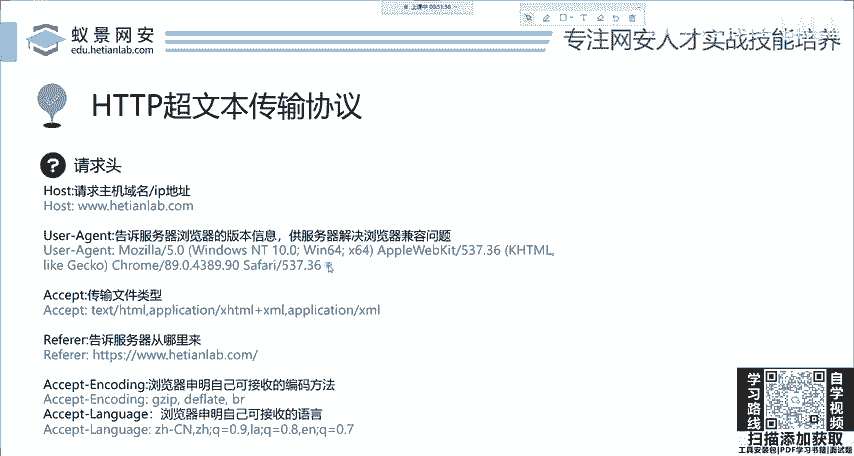
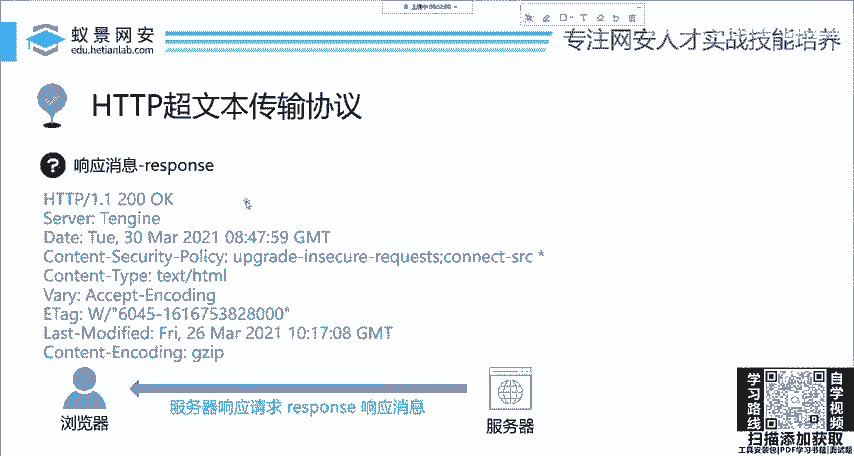
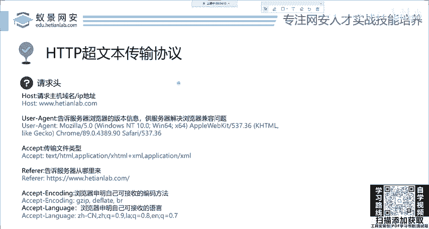

# 网络安全系统教程：7：HTTP基础-请求头 🧩

在本节课中，我们将要学习HTTP协议中请求头（Request Headers）的核心概念与作用。请求头是客户端发送给服务器的附加信息，用于告知服务器关于本次请求的更多细节，例如客户端的能力、来源以及状态等。理解这些头部字段对于后续学习Web应用安全至关重要。

上一节我们介绍了HTTP请求的基本结构，本节中我们来看看构成请求的重要组成部分——请求头。

---

## Referer字段：来源统计 📊

`Referer` 请求头用于告知服务器当前请求是从哪个页面链接而来的。其核心作用是统计访问来源。

例如，某网络安全实验室在百度投放了广告。当用户通过百度搜索并点击广告链接进入实验室网站时，该请求的 `Referer` 头就会包含百度的网址。后端程序员可以通过检查这个头部的值来统计有多少用户是通过百度广告访问网站的，从而评估广告效果。如果统计发现点击量很少，后续可能就不再选择该广告渠道。

## Accept相关字段：协商内容类型与语言 🌐

以下是一组用于内容协商的请求头，它们告诉服务器客户端能够处理哪些类型的内容。

*   **Accept**: 指定客户端能够接收的响应内容类型。例如 `text/html` 表示期望接收HTML文档。
*   **Accept-Encoding**: 指定客户端能够理解的内容编码方式，如 `gzip`。
*   **Accept-Language**: 指定客户端偏好的自然语言，如 `zh-CN` 表示简体中文。

这些头部确保了服务器返回的内容与客户端兼容。例如，如果服务器只能提供日语页面，但客户端的 `Accept-Language` 未包含日语，服务器可能会返回错误或默认页面，以避免客户端显示乱码。

## Cookie字段：维持会话状态 🍪

`Cookie` 是一个至关重要的请求头，用于解决HTTP无状态协议带来的问题。由于HTTP协议本身不记录之前的请求和响应，这会导致用户每次访问网站都需要重新登录。

Cookie机制的工作原理如下：
1.  用户首次登录网站（如百度贴吧）时，服务器验证成功后，会在响应中通过 `Set-Cookie` 头部发送一个令牌（即Cookie）给浏览器。
2.  浏览器保存此Cookie。之后，浏览器向同一网站发起的每一个请求，都会自动在 `Cookie` 请求头中携带这个令牌。
3.  服务器通过验证请求中的Cookie，就能识别出用户身份，维持其登录状态，无需再次输入密码。

在安全领域，Cookie常被视为用户的“会话令牌”。攻击者如果窃取到用户的Cookie，就相当于获得了该用户的身份凭证，可以在无需知道账号密码的情况下，以该用户的身份进行任何操作。因此，保护Cookie安全是Web安全防御的重点之一。

---

本节课中我们一起学习了HTTP请求头的几个关键字段：`Referer` 用于来源追踪与统计；`Accept`、`Accept-Encoding` 和 `Accept-Language` 用于客户端与服务器的内容协商；`Cookie` 则是维持用户会话状态、实现身份认证的核心机制。理解这些头部字段的功能，是分析Web流量、进行渗透测试和漏洞挖掘的基础。