# 网络安全系统教程：P84：71.常见提权工具 🥔

在本节课中，我们将要学习渗透测试中一个关键的环节——提权。我们将重点介绍几种常见的提权工具与脚本，特别是“烂土豆”（Rotten Potato）及其原理，并了解如何利用Token窃取技术来提升权限。这些知识对于理解系统漏洞利用至关重要。

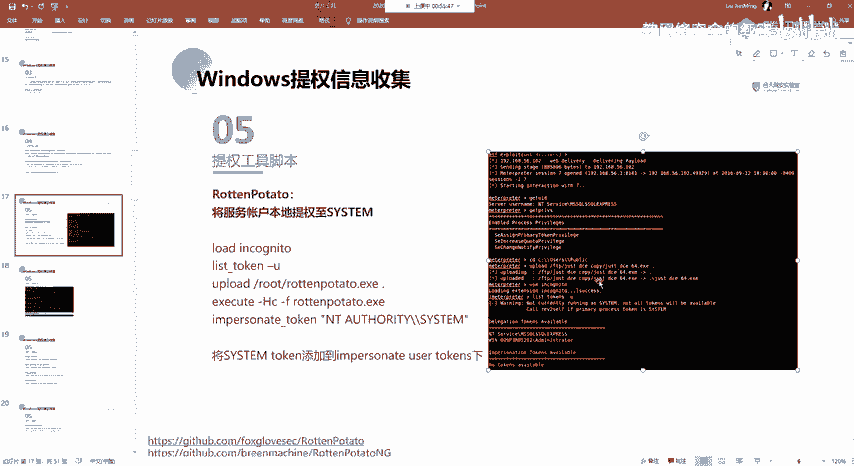

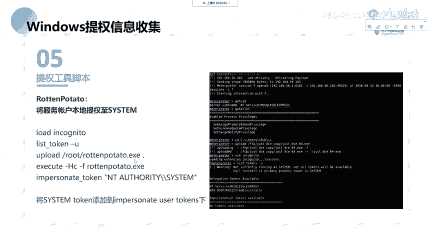

## 提权工具介绍

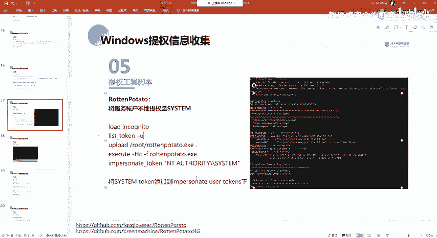

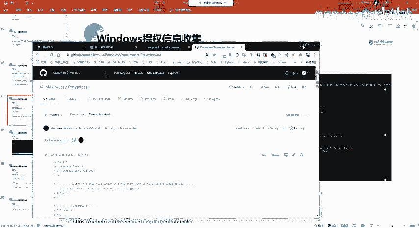

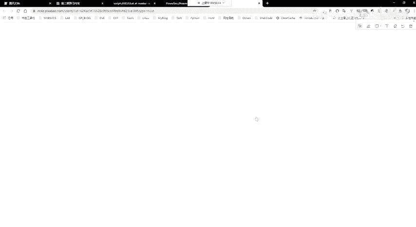

上一节我们介绍了提权的基本概念，本节中我们来看看一些具体的工具。以下是几种常用的提权工具与脚本。

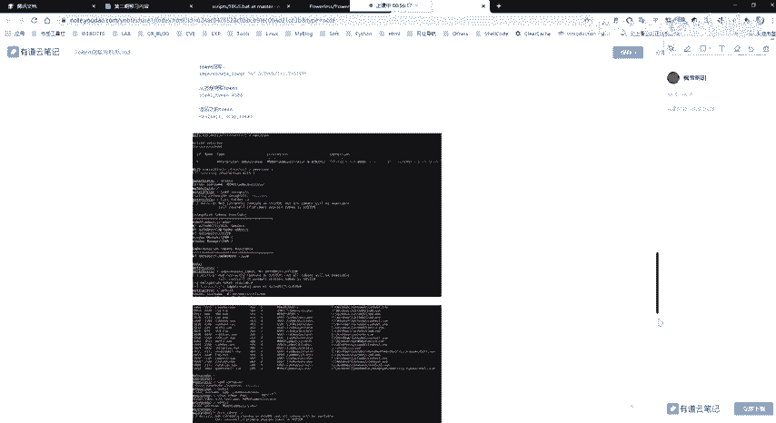

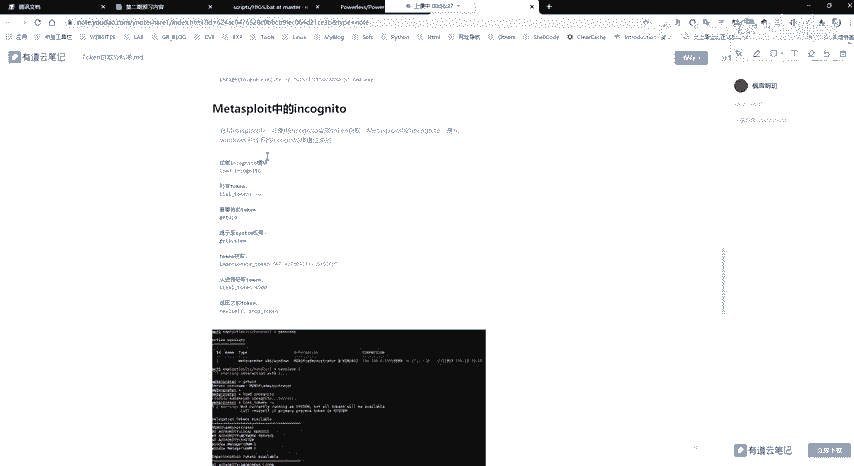

*   **Rotten Potato（烂土豆）**：这是一个非常流行的本地提权工具。它的作用是将一个服务账户的权限提升到**SYSTEM**级别。通常的用法是，当我们通过其他手段（如MSF）获得一个初始的Shell后，将此工具上传到目标机器上并执行。如果目标系统存在相应的提权漏洞，就有可能获得SYSTEM权限。执行成功后，它会在当前系统下生成一个具有SYSTEM权限的**Token**（令牌）。

## Token窃取与利用

关于上面提到的Token，我们需要进一步了解。Token是Windows系统中用于标识用户身份和权限的关键对象。以下是关于Token的两种主要类型及其区别。

*   **授权令牌**：用于交互式会话登录。例如，用户通过桌面远程登录系统时，系统会生成此类令牌来标识用户身份。
*   **模拟令牌**：用于非交互式登录。例如，通过`net use`命令映射网络共享文件夹时，使用的就是此类令牌。

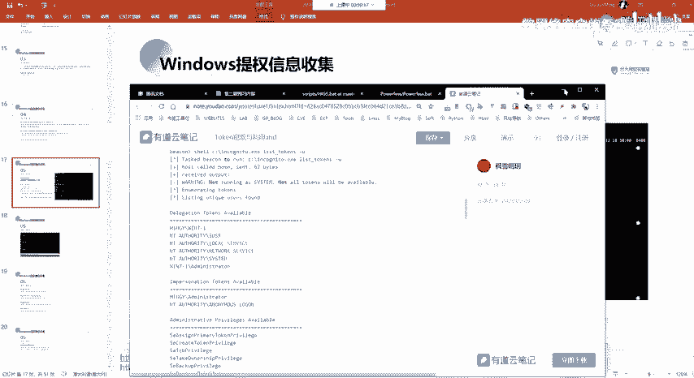

这两种Token在系统重启后会被清除。如果我们已经获得了目标机器的一个Shell，就可以利用工具窃取已存在于系统上的高权限Token（例如管理员登录后留下的Token），从而“扮演”该用户的身份进行操作，实现权限提升。

在Metasploit框架中，集成了`incognito`模块来操作Token。以下是该模块的基本使用命令。

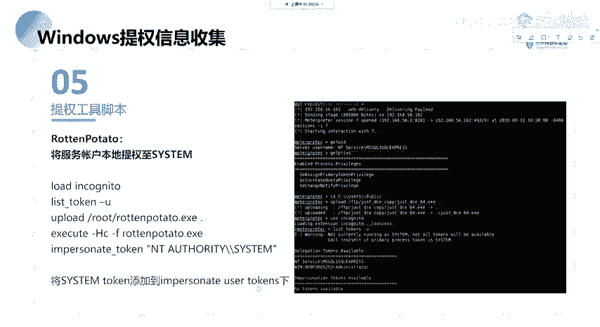

*   `list_tokens -u`：列出当前可用的授权令牌和模拟令牌。
*   `impersonate_token “NT AUTHORITY\\SYSTEM”`：窃取并模拟指定的Token（例如SYSTEM令牌）。执行此命令后，我们的Shell就拥有了该Token对应的权限。

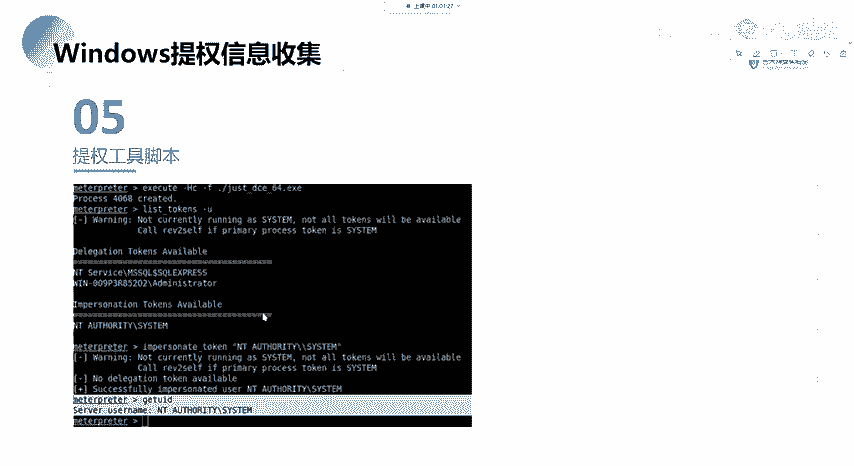

具体流程是：使用“烂土豆”等工具提权成功后，会生成SYSTEM Token。我们随后在MSF的`incognito`模块中使用`list_tokens -u`命令，可以在模拟令牌列表中找到对应的SYSTEM Token，然后使用`impersonate_token`命令窃取它，从而获得SYSTEM权限。

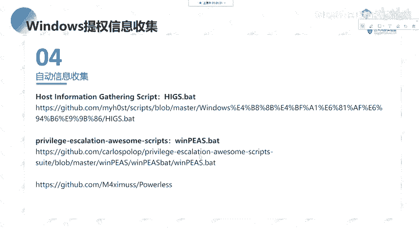

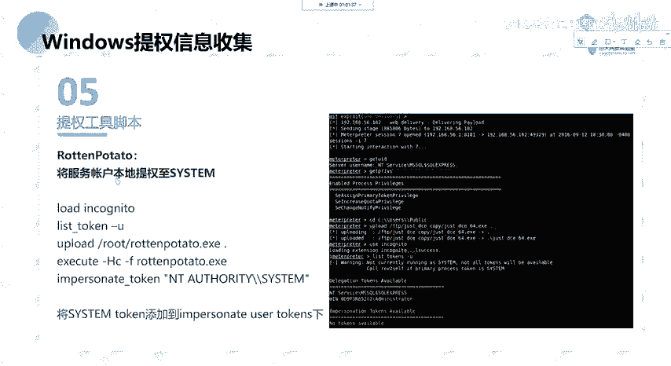

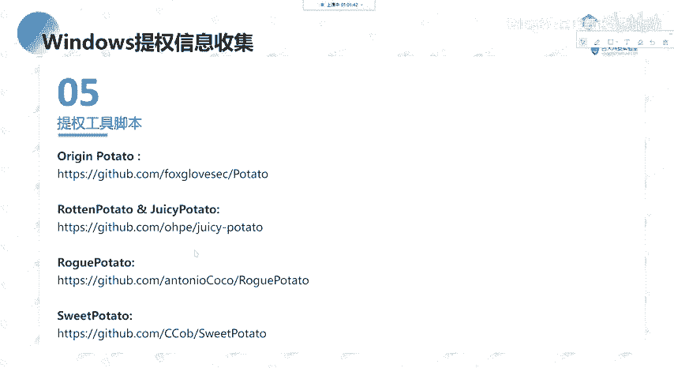

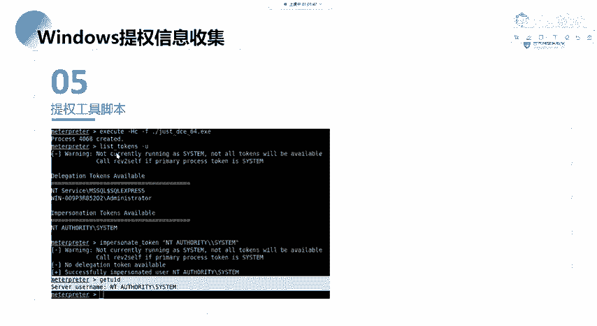

## 其他提权工具

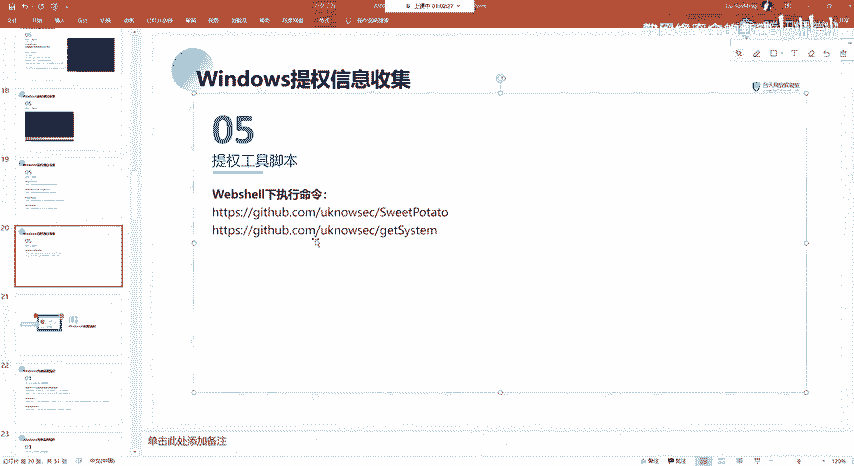

除了“烂土豆”，还存在一个“土豆家族”，包含其他适用于不同场景的提权脚本。基本的提权思路是：收集系统信息，识别潜在的漏洞，然后尝试使用对应的工具进行利用。

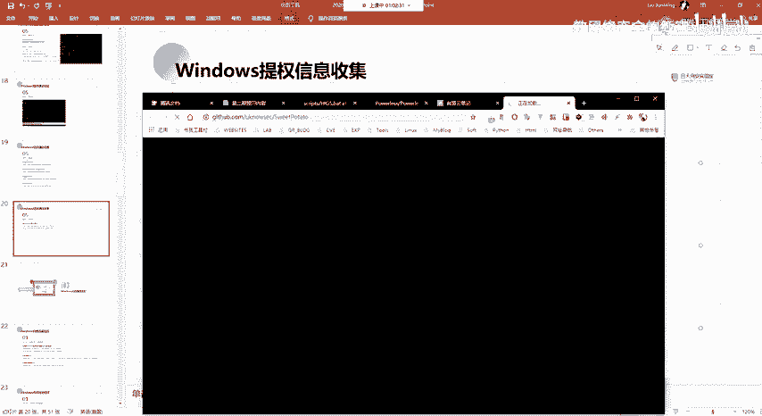

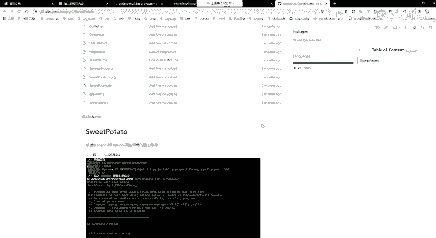

此外，还有一些专门用于在Web Shell环境下执行命令并提权的工具，例如基于“烂土豆”修改的版本。以下是这类工具的一个典型用法。

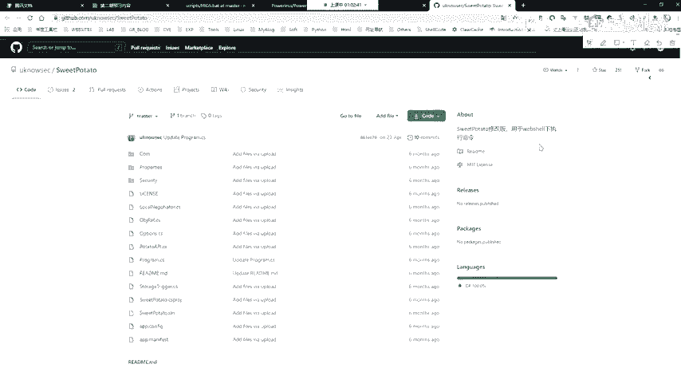

*   `RottenPotato.exe -p <可执行程序路径>`：直接以SYSTEM权限执行指定的程序。例如，我们可以上传一个由MSF生成的后门程序，然后通过此提权工具去执行它，从而获得一个具有SYSTEM权限的反向Shell。

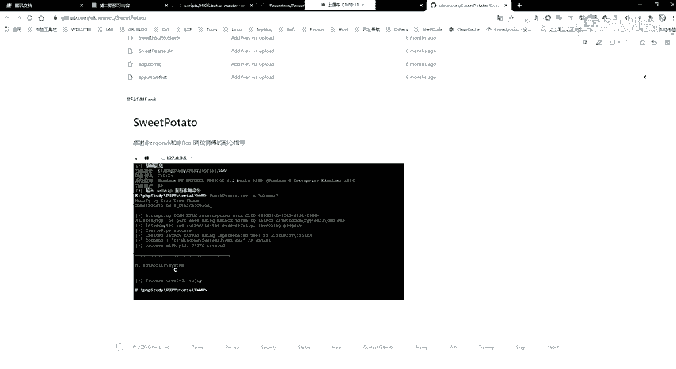

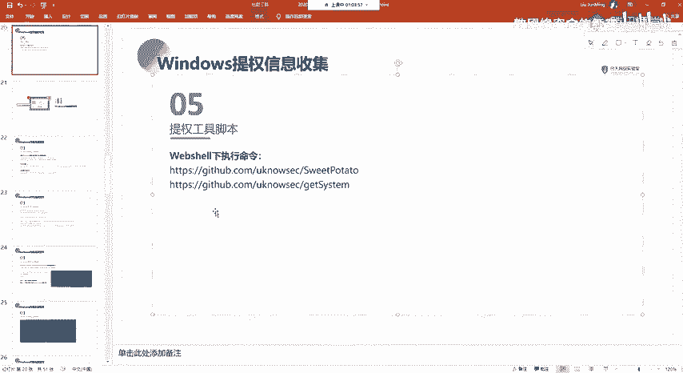

本节课中我们一起学习了常见的提权工具“烂土豆”的工作原理，深入了解了Windows Token的机制以及如何通过窃取Token来实现权限提升，并简要了解了其他提权工具家族及其基本使用思路。掌握这些工具和原理，是进行有效渗透测试的重要基础。