# 网络安全系统教程：P87：74. 不安全服务提权 🛠️

在本节课中，我们将要学习一种名为“不安全服务提权”的权限提升技术。这种技术利用了Windows系统中某些服务配置的弱点，允许低权限用户通过篡改服务属性来获取系统（SYSTEM）权限。我们将从原理入手，逐步讲解其利用步骤。

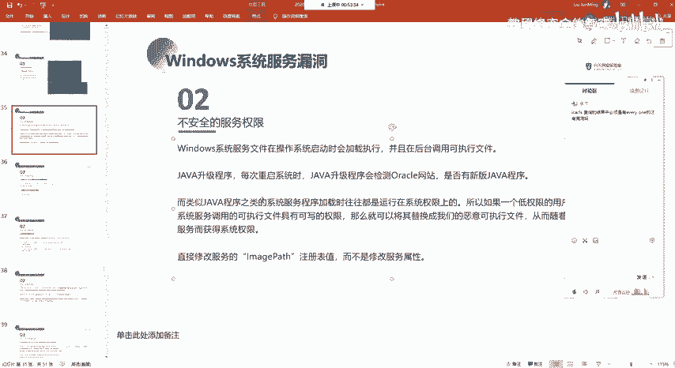

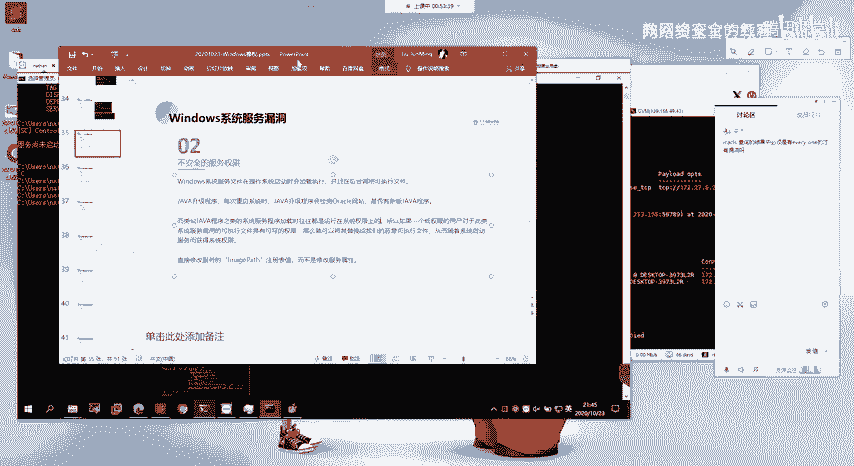

## 概述

不安全服务提权，核心在于某些以高权限（如SYSTEM）运行的系统服务，其对应的可执行文件路径可以被低权限用户修改。如果攻击者能够将这些路径替换为恶意命令或程序，那么当服务重启或系统启动时，恶意程序就会以高权限执行，从而实现权限提升。

上一节我们介绍了其他提权方法，本节中我们来看看如何利用服务配置漏洞。

## 原理详解

像Java升级程序这类系统服务，在加载时通常以**SYSTEM权限**运行。如果低权限用户对这类服务调用的可执行文件具有**写入权限**，就可以将其替换为自己的恶意可执行文件。当系统启动或服务重启时，恶意文件便会以SYSTEM权限执行。

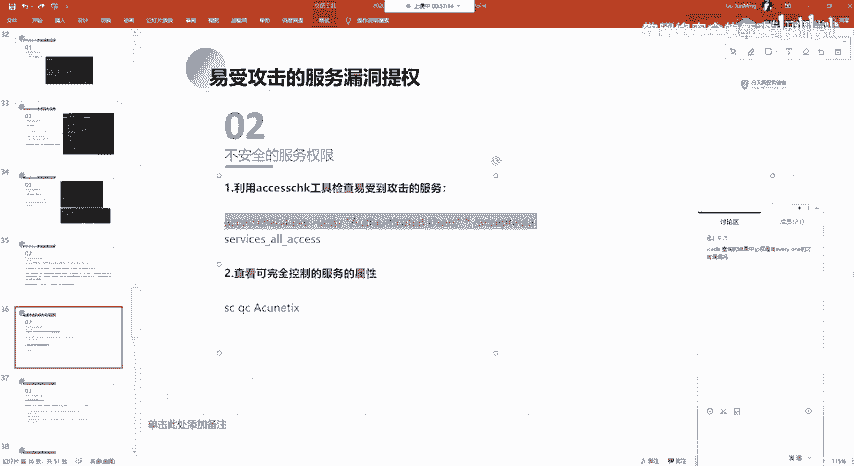

具体而言，我们是通过直接修改服务在注册表中的 `ImagePath` 值，而不是去图形化界面修改服务属性，来实现这一攻击。

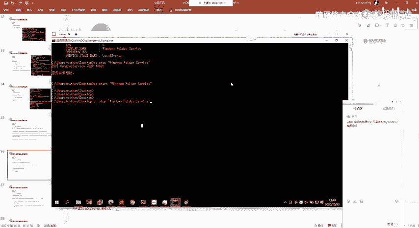

## 利用步骤

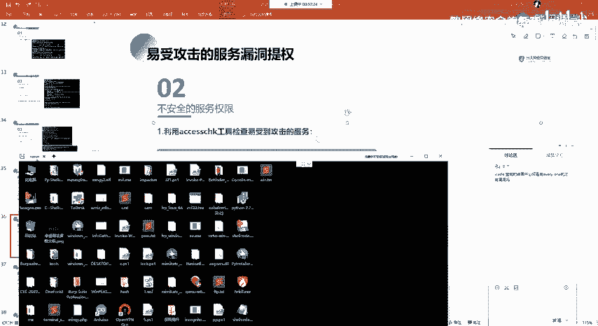

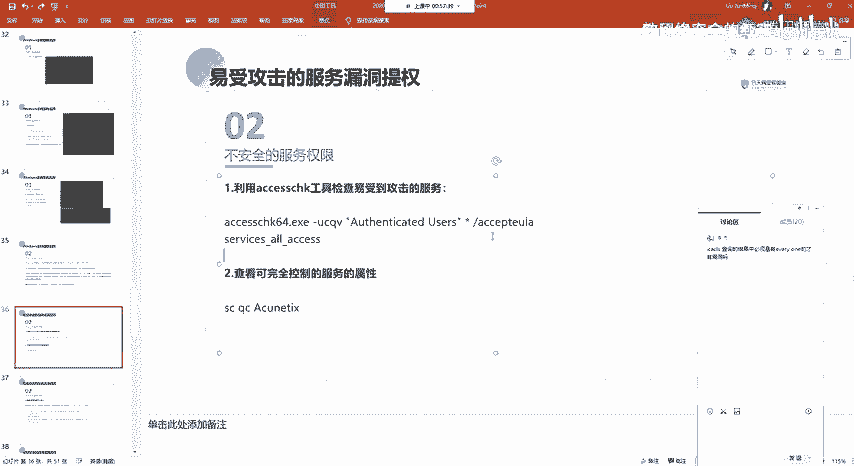

以下是利用不安全服务进行提权的具体操作流程。

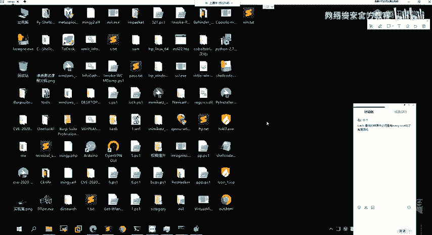

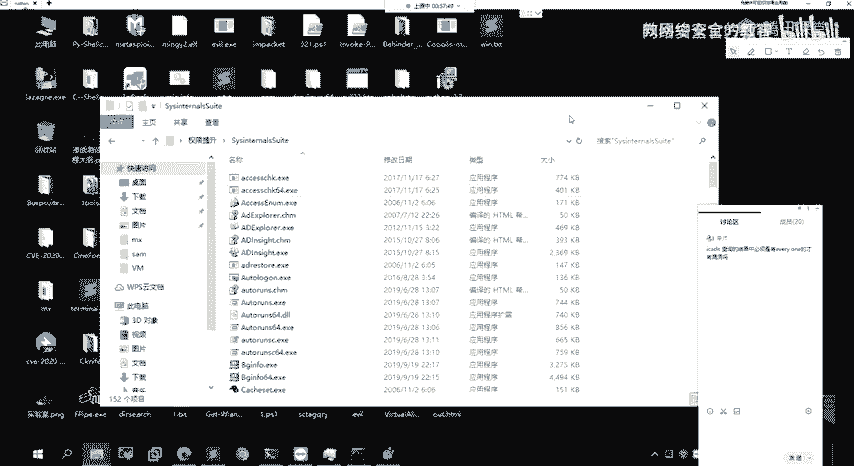

### 第一步：查找易受攻击的服务

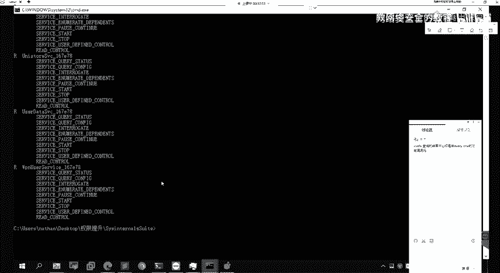

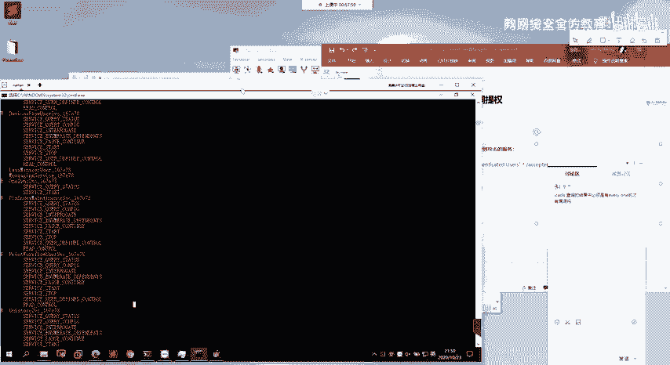

首先，我们需要使用工具来检查系统中哪些服务存在配置弱点，容易被利用。这里我们使用微软官方工具套件（Sysinternals Suite）中的 `accesschk.exe` 工具。

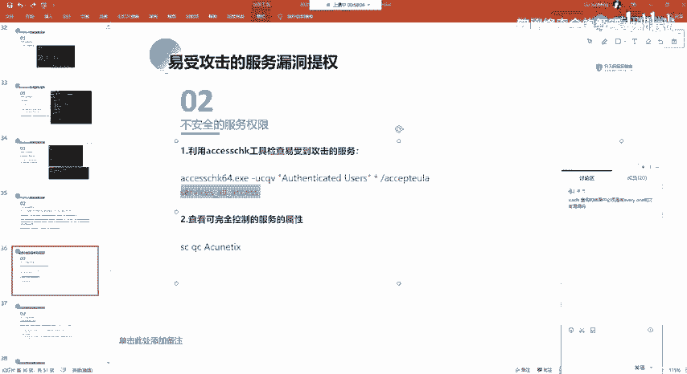

该工具是微软提供的故障排除工具套件的一部分，包含许多功能各异的实用程序，用于诊断和解决Windows系统问题。`accesschk.exe` 专门用于检查用户或组对文件、注册表键、服务等对象的访问权限。

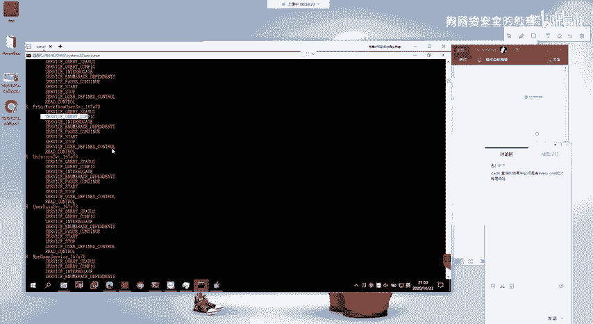

操作步骤如下：
1.  将 `accesschk.exe` 工具从攻击机上传到目标系统。
2.  在目标系统的命令行中执行该工具，扫描服务权限。

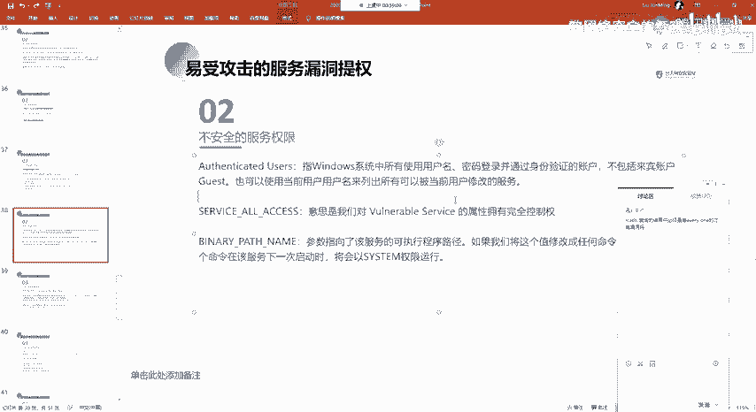

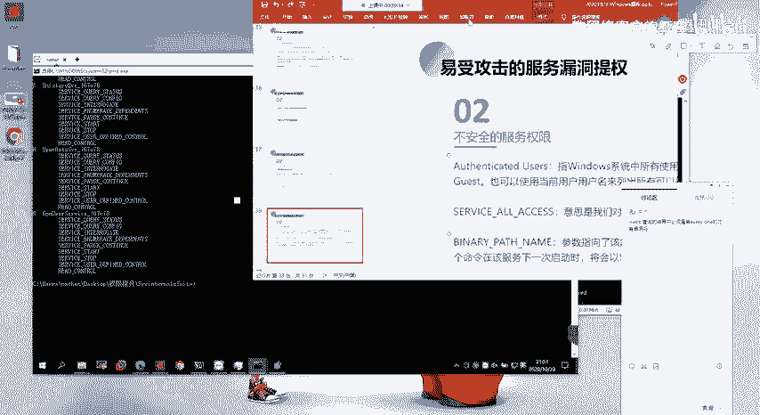

执行命令示例如下：
```cmd
accesschk.exe -uwcqv “Authenticated Users” *
```
或更精确地针对服务：
```cmd
accesschk.exe -uwcqv “Users” *
```

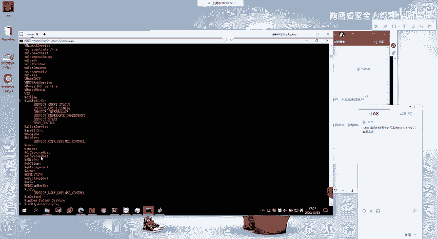

### 第二步：分析扫描结果

执行工具后，会列出大量服务及其权限信息。我们需要重点关注的是 `SERVICE_ALL_ACCESS` 这个属性。

以下是需要关注的关键信息：
*   **`SERVICE_ALL_ACCESS`**：表示我们对这个服务属性拥有完全控制权。
*   **`BUILTIN\Users`**：指Windows系统中的所有用户账户。
*   **`BinaryPathName`**：这是最关键的一个参数，它指向该服务所执行的可执行程序的路径。

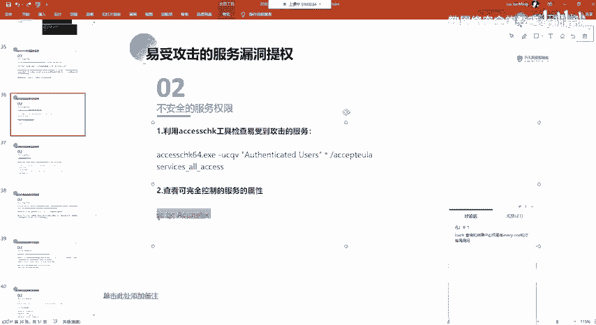

我们的攻击思路就是：找到一个对 `Authenticated Users` 或 `BUILTIN\Users` 组具有 `SERVICE_ALL_ACCESS` 权限的服务，然后修改其 `BinaryPathName` 指向的路径。

### 第三步：定位目标服务并查看详情

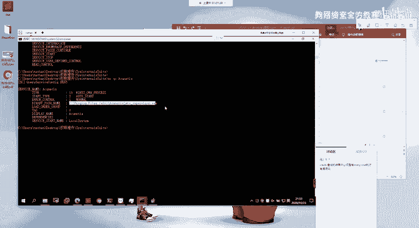

假设我们通过扫描发现一个名为 `Acunetix` 的服务（AWVS扫描器的服务）存在此漏洞。我们需要进一步查看该服务的详细配置。

使用 `sc` 命令查询服务信息：
```cmd
sc qc Acunetix
```
在返回的信息中，重点关注：
*   `START_TYPE`：显示启动类型，如 `AUTO_START` 表示随系统自动启动。
*   `BINARY_PATH_NAME`：这就是服务对应的可执行程序路径。这是我们后续要篡改的目标。

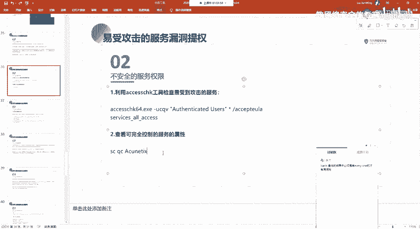

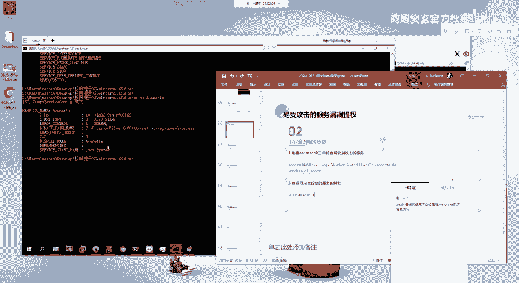

### 第四步：篡改服务路径执行命令

由于我们（低权限用户）对该服务拥有 `SERVICE_ALL_ACCESS` 权限，因此可以修改其配置。

原本的 `BINARY_PATH_NAME` 可能指向 `C:\Program Files\Acunetix\...\wvsc.exe`。我们可以将其修改为任意我们想要执行的命令。

例如，将其修改为添加用户的命令：
```cmd
sc config Acunetix binPath= “net user hacker P@ssw0rd! /add”
```
**注意**：等号（=）后面必须有一个空格。

### 第五步：触发权限提升

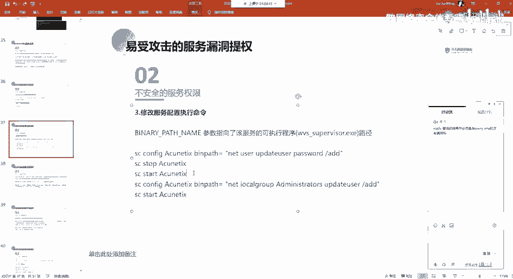

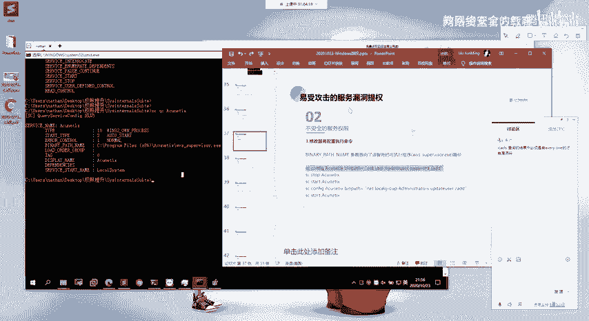

修改完成后，需要触发服务执行新的“程序”。由于普通用户可能无权重启服务，我们可以等待系统重启（如果服务是自动启动的），或者寻找其他方式。

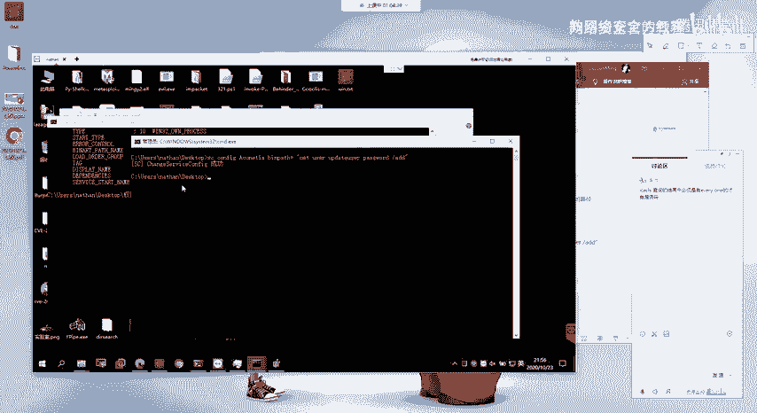

当服务下次启动时（例如系统重启后），它将不再运行原来的程序，而是执行我们设置的 `net user` 命令，并以 **SYSTEM 权限**成功添加一个名为 `hacker` 的用户。

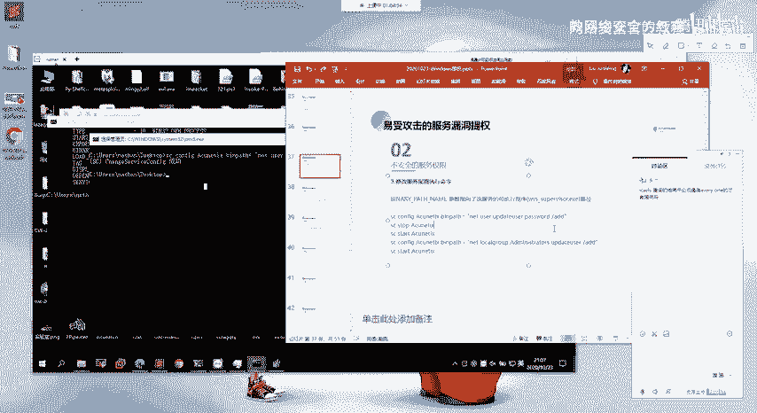

更实际的做法是，将 `BINARY_PATH_NAME` 指向我们事先上传的恶意程序（如木马）的路径：
```cmd
sc config Acunetix binPath= “C:\Temp\reverse_shell.exe”
```
这样，服务重启后，我们将获得一个 **SYSTEM 权限**的反弹Shell。

### 演示与注意事项

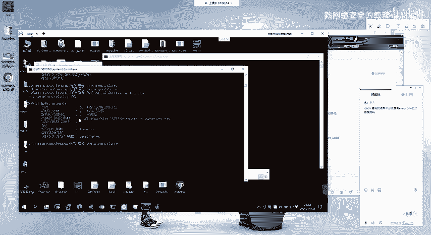

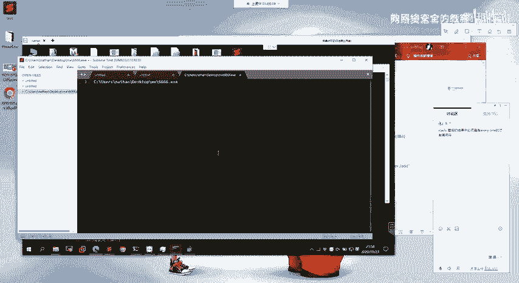

在实际演示中，执行 `sc start Acunetix` 启动被篡改的服务时，系统可能会报错“服务没有响应控制功能”。这是因为服务管理器无法与一个执行完 `net user` 命令就退出的进程进行正常通信。**但这并不影响命令的执行**。此时检查用户列表，会发现新用户已经添加成功。

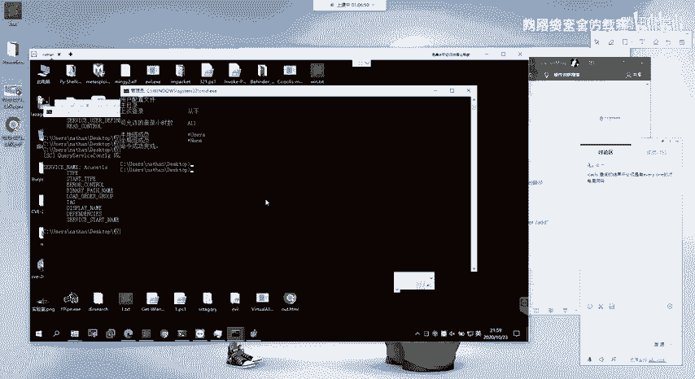

因此，在利用时，更推荐使用持续驻留的恶意程序（如Metasploit生成的payload），这样不仅能获得SYSTEM权限，还能得到一个稳定的控制会话。

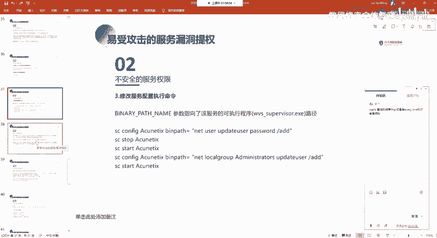

## 总结

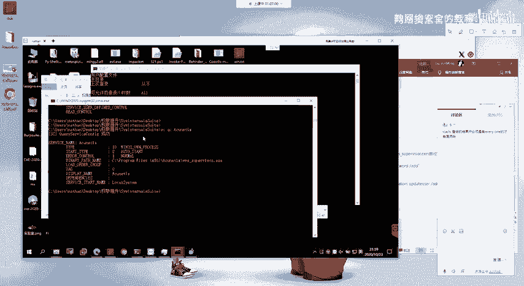

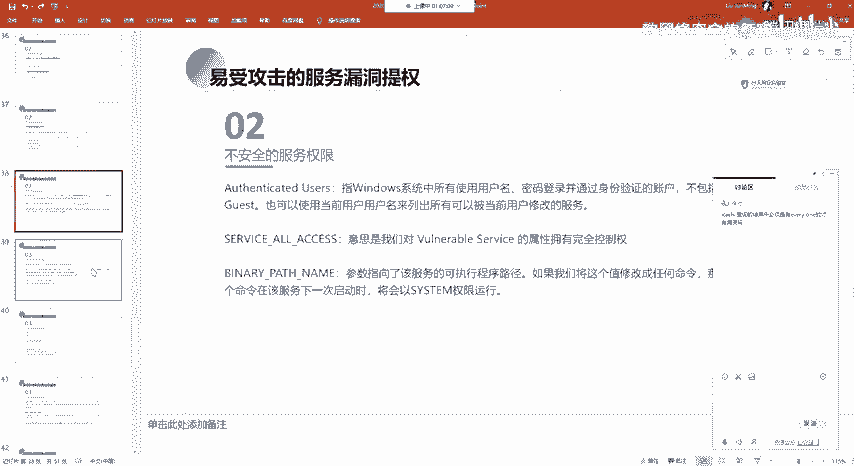

本节课中我们一起学习了“不安全服务提权”技术。其核心是利用了低权限用户对某些高权限服务的配置拥有修改权这一漏洞，通过 `sc config` 命令篡改服务的 `BINARY_PATH_NAME` 路径，将其指向恶意命令或程序。当服务重启时，恶意载荷便以SYSTEM权限运行，从而实现权限提升。防御此类攻击的关键在于遵循最小权限原则，定期审计服务配置，确保关键服务的可执行文件路径不被低权限用户篡改。