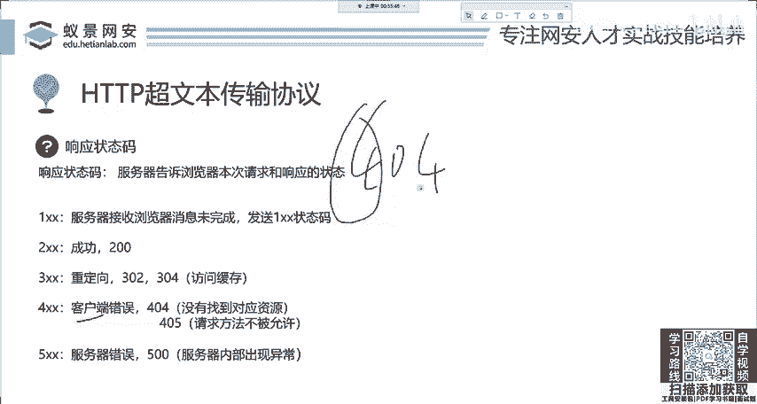
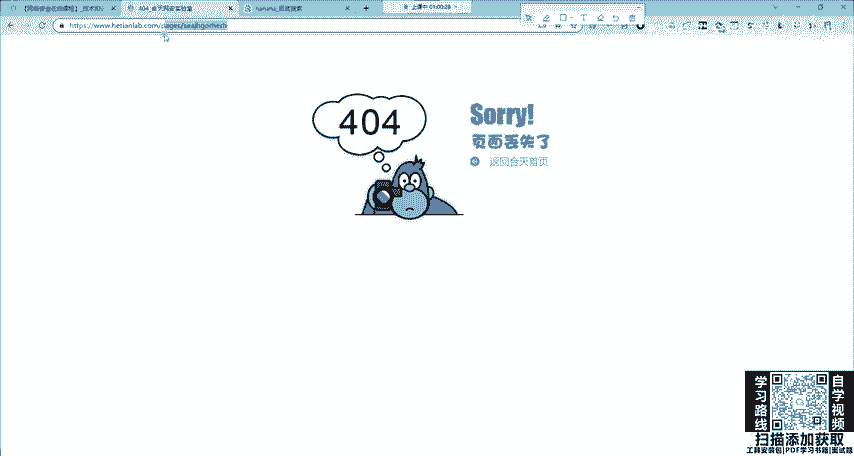

# 网络安全系统教程：8：HTTP基础-响应码 🖥️

在本节课中，我们将要学习HTTP协议中服务器返回的“响应码”。响应码是服务器对浏览器请求的回应，它用简单的数字告诉我们请求是成功了、失败了，还是需要进一步操作。理解这些状态码是分析网络通信、排查问题乃至进行安全测试的基础。

上一节我们介绍了HTTP请求消息，本节中我们来看看服务器是如何回应的。

## 响应消息结构

服务器在接收到浏览器的请求后，会发送一个“响应消息”回来。这个响应消息的结构很容易理解。

首先，响应的协议版本通常是`HTTP/1.1`。接着是最重要的**响应状态码**，这是我们本节课的核心。状态码后面跟着一些“响应头”，例如服务器可能会在这里设置一个令牌（Cookie）返回给浏览器。最后，响应消息的正文部分会包含网站的实际内容，如图片、视频、HTML文件或JavaScript文件等，一并发送给浏览器。

## 响应状态码详解

响应状态码是一个三位数字，它直观地表明了请求的结果。状态码的第一位数字定义了响应的类别。

以下是五种主要的响应状态码类别及其含义：

### 1xx：信息性状态码

这类状态码表示请求已被接收，需要继续处理。它非常少见，通常意味着服务器收到了请求的第一部分，正在等待剩余部分，浏览器会继续发送请求。

### 2xx：成功状态码

这类状态码表示请求已成功被服务器接收、理解并处理。最常见的成功状态码是 **`200 OK`**，它表示一切正常，你访问的绝大多数网页在成功打开时都返回这个状态码。

### 3xx：重定向状态码

这类状态码表示需要客户端采取进一步的操作才能完成请求，通常是需要浏览器跳转到另一个地址。

*   **`302 Found`**：临时重定向。服务器告诉浏览器：“你要的资源不在这里，请去另一个地址找。” 例如，你访问一个旧链接，网站会自动将你跳转到新的页面。
*   **`304 Not Modified`**：资源未修改。这是一个性能优化相关的状态码。当浏览器请求一个资源（如图片）时，如果服务器发现该资源自上次请求后没有变化，就会返回304。浏览器收到后，会直接使用本地缓存的版本，而无需再次下载，从而节省流量和时间。

### 4xx：客户端错误状态码

这类状态码表示错误可能出在浏览器（客户端）这一方。

*   **`404 Not Found`**：最著名的错误码。它表示服务器无法找到请求的资源。例如，你输入了一个错误的、不存在的网址，就会看到404错误。**这代表是你的请求有误**。
*   **`405 Method Not Allowed`**：请求方法不被允许。例如，服务器只接受`GET`请求来获取某个页面，但你却用`POST`方法去请求，服务器就会返回405错误。

### 5xx：服务器错误状态码

这类状态码表示错误出在服务器端，客户端无法解决。

*   **`500 Internal Server Error`**：通用服务器内部错误。表示服务器遇到了一个未曾预料的情况，导致它无法完成请求。
*   **`501 Not Implemented`**：服务器不支持当前请求所需要的某个功能。例如，服务器代码存在逻辑错误（如除以零）。
*   **`502 Bad Gateway` / `503 Service Unavailable`**：网关错误或服务不可用。这通常是由于服务器过载、维护或后端服务故障导致的。例如，在购物节或抢票时，网站流量过大就可能返回这些错误。**这代表是服务器端出了问题**。

## 总结

本节课中我们一起学习了HTTP响应码。我们了解了响应消息的基本结构，并重点掌握了五种类型的响应状态码：1xx（信息）、2xx（成功）、3xx（重定向）、4xx（客户端错误）和5xx（服务器错误）。记住这些状态码的含义，尤其是常见的`200`、`302`、`304`、`404`、`405`、`500`等，对于分析网络行为、诊断问题以及后续的网络安全学习都至关重要。