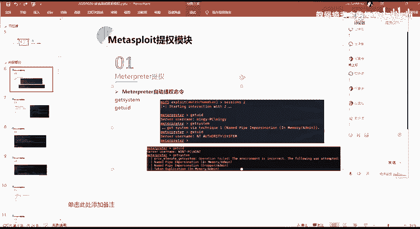
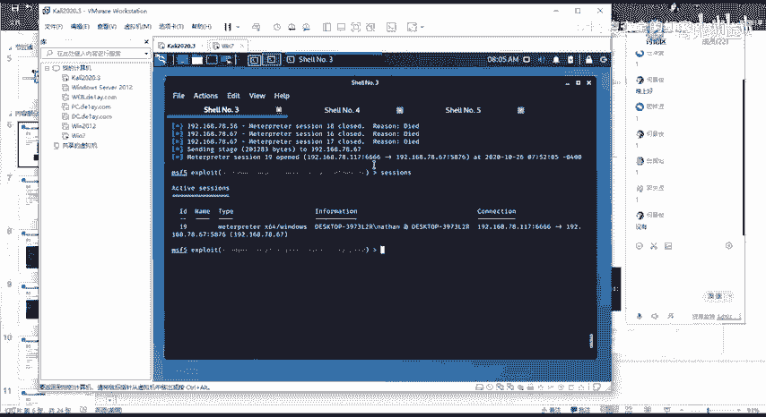
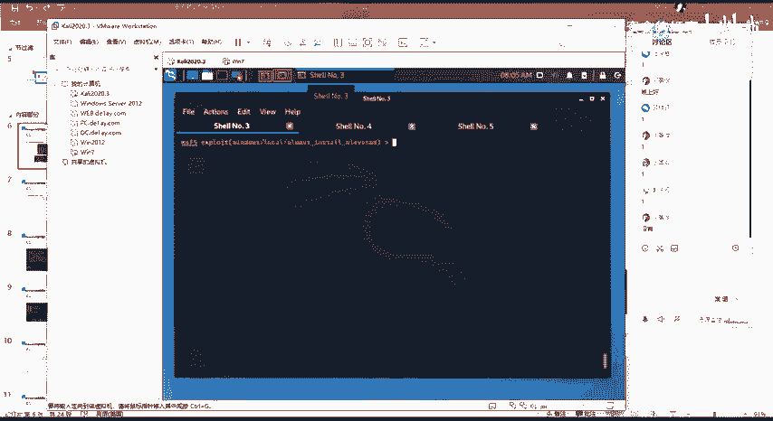
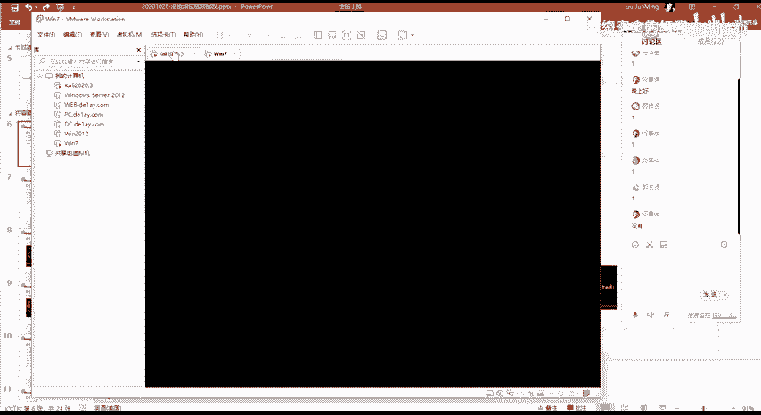
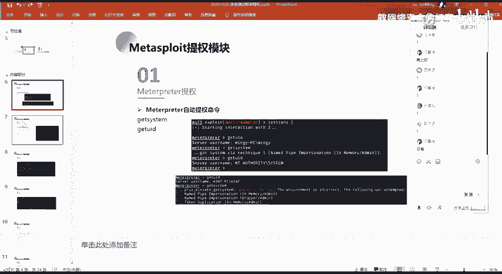

# 网络安全系统教程：P90：77.MSF自动提权命令

在本节课中，我们将要学习如何在Metasploit Framework（MSF）和Cobalt Strike（CS）这两个渗透测试框架中使用自动提权模块。我们将重点介绍MSF的`getsystem`命令，并解释其使用场景与限制。

上一节我们介绍了Windows系统下的多种提权方法与技巧。本节中，我们来看看如何利用MSF框架中现成的模块，自动化地利用这些漏洞进行提权操作。

## MSF提权模块介绍

MSF框架集成了许多功能模块，能极大地方便我们的渗透测试工作。在获得一个Shell会话后，我们通常会尝试将其转移到MSF或CS框架中，以便利用其内置的成熟功能进行后续操作。

以下是MSF中一个常用且重要的自动提权命令。

### 使用 `getsystem` 命令

`getsystem` 是MSF中一个用于尝试自动提升权限的命令。其核心目标是将会话中的普通用户权限提升至SYSTEM或Administrator级别。



**基本命令格式：**
```
getsystem
```





#### 使用场景与结果分析



在实际使用中，`getsystem` 命令的执行结果主要分为两种情况。

**情况一：提权成功**

当当前用户本身属于管理员组（例如Administrators组）时，直接执行 `getsystem` 命令有较大概率成功。成功执行后，你的会话权限将从普通用户直接提升为SYSTEM权限。

> 例如：从一个名为“MNGY”的普通用户会话开始，执行 `getsystem` 后，成功获得SYSTEM权限。

**情况二：提权失败**

然而，更多情况下，直接执行 `getsystem` 命令会失败。即使当前用户在管理员组中，由于系统安全配置（如UAC用户账户控制）等因素，该命令也可能无法完成提权。

> 例如：在一个Windows 7系统的普通用户会话中执行 `getsystem`，命令会报错并提示操作失败，权限未能提升。

## 总结



本节课中我们一起学习了MSF框架下的自动提权命令 `getsystem`。我们了解到，该命令的使用效果高度依赖于目标系统的当前用户权限和具体安全配置。它并非万能，在直接执行失败时，我们需要结合上一节课所学的知识，手动寻找并利用特定的内核或服务漏洞来完成提权。掌握 `getsystem` 命令是快速进行权限提升的第一步，但理解其局限性并准备备用方案同样重要。