# 网络安全系统教程：P93：unquoted_service_path模块

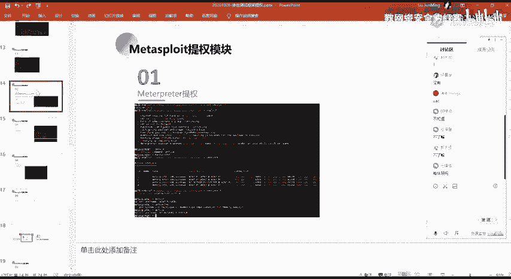

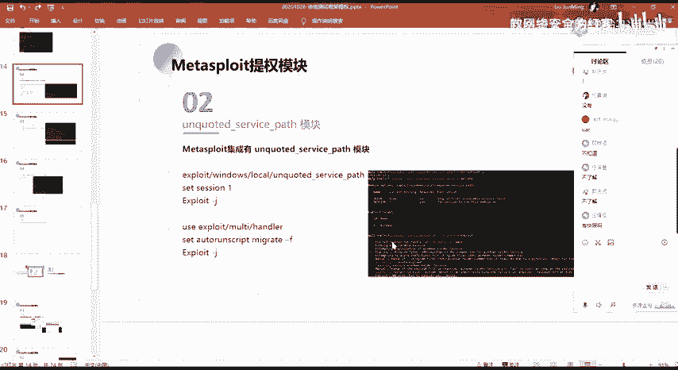

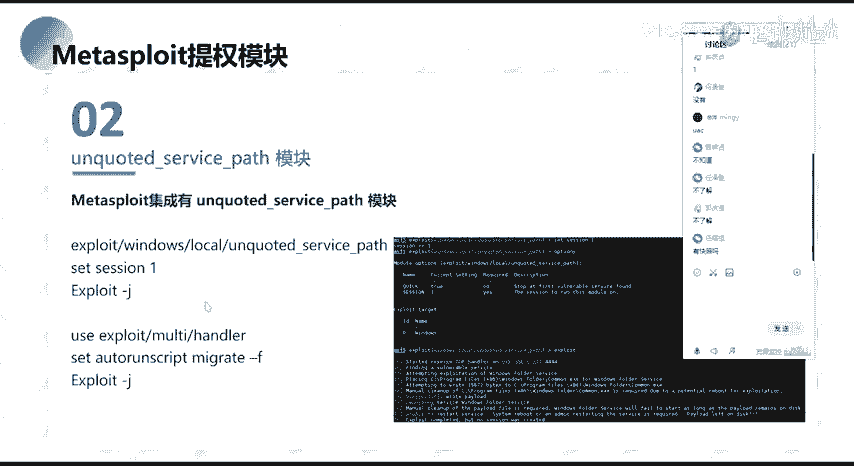

在本节课中，我们将学习Metasploit框架中的 `unquoted_service_path` 模块。这个模块专门用于利用Windows系统中因服务路径未加引号（Unquoted Service Path）而导致的权限提升漏洞。我们将了解其原理、使用方法以及在实际渗透测试中的注意事项。

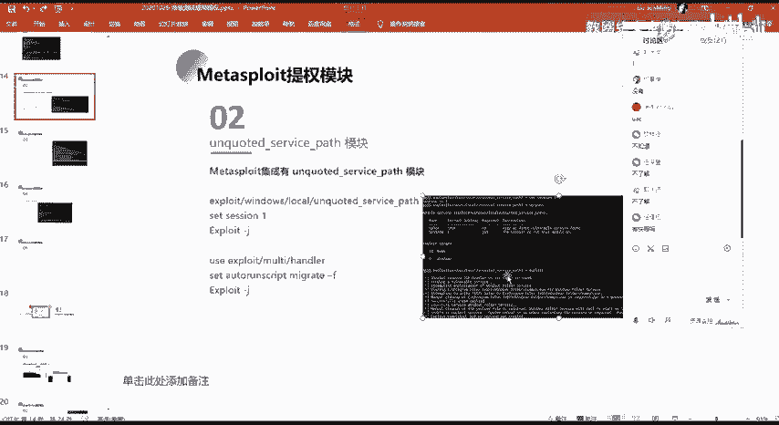

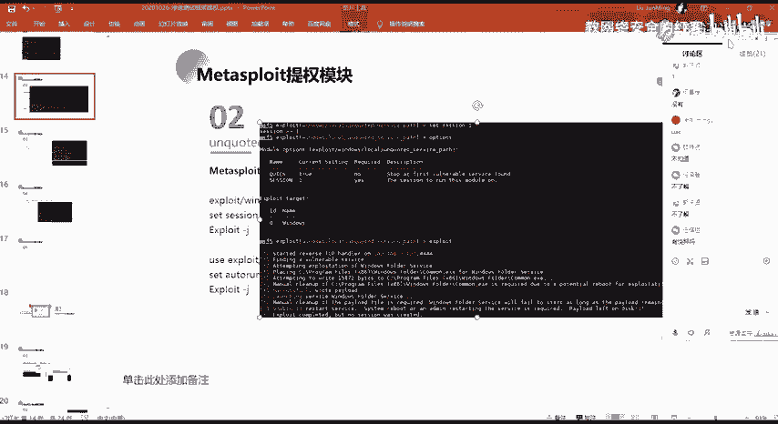

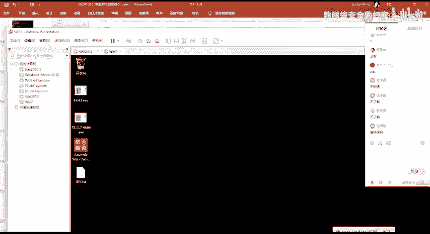

## 概述

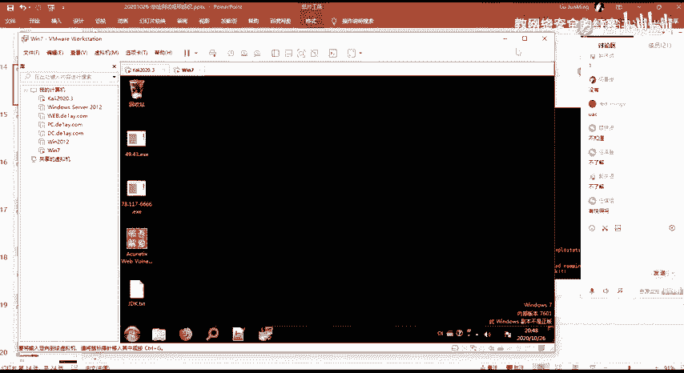

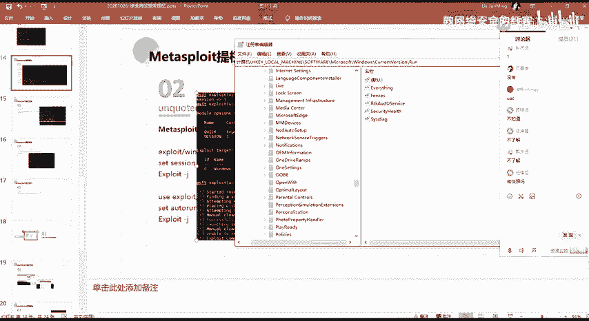

`unquoted_service_path` 模块对应上节课讲解的Windows服务路径漏洞提权。该漏洞源于Windows服务在启动时，如果其可执行文件路径包含空格且未被引号包裹，系统会按特定顺序搜索并执行程序，攻击者可借此植入恶意程序并获得系统权限。

## 模块原理与使用

上一节我们介绍了Windows服务路径漏洞的理论基础，本节中我们来看看如何在Metasploit中利用 `unquoted_service_path` 模块自动化完成攻击。

该模块的使用流程与之前介绍的模块类似。核心步骤是设置目标地址（RHOSTS），然后执行攻击（exploit）。

以下是基本使用命令：
```bash
use exploit/windows/local/unquoted_service_path
set RHOSTS <目标IP>
exploit
```

执行 `exploit` 后，模块会自动在目标机器上执行以下操作：
1.  查找存在未加引号服务路径漏洞的服务。
2.  在具有写入权限的路径中，写入一个恶意可执行文件（例如 `common.exe`）。
3.  等待或诱导该服务重启。当服务重启时，系统会按照漏洞路径搜索并执行我们写入的恶意程序，从而让我们获得一个具有系统权限（SYSTEM）的会话（session）。

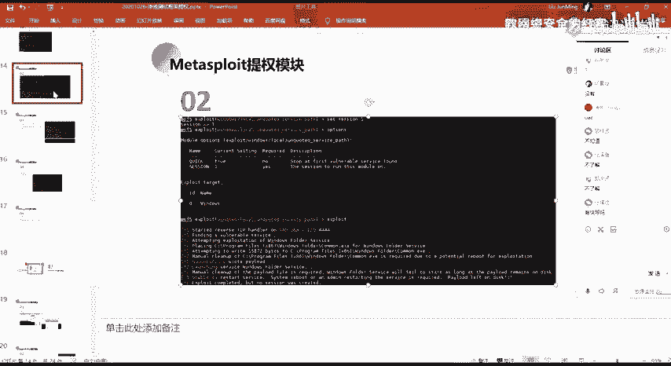

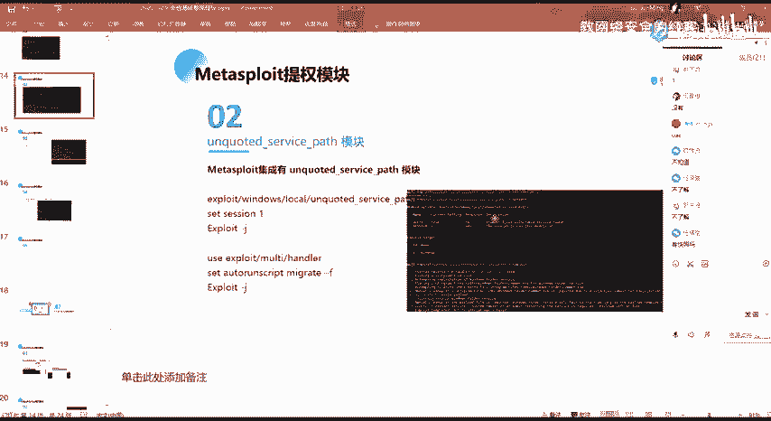

## 攻击流程详解

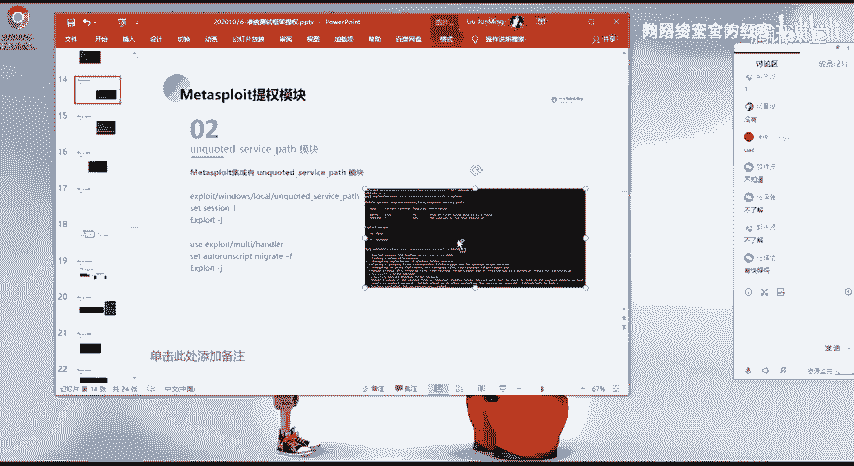

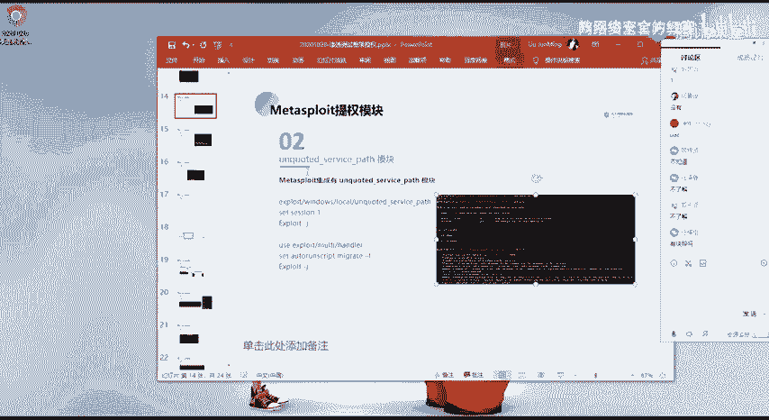

由于环境问题，本次无法进行完整的演示，但我们可以通过分析流程截图来理解关键步骤。

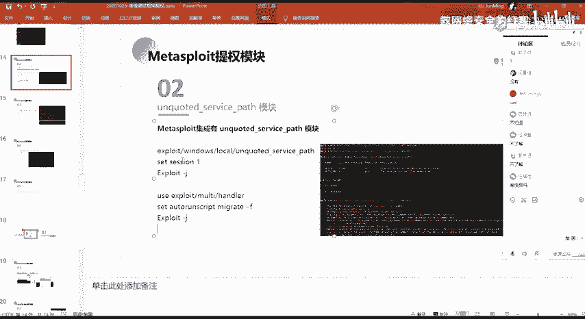

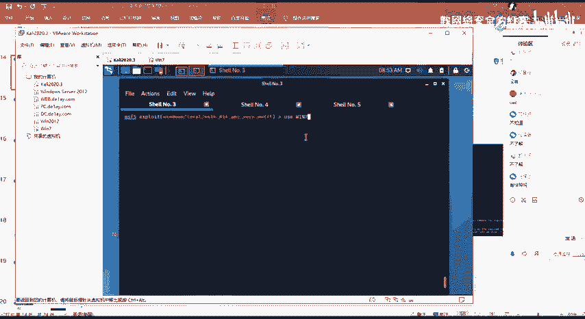

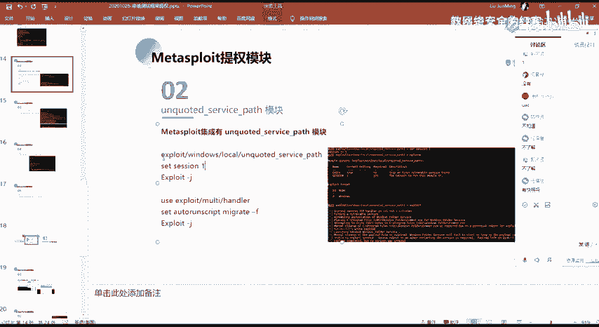

模块运行后，会尝试寻找可利用的服务。例如，它可能找到如下路径：
`C:\Program Files\My Service\service.exe`
如果此路径未被引号包裹，且我们对 `C:\Program` 或 `C:\Program Files` 等目录有写入权限，攻击便可进行。

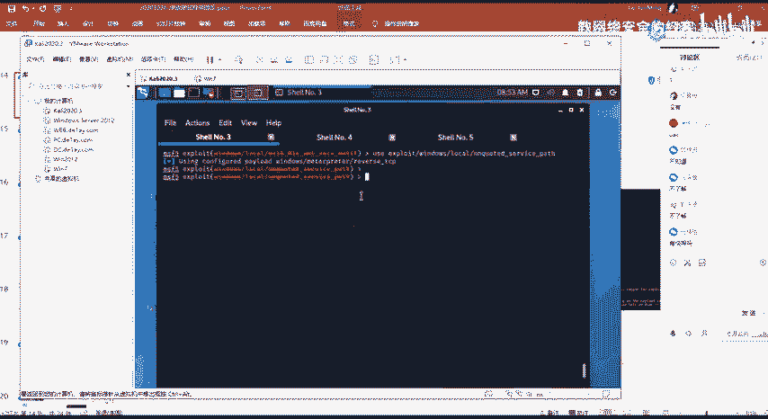

模块成功写入恶意程序后，会进入等待状态。这是因为我们通常无法以普通用户身份直接重启系统服务。需要等待服务因其他原因（如系统重启、计划任务等）被启动。

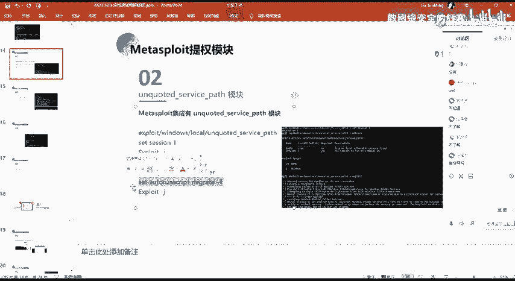

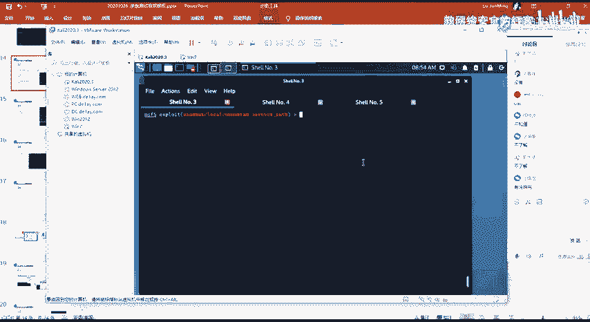

当服务启动并加载了我们的恶意程序后，我们会获得一个系统权限的会话。但需要注意的是，我们植入的 `common.exe` 并非真正的服务程序，因此与服务控制管理器的通信会失败，导致该进程很快被终止。这意味着我们获得的会话是临时的，会很快断开。

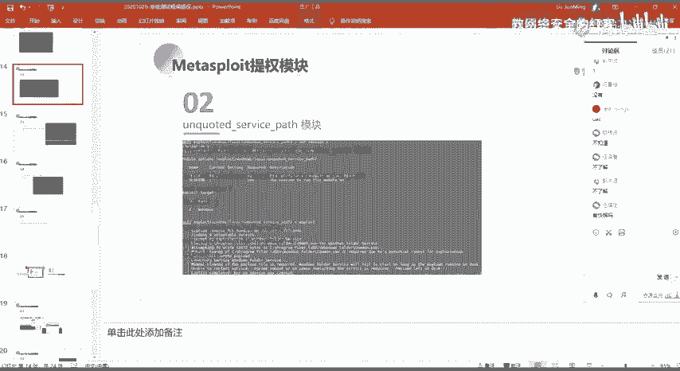

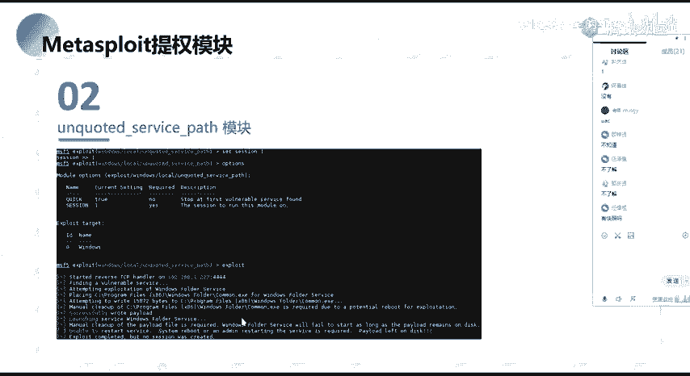

## 会话维持与自动化

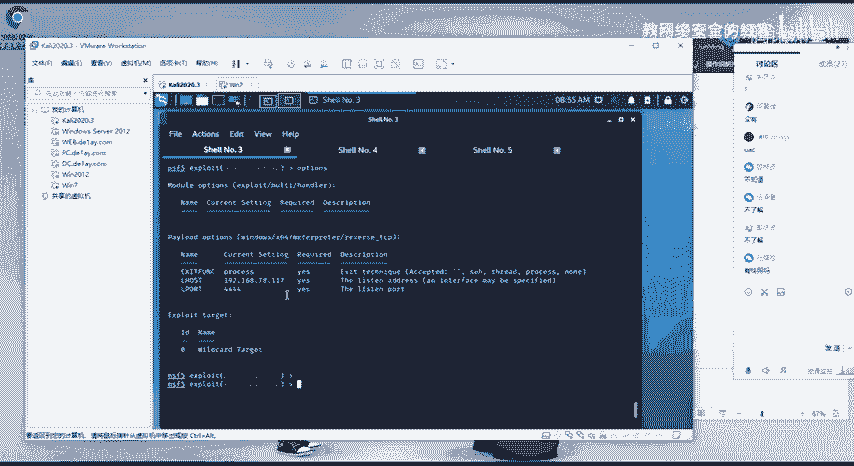

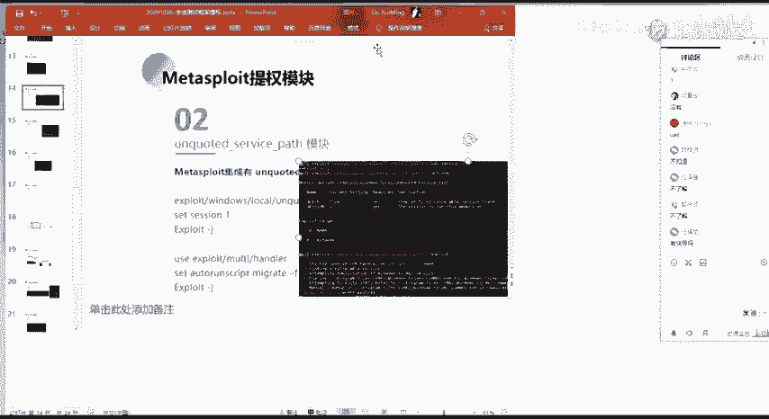

为了解决会话短暂的问题，我们需要在获得会话的瞬间进行进程迁移（Process Migration），将我们的会话从即将终止的恶意程序进程，迁移到一个稳定的系统进程（如 `svchost.exe`）中。

在Metasploit中，我们可以通过设置高级选项来自动化这一过程。

以下是需要关注的两个重要高级选项：

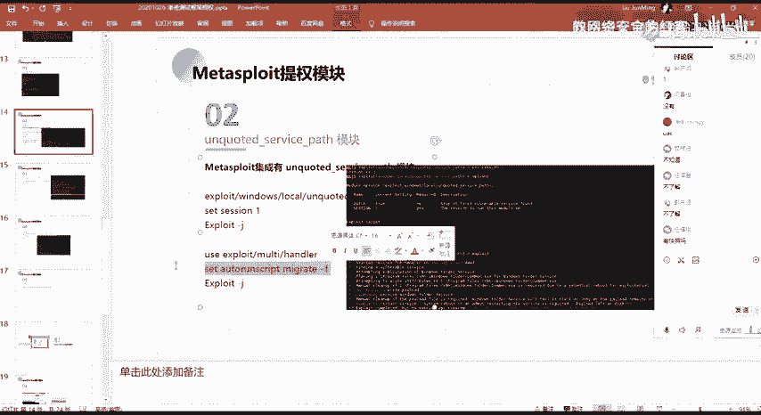

*   **`ExitOnSession`**：此选项控制当payload成功返回一个会话后，对应的监听作业（job）是否退出。默认情况下，获得会话后job会退出。我们通常将其设置为 `false`，以便job持续监听，等待更多连接或处理后续返回的会话。
    ```bash
    set ExitOnSession false
    ```
*   **`AutoRunScript`**：此选项用于设置自动运行脚本。当获得一个新会话时，会自动执行此处指定的命令。为了实现自动进程迁移，我们可以将其设置为 `migrate -f`。
    ```bash
    set AutoRunScript migrate -f
    ```
    `migrate -f` 命令会自动寻找一个合适的进程并将当前会话迁移过去。

通过合理配置这些选项，我们可以使 `unquoted_service_path` 模块的攻击更加自动化，并在获得权限后立即稳定会话。

## 总结

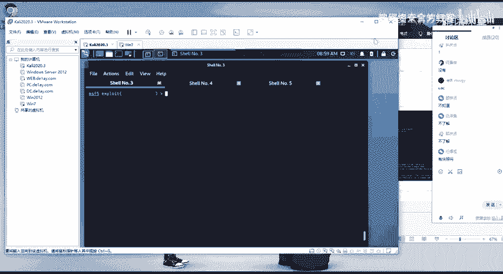

本节课中我们一起学习了 `unquoted_service_path` 模块。我们回顾了该模块所利用的Windows服务路径漏洞原理，掌握了模块的基本使用方法，并深入了解了攻击成功后维持会话的关键技术——进程迁移及其自动化配置。虽然本次没有现场演示，但通过分析攻击流程和配置要点，你应该能够理解如何在实际环境中应用此模块进行权限提升。记住，成功利用的关键在于目标服务路径存在漏洞，并且攻击者对路径中的某个目录拥有写入权限。