# 网络安全系统教程：P96：CS提权模块Elevate

## 概述
在本节课中，我们将学习Cobalt Strike（简称CS）中的提权模块——Elevate。我们将了解CS的基本背景、其与MSF的关系、核心通信机制，并重点演示如何使用内置及扩展的提权模块，从普通用户权限提升至System权限。

## CS简介与背景

上一节我们介绍了多种渗透测试工具，本节中我们来看看Cobalt Strike。

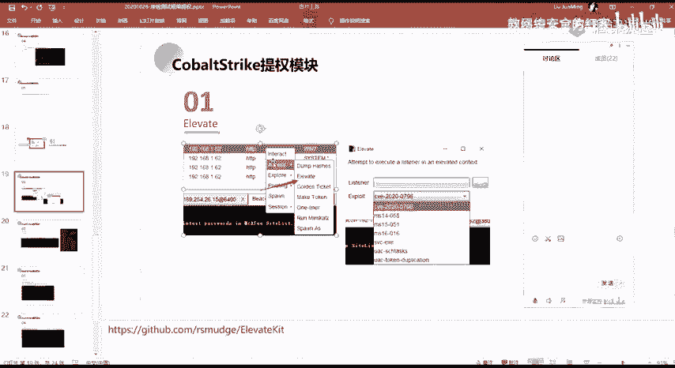

Cobalt Strike的发展基于Metasploit Framework（MSF）的图形化界面组件。它后来逐渐发展并独立于MSF，成为一个独立的框架。

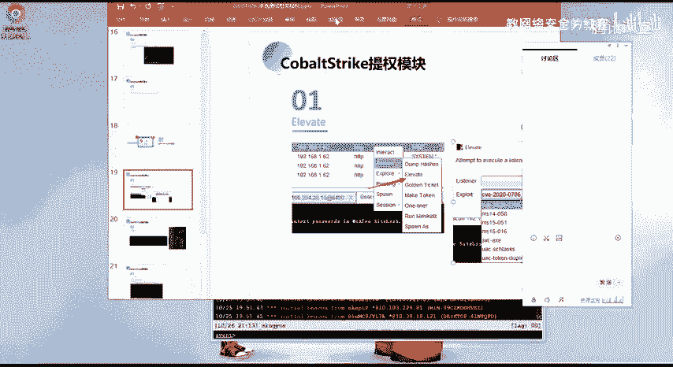

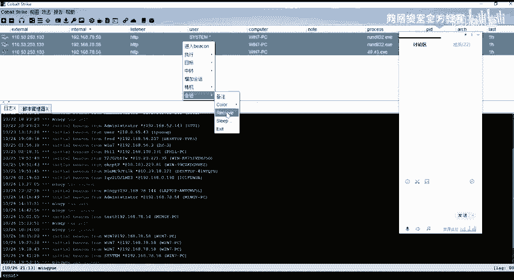

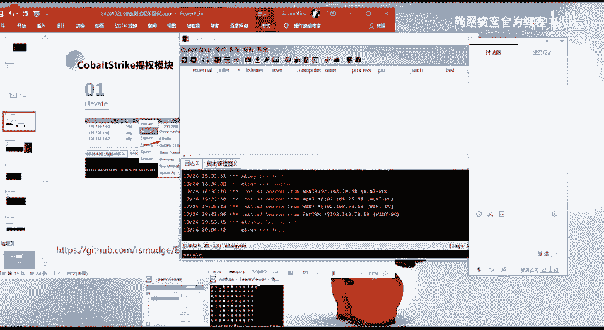

在实际使用中，如果对两个工具都比较熟悉，CS在很多场景下会比MSF更好用。当然，MSF的优点在于其模块数量众多，并且会实时更新，最新的漏洞常有人编写成MSF可直接使用的模块。

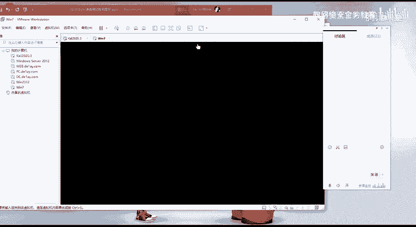

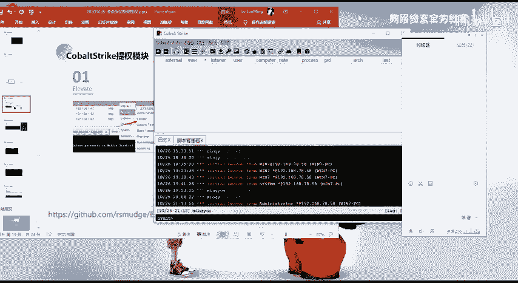

相比MSF，CS可能会更加灵活。CS一个主要的优点是它能够加载用户自己编写的脚本。它提供了一个脚本管理器，可以将自己或他人写好的脚本加载进去，从而扩展CS的功能。

当然，MSF也允许用户编写对应的脚本模块，并通过其提供的API加载进去。

## CS核心通信机制

在讲解CS的提权模块前，有必要先理解其基本通信机制，这有助于我们理解后续操作。

CS默认的`sleep`时间是一分钟。这里的`sleep`指的是信标（Beacon）回连控制端的等待间隔。设置等待时间的原因是为了避免通信过于频繁而被发现。

当`sleep`设置为0时，信标会持续不断地发送请求。例如，执行`whoami`命令后，信标会立即发送一个37字节的请求包到我们的监听器（Listener），然后接收并返回命令执行结果。

CS的通信架构大致如下：用户通过客户端（Client）连接到团队服务器（Team Server）。团队服务器管理着下线的信标（Beacon）。信标是我们生成的Payload（如exe文件）在目标机器上执行后建立的会话。

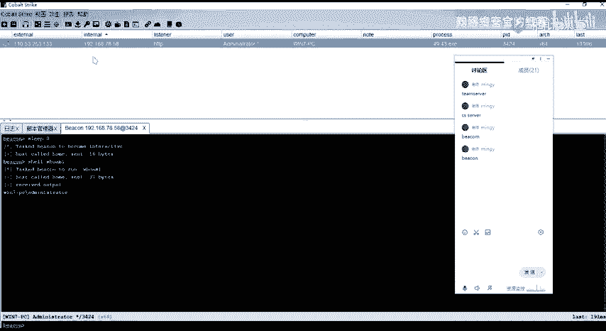

当我们通过会话执行命令时，信标会根据设定的`sleep`时间，周期性地通过HTTP/HTTPS等方式向团队服务器发送GET请求，以获取需要执行的命令。获取命令后，在目标机器上执行，再将结果通过POST请求等方式返回给团队服务器。

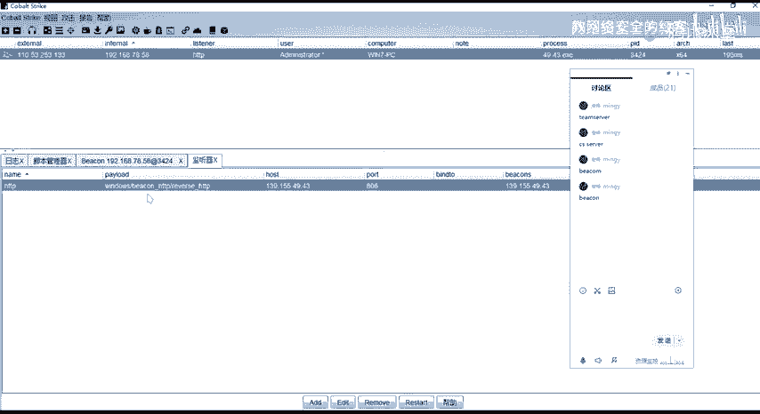

如果`sleep`设置为0，请求会非常频繁，一般不建议设置过短，应设置得长一些以保持隐蔽。

CS的监听器（Listener）定义了通信方式，如HTTP、HTTPS、DNS或TCP。例如使用HTTP监听器，信标与团队服务器的通信就会伪装在HTTP流量中。

## 使用Elevate模块进行提权

理解了CS的基本原理后，我们进入本节课的核心：使用Elevate模块进行权限提升。

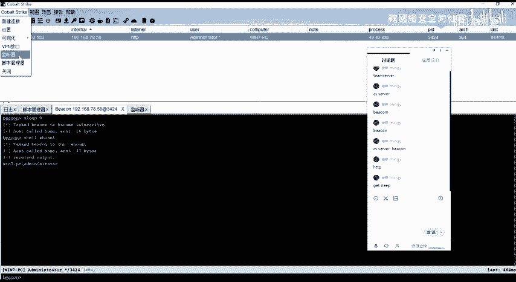

首先，我们需要获得一个初始的信标会话。假设我们已经获得了一个Windows 7普通用户的会话。

在CS客户端中，右键点击该信标会话，可以看到一系列操作选项。

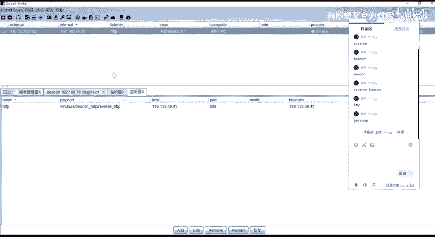

以下是部分常用选项：
*   **run mimikatz**：使用CS内置的mimikatz模块获取明文密码。
*   **转储哈希**：获取用户的哈希值。
*   **提权**：即本节课要讲的Elevate功能。

点击“提权”（Elevate）后，会弹出一个配置窗口。

我们需要在此选择一个监听器。然后，CS会列出可用的提权漏洞利用模块（Exploit）。

CS本身内置的提权模块有限。但我们可以通过加载外部脚本（如`elevate kit`）来扩展可用的模块。

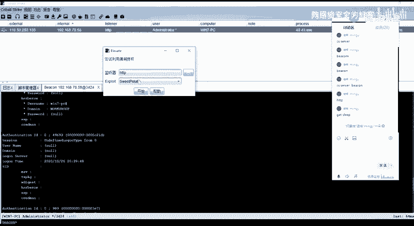

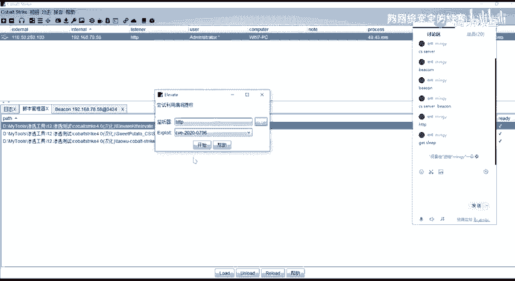

加载脚本后，列表中会出现更多提权模块，例如针对较新系统的`CVE-2021-0796`等。需要注意的是，每个漏洞利用都有其适用的系统版本限制。

## 提权操作演示

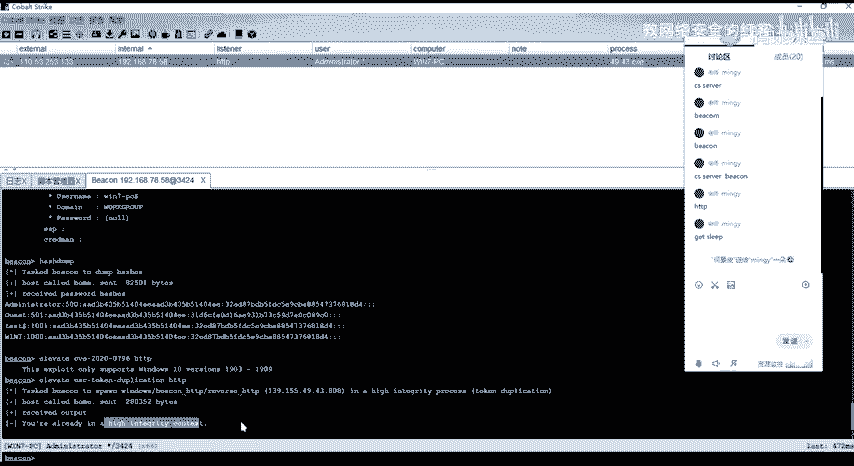

接下来，我们进行实际操作演示。我们的目标是将一个普通用户权限提升至System权限。

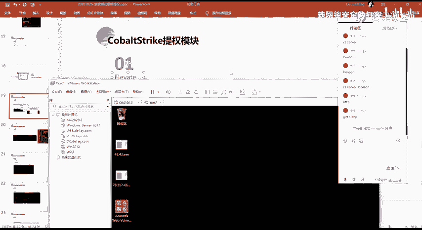

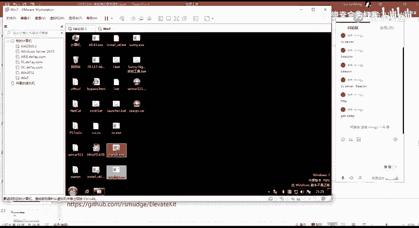

首先，我们确保当前会话是一个普通用户权限。通过执行`whoami`命令可以确认。

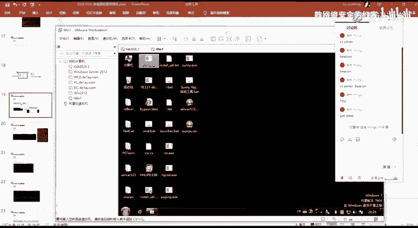

然后，我们通过“提权”功能，选择一个合适的提权模块（例如演示中使用的`uac-token-duplication`模块）并执行。

执行成功后，CS日志会显示初始化了一个新的信标。这个新信标就是提权后得到的更高权限的会话。

我们可以对比新旧会话。新会话的用户名后通常会有一个`*`号，并且边框可能变为红色，这表示其具有管理员权限。

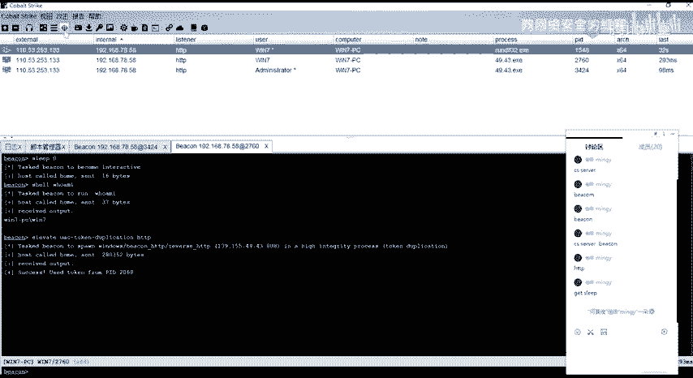

获得管理员权限后，我们可以进一步将其提升至System权限。在拥有管理员权限的信标上，再次使用提权功能，选择诸如`getsystem`等模块进行操作。

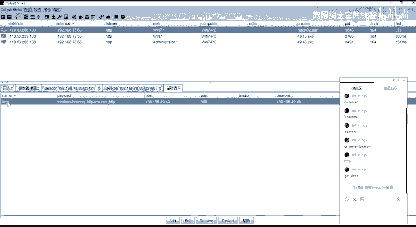

成功执行后，我们将获得一个System权限的信标会话。至此，我们完成了从普通用户到System权限的完整提权过程。

## 加载扩展脚本

为了获得更多的提权模块，我们需要学习如何加载外部脚本。

在CS客户端中，点击菜单栏的“脚本管理器”（Script Manager）。

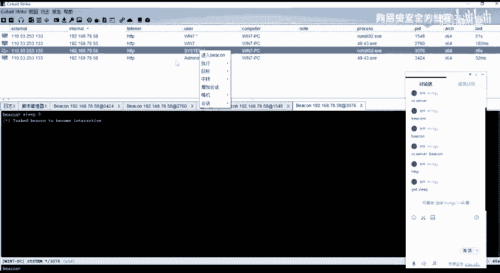

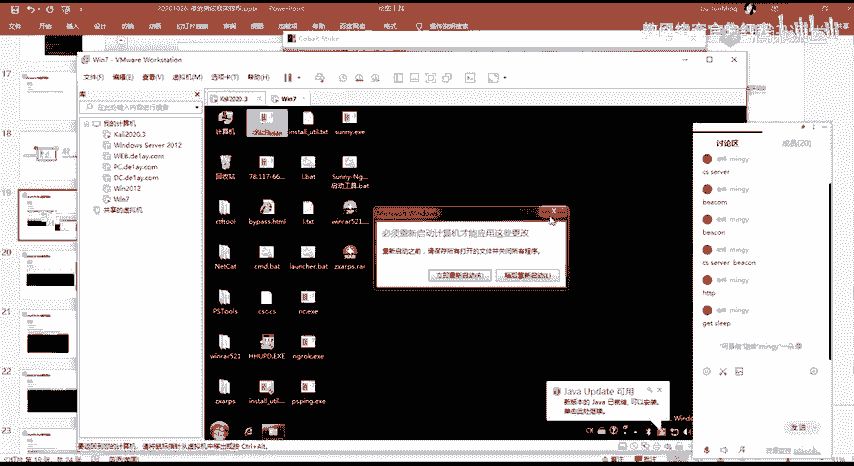

在脚本管理器中，点击“Load”按钮，然后导航到本地存放脚本的目录。需要加载的是后缀为`.cna`的文件。

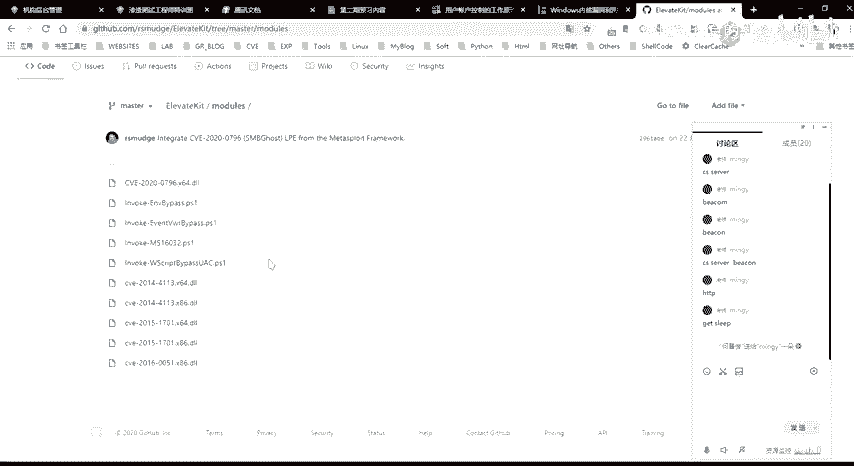

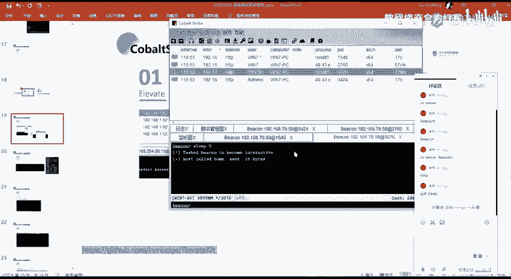

加载成功后，新的功能模块（如更多的提权漏洞利用）就会出现在相应的菜单中。如果重复加载已存在的脚本，则会提示加载失败。

## 总结

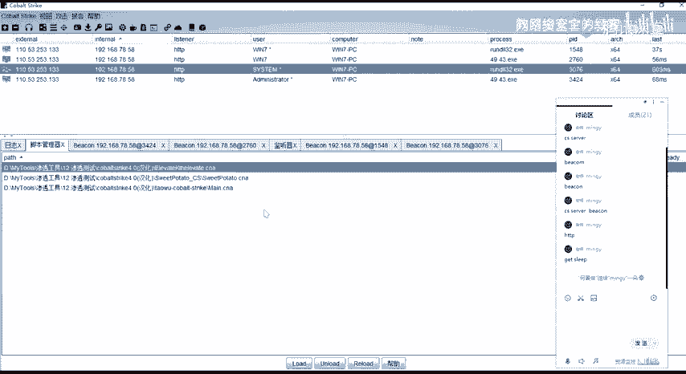

本节课我们一起学习了Cobalt Strike的提权模块。我们首先了解了CS的背景及其与MSF的关系，然后探讨了其核心的通信机制。重点是，我们详细演示了如何使用内置及扩展的Elevate模块，逐步将一个Windows 7普通用户权限提升至System权限。同时，我们也掌握了通过脚本管理器加载外部插件来扩展CS功能的方法。