# 网络安全系统教程：P98：Powershell提权模块 🛡️

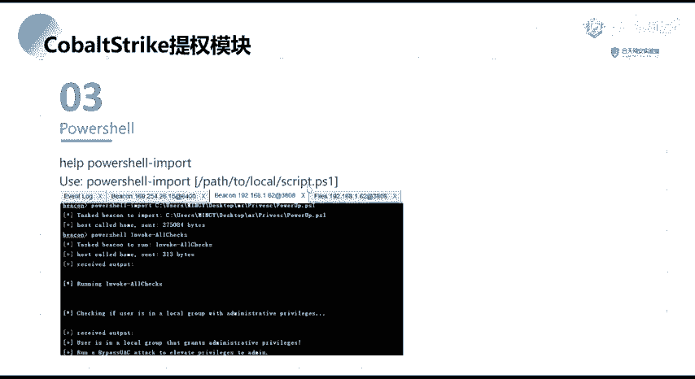

在本节课中，我们将学习如何利用Cobalt Strike框架，通过加载PowerShell模块进行系统提权。课程将重点介绍PowerUp脚本的使用方法，以及如何利用SweetPotato脚本进行提权操作。

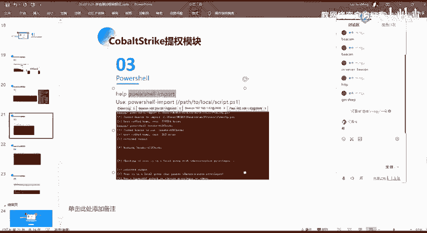

## 概述

上一节我们介绍了多种提权方法，本节中我们来看看如何在Cobalt Strike中利用PowerShell模块进行自动化提权漏洞检测。

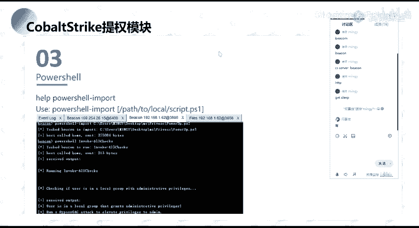

## PowerUp脚本介绍

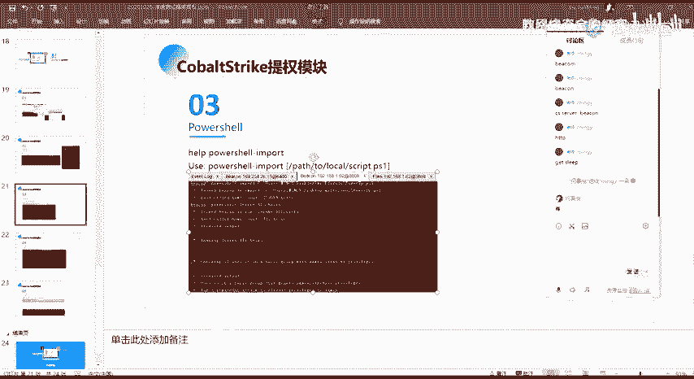

PowerUp是PowerSploit框架下著名的提权脚本。执行该脚本后，它会自动收集目标系统的信息，并尝试检测多种提权漏洞。

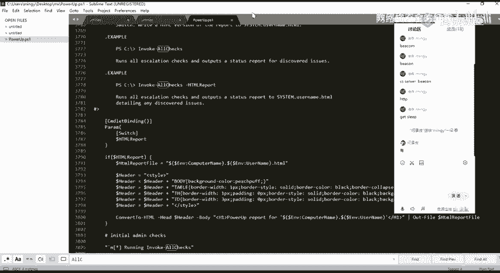

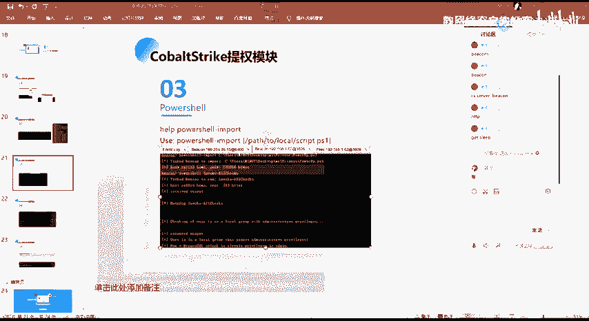

在Cobalt Strike中，我们使用 `powershell-import` 命令来加载本地的PowerShell脚本。

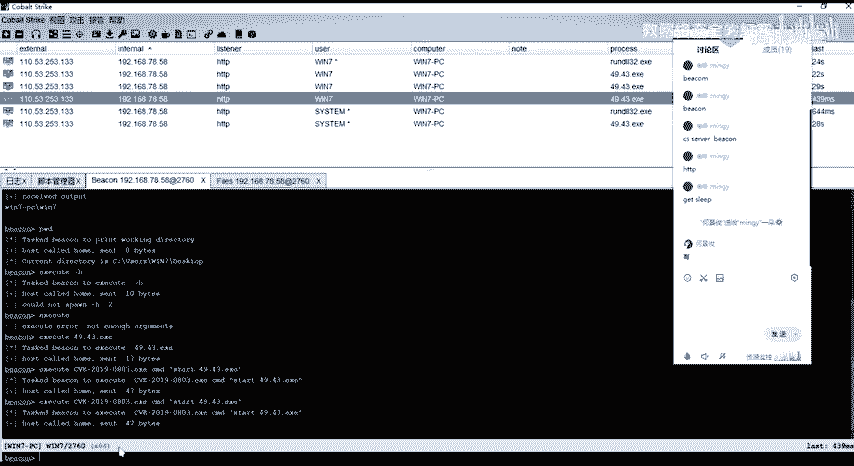

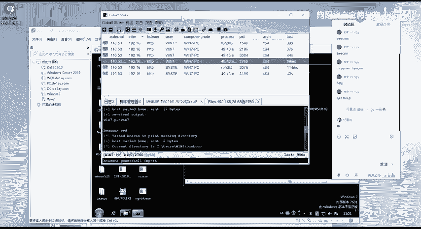

以下是加载PowerUp脚本的代码示例：
```powershell
powershell-import /path/to/PowerUp.ps1
```

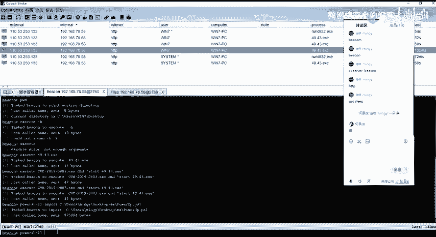

加载脚本后，我们可以调用其内置的方法。其中，`Invoke-AllChecks` 方法会加载所有用于探测提权漏洞的脚本，并对目标系统进行一次全面的漏洞扫描。

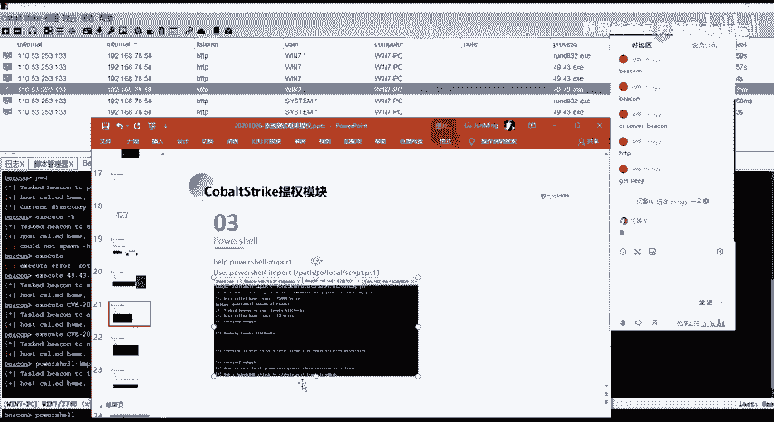

## 执行漏洞检测

现在，我们来实际操作一下。首先通过 `powershell-import` 加载本地的PowerUp脚本。

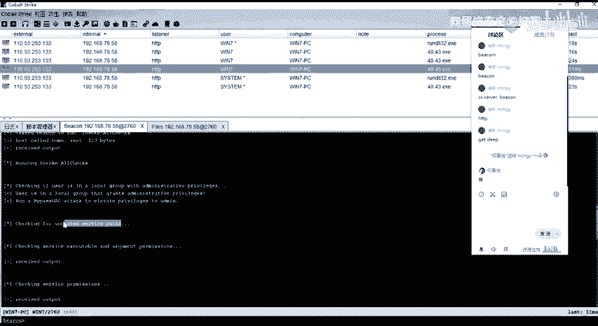

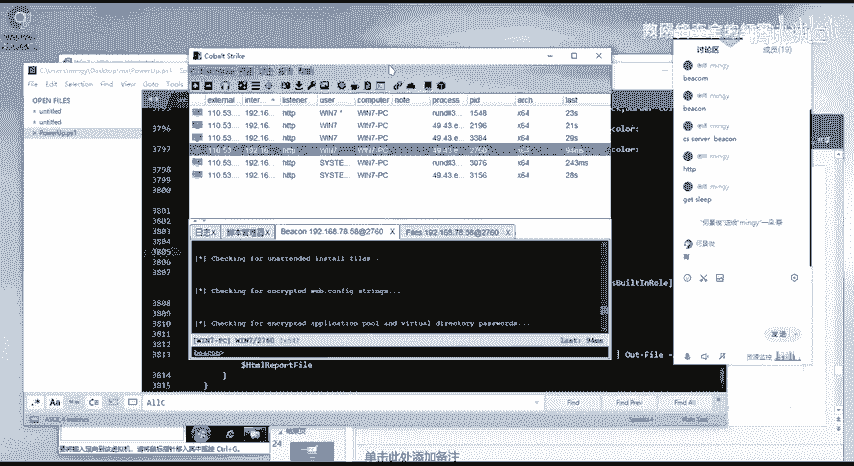

加载完成后，通过PowerShell执行 `Invoke-AllChecks` 方法。

执行后，脚本会输出大量信息。它会检查系统文件、服务配置等多种项目。

例如，它会检测 `AlwaysInstallElevated` 策略（即以SYSTEM权限安装MSI包的策略），以及 `Unquoted Service Path` 等Windows服务漏洞。

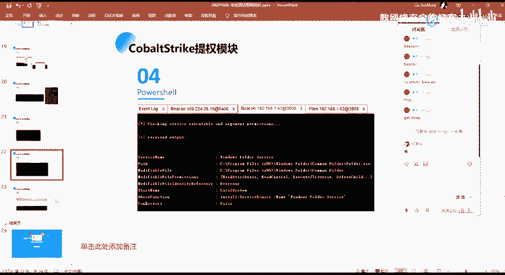

脚本运行需要一些时间。它会列出所有检查项的结果。

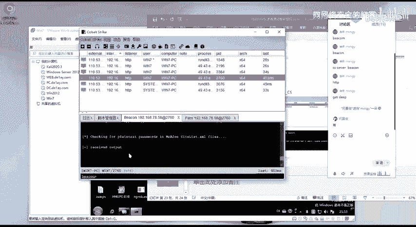

以下是可能检测到的部分漏洞信息示例：
*   **服务路径漏洞**：脚本会显示存在问题的服务及其可执行文件路径。
*   **目录权限**：`Modifiable` 字段表示该目录是否具有可写权限。
*   **其他配置问题**：脚本还会报告其他可能导致提权的系统配置问题。

大家可以在自己环境中执行该脚本以查看完整结果。

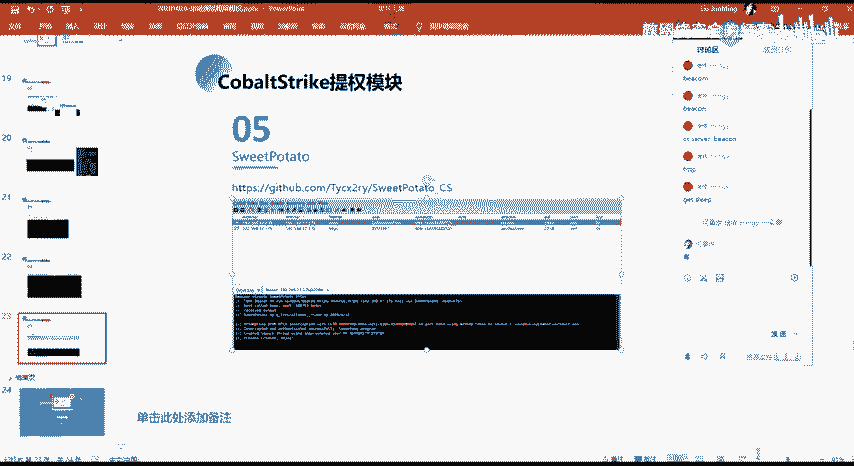

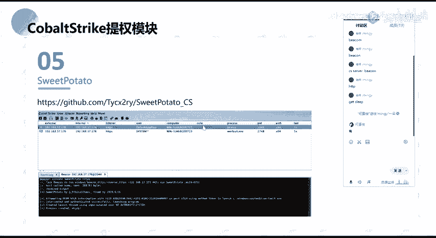

## SweetPotato提权脚本

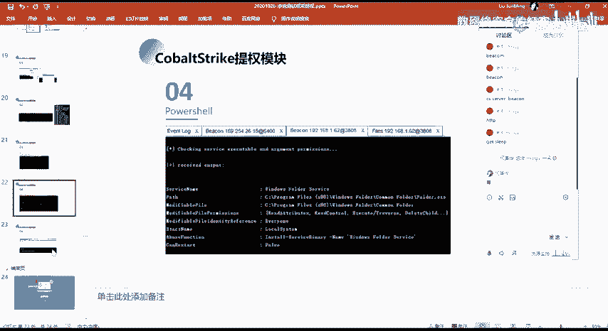

本节课最后一部分内容是SweetPotato脚本。它属于“土豆家族”提权工具之一，并被编写成了Cobalt Strike可加载的脚本。

该脚本在相关工具套件中通常也已包含。其使用方法与前面介绍的其他模块类似。

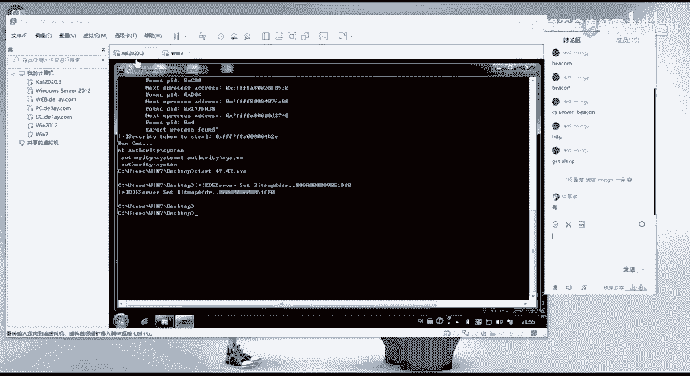

加载该脚本后，它会在Cobalt Strike的提权模块选项中显示。之后，我们选择该模块并指定监听器的名称。如果目标系统存在相应的提权漏洞，执行后我们便能获得一个SYSTEM权限的后门会话。

## 总结

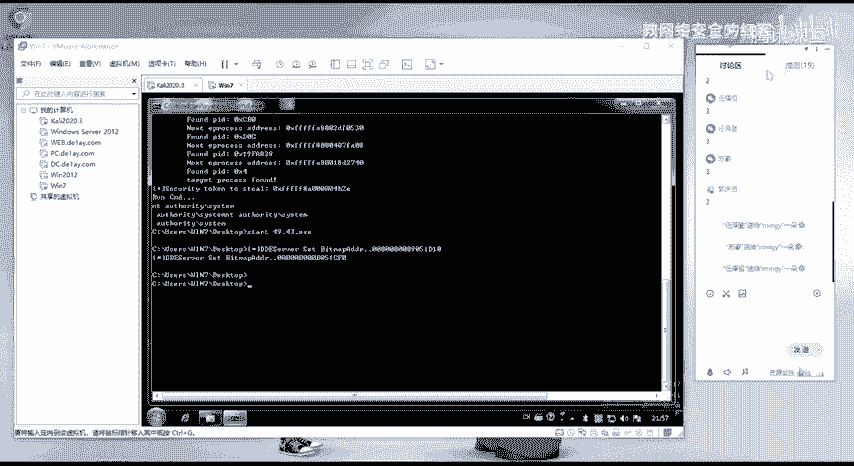

本节课我们一起学习了在Cobalt Strike框架中利用PowerShell模块进行提权的两种主要方法。核心内容包括使用PowerUp脚本进行自动化漏洞扫描，以及使用SweetPotato脚本实施提权。关键在于掌握如何将现有的提权工具和脚本集成到渗透测试框架中，并熟练进行操作。课后请大家务必亲自动手实践本节课演示的操作内容。