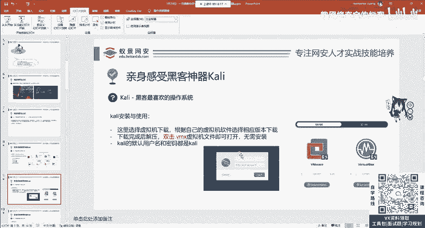
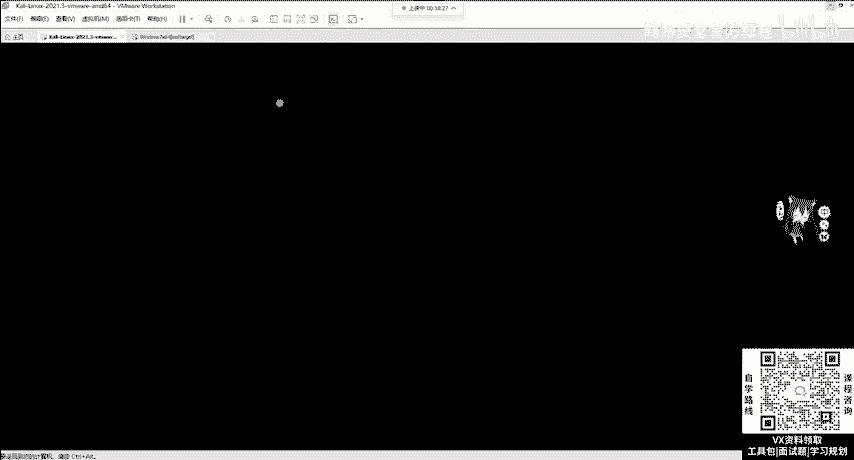
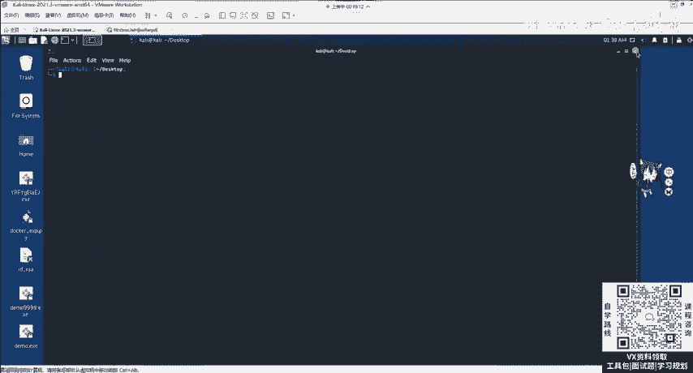
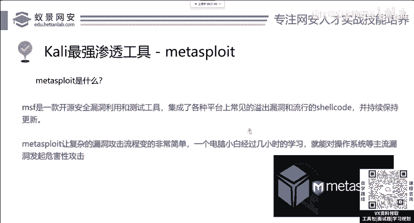

# 网络安全系统教程：P9：漏洞攻击 - Kali Linux 安装与配置 🛠️

在本节课中，我们将学习如何配置一个用于网络安全学习的攻击机环境。我们将重点介绍 Kali Linux 操作系统，包括其简介、版本选择、虚拟机安装方法以及初次登录后的基本操作。这是进入渗透测试和漏洞挖掘领域的第一步。

---

## 课程简介与法律声明 ⚖️

本课程专注于网络安全教学。课程内容涉及木马病毒生成及常见渗透工具的使用。学员在学习后，切勿对未授权的网站或系统进行渗透测试或攻击。任何由此产生的危害与授课讲师无关。请务必遵守法律法规。

---

## 什么是 Kali Linux？ 🐉

上一节我们明确了学习边界，本节中我们来看看我们将要使用的核心工具——Kali Linux。

Kali Linux 是一个基于 Linux 的操作系统发行版。它与普通操作系统的区别在于，它预装了渗透测试和开发中常见的环境，并集成了超过 300 个免费的渗透测试工具。这是从事和学习网络安全必备的操作系统。无论是安全入门者，还是国际顶级安全峰会上的专家，都在使用 Kali Linux。

---

## Kali Linux 的版本选择 💻

了解了 Kali 的重要性后，接下来我们需要知道如何获取它。Kali 为不同平台提供了多种版本。

以下是 Kali Linux 的主要版本：

*   **ARM 架构版**：适用于手机、移动设备或基于 M1 芯片的苹果电脑等。
*   **虚拟机版**：这是我们推荐新手使用的版本。官方已预装好系统，用户只需下载并导入虚拟机软件即可使用，无需复杂安装。
*   **移动版**：可安装在手机上。请注意，并非所有手机（如华为、小米、OPPO）都支持刷入第三方系统。可尝试的设备包括一加、谷歌 Pixel 或三星手机。
*   **其他版本**：还包括针对云服务、容器、U盘启动盘以及 Windows 的 WSL 子系统的版本。

对于初学者，我们强烈建议选择 **虚拟机版本**，因为它最简单快捷。你需要先确保电脑上已安装虚拟机软件（如 VMware Workstation 或 VirtualBox）。VMware 的安装过程与普通软件无异，如有疑问可自行搜索教程。

---

## 下载与安装 Kali Linux（虚拟机版） 📥

我们选择了虚拟机版本，现在来看看具体的下载和启动步骤。

1.  访问 Kali 官网：`www.kali.org`。
2.  点击 “Get Kali”，然后选择 “Virtual Machines”。
3.  根据你使用的虚拟机软件，下载对应的 VMware 或 VirtualBox 镜像文件（一个约 2.4GB 的压缩包）。
4.  将压缩包解压，你会找到一个后缀为 `.vmx` 的虚拟机文件。
5.  双击该 `.vmx` 文件，它会被自动导入到你已安装好的 VMware 软件中。
6.  启动虚拟机，你将看到登录界面。

---

## 登录与初始界面 🖥️

成功启动虚拟机后，我们便进入了 Kali Linux 系统。

Kali Linux 默认的用户名和密码均为：`kali`。输入后即可登录系统。

登录后，你会看到一个图形化桌面环境，与普通操作系统类似。有两种主要方式可以打开命令行终端：
1.  点击屏幕左上角的下拉菜单，选择第6个选项 “Terminal”。
2.  在桌面空白处右键，选择 “Open terminal here”。

对于 Linux 系统，命令行终端是核心操作界面。此外，你还可以通过点击 “Applications” 来查看 Kali 内置的 300 多个工具，它们分类在渗透测试、漏洞攻击、逆向工程、密码攻击等目录下。

**关于工具学习的重要建议**：你不需要立即学习所有工具。超过 80% 的工具在初期可能用不到。正确的学习方法是：在需要用到某个具体工具时，再去针对性学习和搜索其用法。Kali 官方提供了一个工具大全网站（`www.kali.org/tools/`），但同样建议按需查阅。技术的核心在于理解漏洞原理和工具的设计思路，做到举一反三。

---

## 核心工具介绍：Metasploit Framework (MSF) ⚔️

在众多工具中，有一个工具至关重要，它是面试渗透测试或安全服务岗位时要求必须熟练掌握的，这就是 **Metasploit Framework**，简称 **MSF**。我们将在后续课程中详细讲解它的使用。

---

## 总结 📚

本节课中，我们一起学习了网络安全学习的起点——配置攻击机环境。我们介绍了 Kali Linux 操作系统的定义与重要性，指导大家选择了适合新手的虚拟机版本并完成了安装与登录。最后，我们了解了 Kali 的基本界面，并给出了高效学习其海量工具的建议，同时引出了核心工具 Metasploit Framework。下一节课，我们将开始深入探索具体的渗透测试工具与技术。