# 2024网络安全系统教程！清华大佬花159小时讲完的网络安全系统课！别再盲目自学了，学完即可就业！零基础入门网络安全！（渗透测试／漏洞挖掘／CTF／黑客技术） - P25：12.meterpreter指令操控电脑权限.mp4 - 教网络安全的红客 - BV1ft421A7Nj

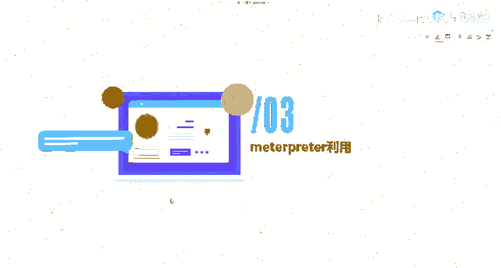

那我们这里来看一下mat print的用。一个用法。如果大家拿到的是一个hell或者是一个半成品，一个残废的mattterpre可以使用sessions杠U。

加上sessions IDD将这个session转换为完整的mattterpre。当然这个转换有可能会失败。这个我们后面再讲。当我们进入mat printer之后，我们输入问号。

那这些我们都可以做了都可以做了。😊。

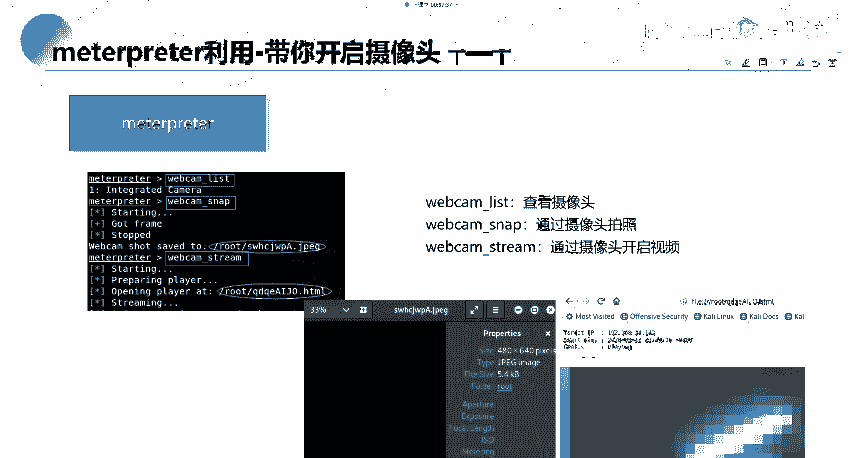

啊，那你想想渗透就渗透，不想渗透，也可以玩一些有趣的东西。比如说开启一个摄像头session一，我们输入问号，刚刚告诉大家摄像头是什么？weca那Vca这里我们可以进行一个list，就是看摄像头的设备。

哎，i不 list，你这里是肯定找不到的，因为我们的虚拟机并没有进行连接。那虚拟机连接的设备在哪儿呢？我们可以打开VM在下面啊，在这下面。😊。

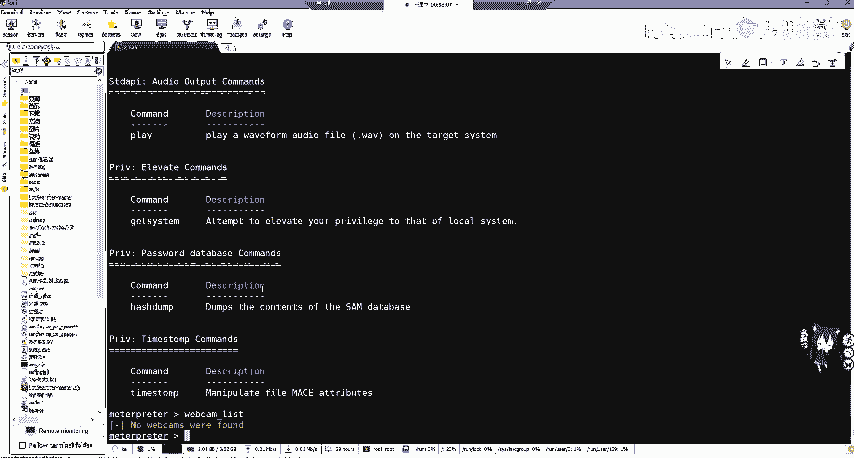

那下面这这看不到。往这往下推一点。

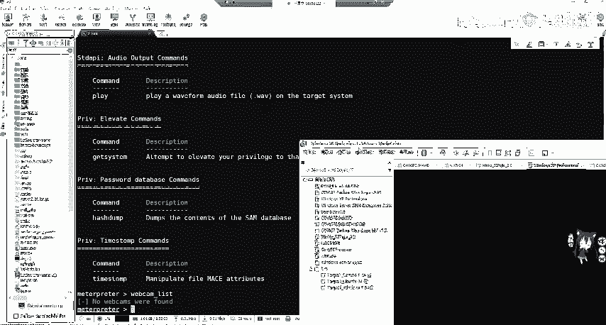

OK在下面右下角这一排，大家可以看到哪些IU设备进行了连接。首先我们的硬盘。CD网络网卡啊，可以连接打印机，可以连接声卡或者是这个外接设备。那我们可以这里进行一个连接。这是USB设备。

我可以把摄像头进行连过来，按一下，连摄像头可不可以。可以在这里添加IU设备。

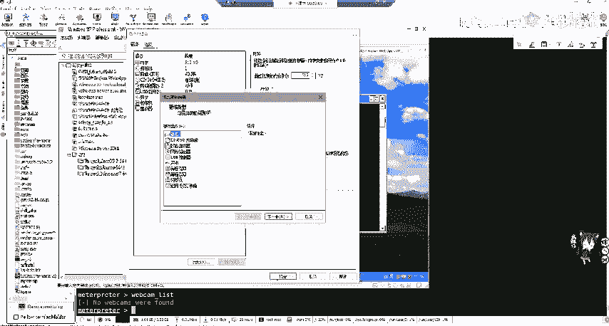

不会这个机器不能连摄像头呗。那，我看一下本机的这个能不能。OK这个你看这个有个network，这camer我们可以进行一个连接，就可以连接到这个主机。那我们除了这个连接主机之外，来看一下其他的。

一些用法。可以对屏幕的进行一个截屏，screenshot啊截屏。那我们直接运行。他会把那个把机截个屏，放在这个里面，放在这个里面。让我们刷新一下，看看在不在啊，是这个。

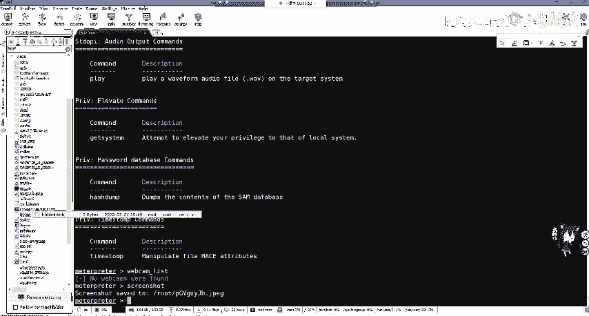

啊，可以看到是我们截的那一个打机的屏幕。当然我们可以实时监控它，就是使用我们的流。比如实时监控这个摄像头就webca stream。

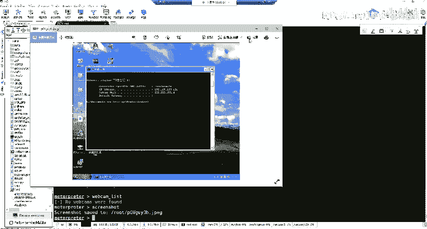

如果实时监控我们的一个屏幕的话，screen share。看就是查看用户的这个屏幕实时查看。所以说大家的摄像头并不是安全的，特别是公司里面具有170106栋的。如果他是外接的摄像头。

那你可以打进去是调用别人的摄像头。那下面我们来看一下这个系统的一些命令。系统命令首先呢是tURID也就是查看我们当前用户的1个UIDUID可以看到我们是stem用户，也就是啊管理员用户。

geURID之后，我们可以PS看一下当前的一个进程。

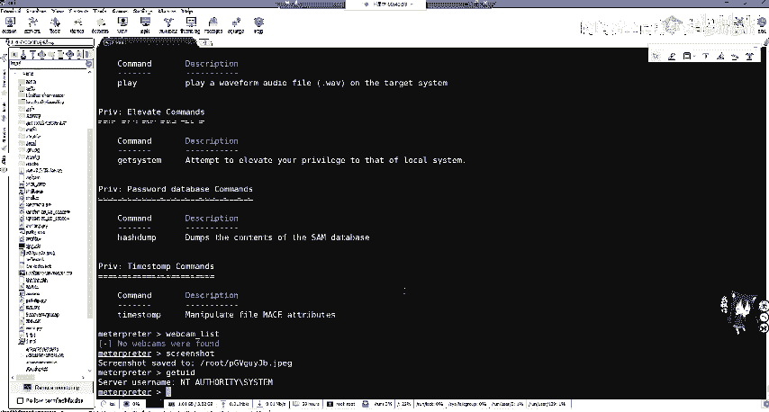

就是打机上面运行的进程。

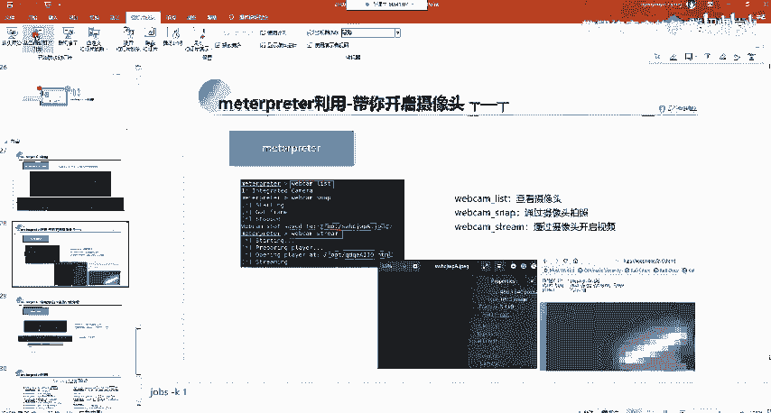

啊，可以使用webcom list查看摄像头拍照或者是开启一个实时的视频。这个视频是通过一个web接口进行开启的。你可以去访问，那就可以实时查看别人的摄像头了。那么mat print一个重要功能呢。

就是打开我们的CMDCMD可以使用一个系统命令excuse执行执行我们的CMD点ESE或执行shall，直接输入shall命令进行执行。啊，跟这个是同样的原理。在shall命令执行之后啊。

我们就拿到了这个XP系统的CMD。这个时候大家可以干什么？可以创建用户。

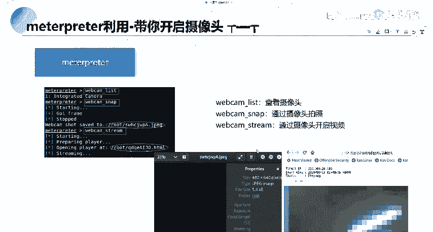

可以啊做一些事情啊，删除文件等等。在mac里面有download的下载或者是upload，我们可以将文件进行上传到我们目标靶机，分别是upload将我们本机的一个文件上传到我们的靶机的一个目标文件啊。

这里就非常简单了。

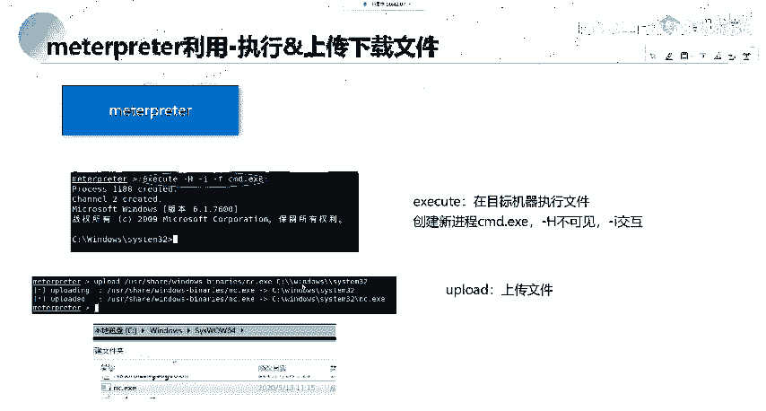

直接选用upload。upload比如我们上传我们的。就当前目录。那当前目录什么都没有。就比如说E叉P点PY像我们目标的C盘E叉P点PY。啊，他会把告诉你传过去了。然后说我们来进行目标机，我们来看一下。

C盘啊。OK这个不在这。哦，这个啊抱歉啊，这个要进行一个转移，不然的话他会认为你这个是一个。因为它会把你的杠E拼成仪器。那这里可以看到它把我们的这个H叉P上传到我们C盘的H叉P。之后我们进把西来看一下。

哎，看一看到这个就在这里面了。可，这就在里面了。那你就可以上传一些木马或者是这些脚本一些工具啊进行上传上去。那mtter printer的常用命令，我们再回顾一下。

首先background放到后台y关闭绘画，help帮助信息。好，大家来看一下sstem info与系统的平台信息。这些我都给大家讲过了，查看进程，还有关闭查看短前的用户权限。那我们最常用的一些。

大家在做渗透的时候，经常用的肯定是background的，放后台，还有查看一个系统的信息shall获取我们的CMD还有PS查看进程。upload进行一个文件的上传。

get your IDD查看当前的用户权限。当然，也可以进行一个端口转发和。用户的创建。这里大家可以看到一个特殊的是我们最想要的关闭杀毒软件runqIV这是装关闭杀毒软件，大家觉得会有用吗？

这一条命令其实现在的这些杀毒软件你都无法关闭。即使是windows defender用这个runqVIV也不会关闭，可以说它基本没有什么用。那我们mat就讲到这里。

大家有想看这个关于更多的mat一个实验，可以去和天网案实验室，自己去搜索mattter splitmat split后渗透入门，它是由这些实验，这个就不作不作为我们的作业。

因为我们后面啊可还会讲渗透测试就是一个性能收集，还有寻找突破点，后渗透一些内容，整个的流程，我们都会再讲。

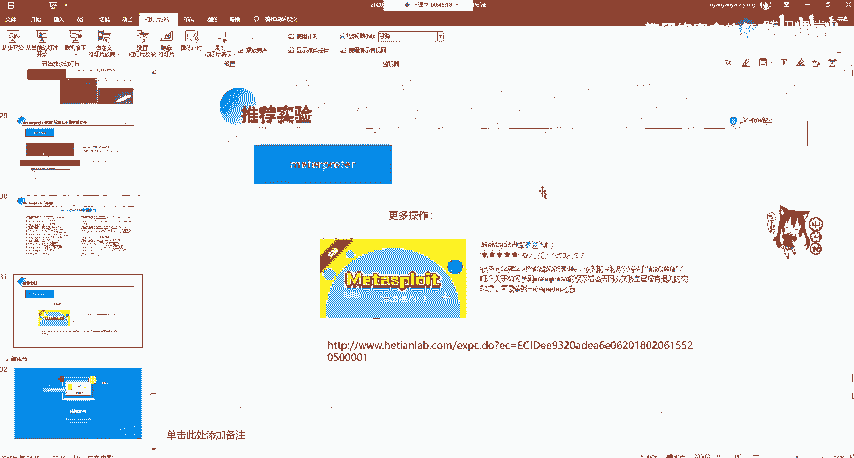

那MSF的一个。还有什么方法能拿到mat，那它的方法很多，我们可以寻找web的一些接口或其他服务的漏洞，一些CVE漏洞。比如说他们比如说timeca的漏洞，还有呃这些web logic这些漏洞。

进行一个攻击，或者是web之前在上一章中讲的那些web漏洞，都可以帮助我们拿到mate。不出来。那这里就是我们卡利的mate split split一个攻击流程。

大家觉得如果是做过会发现非常的基础和简单，但是这个流程还是要熟悉。如果你觉得我们这两节课就能学会mattter split，那是不可能的。因为它里面的东西实在太多了。即使你是专门研究。

也不可能学的非常透彻。你这个只是对一个已知漏洞进行一个攻击。但是它里面还有其他很多东西，包括脚本字典都可以拿来去用。如果使用对如果使用我们杠刚的这个。如果你是使用这个。如果你是使用这个的话。

你会发现他拿到的是一个。CMDCMD之后，你拿到CMD怎么办？你可以background啊，可以background一下background。

然后进行一个session杠U加sessionID进行一个mat的一个转换。它会发很多的包进行一个转换。像像阿玉。是进行一个转换。那大家就是在听课之后一定要去操作，可以自己去下载文熙的镜像。

进行一个攻击，或者是不如果不想下载，就是觉得这确实是没有什么，就是一个流程。那可以到和田网上实验室，大家都有会员，那免费的自己大家自己去做一下就行。熟悉这个流程自己做一遍，那基本没什么问题。

基本没没什么问题。我在看还有大家那个作业的时候，嗯，有的同学就是把信息收集总结成了博客，这个非常好，大家要养成一个总结的一个习惯。包括在学习其他内容，如果不去总结文档，比如说做CTF也好，不去总结文档。

你就发现很快就忘记了。有可能你清楚的记得我这个net meta拿到之后可以做什么后渗透怎么做代理。但是你有可能啊一段时间不做，后面就忘了，这时候就需要操作，或者是你不想操作就翻一下自己的文档即可。

那这里大家对这个流程还有什么疑问吗？呃，疑问的话，现在可以提出来。那没有什么问题的话，那我们先休息5分钟，大家可以去。嗯，休息一下。嗯，那个我们50的时候开始下一节课。

也就是mus split攻击windows和linux的实力。大家如果觉得哪里有问题的话，可以在周末也行，嗯，平时也行去在群里问，或者是私下问我，哪知道我在群里就是这个ID。那我们这一节课先下课啊。

先到这里。