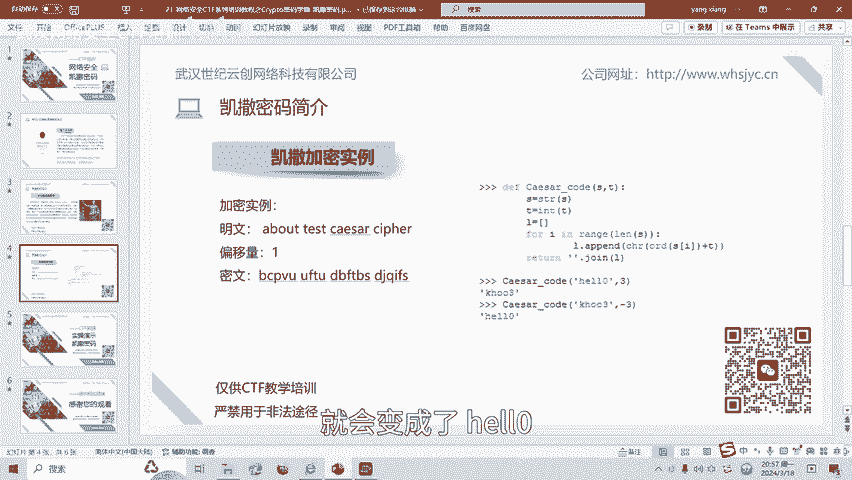
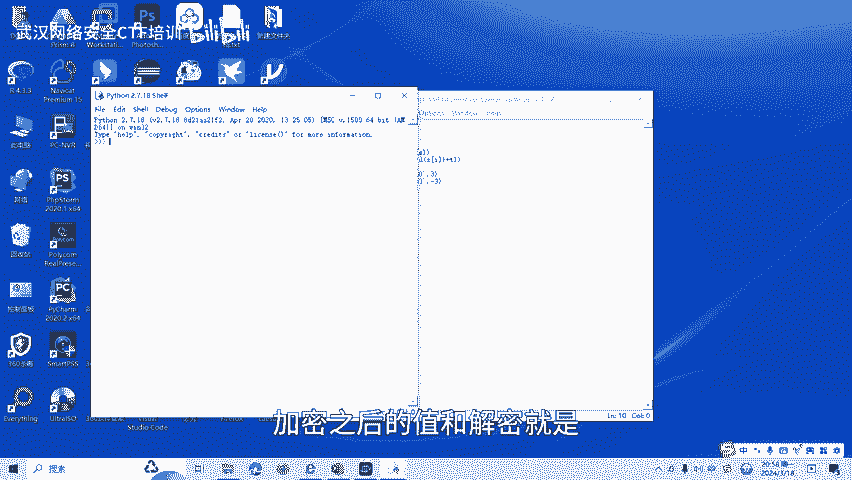
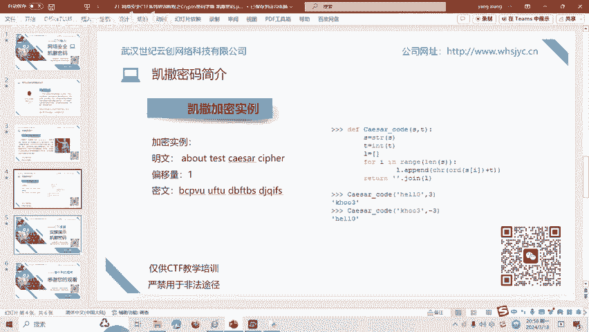
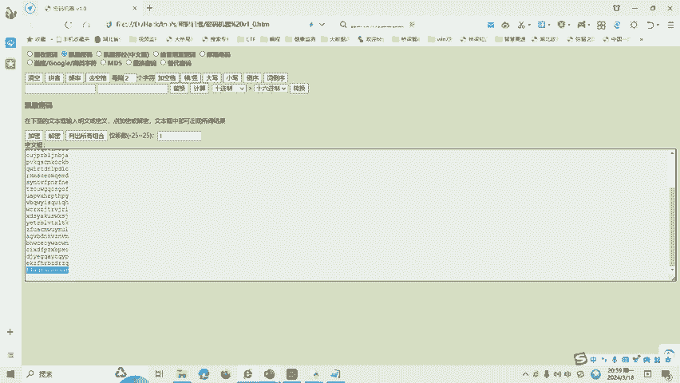

# CTF密码学入门：1：凯撒密码

在本节课中，我们将要学习CTF比赛中密码学方向最基础、最广为人知的加密技术——凯撒密码。我们将了解其原理，并通过Python代码示例学习其加密与解密过程，最后通过一道实战题目巩固所学知识。

## 🛡️ 网络安全声明

首先，请务必遵守《网络安全法》。本课程内容仅用于CTF网络安全教学与培训，请遵守相关法律法规，勿将所学知识用于其他非法用途。

## 🔐 什么是凯撒密码？

在密码学中，凯撒密码（或称凯撒加密、凯撒变换）是一种最简单且最广为人知的加密技术。它是一种替换加密技术，明文中的所有字母在字母表上向后（或向前）按照一个固定的数目进行偏移，从而被替换成密文。

例如，当偏移量为3时，所有字母A将被替换成D，B变成E，以此类推。这种加密方法以罗马共和时期的凯撒大帝命名，因为他曾用此方法与将军们进行通信。

## 💻 凯撒密码的Python实现

上一节我们介绍了凯撒密码的基本概念，本节中我们来看看如何用代码实现它。

### 加密原理

凯撒密码的加密原理是将明文中每个字符按照字母表顺序向后移动K位（K为密钥），得到新的字符即密文。

以下是加密的Python脚本示例：

```python
def caesar_encrypt(text, shift):
    result = ""
    for char in text:
        if char.isalpha():
            # 处理字母字符
            ascii_offset = ord('A') if char.isupper() else ord('a')
            shifted_char = chr((ord(char) - ascii_offset + shift) % 26 + ascii_offset)
            result += shifted_char
        else:
            # 非字母字符保持不变
            result += char
    return result

# 示例：加密“HELL0”，偏移量为3
plaintext = "HELL0"
shift_key = 3
ciphertext = caesar_encrypt(plaintext, shift_key)
print(f"加密结果: {ciphertext}")  # 输出: KHOO3
```

运行上述脚本，输入字符串“HELL0”和步长（偏移量）3，函数会将每个字母字符向后移动三位。因此，H变成K，E变成H，L变成O，数字0保持不变。最终，“HELL0”被加密为“KHOO3”。

### 解密原理

凯撒密码的解密是加密的逆过程。解密时将密文中的每个字符按照字母表顺序全部前移N位（N为加密时的偏移量），得到的新字符即为明文。

以下是解密的Python脚本示例：

```python
def caesar_decrypt(text, shift):
    # 解密即反向加密（前移shift位）
    return caesar_encrypt(text, -shift)



# 示例：解密“KHOO3”，偏移量为3
ciphertext = "KHOO3"
shift_key = 3
plaintext = caesar_decrypt(ciphertext, shift_key)
print(f"解密结果: {plaintext}")  # 输出: HELL0
```

运行解密函数，输入密文“KHOO3”和步长-3（即前移3位），函数会将每个字母字符前移三位。因此，K变回H，H变回E，O变回L，数字3变回0。最终，“KHOO3”被解密为“HELL0”。

## 🛠️ 凯撒密码实战演练



了解了原理和代码实现后，我们来进行一次实战演练。以下是CTF中一道典型的凯撒密码题目。

**题目描述**： 密文为 `fllaag`，请找出flag。



**解题思路**： 由于凯撒密码的偏移量（密钥）未知，我们可以尝试遍历所有可能的偏移量（1到25），观察解密后的结果，寻找有意义的明文。

以下是使用“密码机器”类工具或简单脚本进行暴力破解的思路：

1.  将密文 `fllaag` 作为输入。
2.  尝试从1到25的所有偏移量进行解密。
3.  检查每次解密后的字符串，寻找像 `flag{...}` 或包含特定关键词的明文。

通过遍历，我们会发现当偏移量为某个特定值时，解密结果呈现有意义的内容，例如 `flag{...}` 格式，该内容即为本题的答案。

（注：在实际CTF比赛中，可能会遇到字母、数字、符号混合的凯撒变种，解题思路是相通的，即尝试所有可能的偏移或观察字符变化规律。）

## 📚 总结

本节课中我们一起学习了CTF密码学中的凯撒密码。



*   我们了解了凯撒密码是一种通过固定偏移量对字母进行替换的古典加密算法。
*   我们学习了其加密与解密的原理，并用Python代码实现了这两个过程，核心公式是字符的ASCII码计算：`(ord(char) - base + shift) % 26 + base`。
*   最后，我们通过一道实战题目，掌握了破解未知偏移量凯撒密码的常用方法——遍历所有可能的密钥。

凯撒密码是密码学的基石之一，理解它有助于学习更复杂的加密技术。后续课程中，我们将针对各种类型的凯撒密码变体制作相应的教学视频。

---
**提示**： 如需课程相关工具或资料，可扫描视频中的二维码联系获取。