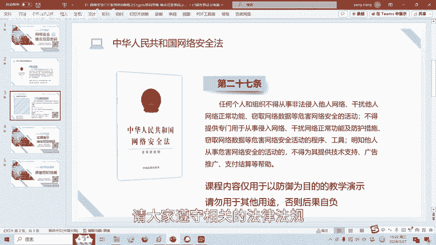
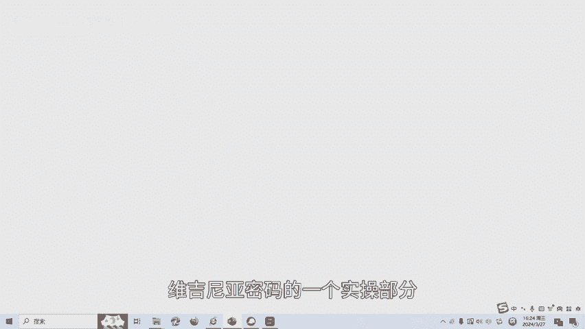
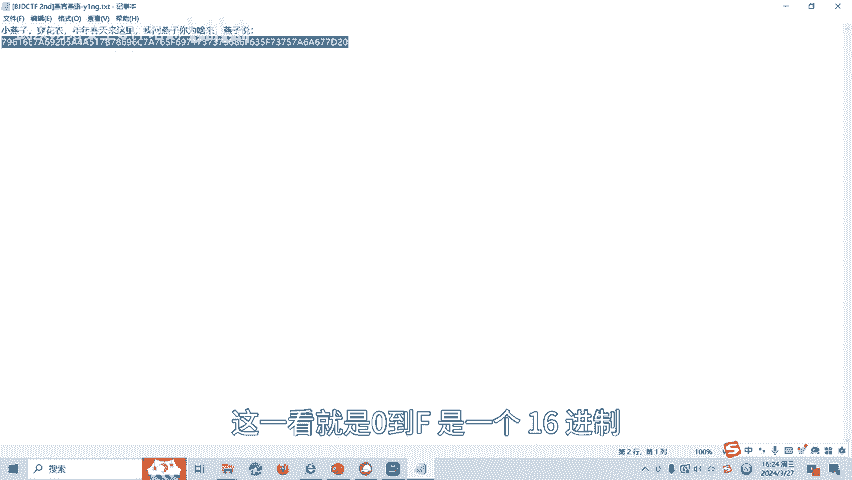
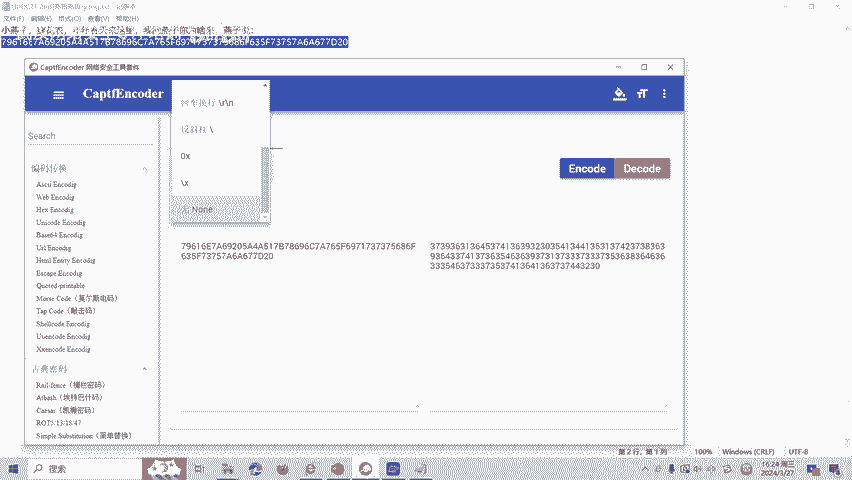
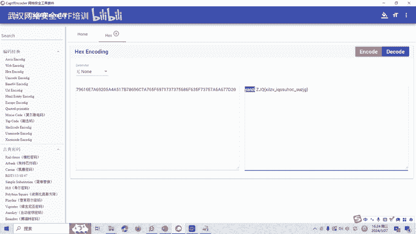
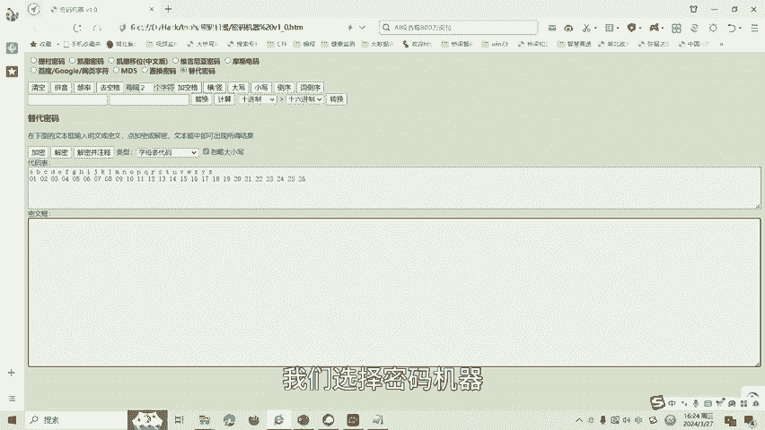
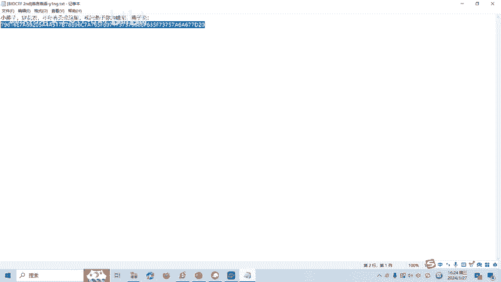
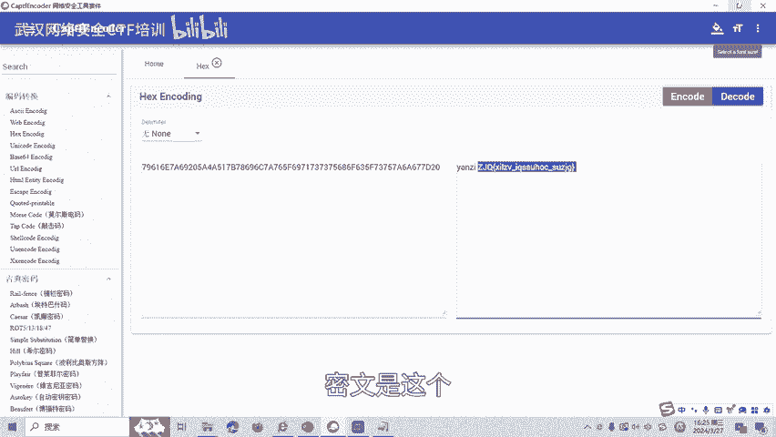
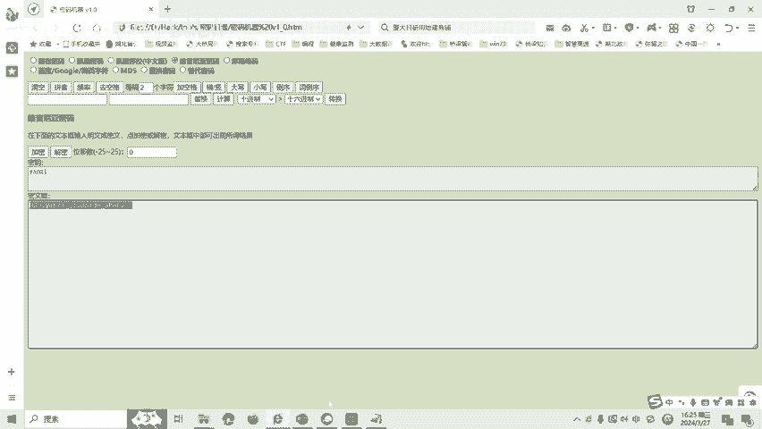

# CTF密码学：P1：维吉尼亚密码 🔐

在本节课中，我们将要学习CTF比赛中密码学方向的一个基础加密技术——维吉尼亚密码。这是一种经典的多表替换密码，理解其原理是解决相关CTF题目的关键。

## 概述

维吉尼亚密码是在单一凯撒密码的基础上扩展出来的多表代换密码。其核心在于根据密钥来决定使用哪一行的密表来进行字符替换。当密钥长度小于明文长度时，密钥可以循环使用。

## 加密原理

上一节我们介绍了维吉尼亚密码的基本概念，本节中我们来看看它的具体加密过程。

加密过程依赖于一个预先定义的维吉尼亚表（通常是一个26x26的字母矩阵）。加密时，需要明文和密钥。

以下是加密的步骤描述：
1.  将明文和密钥转换为字母序列。
2.  对于明文中的第 `i` 个字母，找到其在维吉尼亚表中对应的行（以该明文字母开头）。
3.  找到密钥中第 `i` 个字母（若密钥较短则循环使用），确定其在步骤2所选行中的列。
4.  该行列交叉点的字母即为密文的第 `i` 个字母。

我们可以用**公式**来描述单个字符的加密过程：`C_i = (P_i + K_i) mod 26`，其中 `P_i` 是明文字母序号（A=0），`K_i` 是密钥字母序号，`C_i` 是密文字母序号。

## 加密实例

为了更直观地理解，我们来看一个具体的例子。

假设明文为 `THINK`，密钥为 `CIPHER`。由于密钥长度大于明文，我们只取前5位 `CIPHE`。
*   明文 T (行) + 密钥 C (列) -> 查表得 V
*   明文 H (行) + 密钥 I (列) -> 查表得 P
*   明文 I (行) + 密钥 P (列) -> 查表得 X
*   明文 N (行) + 密钥 H (列) -> 查表得 U
*   明文 K (行) + 密钥 E (列) -> 查表得 O

因此，明文 `THINK` 使用密钥 `CIPHER` 加密后得到的密文为 `VPXUO`。

## CTF实战演练

理解了加密原理后，本节我们将通过一道模拟的CTF题目来实践维吉尼亚密码的解密过程。

我们打开题目，得到一串十六进制数据：`59 61 6e 7a 69 20 6a 69 75 79 69 6e 67`。这显然是0-9和A-F组成的十六进制数。

首先，我们需要将这串十六进制数进行解码。使用工具或代码将其转换为ASCII字符串。

解码后，我们得到字符串：`Yanzi jiuying`。观察发现，中间有空格，`Yanzi` 看起来像一个单词。在维吉尼亚密码题目中，这种有意义的单词常常就是密钥。

接下来，我们使用解密工具。选择维吉尼亚密码解密功能，密钥设置为 `Yanzi`，密文输入 `jiuying`。

执行解密后，得到结果 `welcome`。这个解密后的字符串 `welcome` 就是本题的Flag。

## 总结

本节课中我们一起学习了维吉尼亚密码的基础知识。我们从其作为多表替换密码的基本概念讲起，详细说明了其加密原理和解密过程，并通过一个完整的CTF实战例子演示了如何从十六进制数据开始，一步步分析、解码并最终使用推测的密钥解出Flag。维吉尼亚密码还有很多变种和攻击方式，后续课程将会继续深入。