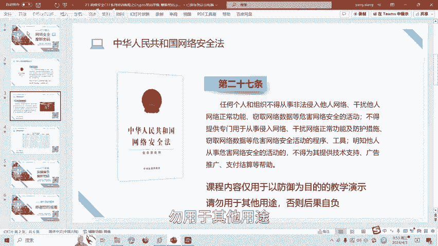
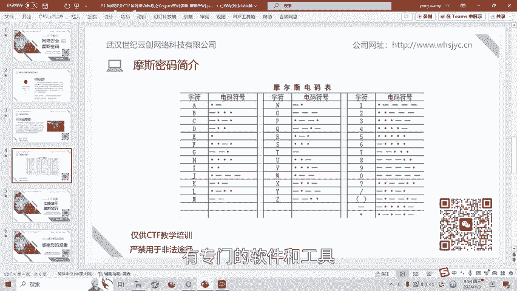
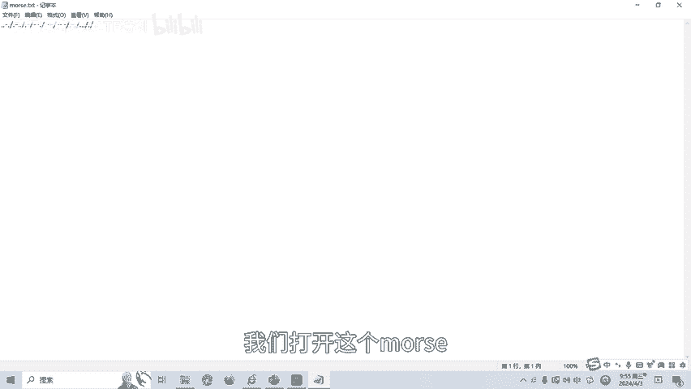
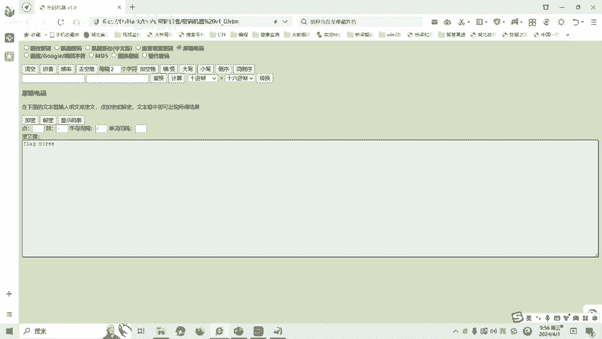

# CTF密码学入门：P1：摩斯密码

在本节课中，我们将要学习CTF比赛中密码学方向的一个基础知识点——摩斯密码。我们将了解其定义、编码规则，并通过一道实操题目来掌握其破解方法。

## 📜 什么是摩斯密码？

摩斯密码是一种时通时断的信号代码，通过不同的排列顺序来表达不同的英文字母、数字和标点符号。摩斯电码是一种早期的数字化通信形式。

它不同于现代只使用0和1两种状态的二进制代码。它的代码包括5种元素：
*   点
*   划
*   点和划之间的停顿
*   每个字符间短的停顿
*   每个词之间中等的停顿
*   句子之间长的停顿

## 📋 摩斯密码表

接下来我们看一下摩斯密码表。以下是部分字符的对应关系：

*   大写字母A的编码是：`.-`
*   大写字母B的编码是：`-...`
*   数字1的编码是：`.----`
*   标点符号如括号、问号也都有相应的点划排列组合。

我们一般破解摩斯密码时，就按照这个对照表进行。当然，也有专门的破解工具。如果人工对照密码表逐个破解，会花费较长时间。使用专门的软件和工具则效率更高，后面我们做实操时就会讲解。

## 🛠️ 摩斯密码实操

上一节我们介绍了摩斯密码的基本概念和对照表，本节中我们来看看如何实际破解一道CTF题目。

我们打开题目文件，会发现其中包含由点和横线组成的字符串，这就是典型的摩斯密码。

以下是破解步骤：

1.  **识别与准备**：确认题目给出的是一串由点（`.`）和横（`-`）组成的摩斯电码。字符间的间隔通常用空格或斜线（`/`）表示。
2.  **使用工具解密**：我们将密文复制到摩斯密码解密工具中。注意，工具中点和横的字符需要与题目一致。
3.  **设置参数**：在工具中选择“解密”功能，并确保编码类型为“摩斯电码”。
4.  **获取结果**：点击解密后，工具会输出对应的英文字母，组合起来即为这道题目的Flag（答案）。

通过以上步骤，我们就能成功破解摩斯密码类的题目。

## 📝 总结与展望

本节课中我们一起学习了CTF密码学中的摩斯密码。我们了解了它是一种通过点、划及其间隔来编码信息的早期通信形式，掌握了基本的密码对照表，并实践了使用工具破解摩斯密码题目的完整流程。

摩斯密码还有很多种变化形式，后续课程将会针对各种类型的摩斯密码题目制作相应的教学视频。