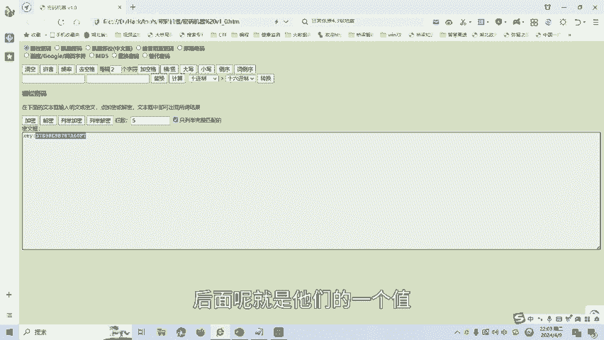

# CTF密码学篇：P1：栅栏密码 🔐

在本节课中，我们将要学习CTF（Capture The Flag）竞赛中密码学方向的一个基础知识点——栅栏密码。这是一种经典的置换密码，理解其原理是解决相关挑战的第一步。

## 什么是栅栏密码？

上一节我们介绍了本课程的目标，本节中我们来看看栅栏密码的具体定义。所谓栅栏密码，是一种通过重新排列明文字符顺序来实现加密的古典密码。其核心操作是将待加密的明文分成N个一组，然后将每组中的第一个字符取出并组合，接着取出每组的第二个字符并组合，依此类推，直到取出每组的第N个字符进行组合。最后，将这些组合按顺序连接起来，就形成了密文。

## 栅栏密码加密实例 🧩

理解了基本概念后，我们通过一个实例来具体看看加密过程。这里以三栏栅栏加密为例。

假设明文为 `test for real`。首先，我们需要去掉空格，得到连续的字符串 `testforreal`。接着，我们以3个字符为一组进行划分：
*   第一组：`tes`
*   第二组：`tfo`
*   第三组：`rre`
*   第四组：`al`（最后一组不足3个字符，通常用特定字符如`X`填充，这里我们暂时保留`al`）

以下是加密步骤：
1.  取出每组第一个字符：`t`, `t`, `r`, `a` -> 组合为 `ttra`
2.  取出每组第二个字符：`e`, `f`, `r`, `l` -> 组合为 `efrl`
3.  取出每组第三个字符：`s`, `o`, `e`（第四组无第三个字符，忽略） -> 组合为 `soe`

最后，将这三组组合连接起来，得到密文：`ttraefrlsoe`。这就是栅栏密码的加密结果。

## CTF实战解题演练 🏁

理论需要结合实践。接下来，我们通过一道模拟的CTF题目来演示如何应用栅栏密码进行解密。

题目描述为：“刘翔是跨栏的，他跨5个栏应该很轻松。” 这通常是一个提示，暗示加密方式为栅栏密码，并且栏数（即分组数N）为5。

假设我们获得的密文是 `Tlhsiis a etsst`（此为示例，实际题目密文不同）。解题步骤如下：

1.  识别提示：题目中的“跨5个栏”强烈提示使用**5栏**栅栏密码。
2.  使用工具：将密文复制到在线的栅栏密码加解密工具中。
3.  设置参数：在工具中选择“解密”模式，并将**栅栏数**设置为 **5**。
4.  执行解密：点击解密按钮，获取结果。

解密后，我们可能会得到类似 `This is a test` 的明文。在CTF比赛中，答案（即`flag`）通常以特定格式呈现，例如 `flag{This_is_a_test}`、`K=This_is_a_test` 或直接是 `CTF{This_is_a_test}`。我们需要根据题目要求提交正确格式的字符串。

## 总结与延伸

本节课中我们一起学习了栅栏密码的基础知识。我们首先了解了它的加密原理：按固定栏数N分组，并按顺序抽取字符重组。然后，我们通过一个实例清晰看到了加密过程。最后，我们模拟了CTF解题场景，掌握了如何根据题目提示（如“跨N个栏”）判断并使用工具进行解密。

栅栏密码还有很多变种，例如`W型栅栏`、`偏移栅栏`等，在后续课程中我们将针对这些高级类型制作相应的教学视频。掌握基础是探索更深领域的关键。

---
**请注意**：本教程内容仅用于CTF网络安全技术教学与培训，请严格遵守《网络安全法》及相关法律法规，切勿用于任何非法用途。