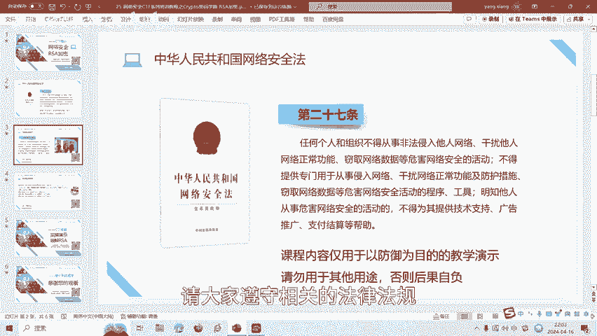
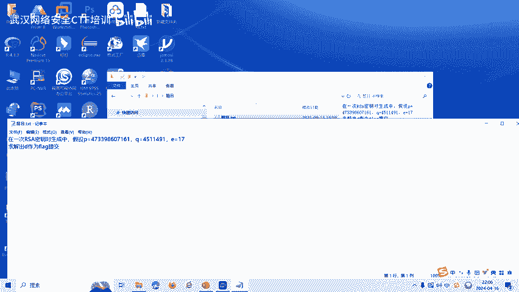
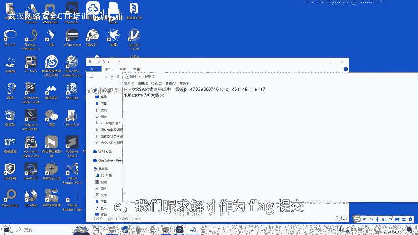
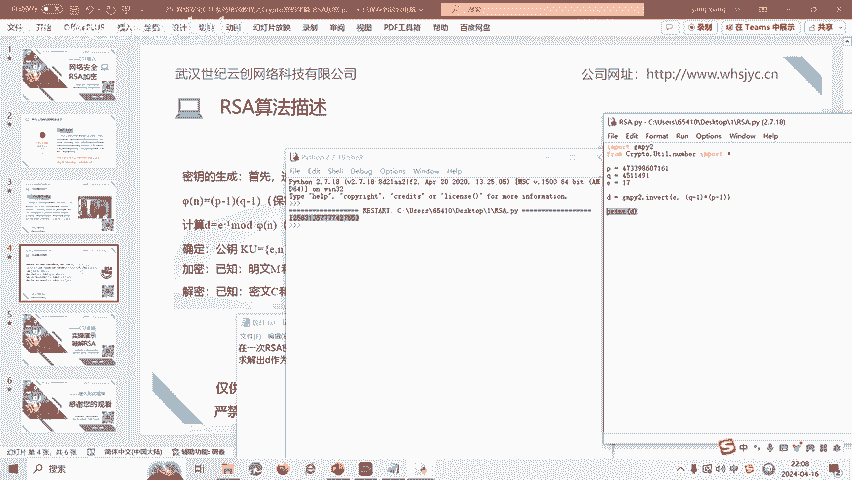

# CTF密码学：第1章：RSA加密基础 🧮

在本节课中，我们将要学习CTF比赛中RSA密码的基础知识，包括其算法原理、加密解密过程，并通过一道实操题目来巩固理解。

## 概述

RSA是一种广泛使用的非对称加密算法。本节将介绍RSA的历史背景、核心算法描述以及一个基础的解题示例，帮助初学者快速入门CTF中的RSA密码学挑战。

## RSA算法简介



RSA算法于1977年由罗纳德·李维斯特、阿迪·萨莫尔和伦纳德·阿德曼在麻省理工学院提出。算法名称“RSA”正是取自他们姓氏的首字母。

RSA是一种非对称加密算法。与对称加密算法不同，RSA使用两个不同的密钥：一个是可以公开的**公钥**，另一个是需要保密的**私钥**。

## RSA算法描述

上一节我们介绍了RSA的基本概念，本节中我们来看看其具体的算法步骤。

以下是RSA密钥生成、加密和解密的完整过程描述：

1.  **选择两个大素数**
    选择两个互异的大素数 **p** 和 **q**。这两个数是私钥的一部分，需要保密。

2.  **计算模数 n 和欧拉函数 φ(n)**
    计算 **n = p * q**。
    计算欧拉函数 **φ(n) = (p-1) * (q-1)**。

3.  **选择公钥指数 e**
    选择一个随机整数 **e**，满足 **1 < e < φ(n)**，且 **e** 与 **φ(n)** 互质（即最大公约数为1）。**e** 是公钥的一部分，可以公开。
    公式表示为：**gcd(e, φ(n)) = 1**

4.  **计算私钥指数 d**
    计算 **d**，使得 **d** 是 **e** 关于模 **φ(n)** 的模逆元。**d** 是私钥的核心部分。
    公式表示为：**d ≡ e⁻¹ (mod φ(n))**
    至此，公钥为 **(e, n)**，私钥为 **(d, p, q)** 或 **(d, n)**。

5.  **加密过程**
    已知明文 **M** 和公钥 **(e, n)**，加密得到密文 **C**。
    公式为：**C ≡ Mᵉ (mod n)**

6.  **解密过程**
    已知密文 **C** 和私钥 **(d, n)**，解密恢复明文 **M**。
    公式为：**M ≡ Cᵈ (mod n)**

算法的安全性基于大整数分解的难度：从公开的 **n** 中难以分解出 **p** 和 **q**，从而无法计算出私钥 **d**。然而，在某些CTF题目中，可能会给出有漏洞的参数，使得破解成为可能。

## RSA算法实操题目

理解了算法原理后，我们通过一道简单的CTF题目来实践如何计算私钥。



**题目描述**：在一次RSA密钥对生成中，已知 **p**, **q** 以及 **e**，要求求解 **d** 并作为flag提交。



**解题思路**：
已知 **p**, **q**, **e**，目标是求 **d**。
根据算法描述，计算步骤如下：
1.  计算 **n = p * q**。
2.  计算 **φ(n) = (p-1) * (q-1)**。
3.  计算 **d ≡ e⁻¹ (mod φ(n))**。

我们可以使用Python脚本快速完成计算。以下是解题脚本示例：

```python
import gmpy2

# 题目给出的已知值
p = 10499958999037877057
q = 12628819901945084387
e = 65537

# 计算 φ(n)
phi_n = (p - 1) * (q - 1)

# 计算 d，即 e 关于模 φ(n) 的模逆元
d = gmpy2.invert(e, phi_n)



print("Flag is: ", d)
```

运行此脚本，输出的 **d** 值即为本题的flag。

## 总结

本节课中我们一起学习了RSA加密算法的基础知识。我们从RSA的历史和基本概念讲起，详细描述了其密钥生成、加密和解密的数学过程，核心公式包括 **n = p * q**、**d ≡ e⁻¹ (mod φ(n))**、**C ≡ Mᵉ (mod n)** 和 **M ≡ Cᵈ (mod n)**。最后，我们通过一道已知 **p**, **q**, **e** 求 **d** 的入门题目，演示了如何应用Python（`gmpy2`库）进行实际计算。


CTF比赛中的RSA题目类型繁多，后续课程将针对共模攻击、小公钥指数攻击等更多解题技巧制作相应的教学视频。