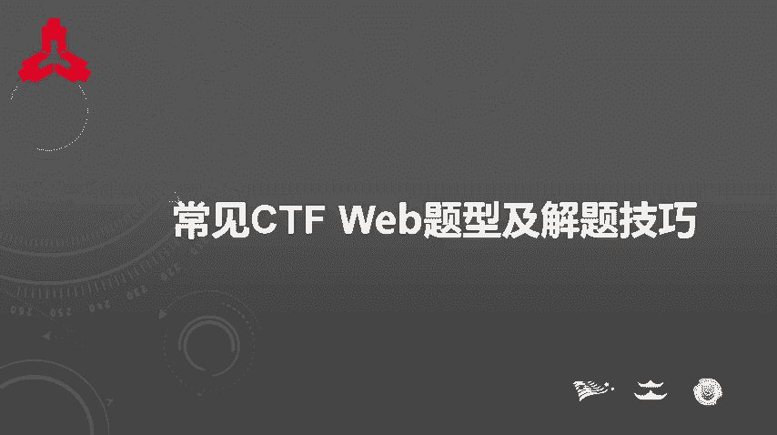
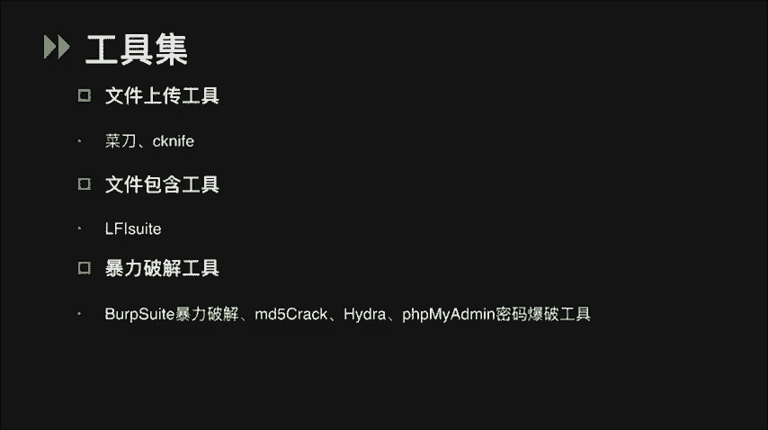
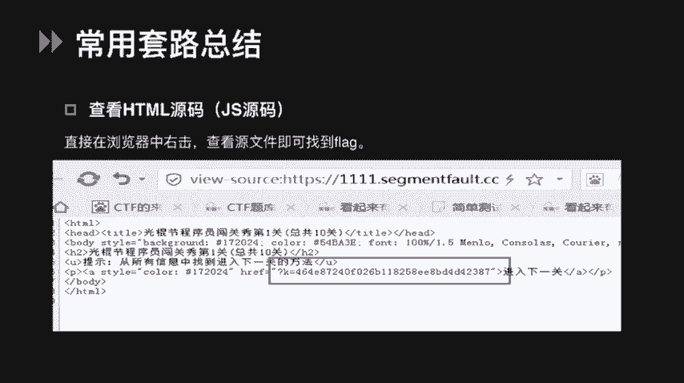
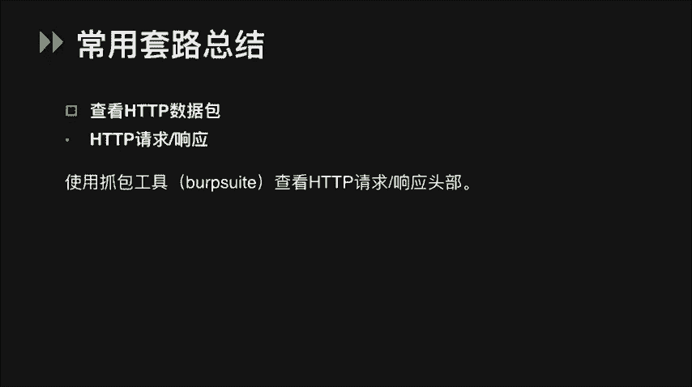
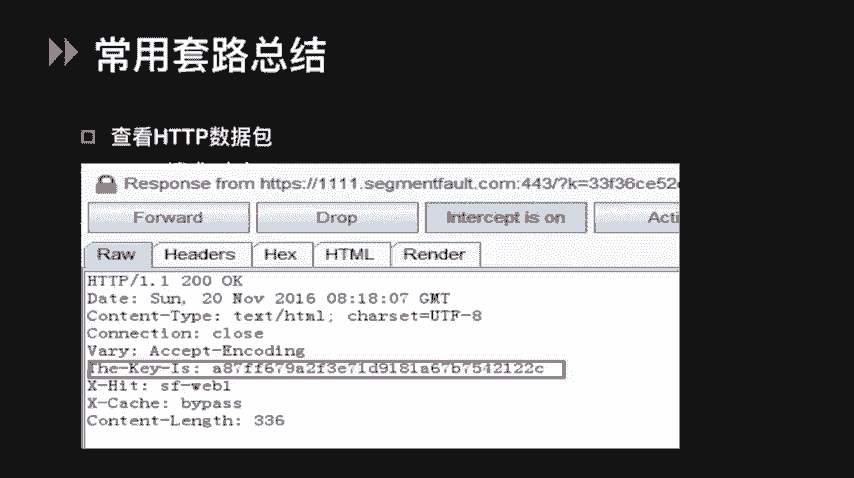
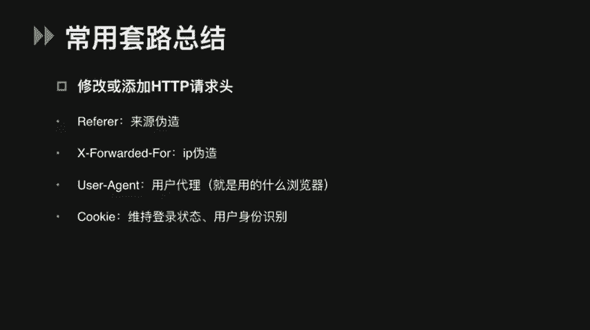
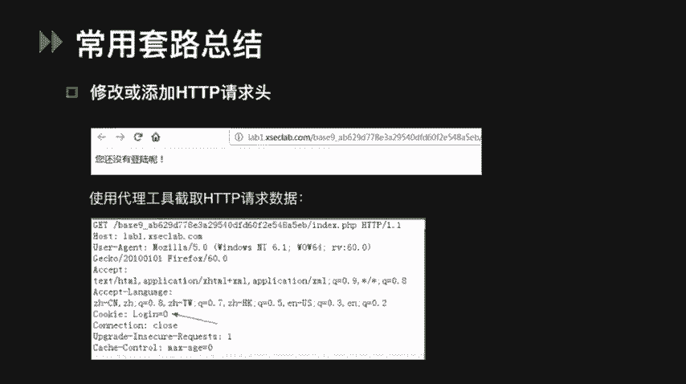
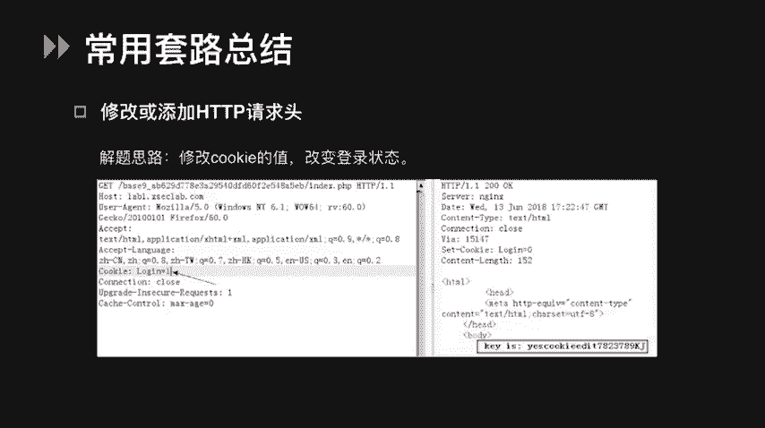
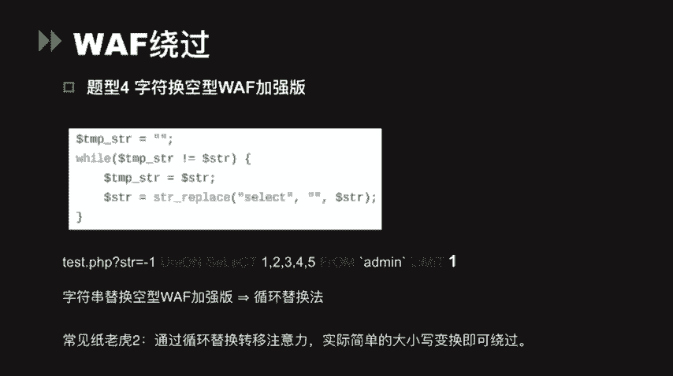
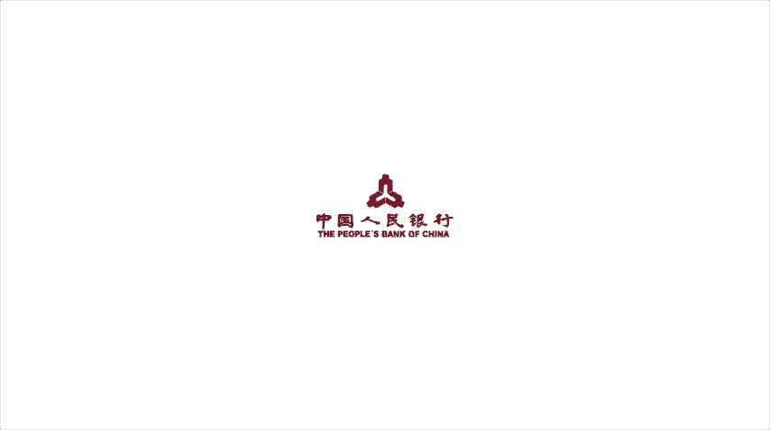

# CTF Web入门：P1：常见题型与解题技巧 🚩



在本节课中，我们将学习CTF（Capture The Flag）比赛中Web类题目的基础知识。课程将分为三个主要部分：常用工具集介绍、解题通用套路总结以及针对特定题型的解题技巧。通过学习，你将能够掌握Web安全挑战的入门方法。

## 工具集介绍 🛠️

上一节我们概述了课程内容，本节中我们来看看解题时常用的一些工具。熟练使用这些工具是高效解题的基础。

以下是CTF Web题目中常用到的工具分类及简介：

*   **代理与抓包工具**：
    *   **Burp Suite**：一个用于攻击Web应用程序的集成平台，也是强大的代理工具。它包含许多功能，如拦截和修改HTTP/HTTPS请求（包括POST参数）、提供SQL注入和XSS测试工具，并能快速对字符串进行各种编码解码。
    *   **Firefox浏览器及其插件**：例如HackBar插件，功能强大，支持修改请求、快速编码等。

*   **扫描与探测工具**：
    *   **御剑/Dirbuster**：用于扫描网站后台目录和文件。
    *   **Nmap**：用于扫描目标主机开放的端口及探测运行的服务。
    *   **AWVS**：一款Web漏洞扫描工具，可自动检测常见Web漏洞。
    *   **注意**：在CTF比赛中需慎用扫描工具，部分比赛禁止大规模扫描操作。

*   **专项利用工具**：
    *   **SQL注入**：最常用的工具是 **sqlmap**。
    *   **XSS（跨站脚本）**：可利用XSS平台获取他人浏览器的信息（如Cookie、LocalStorage）。可以自行搭建，例如知名的 **XSStrike**。
    *   **文件上传**：上传木马文件后，可使用 **中国菜刀**、**Cknife** 等工具连接木马，管理网站目录。
    *   **文件包含**：**LFI Suite** 是本地文件包含漏洞的利用神器，提供多种攻击模块。
    *   **暴力破解**：
        *   Burp Suite的Intruder模块可用于认证破解。
        *   **MD5Crack** 可用于破解MD5加密的密码。
        *   **Hydra**：一款开源的暴力破解工具，支持SSH、FTP、MSSQL、MySQL、POP3等多种服务。
        *   **PHPMyAdmin 密码爆破工具**：可对MySQL数据库登录进行暴力破解尝试。



除了以上工具，网上还有许多其他资源可供探索和下载使用。



## 解题通用套路总结 🎯



掌握了工具后，我们来看看Web题目中一些简单但常见的“套路”。与PWN、Reverse等题型不同，Web题往往需要一些技巧性的发现。



### 1. 页面源代码与HTTP头信息



最简单的一种情况是，Flag直接隐藏在网页的源代码中。只需在浏览器页面右键点击“查看页面源代码”即可找到。






除了源代码，Flag有时会藏在HTTP请求或响应包的头部字段中。这时需要使用之前提到的代理工具（如Burp Suite）抓包查看。


如上图所示，在HTTP响应包的`The-Key-Is`头部中，我们找到了Flag。

### 2. 伪造HTTP请求头

我们还可以通过修改或添加HTTP请求头来伪造客户端信息，以绕过某些检测或触发特定逻辑。

以下是常见的伪造方式：
*   修改 `Referer` 头：伪造请求来源。
*   修改 `X-Forwarded-For` 头：伪造客户端IP地址。
*   修改 `User-Agent` 头：伪造浏览器标识。
*   修改 `Cookie` 头：改变用户的登录状态。


**例题**：题目提示“当前为未登录状态”。解题时，我们使用代理工具查看请求，发现Cookie的值为`login=0`。


解题思路是尝试维持一个登录状态。我们可以修改Cookie的值为`login=1`。


当服务器认为用户处于登录状态时，便会返回Flag。

## 常见题型解题技巧 🔑

上一节我们介绍了一些通用套路，本节我们将深入几种具体的常见题型，学习它们的核心概念和破解技巧。

### 1. 源码泄露

这类题目在线上CTF中比较常见。
*   **Vim源码泄露**：如果页面提示`vi`或`vim`，可能存在`.swp`备份文件泄露。可尝试访问`/.index.php.swp`或`/index.php~`来获取源码。若文件乱码，可在Linux下执行 `vim -r index.php` 恢复。
*   **备份文件泄露**：可尝试访问如 `index.php.bak`、`www.zip` 等常见备份文件后缀。
*   **Git源码泄露**：运行`git init`会在目录下生成`.git`隐藏文件夹。可访问`/.git/config`获取信息，或使用`GitHack`等工具下载源码。
*   **SVN源码泄露**：SVN版本控制系统可能泄露源码，可访问`/.svn/entries`。工具有`Seay-SVN`、`dvcs-ripper`等。

### 2. 编码与加密

Web题中常出现编码解码类题目，识别编码类型是关键。

**例题**：访问页面得到一串长字符串，末尾有`=`，疑似Base64编码。
```python
# 解密脚本示例（假设多次Base64编码）
import base64

with open('1.txt', 'r') as f:
    data = f.read().strip()

while True:
    try:
        data = base64.b64decode(data).decode('utf-8')
    except:
        print("解密结果（或中间状态）:", data)
        break
```
用Base64解码一次未得到明文，猜测是多次编码。可用Python脚本循环解码。

以下是其他几种常见编码：
*   **摩尔斯电码**：由点（.）、划（-）和间隔组成。例如 `.... . .-.. .-.. ---` 解密后为 `HELLO`。可使用在线工具快速解密。
*   **培根密码**：本质是二进制，用A和B表示。5个为一组，例如 `AAAAA` 对应字母 `A`。同样可用在线工具解密。
*   **栅栏密码**：将明文分成N组，按竖排顺序读出。一般明文较短。
*   **凯撒密码**：通过字母移位实现加解密。例如偏移量为1时，`A->B`, `B->C`。公式可表示为：`C = (P + K) mod 26`（加密），`P = (C - K) mod 26`（解密），其中P为明文，C为密文，K为偏移量。
*   **JSFuck**：仅用 `[`、`]`、`(`、`)`、`+`、`!` 六个字符编写任何JavaScript代码。例如 `(![]+[])[+!+[]]` 的结果是 `"a"`。

### 3. PHP弱类型比较

PHP的松散比较（`==`）是常见考点。它会先将变量转换为相同类型再比较。

**核心概念**：
*   字符串与数字比较时，字符串会被转换为数值。转换规则：取字符串开头部分，如果是数字则转为该数字，否则转为0。
*   科学计数法字符串（如 `"0e123456"`）在与数字比较时，`0e...`会被视为`0 * 10^...`，结果等于0。
*   一些特殊等式：
    *   `"abc" == 0` 为真（`"abc"`转为数字0）。
    *   `"123a" == 123` 为真（`"123a"`转为数字123）。
    *   `"0e1" == "0e2"` 为真（都被视为科学计数法0）。

**题型1：strcmp()绕过**
`strcmp()`函数用于比较两个字符串。若传入非字符串类型（如数组），函数会报错并返回`NULL`。在松散比较中，`NULL == 0` 成立。
```php
// 示例代码
if (strcmp($_GET['flag'], $real_flag) == 0) {
    echo $flag;
}
// 绕过：传入 ?flag[]=1 （一个数组）
```

**题型2：MD5绕过**
题目要求输入两个不同的值，但它们的MD5值相等。
*   **解法1（科学计数法）**：寻找两个MD5哈希以`0e`开头的字符串。例如 `QNKCDZO` 和 `240610708` 的MD5值分别是 `0e830400451993494058024219903391` 和 `0e462097431906509019562988736854`。在`==`比较时，它们都被视为0，从而相等。
*   **解法2（数组绕过）**：`md5()`函数无法处理数组，传入数组会返回`NULL`。因此 `md5($a) == md5($b)` 在 `$a` 和 `$b` 都是数组时成立（`NULL == NULL`）。

### 4. WAF（Web应用防火墙）绕过

在SQL注入等场景中，需要绕过对关键词的过滤。

以下是几种常见绕过方式：
*   **大小写混合**：`SeLeCt` 代替 `select`。（若正则使用 `/i` 修饰符则无效）
*   **编码**：
    *   URL编码：`%27` 代替单引号 `‘`，`%2F` 代替 `/`。
    *   十六进制编码：`0x7461626c65` 代替字符串 `table`。
*   **使用注释**：
    *   注释符：`#`、`-- `、`/**/`。
    *   `/**/`可替代空格：`union/**/select`。
    *   内联注释可包裹关键词：`/*!select*/`。
*   **空字节（%00）**：在某些语言中，空字节会终止字符串处理。`%00`后的内容可能被忽略。
*   **嵌套剥离**：若过滤规则只执行一次替换（如将`select`替换为空），可使用`selselectect`绕过，剥离中间的`select`后，剩下`select`。
*   **避开自定义过滤器**：若过滤器过滤`and`和`or`，可尝试 `AnD`、`&&`、`||`。

**例题：字符替换型WAF**
题目使用`str_replace()`函数将`select`等关键词替换为空，但只执行一次。
```php
$sql = str_replace('select', '', $_GET['id']);
// 绕过：传入 ?id=selselectect 1,2,3
```
传入`selselectect`，中间的`select`被移除，两端的字符重新组合成`select`。

**加强版**：题目使用`while`循环替换，但可能只检测小写。此时简单的大小写混合（如`SeLeCt`）即可绕过。

---



本节课中我们一起学习了CTF Web题目的入门知识。我们首先认识了常用的安全工具，然后总结了解题的通用套路，如查看源码、抓包改包。最后，我们深入探讨了源码泄露、编码解密、PHP弱类型比较和WAF绕过等核心题型的解题技巧。掌握这些基础将为你进一步探索Web安全领域打下坚实的基础。



