# CTF逆向工程：01：静态分析入门 🛡️

在本节课中，我们将要学习CTF逆向工程中的静态分析基础。静态分析是理解程序逻辑、寻找漏洞或获取Flag的关键第一步，无需实际运行程序。我们将通过一个简单的实例，学习如何使用工具进行文件检测、反汇编和代码分析。

---

## 逆向工程概述

逆向分析旨在将二进制机器代码反汇编为汇编代码，并在此基础上分析程序功能。由于反汇编生成的代码缺失了源代码中的符号和数据结构等信息，因此需要通过分析尽可能还原这些信息，以理解程序的原始逻辑。

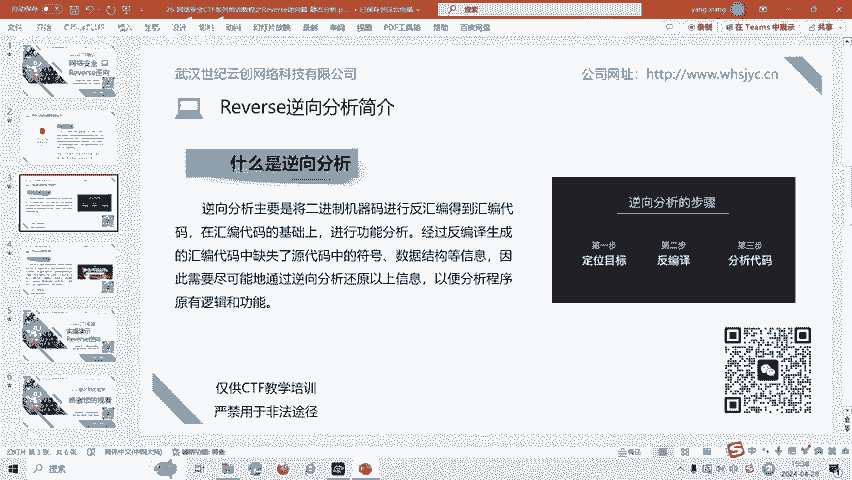

逆向分析主要分为静态分析和动态分析两种。本节课重点讲解静态分析。

## 什么是静态分析？

静态分析指在不执行程序文件的情况下，对代码进行静态的检查和分析。这包括观察代码的外部特征，进行反汇编、反编译以及文件类型分析。

文件类型分析有助于了解程序的编写语言、使用的编译器，以及程序是否经过加密或加壳处理。在逆向过程中，主要使用反汇编工具查看内部代码并分析其结构。

接下来，我们通过一道实操题目来具体学习静态分析的流程。

---

## 实战演练：分析 `EZRE.exe`

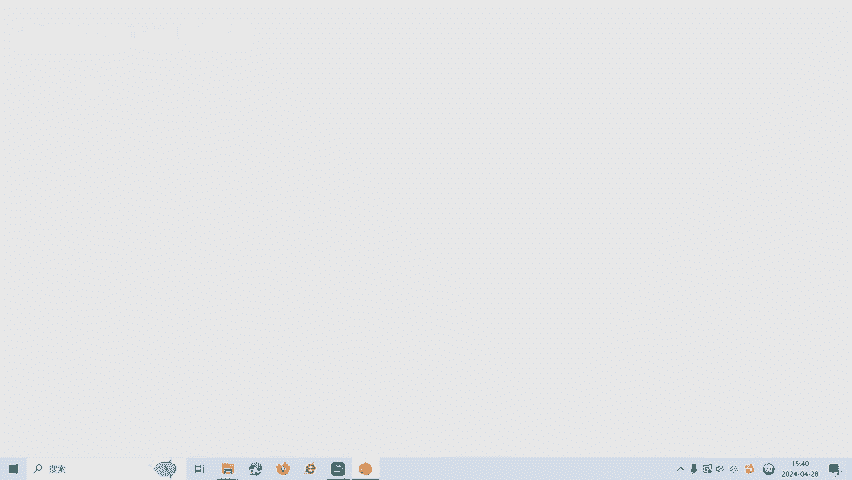

我们面对一个名为 `EZRE.exe` 的程序。运行后，程序会提示输入字符串，无论输入什么，都会输出 `"sorry, you can't get the flag"`。

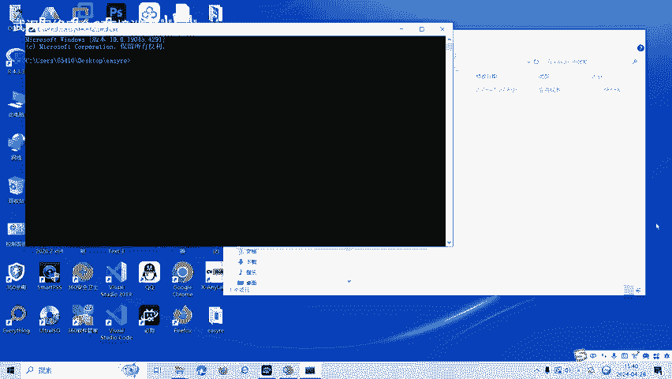

面对这样的逆向程序，我们该如何入手呢？

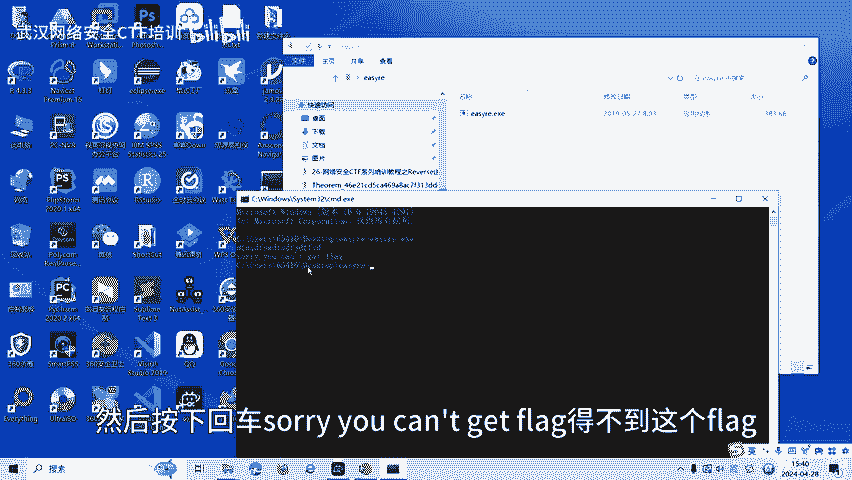

以下是静态分析的基本步骤：

### 第一步：文件检测

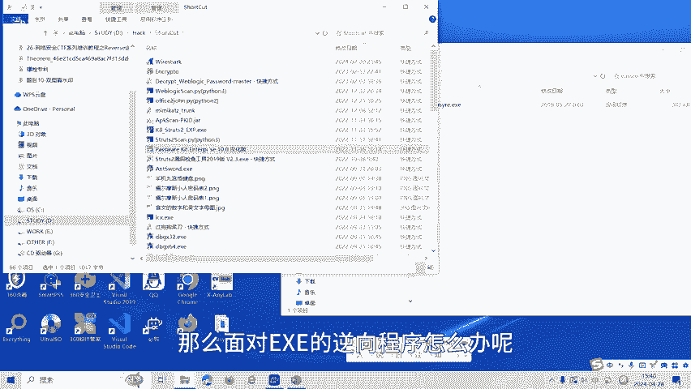

首先，使用 `DIE` (Detect It Easy) 这类工具检测程序的基本信息。

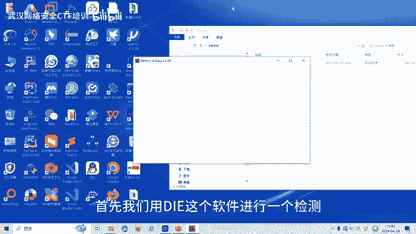

通过检测发现，`EZRE.exe` 是一个 **64位程序**。了解程序位数至关重要，因为它决定了我们应使用对应版本的分析工具（如32位IDA或64位IDA）。

### 第二步：反汇编与代码分析

确定是64位程序后，我们使用64位的反汇编工具 **IDA Pro** 进行分析。

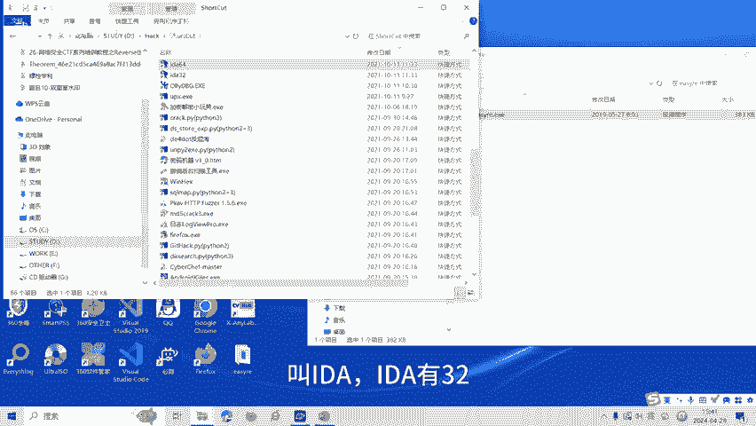

1.  将 `EZRE.exe` 文件拖入IDA。
2.  在IDA的主界面，按下 **F5** 键。这个功能可以将汇编代码反编译成更易读的、类似于C语言的伪代码。

通过阅读反编译出的伪代码，我们可以分析出程序的逻辑。在本例中，代码提示需要输入两个数字，假设变量名为 `a` 和 `b`。程序的核心逻辑是一个判断：

```c
if (a == b) {
    // 输出flag
} else {
    // 输出错误信息
}
```

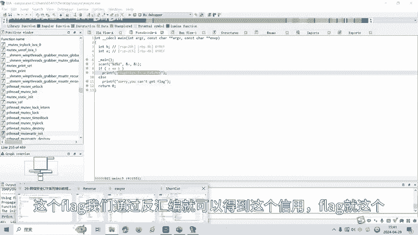

由此可知，只要输入两个相等的数字，程序就会输出正确的Flag。

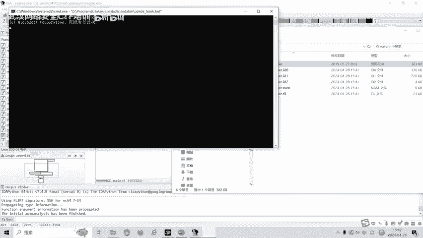

### 第三步：验证与获取Flag

根据代码分析结果，我们返回运行 `EZRE.exe` 程序。

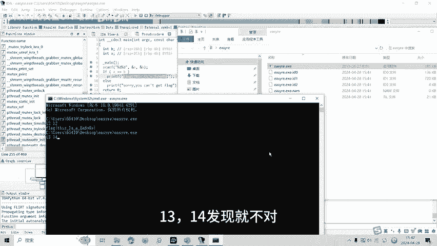

输入两个相同的数字（例如 `12` 和 `12`），按下回车，程序成功输出了Flag。如果输入两个不同的数字（例如 `13` 和 `14`），则得到错误提示。

### 另一种常用技巧：字符串查找

在静态分析中，还有一个非常直接有效的技巧：**查找程序中的明文字符串**。

在IDA中，可以通过菜单 `View -> Open subviews -> Strings` 或直接使用快捷键 **Shift + F12** 打开字符串窗口。

在这个窗口中，我们常常能直接发现包含 `"flag"`、`"success"`、`"congratulation"` 等关键信息的字符串，有时Flag甚至就直接存放在这里。

总结一下，解决这道逆向题有两种主要思路：
1.  **直接搜索字符串**：使用IDA的字符串查找功能，看能否直接发现Flag。
2.  **分析程序逻辑**：通过反编译阅读代码，理解程序的判断条件（本例中输入两个相等的整数），从而满足条件获取Flag。

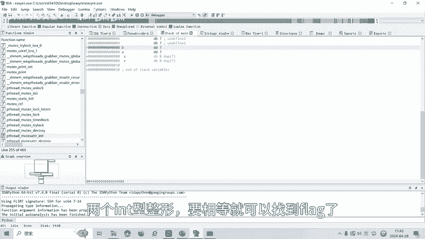

---

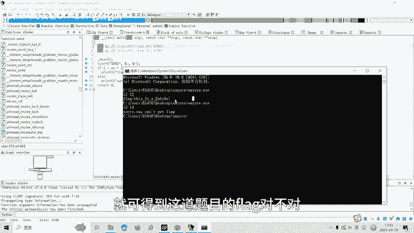

## 总结

本节课中，我们一起学习了CTF逆向工程中静态分析的基础知识。我们了解到静态分析是在不运行程序的情况下，通过工具对二进制文件进行“解剖”和检查。

核心流程包括：
1.  使用工具（如DIE）进行**文件检测**，确定位数和编译器信息。
2.  使用反汇编工具（如IDA Pro）进行**反编译**，将汇编代码转化为更易读的伪代码。
3.  **分析代码逻辑**或**搜索关键字符串**，找到获取Flag的关键条件或直接发现Flag。


通过 `EZRE.exe` 这个简单的例子，我们实践了“分析程序逻辑”这一方法。CTF逆向比赛中还有动态调试、花指令混淆等更复杂的题型和解题技巧，我们将在后续课程中逐一讲解。