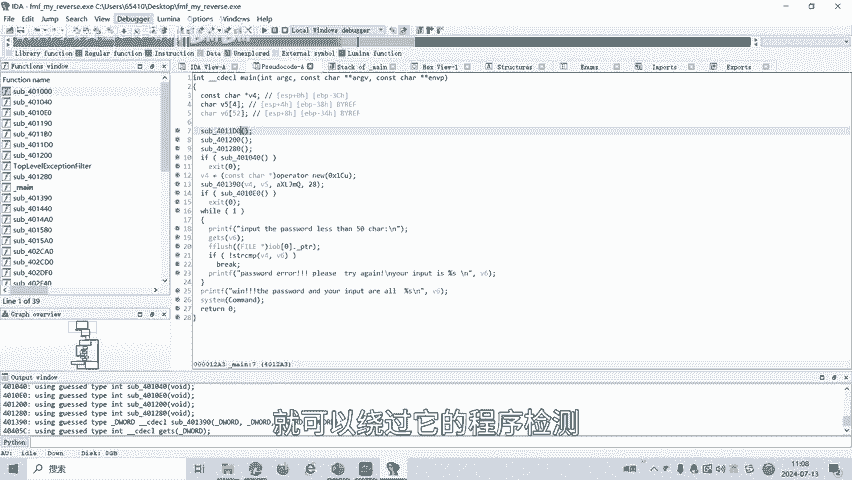
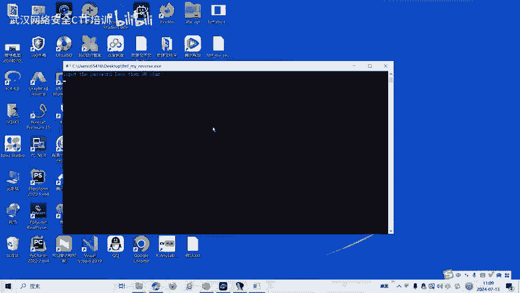
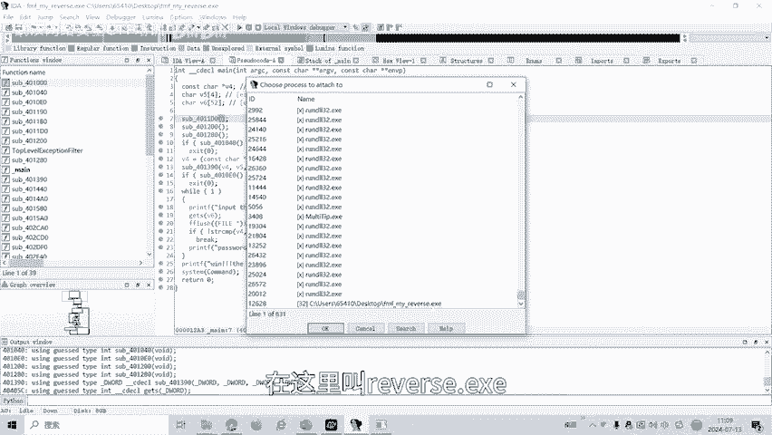
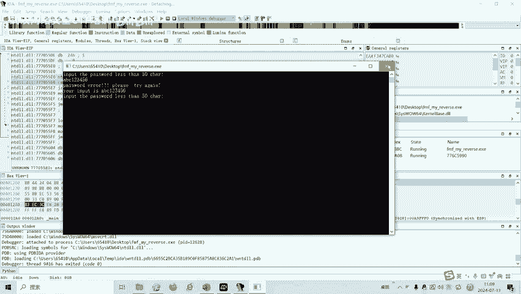
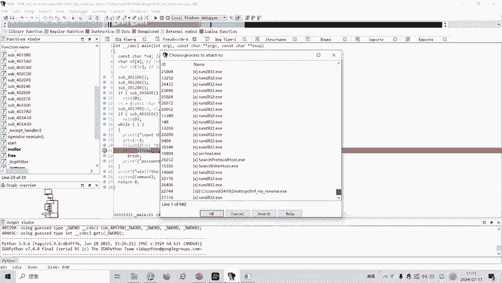
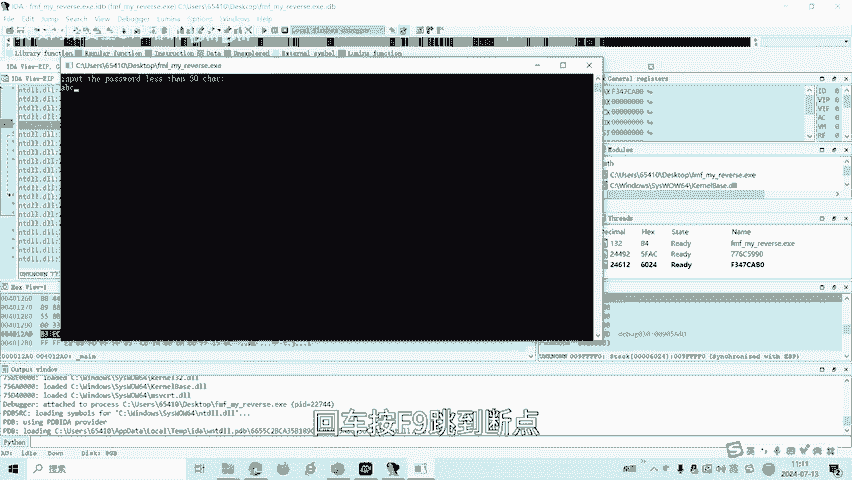
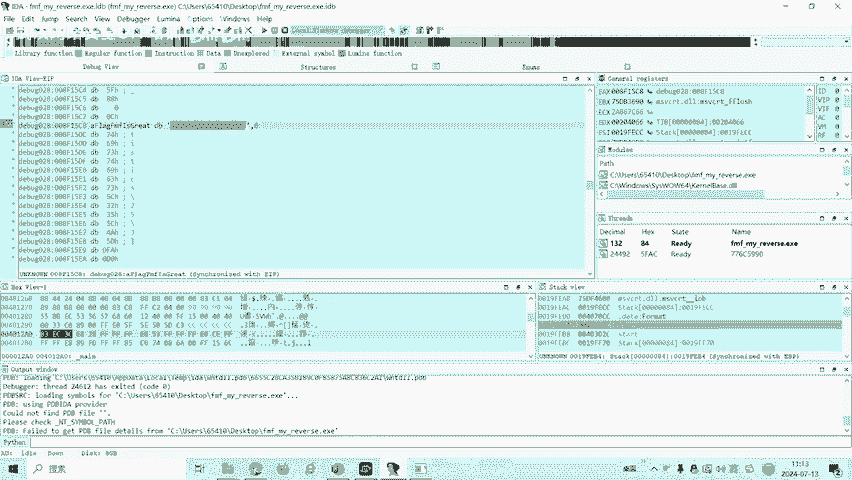
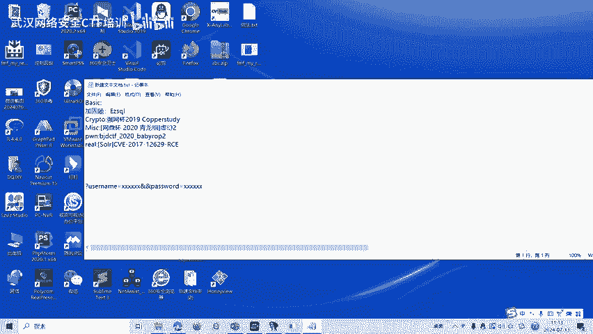
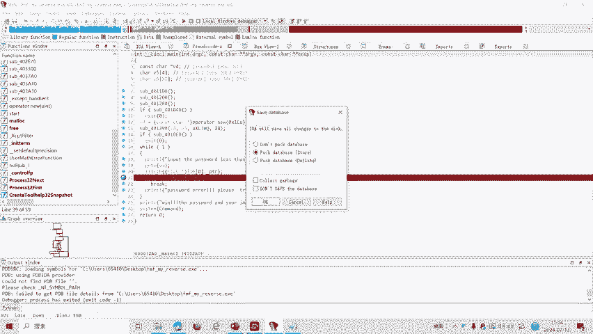
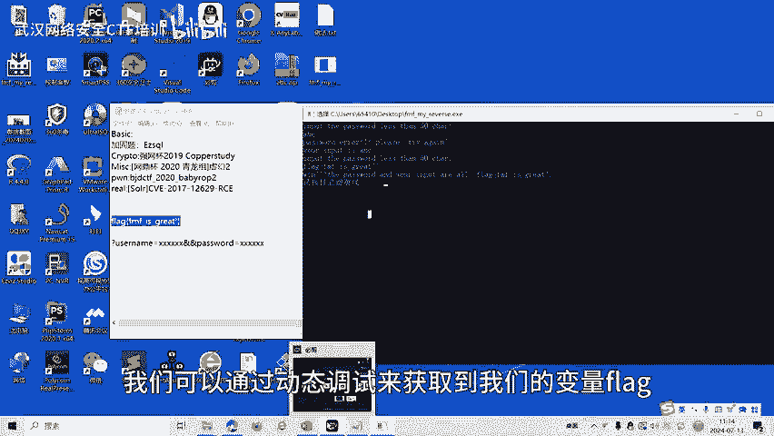

# CTF逆向工程：第27课：动态调试 🐛

在本节课中，我们将学习CTF逆向工程中的动态调试技术。我们将了解动态调试的基本概念、常用工具，并通过一个实际案例演示如何利用动态调试技术获取程序中的关键信息（如flag）。

---

## 概述

逆向分析旨在将二进制机器码反汇编为汇编代码，并在此基础上分析程序的功能与逻辑。由于反汇编过程会丢失源代码中的符号、数据结构等信息，因此需要通过逆向分析尽可能还原这些信息。逆向分析主要分为静态分析和动态分析。本节课将重点讲解**动态分析**中的**动态调试**技术。

## 什么是动态调试？

动态调试是指利用集成开发环境（IDE）自带的调试器或专用调试工具，跟踪软件在运行时的状态，以协助开发者发现并解决软件中的错误。在CTF逆向工程中，我们可以使用动态调试来理解程序运行时的行为，获取内存中的关键数据。

常用的动态调试工具有 **IDA Pro** 和 **OllyDbg (ODBG)**。

上一节我们介绍了逆向分析的基本概念，本节中我们来看看如何具体应用动态调试技术。

## 实战演练：获取程序中的Flag

我们将通过一个具体的32位Windows程序（.exe）来演示动态调试的完整流程。

### 第一步：检查程序信息

首先，使用工具 **DIE** 检测目标程序的基本信息，例如它是32位还是64位程序。本例中，程序为32位。

### 第二步：静态分析

使用 **IDA Pro 32位版本** 打开目标程序。按下 **F5** 键可以生成伪代码，便于理解程序逻辑。



以下是分析得到的 `main` 函数关键伪代码片段：
```c
int __cdecl main(int argc, const char **argv, const char **envp)
{
  char v4[50]; // 存储正确密码/flag的变量
  char v6[50]; // 存储用户输入的变量
  // ... 其他代码 ...
  scanf("%s", v6); // 获取用户输入
  if ( !strcmp(v6, v4) ) // 比较输入与正确值
    puts("Great!");
  else
    puts("Error!");
  // ... 其他代码 ...
}
```
从伪代码可知，程序会将用户输入与变量 `v4` 的值进行比较。`v4` 很可能就是我们要找的flag。但在静态分析中，我们无法直接看到 `v4` 在运行时的具体值。



此外，程序开头存在反调试检测函数。如果检测到程序正在被调试，则会强制退出，阻碍我们的动态分析。



### 第三步：绕过反调试并附加进程

为了成功进行动态调试，我们需要绕过反调试检测。IDA Pro 提供了一个功能：**附加到运行中的进程**。



操作步骤如下：
1.  首先，直接运行目标程序。
2.  然后，在IDA中选择 `Debugger` -> `Attach to process`，找到并附加到正在运行的目标程序进程。
3.  这种方法可以绕过一些简单的反调试检查。

### 第四步：设置断点与动态跟踪



附加成功后，我们需要在关键代码处设置断点。在本例中，我们在字符串比较函数 `strcmp` 的调用处设置断点。



以下是关键步骤：
1.  在IDA的汇编视图或伪代码视图中，在 `strcmp` 调用行设置断点（按 **F2**）。
2.  在运行的程序窗口中输入任意测试字符串（如 “ABC123”），然后按回车。
3.  此时程序会在断点处暂停（按 **F9** 运行到断点）。
4.  按 **F8** 进行单步跟踪，观察寄存器和栈的变化。

### 第五步：获取Flag值

当程序执行到比较指令时，参与比较的两个值通常会加载到寄存器中。在我们的例子中：
-   一个寄存器（如 `EAX`）指向我们输入的字符串。
-   另一个寄存器（如 `EDX`）则指向正确的flag值。



我们可以在IDA的寄存器窗口或内存窗口中，查看 `EDX` 寄存器所指向的内存地址的内容，该内容即为程序的flag。



### 第六步：验证Flag



结束调试，直接运行原程序，输入我们通过动态调试获取到的flag字符串。如果程序输出“Great!”，则验证成功。

## 总结



本节课我们一起学习了CTF逆向工程中的动态调试技术。我们了解到动态调试是分析运行时程序行为、获取内存数据的有力工具。通过实际操作，我们掌握了使用IDA Pro附加进程、绕过基础反调试、设置断点以及跟踪寄存器来获取flag的完整流程。

CTF逆向题目类型多样，除动态调试外，还包括静态分析、代码混淆、加壳脱壳等。后续课程将针对其他类型的逆向题目制作相应的教学视频。

---
*提示：本教程内容仅用于CTF技术教学与合法安全研究，请严格遵守《网络安全法》及相关法律法规。*