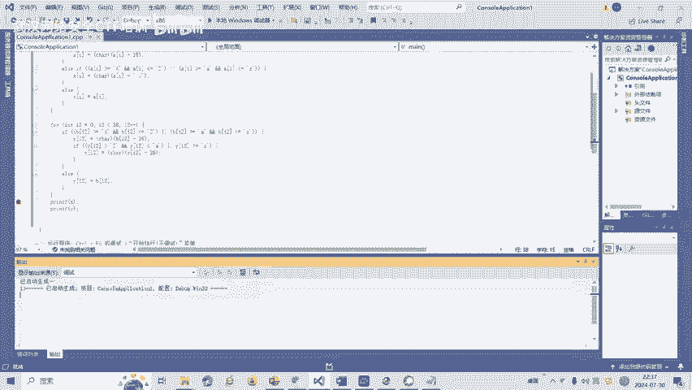
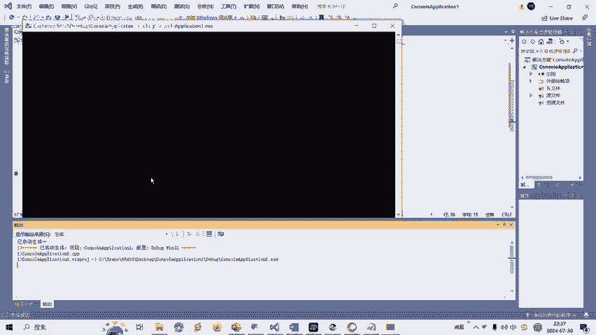
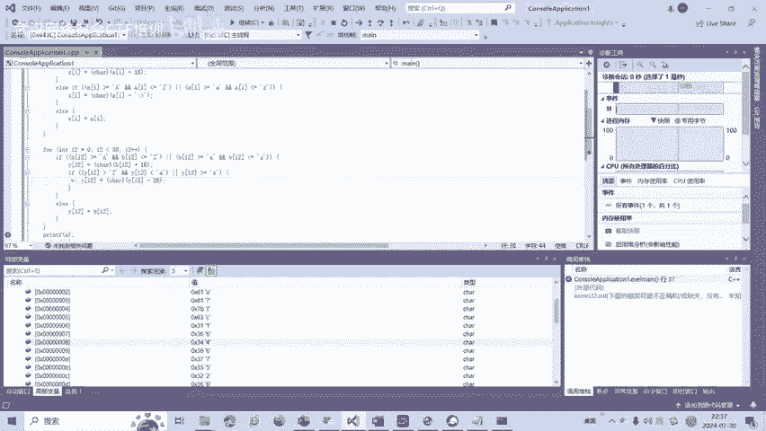
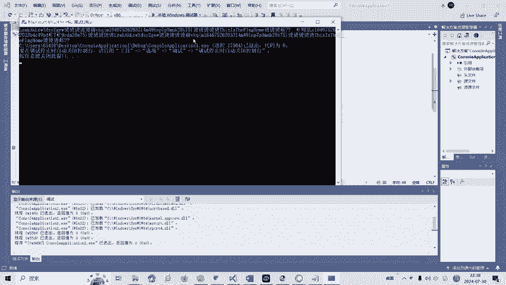
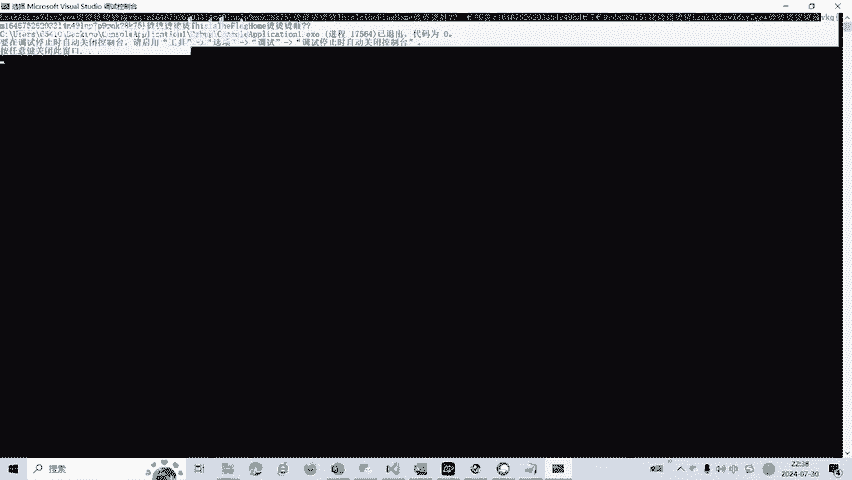
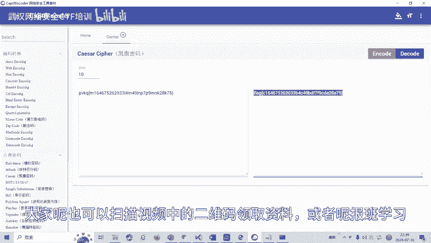

# CTF逆向工程：第28课：安卓APK逆向分析入门 🧩

在本节课中，我们将学习CTF比赛中逆向工程（Reverse）的基础知识，特别是针对安卓APK文件的逆向分析方法。我们将通过一个简单的实例，了解如何分析程序逻辑并获取关键信息。

---

## 课程概述 📋

逆向工程是将编译后的二进制机器码进行反汇编，得到汇编代码，并在此基础上分析程序功能的过程。由于反编译生成的代码缺失了源代码中的符号和数据结构等信息，因此需要通过逆向分析尽可能还原这些信息，以理解程序的原始逻辑。

本节课聚焦于安卓APK的逆向分析。安卓逆向是指利用技术手段对安卓应用程序进行研究，以了解其内部机制、发现潜在漏洞或安全问题，并提供解决方案。

---

## 安卓逆向实操演示 🔧

上一节我们介绍了逆向工程的基本概念，本节中我们来看看一个具体的安卓APK逆向分析实例。

我们使用逆向工具打开一个提供的APK文件。在主函数中，可以观察到两个变量A和B。变量A包含17个字节，变量B包含38个字节。程序逻辑涉及将数组X通过变量A的变换进行赋值，同时数组Y通过变量B的变换进行赋值。

程序的核心功能是获取用户输入，并将其与变换后的Y值进行比较。如果相等，则输出Y值。

以下是分析过程中的关键步骤：

1.  **观察字符串关联**：初始字符串“PVKQ”与常见flag格式“flag”相似。通过计算ASCII码差值，发现每个字符相差10，这提示可能使用了凯撒密码加密。
2.  **验证猜想**：将“PVKQ”进行凯撒密码解密（偏移-10），可以得到“flag”。另一种方法是模拟程序逻辑。
3.  **代码模拟分析**：将逆向得到的代码片段（因其与C语言高度相似）复制到编程环境中执行。通过调试，可以观察到变换后的Y值，从而验证或直接获取flag。

通过以上分析，我们成功获取了目标flag。

---

## 总结与拓展 🚀

本节课我们一起学习了安卓APK逆向分析的基本流程。我们通过一个实例，演示了如何从APK中定位关键代码、分析加密变换逻辑，并最终推导出flag。

逆向工程领域还包括花指令、代码混淆等多种复杂题型。后续课程将针对这些不同类型的题目制作相应的教学视频。

> **重要提示**：请严格遵守《网络安全法》。本课程内容仅用于CTF教学与培训，请勿用于其他非法用途。

---
**版权声明**：本教程内容来源于相关培训视频，仅供学习交流使用。