# CTF逆向工程：第29课：Python逆向分析 🐍

在本节课中，我们将要学习CTF比赛中Python逆向分析的基本原理和实战解题步骤。我们将从Python的运行机制讲起，然后介绍常用的反编译工具，最后通过一个实际案例演示如何从打包的EXE文件中逆向出源代码并获取Flag。

---

## Python运行原理 🔄

上一节我们介绍了课程概述，本节中我们来看看Python语言的运行原理。

Python是一种解释型语言，没有严格意义上的编译和汇编过程。通常认为，编写好的Python源文件（`.py`）会由Python解释器翻译成以`.pyc`为结尾的字节码文件。

**核心概念**：
*   `.pyc`文件是二进制文件，可以由Python虚拟机（PVM）直接运行。
*   运行流程可以概括为：`Python源码` -> `Python解释器` -> `.pyc字节码文件` -> `Python虚拟机运行`。

Python代码的编译结果是 **`PyCodeObject`** 对象，这个对象可以由虚拟机加载后直接运行。而`.pyc`文件就是`PyCodeObject`对象在硬盘上的持久化保存形式。

---

## 什么是Python逆向分析？ 🕵️

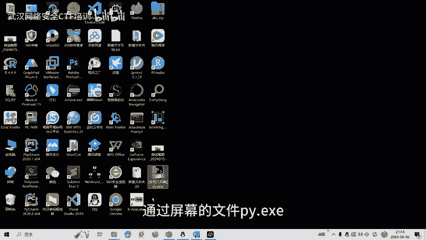

了解了Python的运行原理后，本节我们来定义什么是Python逆向分析。

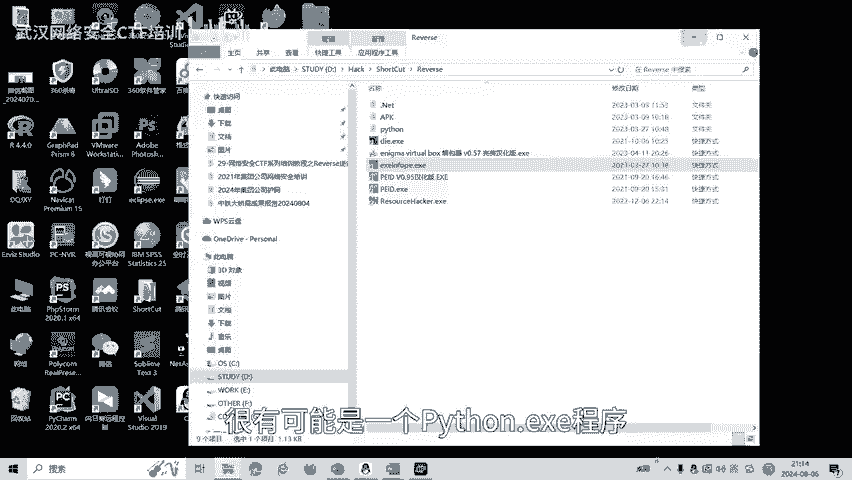

Python逆向通常指利用技术手段，对由Python编写的软件、应用程序或网络服务进行反向工程。在CTF中，常见的目标是分析打包的程序或字节码文件，以理解其逻辑并找到隐藏的Flag。

常用的Python反编译工具是 **`uncompyle6`**，它可以将Python的字节码（`.pyc`文件）反编译回Python源代码。

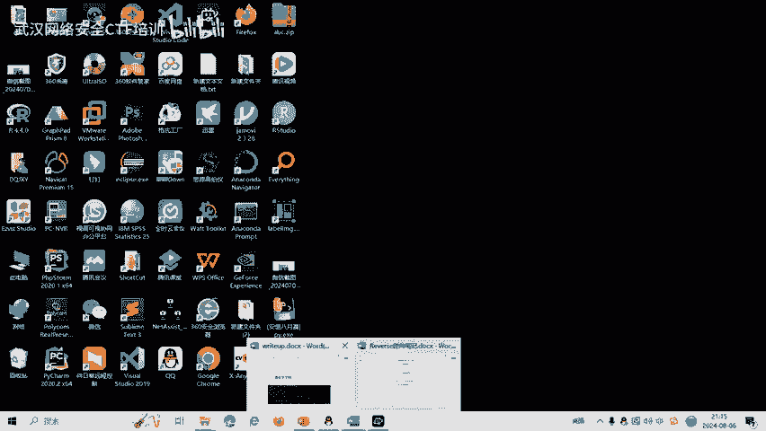

---

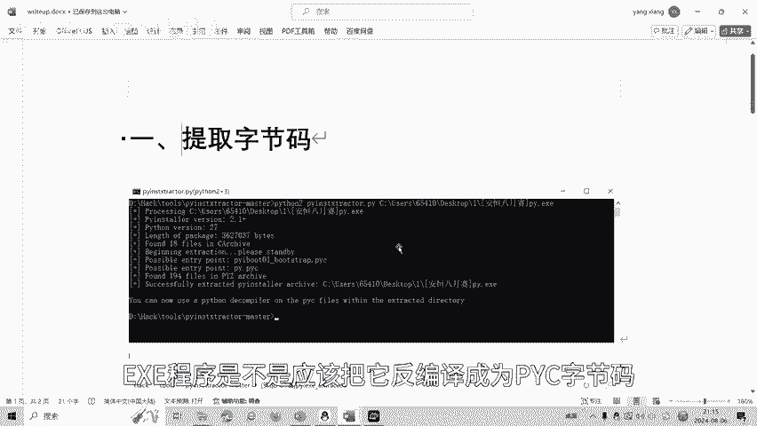

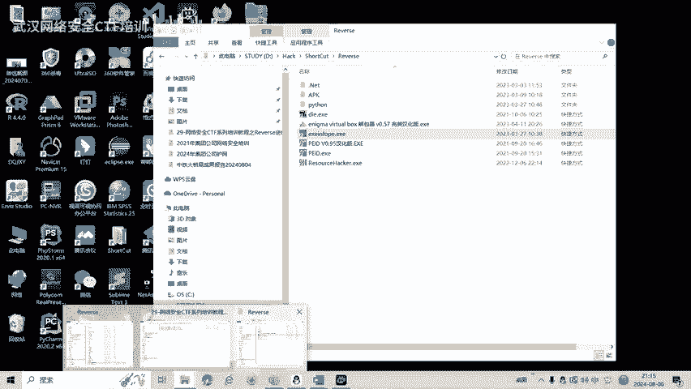

## 实战演练：解一道Python逆向题 ⚔️

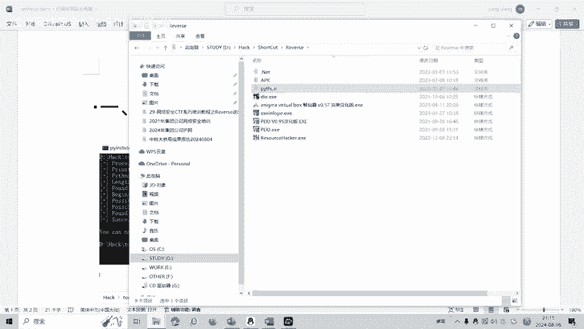

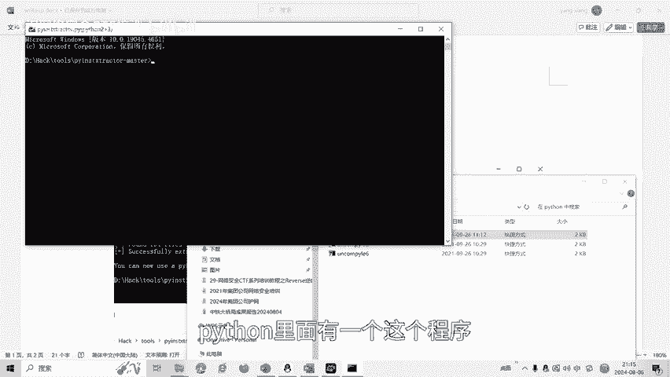

理论部分已经介绍完毕，接下来我们通过一道安恒8月赛的实战题目，一步步学习Python逆向的解题过程。

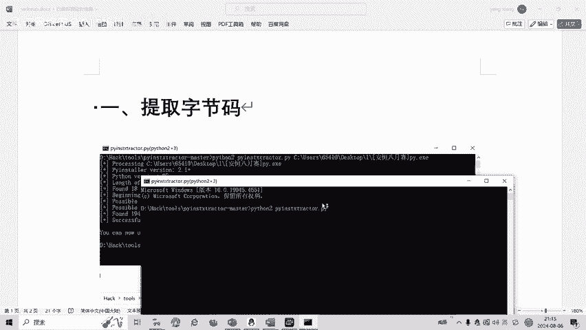

我们拿到一个名为`exe`的文件。通过查壳工具（如`pyinstxtractor`）分析，发现它是由`PyInstaller`打包生成的EXE程序，这提示我们它内部封装了Python代码。

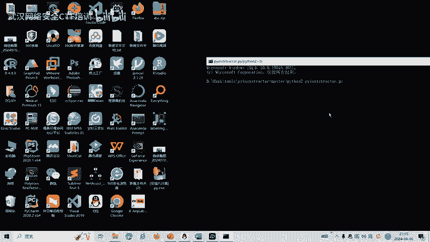

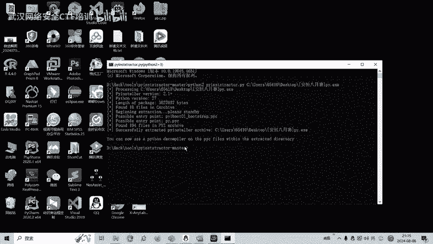

以下是完整的解题步骤：

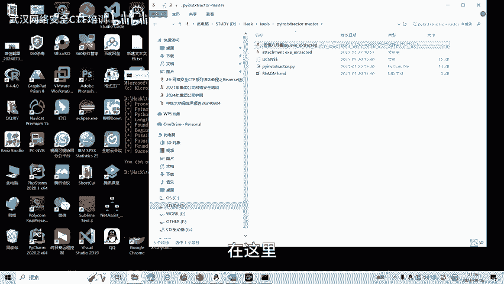

**第一步：提取字节码文件**
我们需要从EXE文件中提取出Python字节码（`.pyc`）文件。可以使用`pyinstxtractor.py`工具。

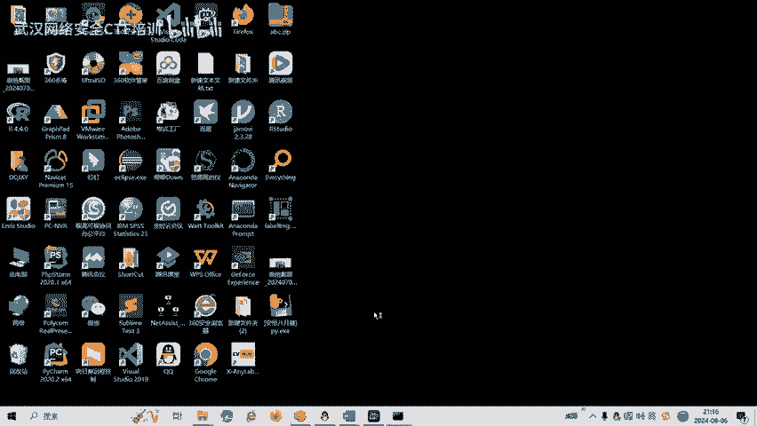

```bash
python pyinstxtractor.py exe
```
命令执行后，会在当前目录生成一个提取出的文件夹，里面包含`exe`文件解包后的内容，其中就有我们需要的`.pyc`字节码文件。

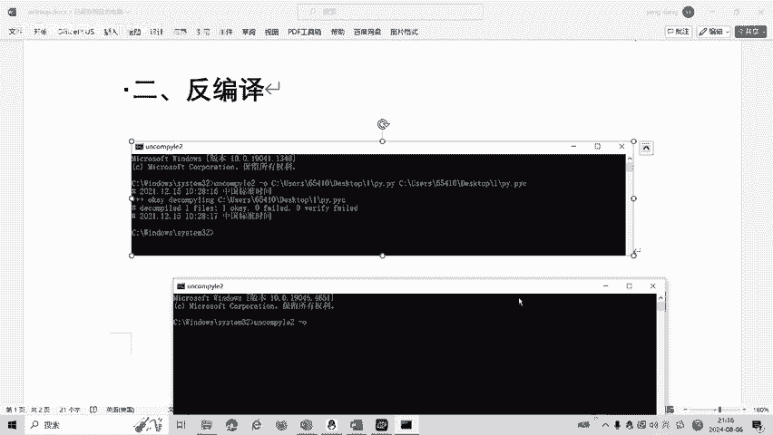

**第二步：反编译字节码**
得到`.pyc`文件后，我们使用`uncompyle6`工具将其反编译为可读的Python源代码。

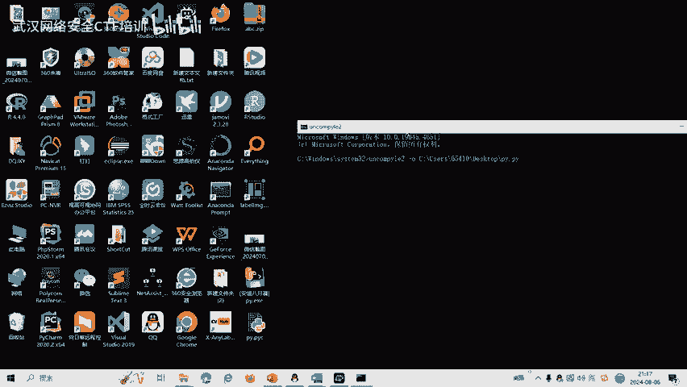

```bash
uncompyle6 -o output.py extracted_file.pyc
```
这条命令会将`extracted_file.pyc`反编译，并将源代码输出到`output.py`文件中。

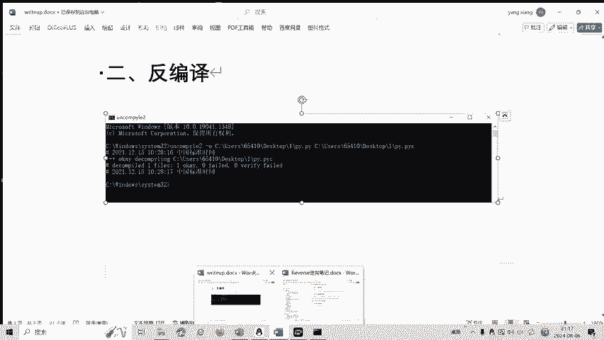

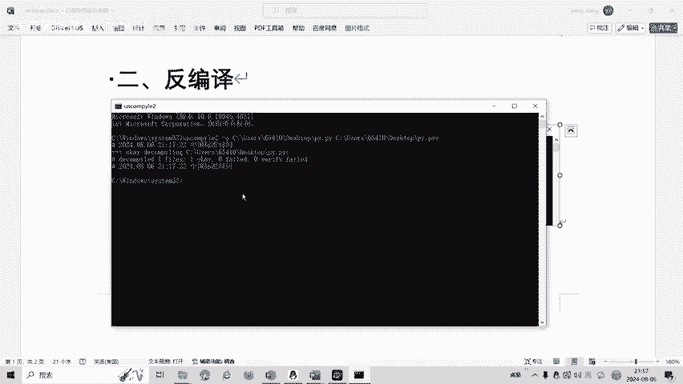

**第三步：分析源代码逻辑**
打开反编译得到的`output.py`文件，分析其核心逻辑。在本例题中，代码对用户输入（即Flag）进行了一个编码操作：
1.  将输入字符串的每个字符与数字`32`进行**异或**（`^`）操作。
2.  然后将异或的结果加上数字`31`。

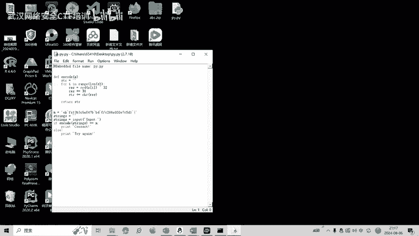

**核心算法公式**：
对于明文字符 `char`，其编码过程为：
`encoded_char = (char ^ 32) + 31`

**第四步：编写解码脚本**
由于异或操作是可逆的，我们可以根据编码逻辑反向推导出解码过程：
1.  先将密文字符减去`31`。
2.  再将结果与`32`进行异或。

解码的Python代码实现如下：

```python
cipher = "得到的密文字符串"
flag = ''
for c in cipher:
    s = ord(c) - 31
    s = s ^ 32
    flag += chr(s)
print(flag)
```
运行此脚本，即可得到正确的Flag。

---

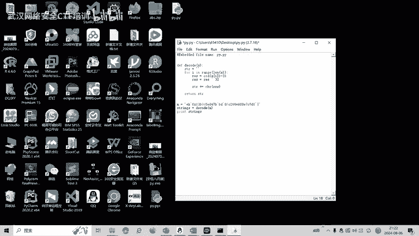

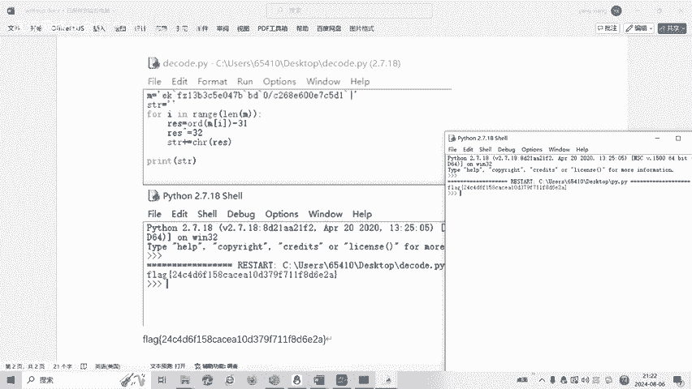

## 总结 📝

本节课中我们一起学习了CTF中Python逆向分析的基础知识。我们首先了解了Python作为解释型语言的运行原理，特别是`.pyc`字节码文件和`PyCodeObject`对象的作用。然后，我们定义了Python逆向分析的目标，并介绍了关键工具`uncompyle6`。最后，通过一个完整的实战案例，我们演练了从PyInstaller打包的EXE文件中提取字节码、反编译源码、分析算法并编写解码脚本的全过程。

CTF逆向工程中还有代码混淆、花指令等多种复杂题型，后续课程将会针对这些内容制作相应的教学视频。