# 逆向工程入门：3：IDA Pro 使用方法

在本节课中，我们将要学习一款强大的逆向工程工具——IDA Pro。我们将从软件的基本介绍开始，逐步了解其界面、核心功能，并重点掌握如何使用IDA进行远程调试。课程最后，我们还会分享一些学习资源和练习题目。

## IDA Pro 简介 🧩

IDA Pro 是一款著名的反编译软件，全称是 Interactive Disassembler，即交互式反汇编器。它是一款功能强大的反汇编器和通用的多平台调试器。

从官网摘录的简介如下：IDA Pro 是一个强大的反汇编器和一个通用的、多功能的调试器。IDA 已成为分析恶意代码的事实标准，并可作为漏洞研究和商业验证的标准。

IDA Pro 的功能特性总结如下：
*   **交互式**：用户可以动态地与反汇编代码进行交互。
*   **可编程**：提供了 IDC 脚本语言以及 IDA Python 接口。
*   **支持多架构**：支持 x86、ARM、MIPS 等多种指令集。
*   **可扩展**：支持通过插件扩展功能。

因此，IDA Pro 可以被定义为一个**反汇编工具**、**调试工具**和一个**代码分析工具**。

> 小知识：IDA 软件 Logo 上的女性形象，据维基百科记载，是法国国王路易十四的一位秘密情人。在逆向工程社区，她常被戏称为“逆向女神”。

## IDA Pro 文件目录结构 📁

IDA 的安装目录层次清晰，初学者需要重点关注以下几个目录：

*   **`cfg`**：存储 IDA 的配置文件。
*   **`dbgsrv`**：存储用于调试的服务器程序。在进行远程调试时，会频繁使用此目录下的文件。
*   **`plugins`**：插件目录。所有下载的 IDA 插件都应放置于此。

安装目录下通常有两个可执行文件：
*   `ida.exe`：用于分析 32 位程序。
*   `ida64.exe`：用于分析 64 位程序。

对于 `dbgsrv` 目录，需要特别关注 `linux_server` 和 `linux_server64` 这两个文件。如果你在 Windows 上使用 IDA 分析 Linux 程序，建议将这两个文件拷贝到你的 Linux 环境（如 WSL 或虚拟机）中。

## IDA Pro 常见界面 🖥️

上一节我们了解了 IDA 的基本信息和目录结构，本节中我们来看看它的用户界面。启动 IDA Pro（以 IDA Pro 7.7 的 ida64.exe 为例）但不加载文件时，原始界面如下：

*   **菜单栏**：位于最上方，包含文件、编辑、跳转、搜索、视图、调试器、选项、窗口、帮助等丰富功能。
*   **工具栏**：菜单栏下方，定义了一些常用操作的快捷按钮。
*   **工作区**：中间灰色区域，用于拖拽待分析的二进制文件。
*   **输出窗口**：显示日志信息，如插件报错或 Python 交互窗口的输出。
*   **Python 命令行**：输出窗口下方，是一个交互式的 Python 命令行。

以下是各主要菜单功能的简要说明：
*   **文件**：与文件操作相关，如打开、导入、导出文件。
*   **编辑**：用于修改数据。
*   **跳转**：跳转到指定地址或符号。
*   **搜索**：搜索函数、文本或数值。
*   **视图**：最常用的功能之一，可以打开函数列表、导入/导出表等多种有用窗口。
*   **调试器**：进行本地或远程调试时使用。
*   **选项**：用于配置 IDA。
*   **窗口**：包含汇编、伪代码等视图的布局管理。
*   **帮助**：提供 IDA 的使用帮助文档。

### 核心功能窗口详解

了解了整体布局后，我们来逐一深入几个最核心的窗口。

**1. 函数窗口与 Python 交互窗口**
在函数窗口中，可以查看当前程序中所有函数的名称、所在段、起始地址和长度（以字节为单位，十六进制显示）。Python 交互窗口则允许用户执行 Python 语句，调用 IDA Python API 或与插件交互，例如：
```python
import idaapi
print(idaapi.get_input_file_path()) # 打印当前载入的文件路径
```

**2. 主界面与子窗口**
主界面顶部有一个颜色分区（段指示器），点击不同颜色可跳转到对应的程序段（如 `.text` 代码段）。其下方和右侧是主要的显示区域，可以同时打开多个子窗口：
*   **IDA View**：显示汇编代码、调用关系图等。
*   **Pseudocode**：显示反编译生成的 C/C++ 伪代码。
*   **Hex View**：以十六进制形式显示文件字节。
*   **Structures**：显示和编辑结构体信息。
*   **Enums**：显示枚举信息。
*   **Imports**：显示从其他库导入的函数（API）信息。
*   **Exports**：显示当前程序导出给其他程序使用的函数信息。

**3. 设置窗口**
通过 `Options -> General` 打开设置窗口。建议进行以下设置以方便分析：
*   勾选 `Stack pointer`，以便查看函数栈是否平衡。
*   将 `Number of opcode bytes` 设置为 `8`，这样可以在汇编窗口看到指令对应的机器码。
*   可勾选 `Auto comments`，让 IDA 在汇编窗口自动添加注释。

**4. 汇编窗口**
这是分析代码的主要视图。从左到右通常显示以下信息：
*   断点状态
*   地址（如 `0x4010B0`）
*   栈变化信息（需在设置中开启）
*   指令的机器码（需在设置中开启）
*   函数名及汇编指令

**5. 伪代码窗口**
在汇编窗口的函数地址处按下 `F5` 或 `Tab` 键，即可切换到伪代码窗口。该窗口会显示函数的签名和函数体，并标注局部变量相对于基址指针（如 `RBP`）的偏移，这有助于理解数据布局。**请注意，伪代码并非 100% 准确，但绝大多数情况下是可靠的，复杂分析时仍需参考汇编代码。**

**6. 十六进制窗口**
此窗口显示数据的原始字节。左侧是地址，中间是十六进制值，右侧是对应的 ASCII 字符（不可见字符显示为点 `.`）。在此窗口按 `F2` 可以编辑数据。

**7. 结构体窗口**
左侧列出所有结构体名称，右侧顶部提供操作快捷键（创建、删除、添加成员等）。对于每个结构体，会显示其成员的偏移量和大小。更推荐在 **Local Types** 窗口操作结构体。

**8. 导入表与导出表**
导入表列出了程序调用的外部函数及其地址。导出表列出了程序提供给外部的函数或数据。通常直接查看函数窗口即可，这两个表用于特定场景。

**9. 字符串窗口**
按 `Shift + F12` 打开。它显示程序中所有字符串的地址、长度、类型和内容。作用包括：
*   定位关键信息（如搜索 `flag` 字符串）。
*   辅助猜测程序逻辑和函数功能。

**10. 本地类型窗口**
按 `Shift + F1` 打开。这是管理结构体的主要窗口，支持增删改查，并能直接导入 C 语言格式的结构体定义。

**11. 交叉引用与流程图**
*   **函数调用关系图**：通过 `View -> Graphs -> Function calls` 查看，以树状图展示函数间的调用关系，便于定位关键函数。
*   **函数控制流图**：在汇编窗口按**空格键**，或在 `View -> Graphs` 中选择 `Flow chart` 查看。它以流程图形式展示单个函数的执行路径，非常适合分析复杂逻辑。在流程图界面，可以按 `Ctrl` 并滚动鼠标滚轮进行缩放。

## IDA Pro 常用功能与快捷键 ⌨️

上一节我们熟悉了 IDA 的各种界面，本节中我们来看看如何高效地使用它，包括结构体操作和必备的快捷键。

### 结构体操作
我们可以在 **Local Types** 窗口中创建、编辑和删除结构体。操作方式是直接输入 C 语言格式的结构体定义。例如，创建一个 `student` 结构体：
```c
struct student {
    char name[32];
    int id;
    int score;
    char deskmate_name[32];
};
```
点击 `OK` 即可创建。之后可以点击 `Edit` 进行修改，或使用右键菜单删除。

### 常用快捷键
以下操作强烈建议使用快捷键完成。当然，你也可以在目标（函数、变量等）上右键选择相应操作。

*   `N`：重命名函数、变量等。
*   `Y`：修改函数签名或变量的数据类型。
*   `/`：添加常规注释。
*   `\`：隐藏或显示类型描述。
*   `G`：跳转到指定地址。
*   `X`：查看对当前函数或变量的交叉引用。
*   `U`：将当前地址内容标记为“未定义”数据。
*   `C`：将当前数据转换为代码。
*   `P`：将当前代码块定义为一个函数。
    *   `U` -> `C` -> `P` 是一个常用组合，用于将数据区重新分析为函数。
*   `Shift + F12`：打开字符串窗口。
*   `Alt + T`：打开文本搜索窗口。
*   `Ctrl + W`：保存当前数据库（`.idb` 或 `.i64` 文件）。**注意**：不是 `Ctrl + S`（`Ctrl + S` 显示段信息）。
*   `Ctrl + Shift + W`：为当前数据库创建快照。建议在进行重大修改前执行此操作。

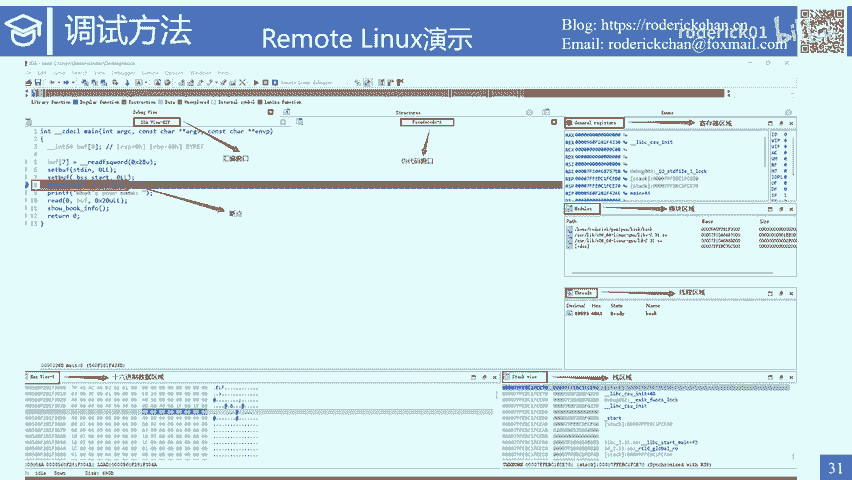

## 使用 IDA Pro 进行远程调试 🔗

在 CTF（Capture The Flag）逆向工程中，我们的 IDA 通常安装在 Windows 上，而目标程序运行在 Linux 系统。因此，远程调试比本地调试更常用（除非调试 Windows PE 文件）。

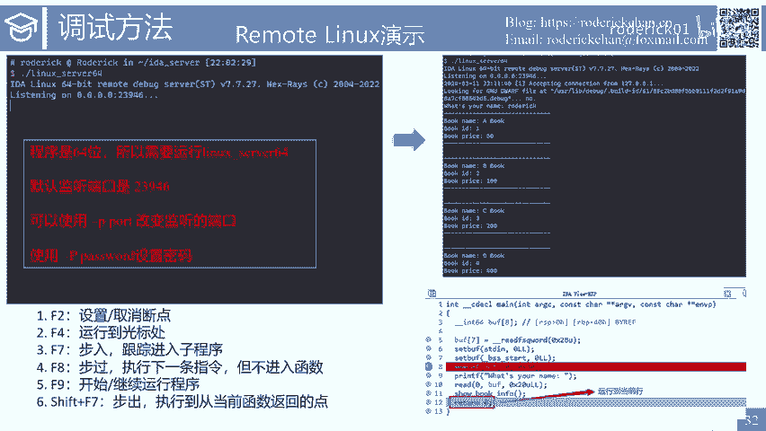

IDA 支持两种主要的远程调试方式：
1.  **Remote GDB debugger**：需要结合 IDA Pro 和 `gdbserver`。
2.  **Remote Linux debugger**：需要结合 IDA Pro 和 `dbgsrv` 目录下的调试服务器程序（如 `linux_server64`）。

**推荐使用 Remote Linux debugger**，体验更佳。需要注意的是，常规 CTF 题目用 GDB 命令行调试往往足够，远程调试更多用于复杂的漏洞分析或大型程序。

### 模式一：使用调试服务器启动程序
此模式使用 `linux_server64` 等程序在目标机器上启动待调试程序。

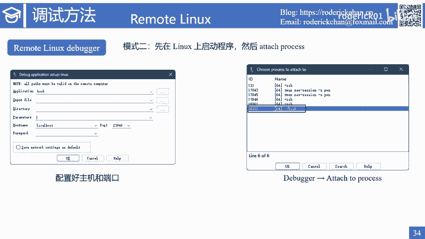

**步骤：**
1.  在 IDA 中点击 `Debugger -> Select debugger`，选择 **Remote Linux debugger**。
2.  点击 `Debugger -> Process options`。
3.  填写配置参数，然后点击 `Start process`。

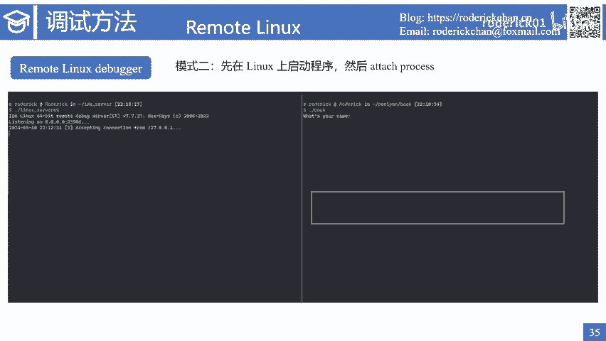

**配置参数说明：**
*   `Application`：目标程序在 Linux 上的完整路径。
*   `Input file`：同 `Application`。
*   `Directory`：程序启动的工作目录。
*   `Parameters`：程序运行所需的命令行参数。
*   `Hostname`：Linux 主机的 IP 地址或域名。
*   `Port`：调试服务器监听的端口（默认 `23946`）。
*   `Password`：连接密码（如果服务器启动时设置了密码）。

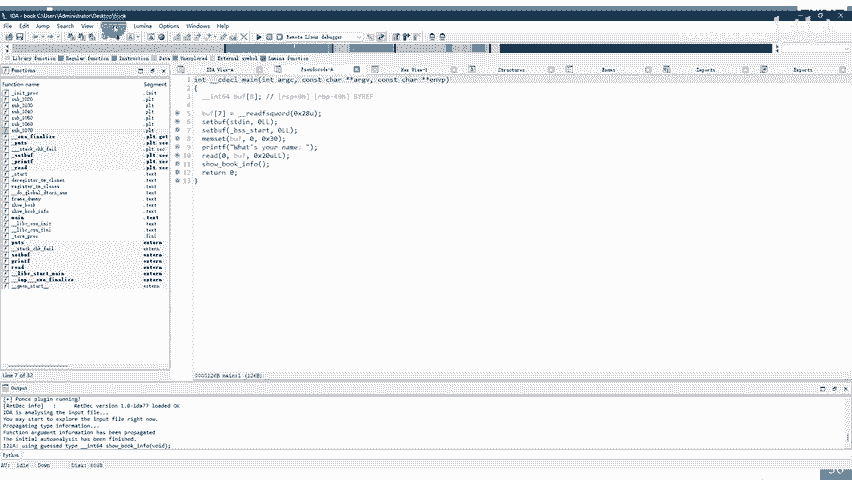

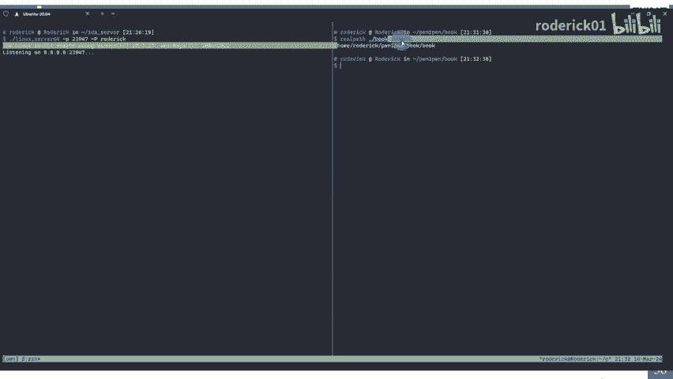

**优点：** 可以在程序任意位置下断点；可以方便地设置启动参数。
**缺点：** 配置项较多；不方便输入不可见字符（如 `\x00`）。

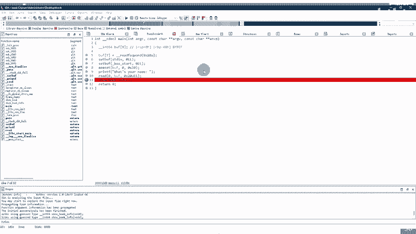

**调试界面：** 成功连接后，界面会新增寄存器、模块、线程、内存数据、堆栈等视图区域，便于全方位监控程序状态。

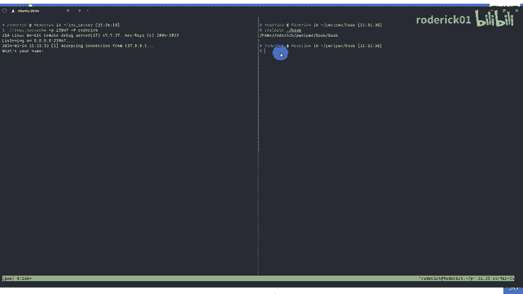

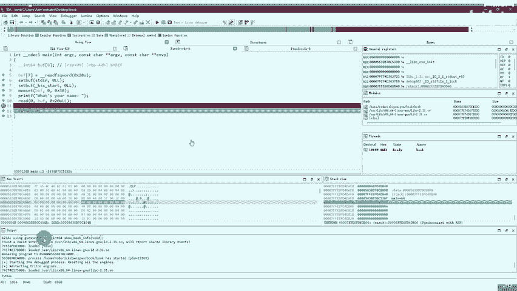

**常用调试快捷键：**
*   `F2`：设置/取消断点。
*   `F4`：运行到光标处。
*   `F7`：单步步入（进入函数调用）。
*   `F8`：单步步过（执行完当前指令，不进入函数）。
*   `F9`：开始或继续运行程序。
*   `Shift + F7`：单步步出（执行直到从当前函数返回）。

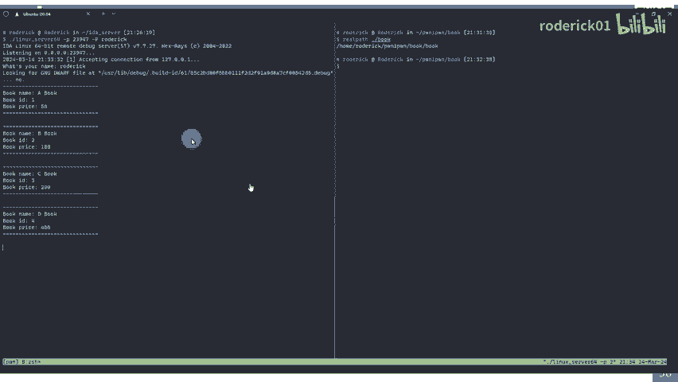

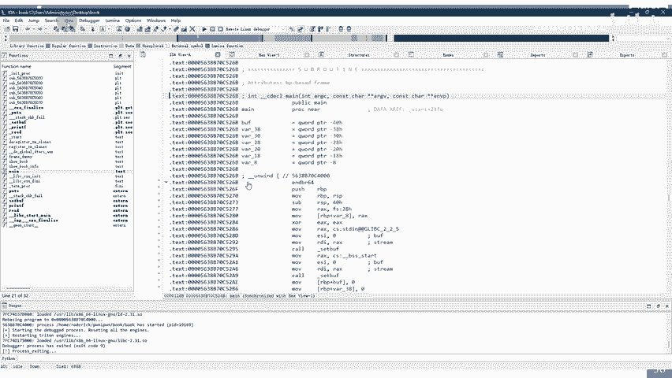

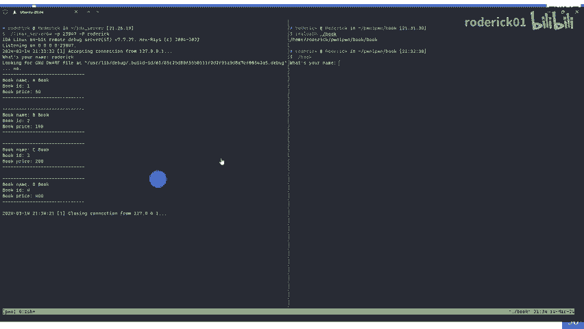

### 模式二：附加到已运行进程
此模式先让程序在 Linux 上运行起来，然后让 IDA 去附加（Attach）到这个进程。

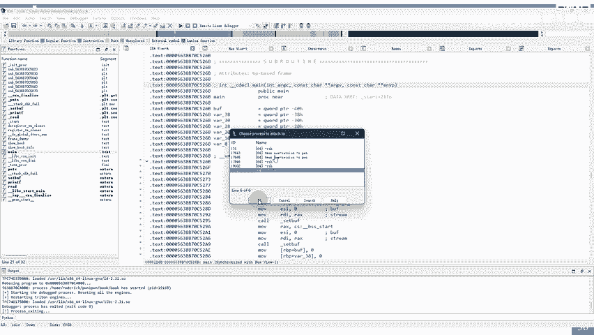

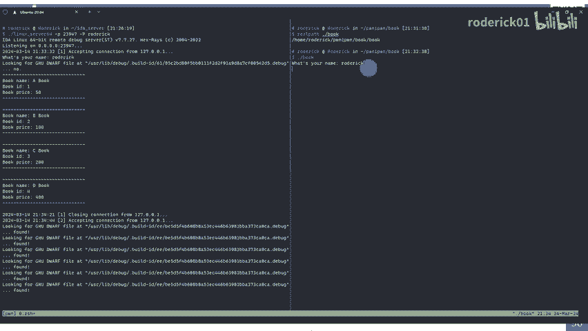

**步骤：**
1.  在 Linux 上启动调试服务器（如 `./linux_server64`）和待调试程序。
2.  在 IDA 的调试器设置中，仅需填写 `Hostname` 和 `Port`（`Application` 可随意填写或留空）。
3.  点击 `Debugger -> Attach to process`，从列表中选择目标进程。

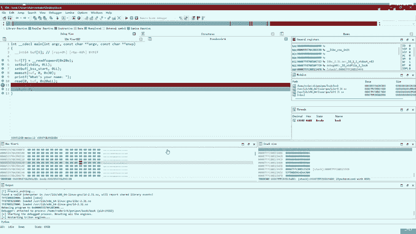

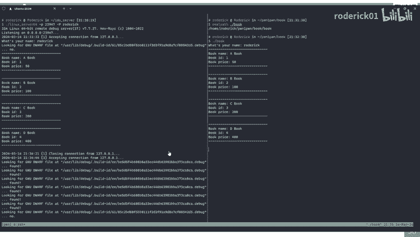

**优点：** 可与 `pwntools` 等脚本工具结合，方便输入不可见字符；配置简单。
**缺点：** 程序必须持续运行（不能立即结束），因此不方便调试程序启动初期或结束前的代码；无法在程序启动前下断点。

### Remote GDB Debugger 模式
此模式需要目标 Linux 系统安装 `gdbserver`。

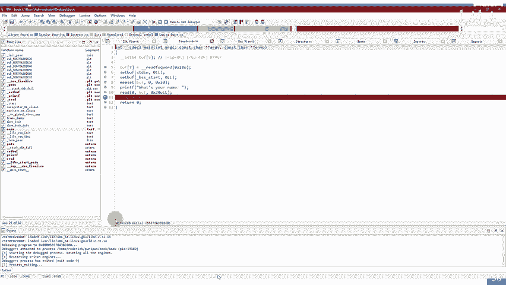

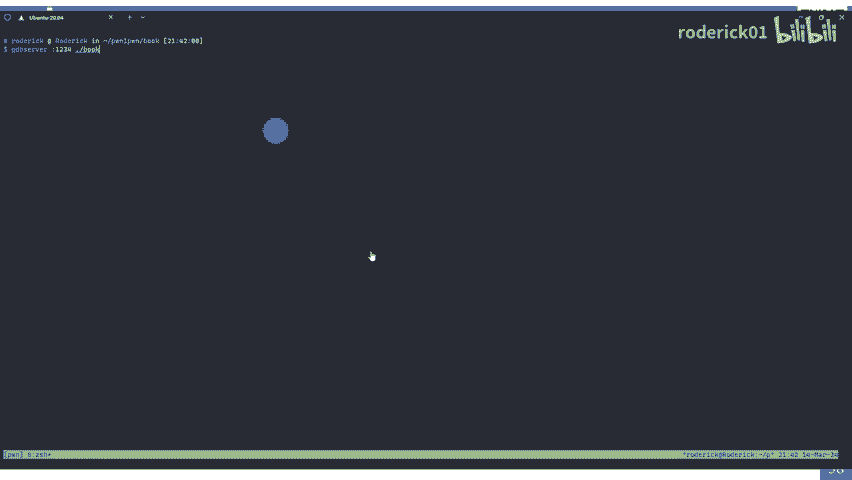

**步骤：**
1.  在 Linux 上用 `gdbserver` 启动程序：`gdbserver :1234 ./target_program`。
2.  在 IDA 中选择 **Remote GDB debugger**。
3.  在 `Process options` 中，`Hostname` 填 Linux 主机地址，`Port` 填 `gdbserver` 监听的端口（如 `1234`）。
4.  点击 `Start process` 开始调试。

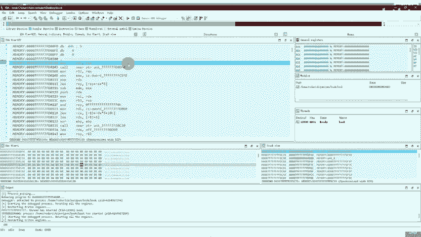

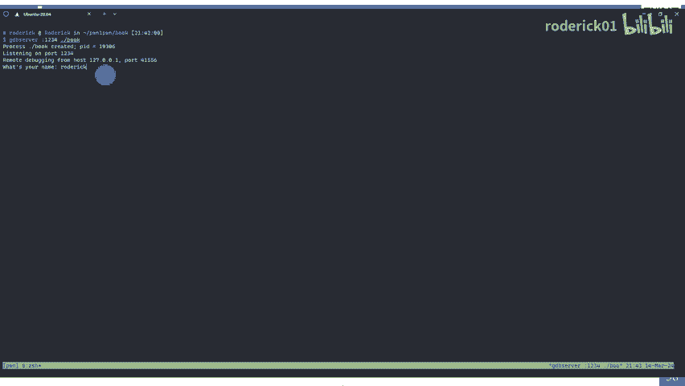

## 学习资料与课后练习 📚

本节课我们一起探索了 IDA Pro 的核心功能。最后，我们来汇总一些学习资源和布置一个练习。

### 学习资料
1.  **软件下载**：可关注看雪论坛、吾爱破解等社区，获取 IDA Pro 7.6/7.7 等稳定版本。
2.  **插件资源**：
    *   GitHub 仓库（如 `ida-plugins`）收集了大量插件。
    *   在 GitHub 搜索 `ida plugin` 关键字。
    *   看雪论坛的插件专区。
    *   官方插件仓库：https://www.hex-rays.com/plugins/
3.  **推荐插件**：
    *   `findcrypt`：识别加密算法常量。
    *   `decomp2gef`：将 IDA 与 GEF/GDB 联动。
    *   `diaphora`：强大的二进制文件对比插件（需配合 `Jython`）。
    *   各类去混淆插件。
4.  **文档与书籍**：
    *   **官方资源**：Hex-Rays 官网提供文档、教程和问题解答。遇到错误可直接搜索错误信息。
    *   **内置帮助**：按 `F1` 键打开 IDA 本地帮助文档。
    *   **权威书籍**：《IDA Pro 权威指南》（中文）或 *The IDA Pro Book*（英文）。

### 课后练习
为了巩固所学，请分析提供的程序 `fruit_release`（无调试符号），并完成以下任务：
1.  重建程序中的关键结构体。
2.  重命名函数与变量，使其含义清晰。
3.  在分析过程中，熟练使用 IDA 的各个窗口（字符串窗口、结构体窗口等）。
4.  练习使用本节课介绍的常用快捷键。
5.  （可选）尝试使用 IDA 对程序进行远程调试。

你可以对比分析 `fruit_debug`（带调试符号）来验证你的分析结果。

**文件下载地址**：`https://example.com/path/to/fruit.zip` （请替换为实际地址或使用提供的二维码）

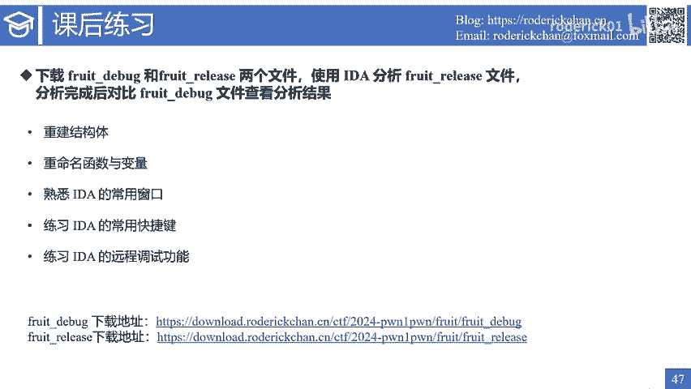

下节课，我们将讲解如何使用 GDB 进行命令行调试。祝你学习顺利！