# CTF逆向工程：1：.NET逆向分析入门

在本节课中，我们将要学习CTF比赛中.NET程序的逆向分析基础。我们将了解.NET程序集的基本概念，掌握一个标准的逆向分析流程，并通过一道实际的CTF题目来实践所学知识。

## 概述

.NET逆向分析主要针对由.NET框架编写的程序集，例如DLL或EXE文件。其核心目标是理解程序的逻辑，找到关键算法或验证机制，这在CTF的逆向类题目中非常常见。

## .NET逆向分析基本流程

上一节我们介绍了.NET逆向分析的目标，本节中我们来看看一个系统性的分析流程。以下是进行.NET逆向分析时通常遵循的八个步骤：

1.  **获取源代码**：使用.NET反编译工具（如dnSpy, ILSpy, Reflector）将程序集反编译为高级语言（如C#）代码。
2.  **分析程序集元数据**：了解程序集的依赖关系、版本信息、引用的外部库等。
3.  **定位核心方法**：在反编译的代码中，查找程序的入口点（如`Main`方法）和关键的业务逻辑函数。
4.  **理解关键方法逻辑**：对定位到的核心方法进行详细分析，理解其具体的算法实现和数据处理流程。
5.  **检查程序资源**：分析程序内嵌的资源文件，例如字符串常量、图片或配置文件，这些可能包含重要信息。
6.  **动态调试跟踪**：使用调试器（如dnSpy内置的调试功能）逐步执行代码，跟踪变量的值变化和函数调用栈。
7.  **分析加密与混淆**：识别并分析代码中使用的加密算法（如AES、DES）或代码混淆技术。
8.  **分析安全机制**：检查程序是否使用了代码签名、许可证验证或反调试等安全特性。

## 实战演练：湖北省CTF逆向题目解析

在掌握了基本流程后，我们通过一道来自湖北省赛的CTF逆向题目来实践应用。题目提供了一个EXE文件和三个.dat文件。

首先，我们使用查壳工具（如PEiD或Detect It Easy）检查EXE文件，发现它是由.NET框架编写的。

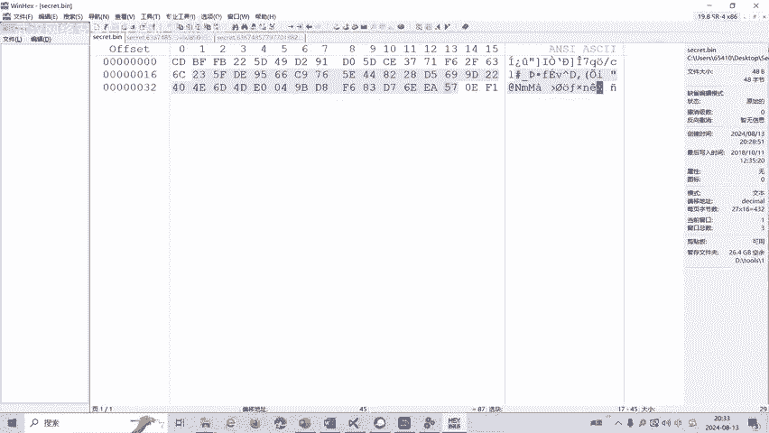

> 关键步骤：使用.NET反编译工具（例如dnSpy）打开该EXE程序集。

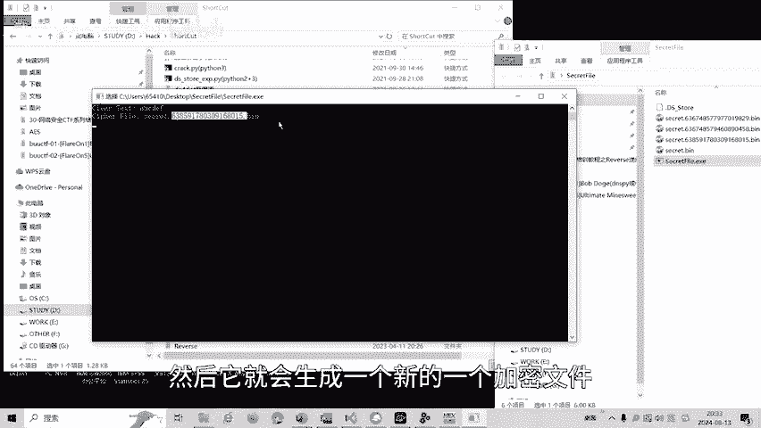

在反编译后的代码中，我们定位到`Program`类下的`Main`方法。分析发现，程序的核心逻辑是：
1.  接收用户输入的一个字符串。
2.  使用该字符串同时作为密钥（Key）和初始化向量（IV），对数据进行AES加密。

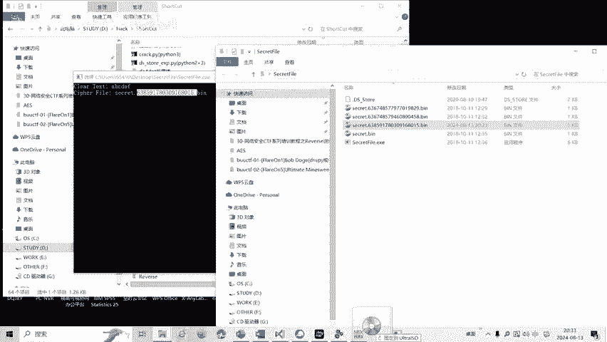

其加密过程的核心代码逻辑可以概括为以下伪代码：

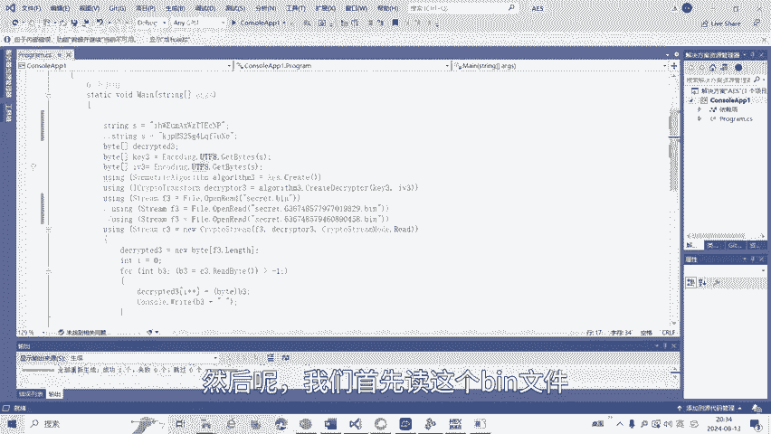

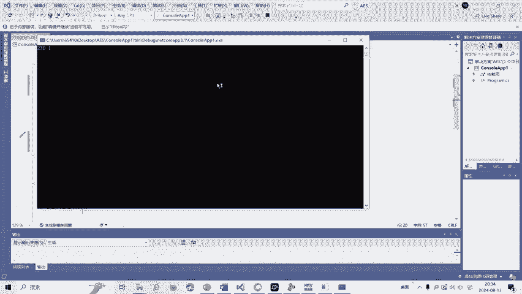

```csharp
string userInput = Console.ReadLine(); // 获取用户输入
byte[] key = Encoding.UTF8.GetBytes(userInput); // 将输入转为字节作为Key
byte[] iv = key; // 使用相同的字节作为IV
using (Aes aesAlg = Aes.Create())
{
    aesAlg.Key = key;
    aesAlg.IV = iv;
    // ... 执行加密操作
}
```

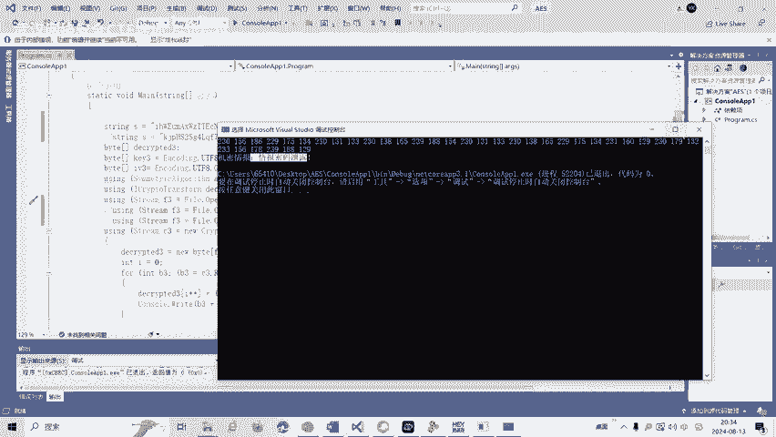

程序运行后，会用我们输入的密码去加密数据并生成新的文件。题目附带的三个.dat文件就是被不同密码加密后的结果。

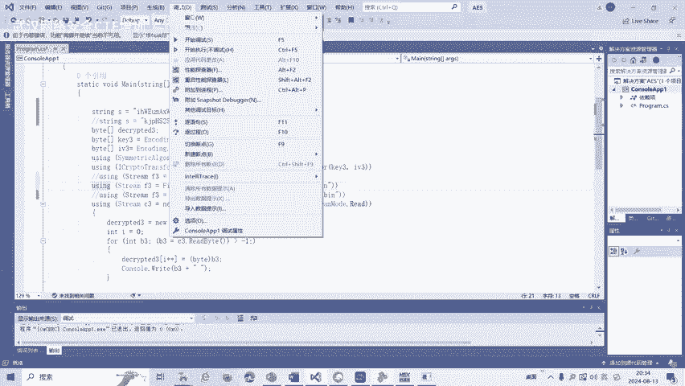

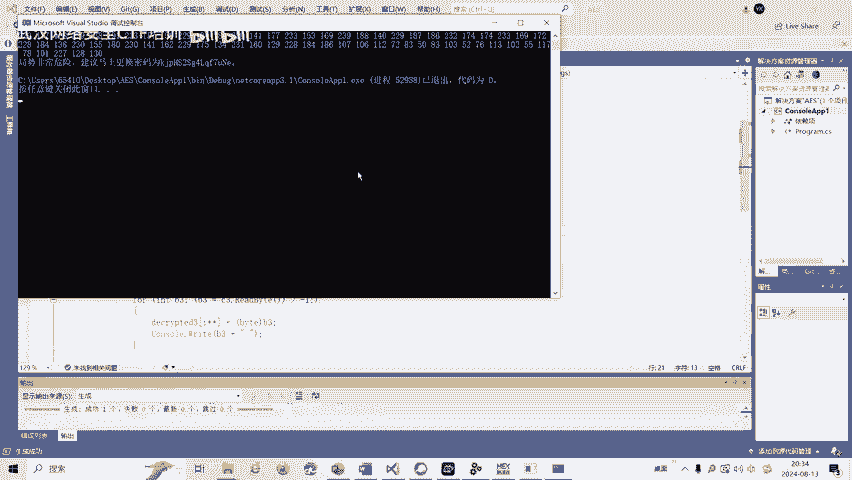

我们的解题思路是：既然知道了加密算法（AES）和密钥生成规则（密钥=IV=用户输入），我们就可以尝试用可能的密码去解密这三个.dat文件。

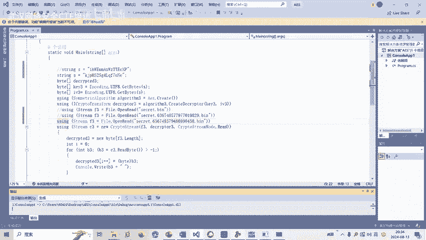

以下是解题操作步骤：

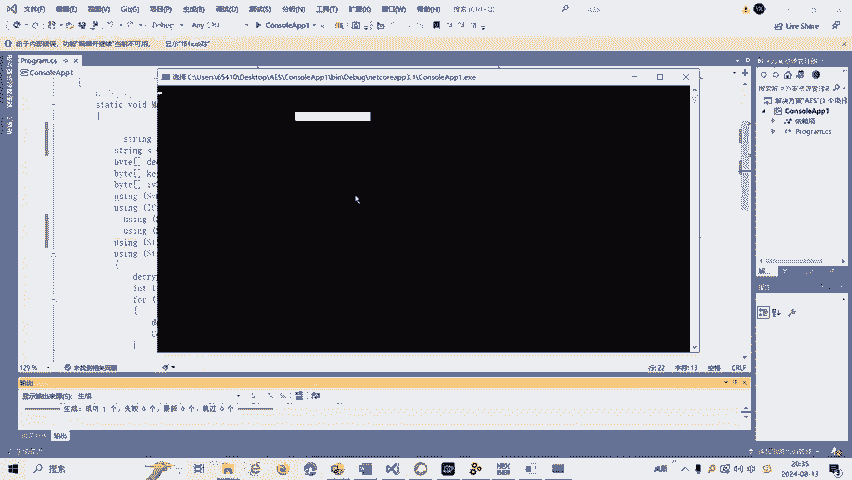

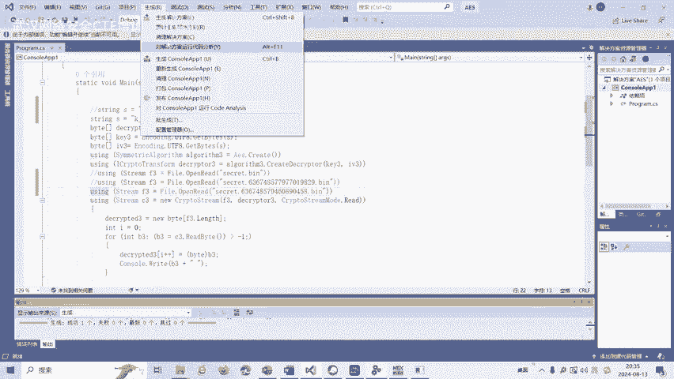

1.  **解密第一个文件**：我们尝试使用一个简单密码（如“123”）进行解密，解密后文件显示内容为“情报密码泄露”。这提示我们第一个文件的密码可能已泄露或非常简单。
2.  **解密第二个文件**：用第一个文件解密后得到的提示，我们尝试更换密码。解密第二个文件后，得到新的提示：“密码要进行更换”。
3.  **解密第三个文件**：根据提示再次更换密码，对第三个.dat文件进行解密，最终成功得到本题的Flag。

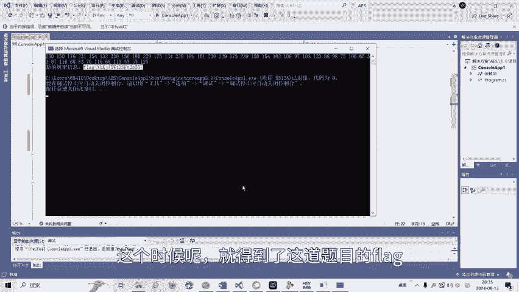

## 总结

本节课中我们一起学习了.NET逆向分析的基础。我们首先介绍了分析.NET程序集的标准流程，从静态反编译到动态调试。接着，我们通过一道实战CTF题目，演示了如何运用这些知识：识别程序为.NET编写、使用工具反编译、定位核心加密逻辑（AES）、理解密钥生成方式，并最终通过分析提示逐步解密获得Flag。

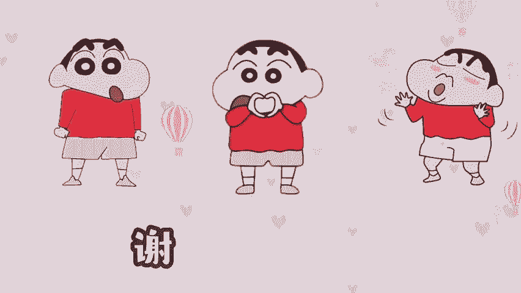

CTF逆向工程领域还包括花指令去除、代码混淆、虚拟机保护等更复杂的技术，我们将在后续课程中针对这些主题制作相应的教学视频。