# CTF逆向工程：1：UPX脱壳入门教程 🛡️

## 概述

在本节课中，我们将要学习CTF逆向工程中的一个基础且重要的概念——程序“加壳”与“脱壳”。我们将以UPX壳为例，详细介绍壳的定义、分类以及如何进行手动脱壳，帮助你理解如何分析被保护的程序。

---

## 壳的定义与作用

上一节我们概述了课程内容，本节中我们来看看什么是“壳”。

壳是一种对程序进行加密或压缩的程序。这个名称形象地描述了其功能：我们可以将被加壳的程序当作核心内容，而加壳程序就是在外面加上一层坚硬的外壳，以防止他人轻易窃取或分析内部的原始代码。

加壳后的程序依然可以被直接运行。当程序运行时，壳的代码会首先运行，完成解密或解压操作后，再跳转到原始程序的入口点执行。其主要目的是隐藏程序的**OEP**，即程序的原始入口点，从而防止外部程序对其进行反汇编分析或动态调试。

许多病毒通过加壳来达到免杀的目的。同时，加壳技术也常用于保护正版软件，防止被破解。技术本身没有对错之分，关键在于使用者的目的。

---

## 壳的分类

了解了壳的基本概念后，我们来看看壳有哪些主要类型。以下是两种最常见的壳：

1.  **压缩壳**
    *   **作用**：主要目的是压缩程序体积，减小文件大小。
    *   **原理**：它不会对程序的代码逻辑进行修改，只是改变了程序的存储方式，使其更紧凑。运行程序时，先执行壳内的解压缩代码，将原始程序解压到内存中，然后再执行。
    *   **常见工具**：**UPX**。它可以将一般程序的体积压缩到原来的30%左右。
    *   **公式表示**：`加壳后文件 ≈ 压缩(原始程序)`

2.  **加密壳**
    *   **作用**：主要目的是保护程序不被破解和分析。
    *   **原理**：会对原始程序的代码进行各种修改和混淆，例如添加花指令、代码变形等，大大增加逆向分析的难度。有些加密壳也兼具压缩功能。
    *   **常见工具**：ASPack, Themida, VMProtect, Enigma Protector 等。
    *   **高级变种**：虚拟机保护壳。其关键技术是用软件模拟一个CPU（虚拟机），原始程序的代码被翻译成这个虚拟机的特有指令集。由于程序不遵循标准的x86/ARM等指令集，因此分析起来异常困难。
    *   **公式表示**：`加壳后文件 ≈ 加密(混淆(原始程序))`

---

## 脱壳简介与基本流程

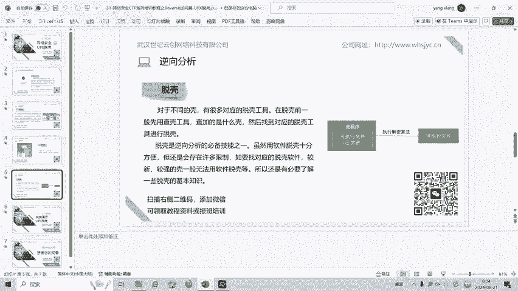

既然程序可以被加壳，自然也有对应的“脱壳”技术。脱壳是逆向分析的必备技能之一。

对于不同的壳，存在许多对应的脱壳工具。通常的脱壳流程是：先用查壳工具检测程序被加的是什么壳，然后寻找对应的脱壳工具进行脱壳。

虽然使用现成的脱壳软件十分方便，但这种方法存在限制。例如，需要找到针对特定壳的工具，而对于较新或强度较高的壳，往往没有通用的脱壳软件。因此，了解手动脱壳的基本原理和知识是非常必要的。

---

## UPX脱壳实战演示

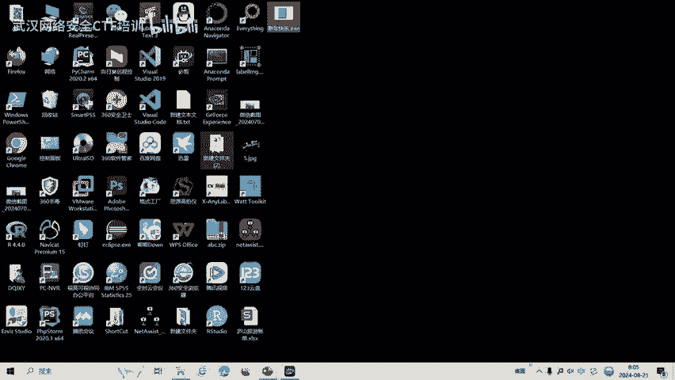

理论部分已经介绍完毕，本节中我们来进行一次实际的UPX脱壳操作。

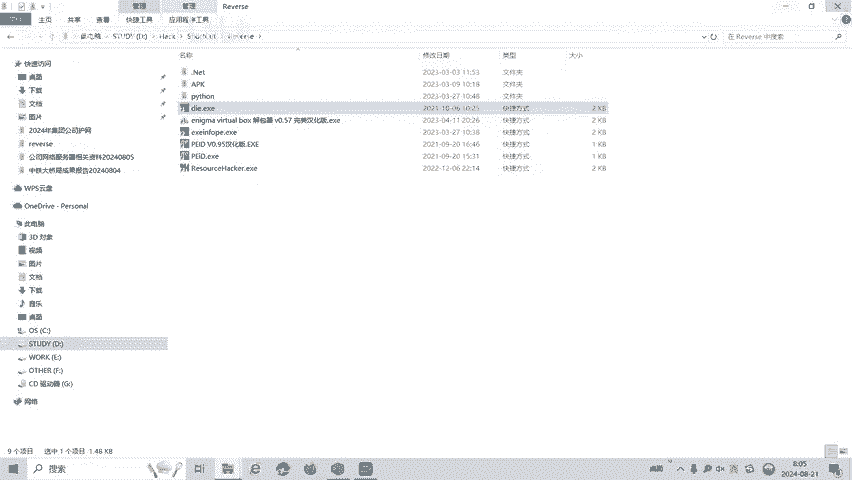

我们准备了一个名为 `新年快乐.exe` 的程序。首先，我们需要使用查壳工具 **DIE** 来分析它。

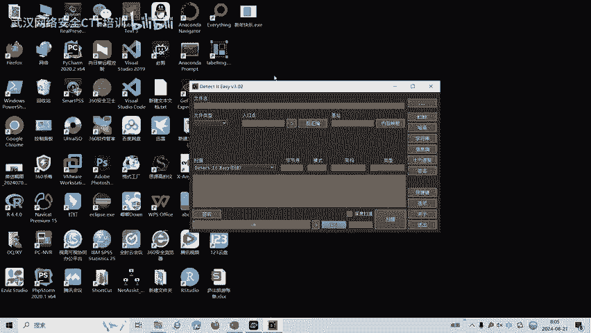


通过DIE分析，我们可以看到这是一个32位的程序，并且被检测出使用了 **UPX** 壳。

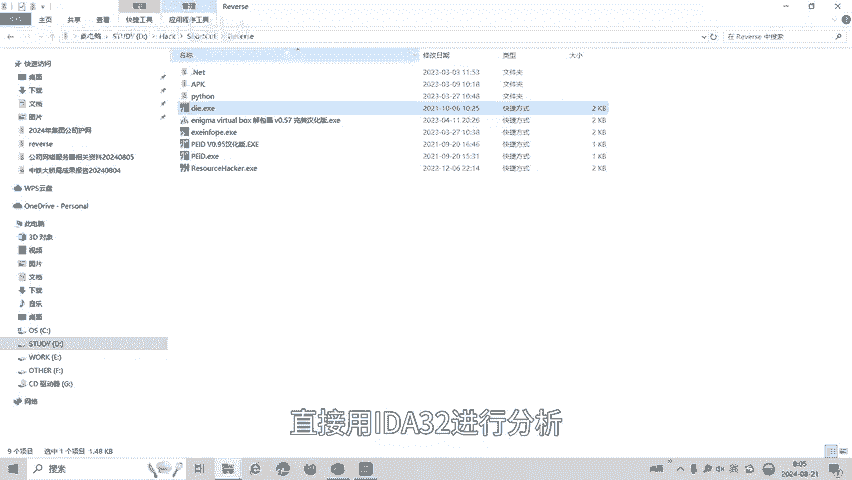


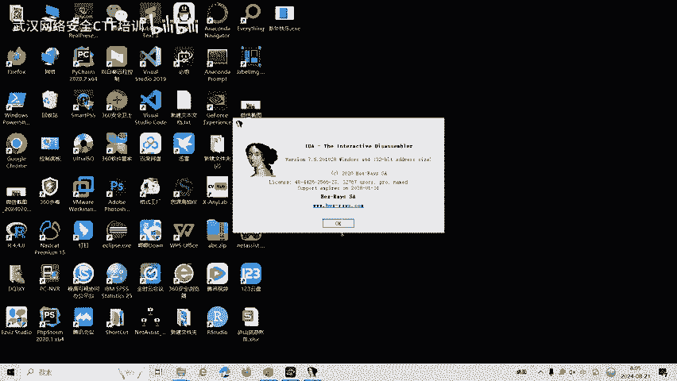

如果我们不脱壳，直接使用IDA进行静态分析，会得到什么结果呢？


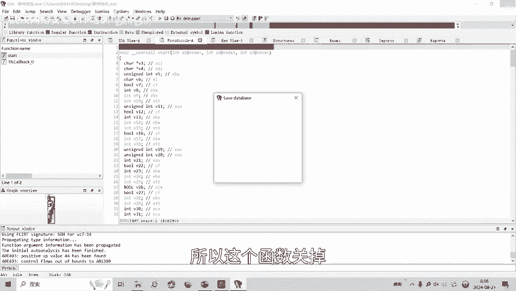

可以看到，反汇编出来的代码非常混乱且难以理解，IDA也无法正确识别出主要的函数。这是因为IDA分析的是壳的代码，而非原始程序。

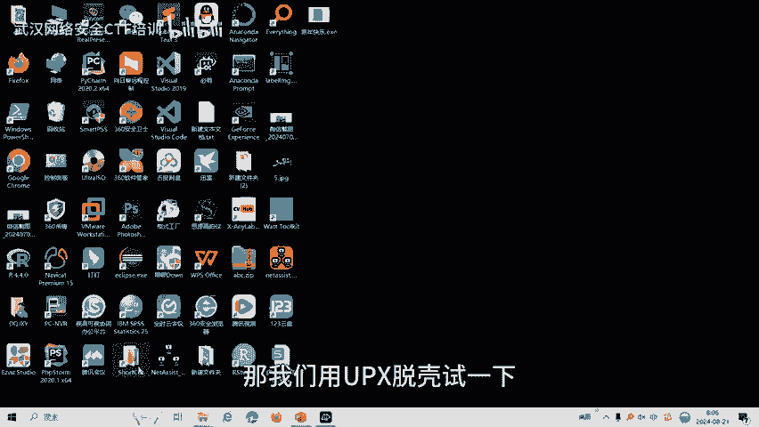


此时，程序的文件大小是20KB。

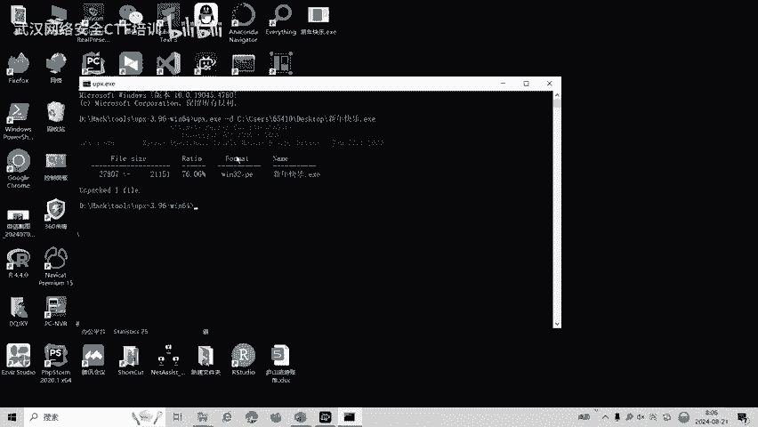

接下来，我们使用UPX官方工具进行脱壳。在命令行中执行以下命令：
```bash
upx -d 新年快乐.exe
```
其中，`-d` 参数代表脱壳。

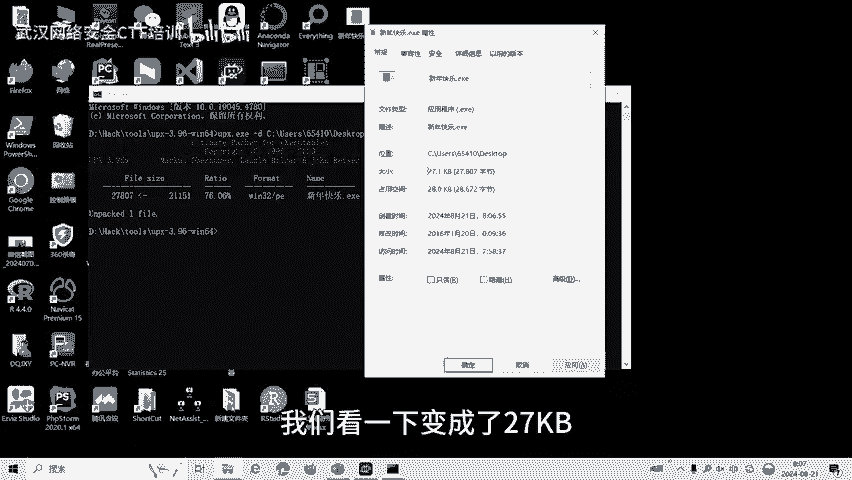


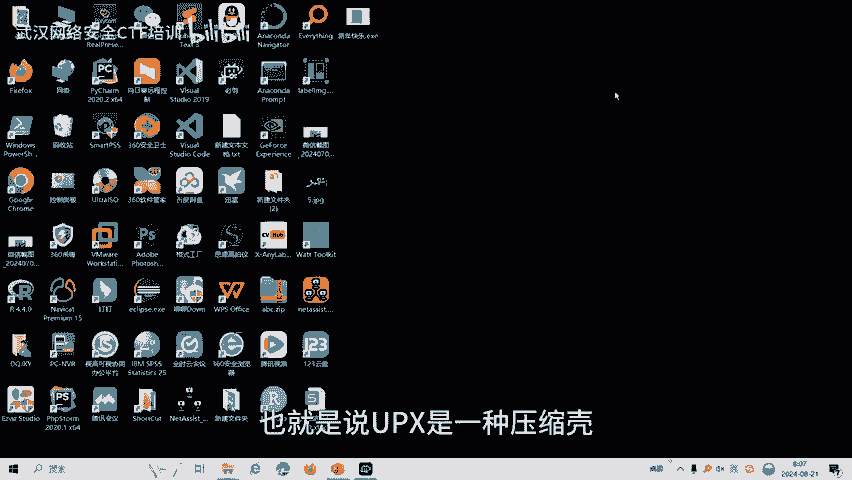

脱壳完成后，工具会覆盖原文件。我们再次查看文件属性，发现它的大小变成了27KB。


文件变大了，这印证了UPX作为压缩壳的特性：脱壳后，程序会恢复为原始的、未压缩的体积。

现在，我们再次用IDA32打开脱壳后的 `新年快乐.exe` 程序，并按F5键生成伪代码。

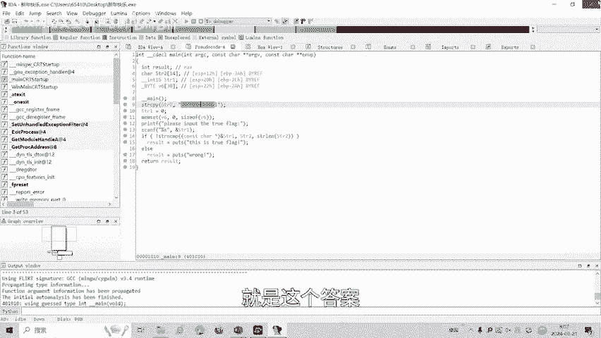


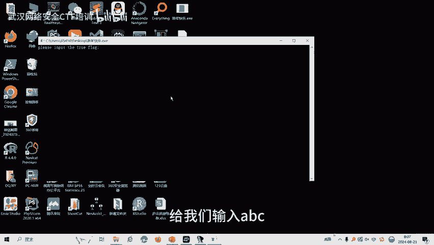

分析伪代码，逻辑变得非常清晰：程序提示“happy new year”，要求用户输入一个字符串。程序会将用户输入的字符串 `str1` 与内置的字符串 `str` 进行比较，如果相等则成功。

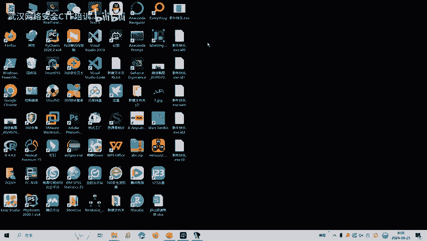


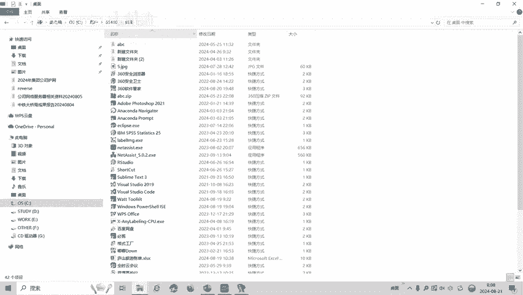

从代码中可以直接看到，正确的 `str` 是 `"flag{Welcome_to_UPX_World}"`。我们运行程序进行验证：
*   输入 `abc`，程序报错。
*   输入 `flag{Welcome_to_UPX_World}`，程序显示正确。

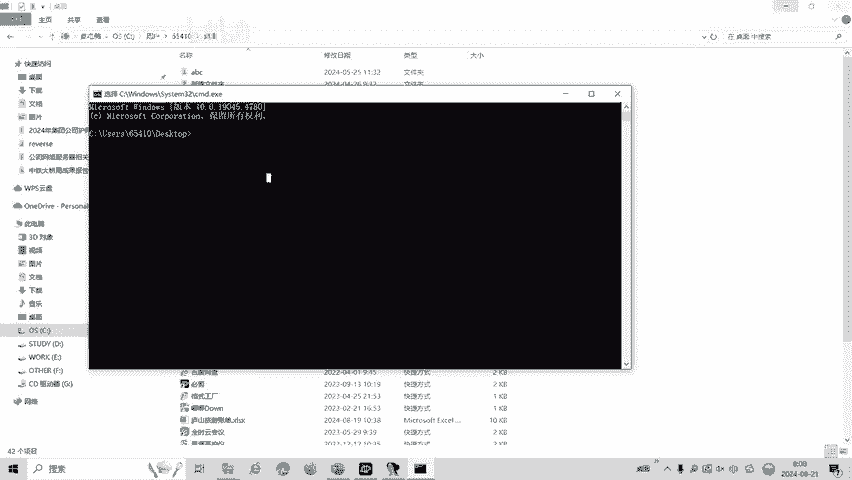


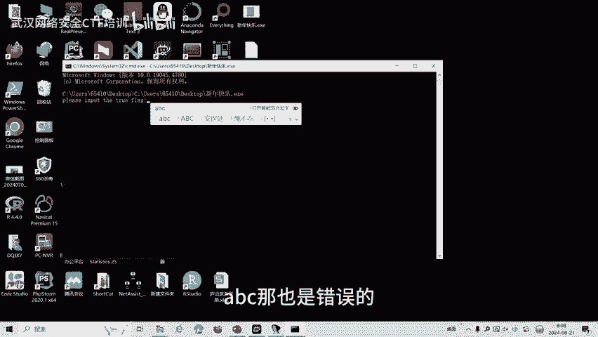

至此，我们成功完成了UPX壳的脱壳与分析。

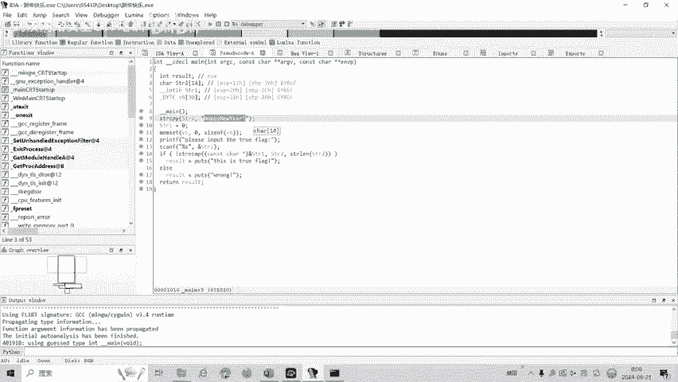

---

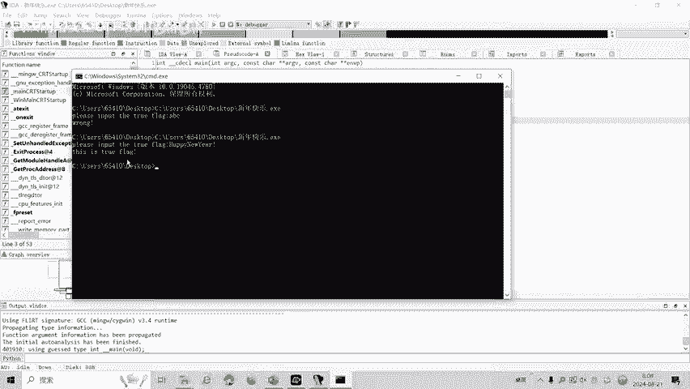

## 总结

本节课中我们一起学习了CTF逆向工程中关于“壳”的基础知识。我们首先了解了壳的定义及其保护原理，然后区分了压缩壳和加密壳两大类别。最后，我们通过一个完整的实战演示，使用UPX工具对一个加壳程序进行脱壳，并利用IDA成功分析了脱壳后的原始程序逻辑，找到了隐藏的flag。

CTF逆向工程中除了脱壳，还涉及反调试、代码混淆等多种技术。在后续的课程中，我们将针对各种类型的题目制作相应的教学视频。

---
**版权声明**：本教程内容仅用于CTF网络安全教学与培训，请严格遵守《网络安全法》及相关法律法规，勿将所学技术用于非法用途。