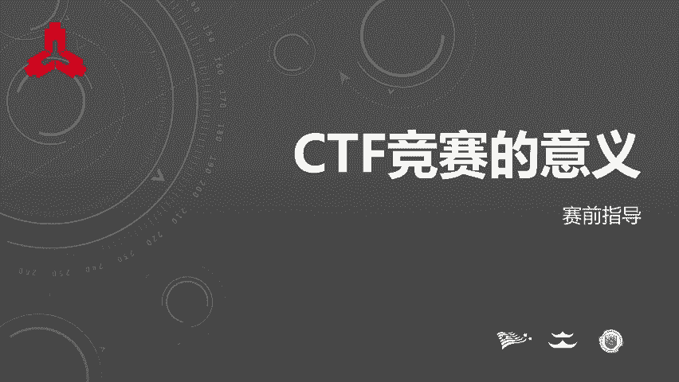
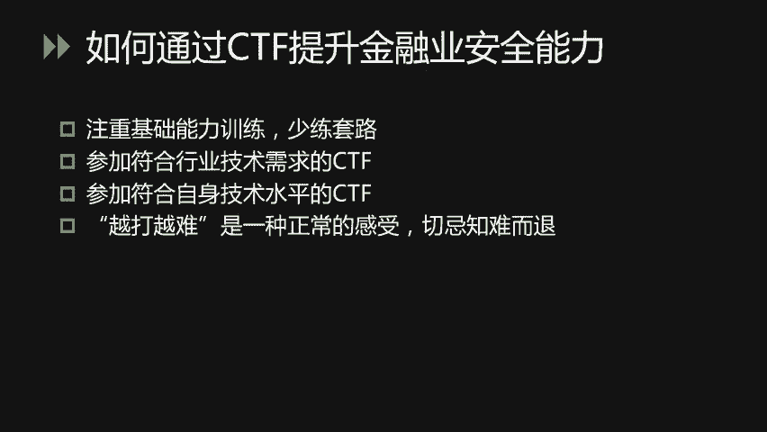

# CTF竞赛的意义：P1：高中数学yyds

在本节课中，我们将要学习CTF竞赛的意义，了解其发展历程、核心价值，并探讨它如何为网络安全行业，特别是金融业，培养和输送人才。

## 课程概述

如今，在网络安全行业，CTF形式的网络安全竞赛越来越流行。大家可能会问CTF到底有何作用？在金融业能否通过CTF来促进网络安全工作？围绕这些问题，我们今天就来重点谈一谈CTF竞赛背后的意义所在。

## CTF竞赛的六年发展

首先我们来看一看最近6年来，在国内和国际范围内，CTF发生了哪些变化。CTF最早起源于1996年的DEFCON。因此，在6年前，也就是2012年，CTF在国际上已经经历了十多年的发展，产生了一定的影响力。

据统计，2012年在国际上一共举办了20到30场知名CTF国际赛事，每场比赛大概有200到300支队伍得分。而在国内，同年还没有任何CTF竞赛，就连参加国际CTF的选手也少之又少。

但是当年，起源于清华大学的一支战队，叫做蓝莲花战队，开启了CTF探索之路，他们开始高强度的参加国际CTF赛事。

到了6年后的今天，国内外都取得了极大的发展。国际上的CTF大赛数量从二三十场增长到了大约100场。每场比赛的参赛战队数量也增加到了1000支，整体实现了5倍规模的增长。

对于国内来说，这6年时间里面，CTF经历了从无到有的过程。如今，国内的CTF赛事可以说是遍地开花。

以下是国内CTF赛事的主要类型：
*   各大高校学生社团举办的CTF。
*   企业举办的CTF。
*   面向各个垂直行业的CTF。
*   政府组织的CTF。

同时，在国内外密集的赛事中，也涌现了一批优秀的CTF选手，国内的选手在国际上渐渐也开始崭露头角。

在这里我列举一些具有代表性的成绩：
*   清华大学的蓝莲花战队曾经在2013年作为中国的战队首次晋级DEFCON CTF决赛。
*   上海交大的0ops战队曾经获得2015年的Codegate CTF冠军。
*   2016年，蓝莲花战队和0ops战队组成的联队b1o0p，获得了迄今为止中国战队在DEFCON CTF上取得的最好成绩：第二名。

## CTF如何培养实战人才

国内选手取得的成绩离不开持续的练习和提升。我个人曾经作为蓝莲花战队的队长，经历了战队成员们网络安全技能成长的整个过程。在这个过程当中，我觉得核心是在于坚持参赛。

蓝莲花战队曾经在不到4年的40个月时间里面参加了大概460场国际CTF赛事，几乎每场比赛都是持续不断的48个小时。坚持和努力是取得成绩的核心要素。

那么我们现在看到，在过去的几年里面，国内的CTF选手们在比赛中取得了一些成绩。但是大家可能会问，CTF毕竟只是一种竞赛游戏，竞赛中培养的人能不能解决现实中的网络安全问题？或者换句话说，CTF能不能培养出真正的网络安全人才？

我们先来看一些例子。在CTF比赛当中，选手破解的题目都是命题者编写的一些小程序，程序中的漏洞都是人为预制在里面的。而许多优秀的CTF选手，就是通过这些CTF题的训练，掌握了真实软件的攻防技术。

在知名国际黑客大赛Pwn2Own上面，演示了面向流行软件的破解，例如大家平时使用的macOS、Windows、Android、iOS。我把近年来在Pwn2Own上获胜的CTF选手都列了出来。

*   左上角这位是来自韩国的Lokihardt，他来自于战队KoreaSec。
*   右上角和左下角是来自国内蓝莲花和0ops战队的选手，他们分别代表了长亭科技和腾讯在Pwn2Own上进行亮相。
*   右下角是来自德国ERNW战队的两位选手。

所以我们可以看出，CTF培养的选手已经在网络安全攻防领域崭露头角，正在为整个软件生态发现并修复了许多高危漏洞。

除了活跃在刚才所说的Pwn2Own大赛上面的一些选手以外，其他一些优秀的选手也已经毕业，在各自的工作岗位上为网络安全行业做着贡献。

以下是CTF选手毕业后的主要去向：
*   有些人进入了BAT、Google等互联网巨头，挑起了安全技术支撑的大梁。
*   有些人留在国内外高校攻读PhD，从事网络安全学科对前沿的科学研究。
*   也有些人创办了网络安全公司，为行业输送安全服务和防护产品。

可以说，CTF为整个行业输送了大量的攻防技术人才，同时这些人才也在为行业注入新的能量。

## CTF的核心魅力

为什么CTF有如此的魔力呢？我总结了4点CTF的核心魅力。

**首先，CTF是一种会上瘾的游戏。** 在圈内，大家经常戏称CTF为电子竞技，称CTF选手为电竞选手。是因为CTF和电子竞技游戏一样，都是在有限时间内追求得分和排名的比赛。选手在比赛中都会有一种肾上腺素激增，集中全部精力思考解题的感受。在这种激烈对抗的环境中，你学习到的解题技术会让人印象更加深刻，掌握得更好。同时，好的比赛成绩也会让选手们获得比较强烈的成就感。

**其次，CTF题目是安全技术的浓缩和提炼。** 在没有CTF之前，想要学习安全技术，你就必须搭建一套真实环境，通过复现攻防场景来学习。所以，通常你需要花费比较多的时间在理解真实软件的工作方式上面。而CTF会把安全技术进行抽象，并且融合在一个命题者编写的小程序当中，让选手在理解和学习安全技术时，更加专注于技术本身，不需要花费额外时间在环境搭建和大型软件的理解上面。因此，CTF选手可以通过题目，在短期内迅速理解和掌握多种安全技术。

**然后，CTF是比较注重实际操作的。** 因为网络安全是一门实践学科，攻防技术都需要通过实操来落地。CTF题都是需要动手才能解决的，所以训练的效果能够直接为实战攻防提供帮助。

**最后，CTF不是一成不变的，是会紧跟时代不断变化进步的。** 高质量的CTF没有固定的大纲，通常是由安全专家命题，他们会以最新的技术架构为背景，融入新的安全技巧来命题，让参赛者能够不断学习新的知识。例如，在6年前，CTF可能主要围绕x86的架构来出题。而到了如今的移动互联网时代，CTF会出现基于移动处理架构ARM的题目。

## CTF对金融业网络安全的促进

说了这么多CTF的优点。那么对于金融业来说，CTF能否促进网络安全工作呢？我们知道，金融业的网络安全工作很大一部分是保障金融信息系统的安全运行，这是一项系统性的工作，包含了方方面面。

就拿广泛实践的软件安全开发生命周期来说，通常会包含安全意识培训、安全架构设计、安全编码、安全测试、应急响应等一系列的工作。这些工作想要做好，它的基础在于理解攻防。

而CTF是能够帮助大家通过浓缩和精炼的赛题来理解攻防细节的一种非常好的方式。所以，CTF是能够促进金融业网络安全工作的。

但是，我们会遇到一个问题，就是现在CTF赛事这么多，怎么样选择适合自己的比赛？我在这里主要提供4点建议。

以下是选择CTF比赛的建议：
*   **首先，在解CTF题时，要注重基础能力的训练。** 要更多的通过题目的理解来学习，少练一些套路题，比如那些用工具就能解决的题目。
*   **其次，要参加符合行业技术需求的CTF。** 因为现在的CTF考点五花八门，涉及的知识点非常杂，作为金融业的网络安全人员，并不一定要全部掌握，可以选择和业务关联性较大的技术进行重点发展。
*   **然后，要参加符合自身技术水平的比赛。** 因为难度过高的比赛会影响选手的积极性，难度太低又会影响进步和提高。
*   **最后，切记知难而退。** 如果你发现CTF越打越难，其实是一种正常的体验，说明你一直在提升和学习新的东西。如果发现CTF越打越容易，那就说明需要提高参加比赛的难度等级了。

## 课程总结

本节课中，我们一起学习了CTF竞赛的意义。我们回顾了CTF近六年在国内外的快速发展，探讨了它如何通过浓缩的赛题和竞技模式，高效地培养出能够解决实际安全问题的攻防人才。我们还分析了CTF的四大核心魅力，并讨论了它对于促进金融业网络安全工作的价值，最后给出了选择合适CTF比赛的建议。

最后，我在这里预祝大家能够通过CTF收获更多的技术提升。