# CTF逆向工程：第32课：迷宫类题目解析 🧩

## 概述
在本节课中，我们将学习CTF逆向工程中一类常见的题目——迷宫题。我们将从基本概念入手，分析一个具体的迷宫题目，并学习如何通过手动分析和脚本辅助两种方式高效解题。

---

## 二维四项迷宫基础概念

上一节我们介绍了本节课的主题。本节中，我们来看看迷宫题的基础概念。

在CTF逆向的迷宫题中，最常见的是“二维四项”迷宫。
*   **二维**：指迷宫结构是一个二维平面，通常用二维数组或一维数组模拟二维结构来表示。
*   **四项**：指在迷宫中的移动方向仅限于四个：上（W）、下（S）、左（A）、右（D）。

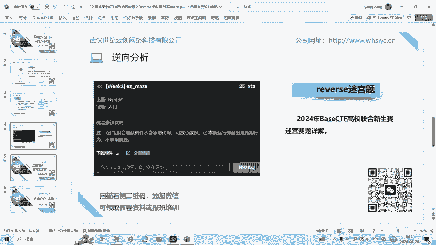

题目通常会给出迷宫的起点（如 `X`）、终点（如 `Y`）以及障碍物（如 `$`）。解题目标是找到从起点到终点的一条有效路径，有时要求是最短路径。

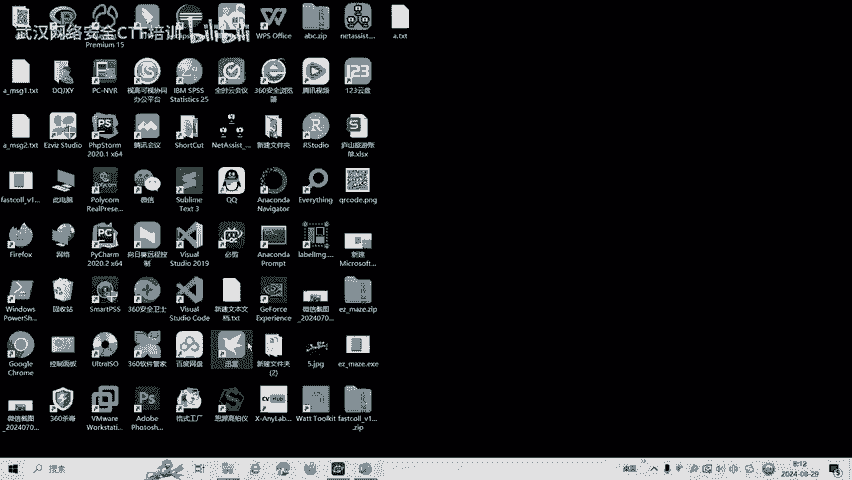

---

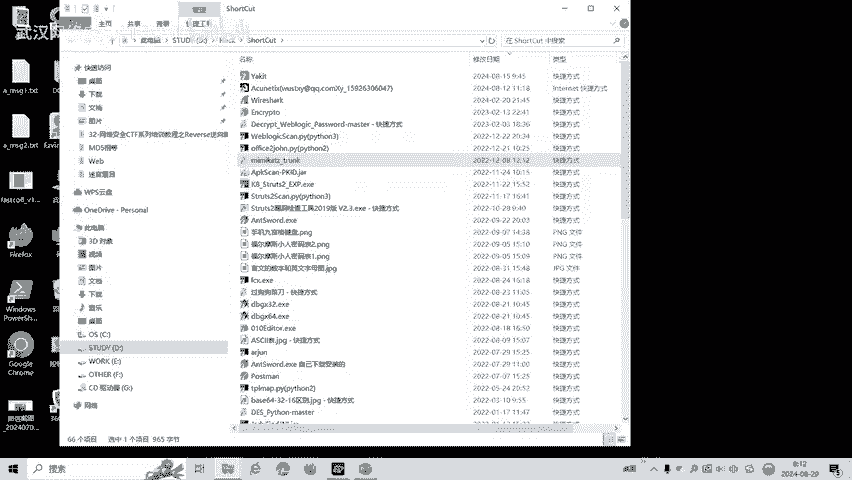

## 实例分析：2024年CTF迷宫题

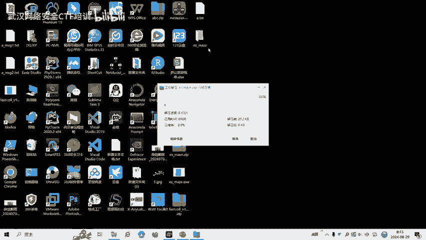

理解了基本概念后，我们通过一个实际题目来加深理解。本节我们将分析一道来自2024年CTF比赛的迷宫题。

首先，使用查壳工具DIE检测程序，确认其为64位程序。
接着，使用反汇编工具IDA64打开程序，并查看其反编译的伪代码。

在代码中，我们发现了关键逻辑：
1.  要求输入一个长度为32的字符串 `V5`，这很可能就是迷宫路径。
2.  根据输入的字符（`W`/`S`/`A`/`D`）来改变坐标 `V9`，对应上下左右移动。
    *   `D`（右）：`V9 = V9 + 1`
    *   `S`（下）：`V9 = V9 + 15` （暗示迷宫每行有15个元素）
    *   `W`（上）：`V9 = V9 - 15`
    *   `A`（左）：`V9 = V9 - 1`
3.  判断移动后的位置字符：
    *   如果是 `$`，则提示“撞击了墙”（`move hit`）。
    *   如果是 `Y`，则到达终点。
4.  程序最终检查是否成功到达 `Y`。

此外，在字符串中找到了一个长字符串，疑似为表示迷宫地图的数组。将其导出并整理为15行15列的格式后，我们得到了清晰的迷宫图。

以下是迷宫的可视化表示（示例）：
```
***************
*X*   *   *   *
* * *** * * * *
*   *   *   * *
*** * * *** * *
*     *   * * *
* *** * *** * *
* *   *     * *
* * *** *** * *
*   *   *   *Y*
*** * * * * * *
*     *   *   *
* *** *** *** *
*   *         *
***************
```
（注：此处为示意，实际迷宫字符可能为 `X`, `Y`, `$`, `*`, 空格等）

在迷宫中，`X` 是起点，`Y` 是终点，`$` 或 `*` 是墙，空格是可通行路径。

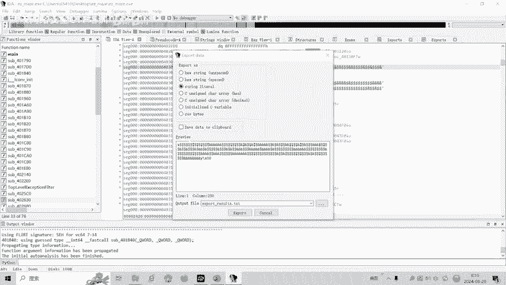

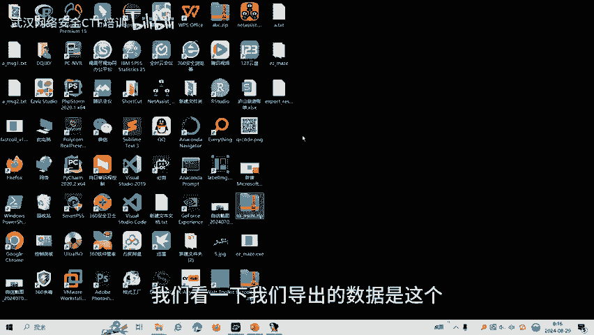

---

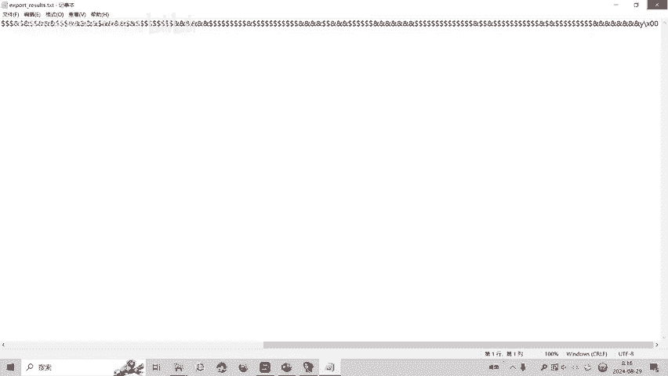

## 手动求解迷宫路径

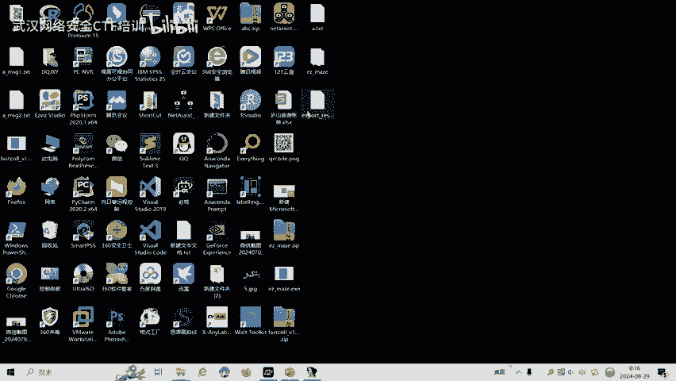

拿到迷宫地图后，最直接的方法是手动寻找路径。以下是手动求解的基本步骤：

1.  **观察起点与终点**：确认 `X` 和 `Y` 的位置。
2.  **规划路径**：从 `X` 出发，尝试使用 `W`/`S`/`A`/`D` 向四个方向移动，避开墙（`$`），最终到达 `Y`。
3.  **记录指令**：将每一步的移动方向记录下来，形成一串路径指令。

例如，一条可能的路径指令是：`SSSSSDDDWWDDDSSSSSD`。

然而，对于复杂的迷宫，手动寻找效率低下且容易出错。

---

## 使用脚本自动求解

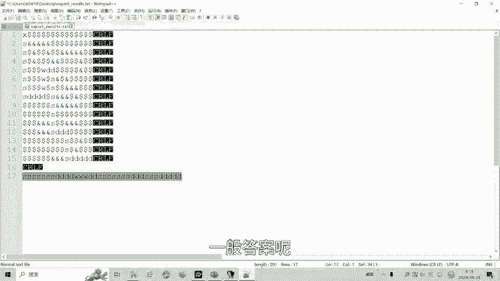

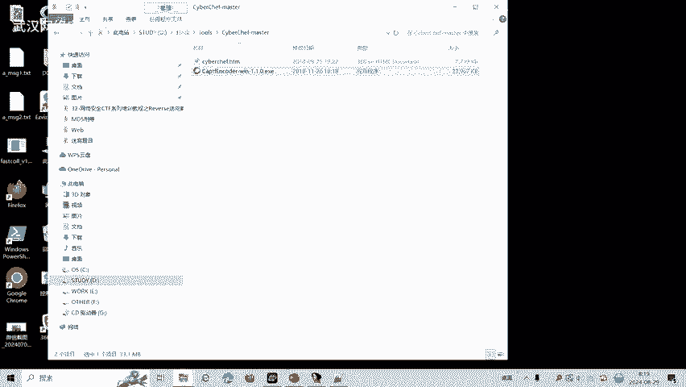

为了提高解题效率和准确性，我们可以编写或使用现成的脚本来自动求解迷宫。以下是脚本辅助解题的一般流程：

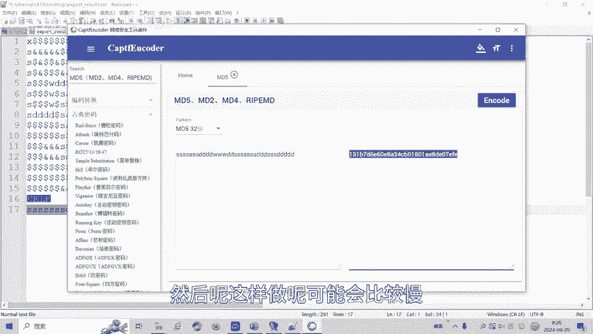

**第一步：处理迷宫数据**
将题目中的迷宫数组字符串复制到脚本中，并格式化为程序可识别的二维列表。

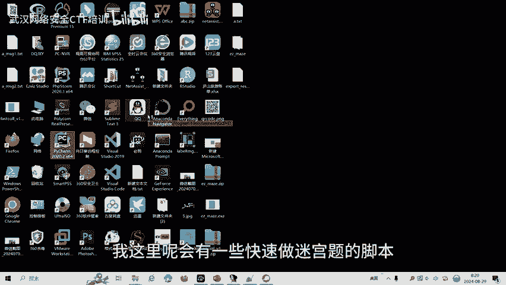

**第二步：路径搜索算法**
使用广度优先搜索（BFS）或深度优先搜索（DFS）等算法，在迷宫中自动寻找从起点到终点的路径。
核心算法逻辑（BFS思路）可以用如下伪代码表示：
```python
queue = [(start_x, start_y, “”)] # 队列元素：(x坐标, y坐标, 已走路径)
visited = set() # 记录已访问坐标
while queue:
    x, y, path = queue.pop(0)
    if (x, y) == (end_x, end_y):
        return path # 找到路径
    for direction, (dx, dy) in moves.items(): # moves: {‘W’:(-1,0), …}
        nx, ny = x + dx, y + dy
        if 迷宫[nx][ny]不是墙 and (nx, ny) not in visited:
            visited.add((nx, ny))
            queue.append((nx, ny, path + direction))
```

**第三步：获取并处理答案**
运行脚本后，得到路径字符串。通常，题目会要求将该路径字符串进行MD5加密后提交。
```bash
echo -n “SSSSSDDDWWDDDSSSSSD” | md5sum
```

使用脚本可以快速、准确地得到迷宫路径，极大提升解题速度。

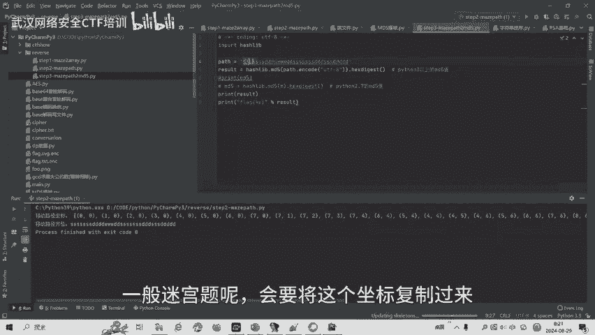

---

## 总结

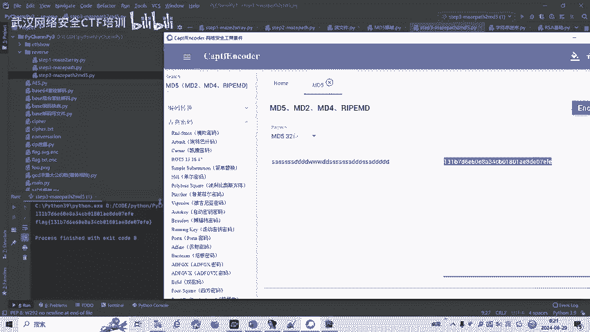

本节课我们一起学习了CTF逆向工程中迷宫类题目的解法。
我们首先介绍了二维四项迷宫的基本概念，然后通过一个真实案例，演示了从程序分析、提取迷宫数据到求解路径的完整过程。
我们比较了手动求解和脚本自动求解两种方法的优劣，并强调了在复杂情况下使用脚本工具的重要性。
掌握迷宫题的解题模式，并熟练运用辅助脚本，将帮助你在CTF比赛中更有效地应对此类挑战。

---
*注：课程中提到的解题脚本及更多学习资料，可通过相关渠道获取。请始终将所学知识用于合法合规的CTF竞赛与技能提升。*