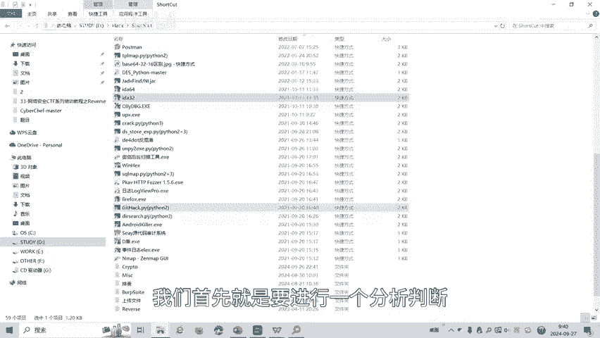
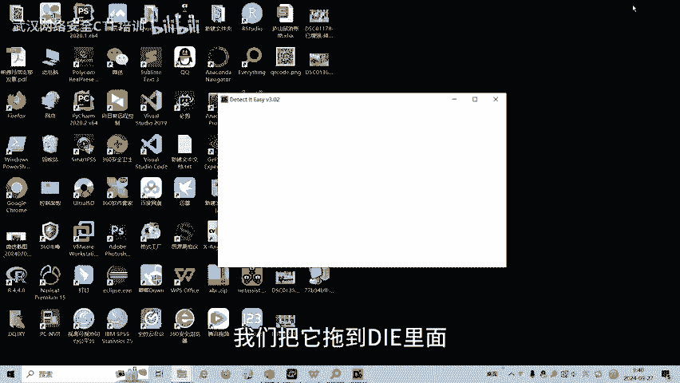
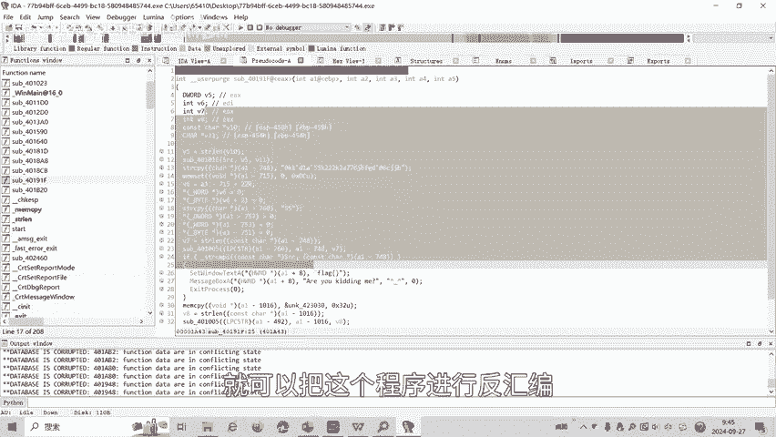
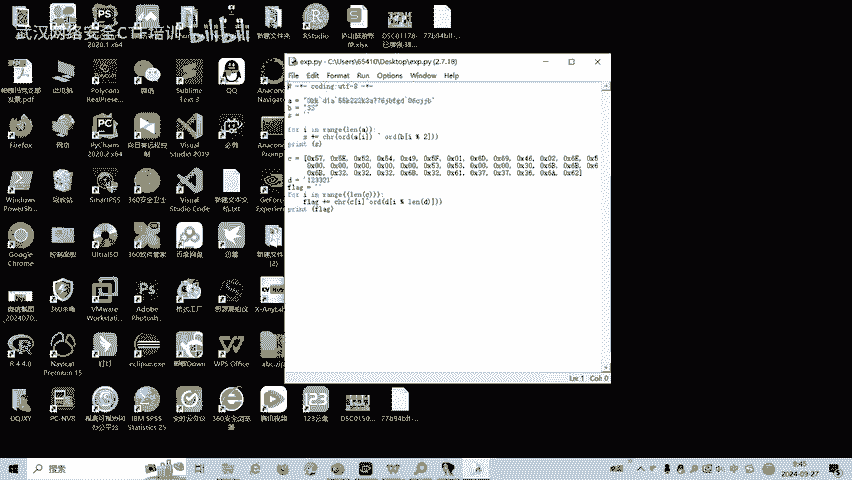
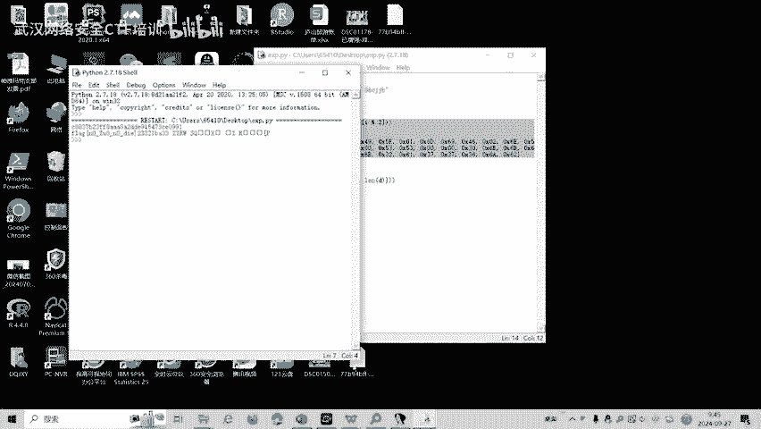

# CTF逆向工程：第33课：花指令识别与清除 🛡️

在本节课中，我们将要学习CTF逆向工程中的一个重要概念——花指令。我们将了解花指令的定义、作用、分类，并通过一个实际案例，学习如何在IDA Pro中识别和清除花指令，从而恢复可读的伪代码，以便进行后续的逆向分析。

## 概述：什么是花指令？

花指令，英文名为Junk Code，也称为垃圾代码。它是指在程序代码中插入的、不影响程序正常运行的无效指令。其主要目的是干扰逆向分析人员的静态分析，增加分析难度和时间。

花指令主要有两个作用：
1.  作为垃圾指令，增加静态分析的难度。
2.  用于病毒或木马程序，通过改变程序的特征码来躲避杀毒软件的扫描。

从定义上看，花指令通常位于一个永远不会被执行的分支中。例如，在一个无条件跳转指令之后，花指令代码永远不会被CPU执行，因此不会影响程序逻辑。但是，反汇编器在解析时可能会被这些代码干扰，导致反汇编结果出错。

## 花指令的分类

花指令大致可以分为两大类，每类下又包含两个小类。

### 第一大类：不会被执行的花指令

这类花指令位于永远不会被执行的代码路径中。

以下是其两个子类：
*   **操作码混淆**：花指令本身是操作码，但其后的原始机器码会被反汇编器误认为是操作数，从而导致后续的解析全部出错。
*   **堆栈平衡干扰**：花指令包含堆栈操作（如`push`/`pop`），导致反汇编器（如IDA的F5功能）误判堆栈不平衡，从而无法生成有效的伪代码。

### 第二大类：会被执行的花指令

这类花指令虽然会被执行，但其目的仍然是干扰分析。

以下是其两个子类：
*   **无副作用的正常指令**：执行一些正常的汇编指令（如`nop`, 寄存器运算），这些指令可能改变堆栈或寄存器状态，但最终不会影响原程序的逻辑，仅起到干扰作用。
*   **复杂流程干扰**：利用跳转指令（如`call`）向堆栈中加入返回地址，并通过修改返回地址配合`ret`指令跳转到任意位置，从而构造复杂的、难以静态分析的执行流。例如，2018年“网鼎杯”的题目就采用了这种方法。

## 花指令实例分析

我们来看一个“不会被执行”类型的花指令实例。以下是一段C代码及其对应的汇编代码片段。

**C代码示意：**
```c
void func() {
    // 一些代码...
    if (condition) {
        goto label1;
    }
    // 这里是花指令（永远不会执行）
    __asm {
        junk_code1;
        junk_code2;
        junk_code3;
    }
label1:
    // 真实代码继续执行...
}
```

**对应的汇编代码片段：**
```assembly
xor eax, eax    ; 将EAX寄存器置0
jz label1       ; 因为EAX为0，所以条件跳转总是成立，直接跳转到label1
junk_code1      ; 以下是花指令，永远不会被执行
junk_code2
junk_code3
label1:
    ; 真实代码开始
```
在这个例子中，`jz label1`是一个无条件跳转，其后的三条`junk_code`指令永远不会被执行。但是，当反汇编器解析时，这些“垃圾”操作码可能会被错误地解释，导致其后的指令解析全部错位，从而干扰分析人员的判断。

## 实战：识别与清除花指令

上一节我们介绍了花指令的理论知识，本节我们通过一道CTF题目来进行实操，学习如何在IDA Pro中识别和清除花指令。



首先，我们拿到一个PE程序文件。使用查壳工具DIE（Detect It Easy）进行分析，可以判断这是一个32位的程序。




因此，我们使用32位版本的IDA Pro打开它。花指令在反汇编视图中通常有特征可循。如果发现代码段中存在大量红色高亮的字节（表示IDA无法识别为有效指令），就可能存在花指令。


我们需要寻找典型的花指令模式。一种常见的模式是`call`指令后接一个`pop`指令来获取当前地址，然后对地址进行算术运算（如加/减一个值），最后跳转。例如：
```assembly
call $+5
pop edx
add edx, 2
jmp edx
```
在这个模式中，`call $+5`调用下一条指令，`pop edx`将返回地址（即自身地址）存入EDX，`add edx, 2`计算目标地址，`jmp edx`实现跳转。中间可能插入垃圾字节。

在本题中，我们观察反汇编窗口，发现类似模式。例如，在地址`0x4019EF`附近，我们看到冗余的`pop edx`操作和可疑的跳转。通常，连续两个相同的`pop`操作中有一个是无效的。通过计算（`edx + 2`）我们找到了跳转目标`0x4019EF`。

以下是清除花指令的关键步骤：
1.  在地址`0x4019EF`处按下`P`键，将其定义为一个函数的起始点。
2.  IDA会重新分析该区域，之前的红色混乱代码大部分会消失，函数结构变得清晰。
3.  对于剩余的其他红色代码块，重复此过程（例如在`0x40181D`处按`P`），直到所有红色部分被清除。



清除花指令后，我们就能清晰地看到`0x4019EF`处的函数（即主逻辑函数）。F5查看其伪代码，可以发现其中包含一段密文，该密文经过一系列运算后即可得到`flag`。




最后，根据伪代码逻辑编写Python脚本进行解密，即可得到本题的答案`flag`。





## 总结

本节课中，我们一起学习了CTF逆向工程中的花指令技术。我们首先了解了花指令的定义和干扰静态分析的目的，然后将其分为“不会被执行”和“会被执行”两大类，并探讨了各类下的子特征。最后，我们通过一个完整的实战例题，演示了如何在IDA Pro中通过识别`call-pop`等模式来定位花指令，并使用创建函数（`P`键）的方法来清除花指令，恢复可读的伪代码，从而为后续的算法分析和`flag`获取铺平道路。

CTF逆向分析中对抗花指令的技巧还有很多，后续课程将针对其他类型的干扰方式制作相应的教学视频。