# CTF Pwn入门：第1章：使用nc连接靶机 🖥️

在本节课中，我们将学习CTF Pwn方向的基础知识，并通过一个真实赛题演示如何使用`nc`（netcat）工具连接靶机，获取目标系统中的flag。

Pwn是CTF竞赛中的术语，指通过寻找和利用程序漏洞来获取系统控制权的过程。其发音类似“砰”，象征着成功攻破系统。

---

## 工具与环境准备

上一节我们介绍了Pwn的基本概念，本节中我们来看看实际操作所需的工具和环境。

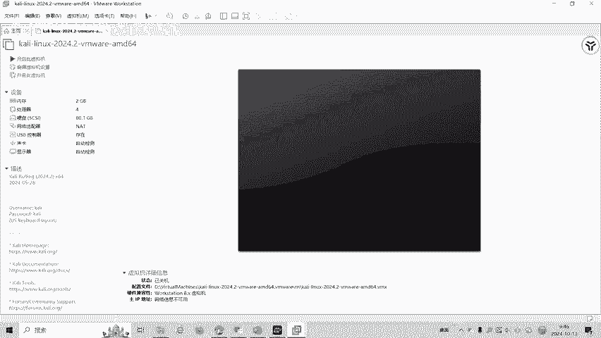

以下是进行本次实操演示所需的基本工具：
*   **虚拟机环境**：用于运行Linux系统，执行命令。
*   **`nc` (netcat) 命令**：一个功能强大的网络工具，可用于TCP/UDP连接、端口扫描、文件传输等。在本例中，我们用它来连接靶机。
*   **题目文件**：从题目中获取的`test`可执行程序，用于后续分析。

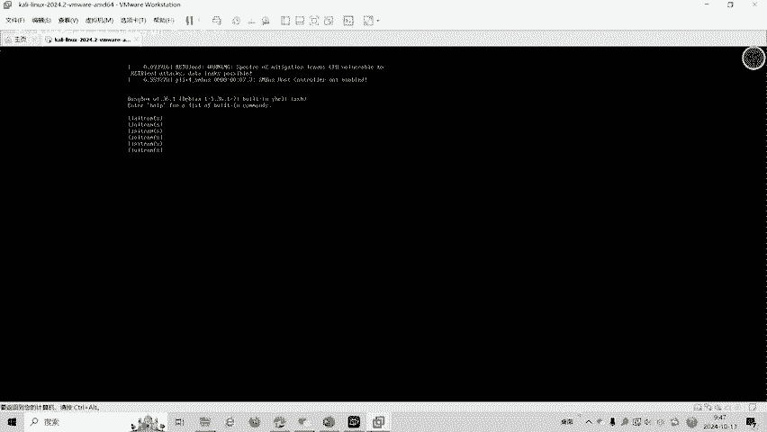

---

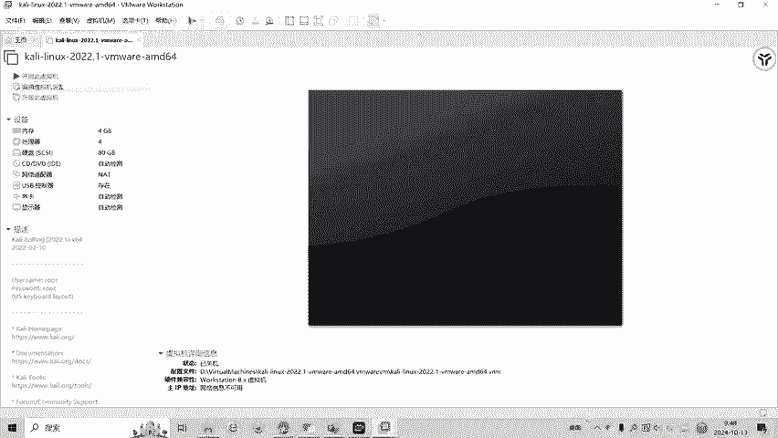


## 连接靶机并获取Flag

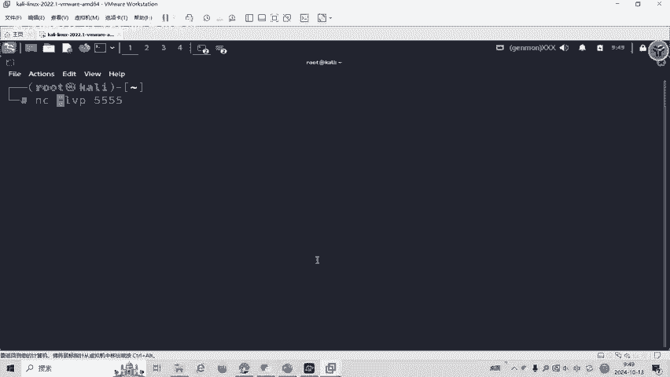

准备好环境后，我们开始连接靶机。靶机地址通常以“IP地址:端口号”的形式给出。

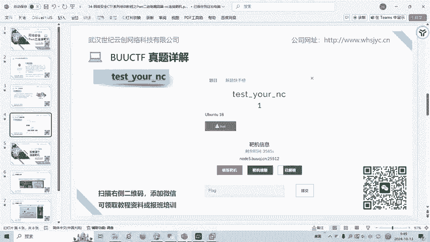

操作步骤如下：
1.  打开虚拟机终端。
2.  使用`nc`命令连接靶机。命令格式为：`nc <靶机IP> <端口号>`。
3.  连接成功后，尝试执行`ls`命令，列出当前目录下的文件。
4.  发现名为`flag`的文件后，使用`cat flag`命令查看其内容，即可获得flag。

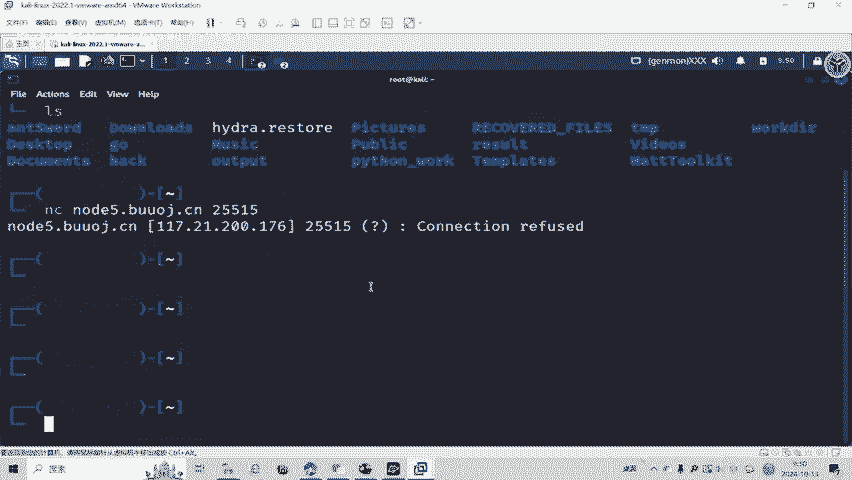

在演示中，输入命令 `nc 192.168.1.100 25512` 成功连接靶机。执行`ls`命令后发现了`flag`文件，使用 `cat flag` 命令成功读取到flag内容。

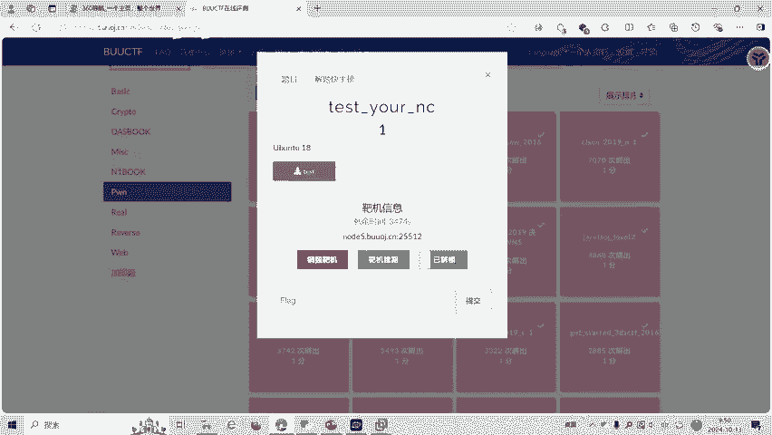

---

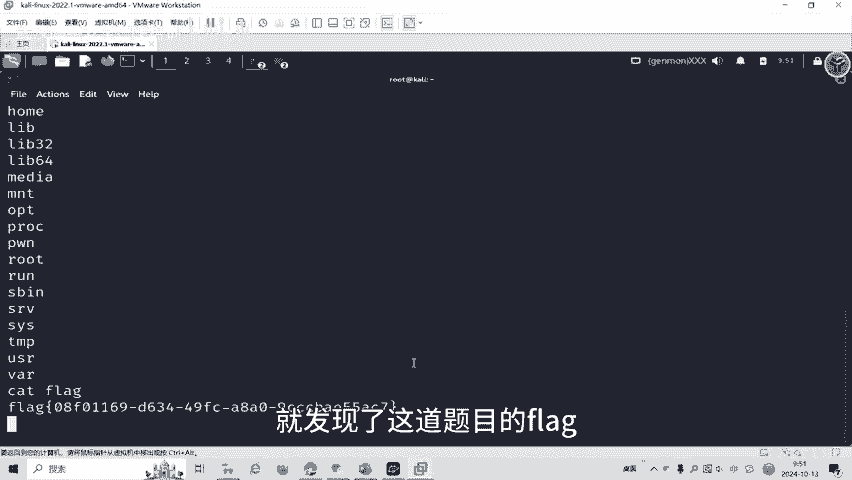

## 漏洞程序分析

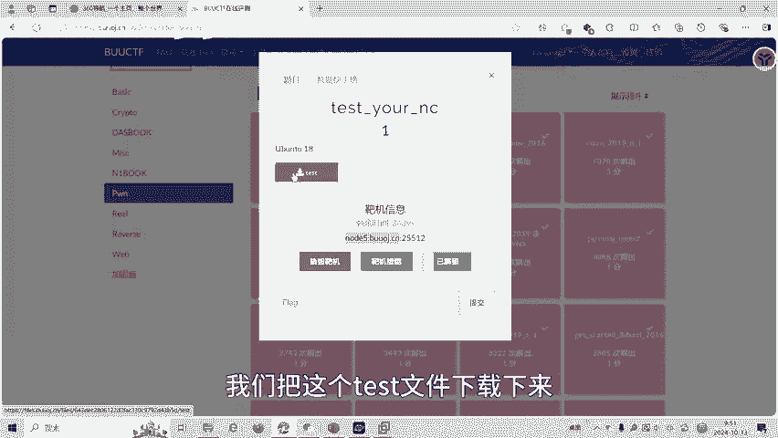

成功获取flag后，我们自然会产生疑问：为什么连接后就能直接执行命令？接下来，我们分析题目提供的`test`程序。

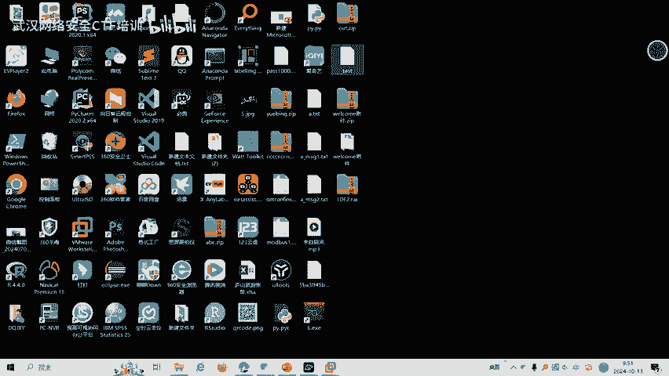

我们将`test`文件下载到本地进行分析：
1.  使用查壳工具（如DIE）检查，发现它是一个64位ELF可执行文件。
2.  使用反汇编工具（如IDA Pro 64位）打开该程序。
3.  定位到`main`函数，并按`F5`键进行反编译，查看近似C语言的伪代码。

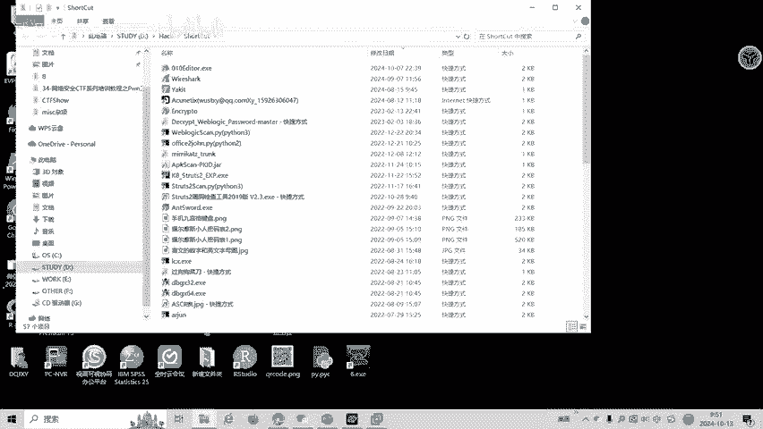

分析发现，在`main`函数中直接调用了`system`函数，执行了`/bin/sh`命令。
```c
system("/bin/sh");
```
这意味着，任何成功连接到该服务端程序的客户端，都会立即获得一个shell权限。因此，我们之前使用`nc`连接后，就能直接执行`ls`、`cat`等系统命令。

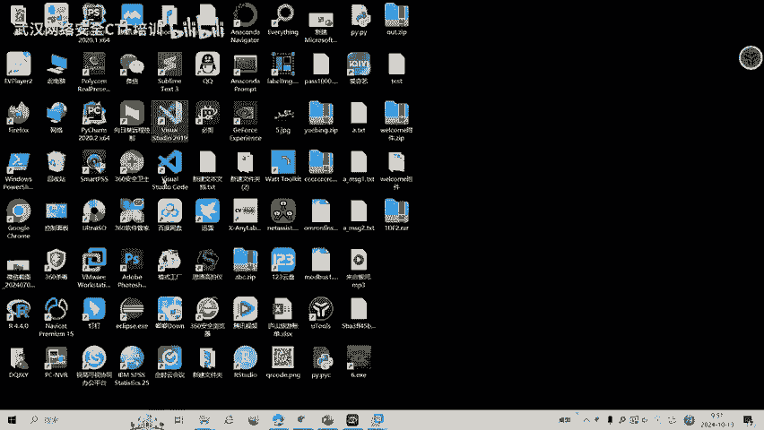

---

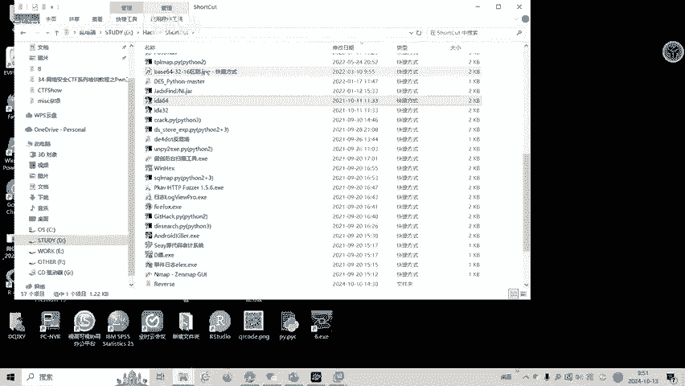

## 总结与拓展

本节课我们一起学习了CTF Pwn的入门操作。我们使用`nc`工具连接了目标靶机，通过执行系统命令找到了flag，并分析了背后简单的漏洞原理——程序直接给出了系统shell权限。

CTF比赛中的Pwn题型远不止于此，涉及栈溢出、堆利用、格式化字符串等多种漏洞利用技巧。这些高级内容将在后续的培训课程中由来自CTF省赛、国赛前十名战队的教师团队进行详细讲解。

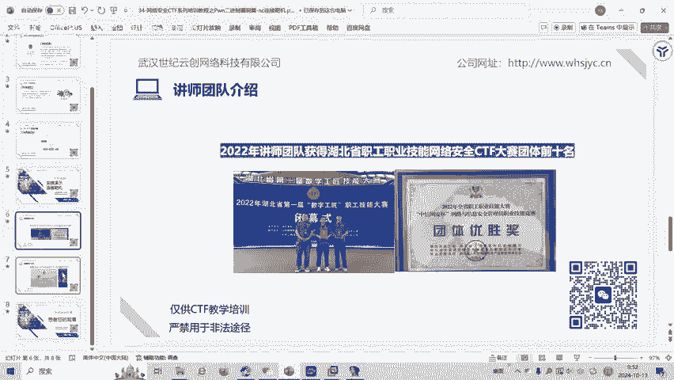

---

**免责声明**：本课程内容仅用于CTF网络安全教学与培训，请严格遵守《网络安全法》及相关法律法规，切勿用于非法用途。