# GDB调试指南：4：高级调试技巧与实用工具

在本节课中，我们将深入学习GDB的高级调试功能，包括多进程、多线程调试，信号处理，以及如何修改内存和寄存器。我们还将探索一些能极大提升调试效率的实用技巧和插件。

## 断点的进阶使用

上一节我们介绍了GDB的基本命令，本节中我们来看看如何更灵活地使用断点。

首先启动程序并使用 `start` 命令，让程序停在 `main` 函数入口处。

以下是设置断点的几种方法：

*   **按函数名设置**：使用 `break` 命令加上函数名称。例如，`break read` 会在 `read` 函数处设置断点。
*   **按内存地址设置**：使用 `break *` 加上一个内存地址。例如，`break *0x4005a0`。
*   **按源代码行号设置**：如果程序包含调试信息，可以直接在源代码行号处下断点。例如，`break 12` 或 `break test.c:14`。

除了普通断点，还有一些特殊断点：

*   **临时断点**：使用 `tbreak` 命令。例如，`tbreak printf`。该断点命中一次后会自动删除。
*   **正则表达式断点**：使用 `rbreak` 命令。例如，`rbreak print` 会为所有名称包含 “print” 的函数设置断点。

要查看所有断点，使用 `info breakpoints` 或其缩写 `i b`。要启用或禁用特定断点，使用 `enable <断点ID>` 或 `disable <断点ID>`。还可以使用 `ignore <断点ID> <次数>` 命令让断点忽略指定次数的命中。

### 观察点与捕获点

除了普通断点，我们还有一些特殊的断点类型，例如观察点和捕获点。

**观察点**用于监视特定内存地址的读写操作。首先在 `read` 函数处设置一个普通断点。程序暂停后，可以使用 `watch` 命令监视内存。例如，`watch *0x7fffffffe3a0` 会监视该地址开始的4个字节。若要监视8个字节，可以指定类型：`watch *(long long*)0x7fffffffe3a0`。当程序对该内存进行读写时，GDB会暂停并显示变化。

**捕获点**主要用于捕获系统调用、异常等事件。通常用于捕获系统调用。例如，`catch syscall read` 会捕获 `read` 系统调用。也可以使用系统调用号，如 `catch syscall 0`。设置后，当程序执行对应的系统调用时，GDB会暂停执行。

## 数据查看与操作命令

本节我们将学习用于查看和操作程序数据的核心命令。

最常用的打印命令是 `print`（缩写 `p`），它可以打印变量、寄存器、内存地址和表达式的结果，并记录历史。`ptype` 命令专门用于打印变量或表达式的类型信息。

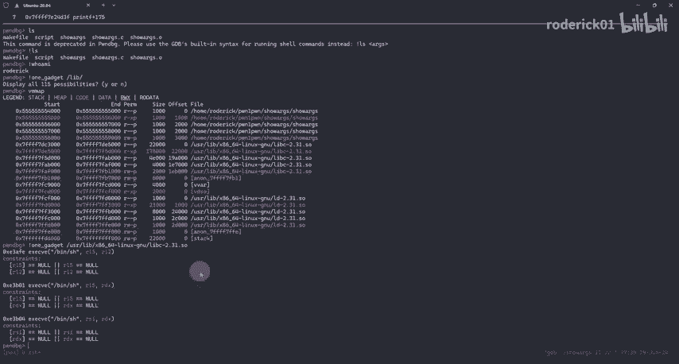

需要重点掌握的是 `x`（examine memory）命令，用于显示指定地址的内存内容。其格式为：
```
x/[数量][格式][单位] <地址>
```
其中，**格式**可以是：
*   `o`：八进制
*   `x`：十六进制（**最常用**）
*   `d`：十进制
*   `u`：无符号十进制
*   `t`：二进制
*   `f`：浮点数
*   `a`：地址
*   `i`：指令
*   `c`：字符
*   `s`：字符串


**单位**（大小）可以是：
*   `b`：字节
*   `h`：半字（2字节）
*   `w`：字（4字节）
*   `g`：巨字（8字节）

另一个极其有用的命令是 `help`。当你不清楚某个GDB命令的用法时，输入 `help <命令名>` 即可查看详细的帮助文档。

以下是其他一些常用命令的简介：
*   `disassemble`：显示指定函数或地址的汇编指令。
*   `info registers`（缩写 `i r`）：显示所有寄存器的值。
*   `backtrace`（缩写 `bt`）：打印当前的函数调用栈（栈帧）信息。
*   `frame`：显示当前栈帧的详细信息。结合 `up` 和 `down` 命令可以在调用栈中上下移动。
*   `info locals`：显示当前栈帧中的局部变量。
*   `call`：直接调用程序中的函数。
*   `dump`：将内存、变量值等保存到文件。
*   `shell`（或前缀 `!`）：在GDB中执行外部Shell命令。

**命令演示摘要**：
*   使用 `p/x *stderr` 可以打印 `stderr` 结构体的内容。
*   使用 `x/20gx 0x400000` 可以以16进制格式查看从0x400000开始的20个8字节数据。
*   使用 `x/20i main` 可以查看 `main` 函数起始处的20条汇编指令。
*   使用 `disassemble main` 可以直接显示 `main` 函数的汇编代码。
*   使用 `call system(“ls”)` 可以在调试过程中直接调用 `system` 函数。
*   使用 `!one_gadget /lib/x86_64-linux-gnu/libc.so.6` 可以快速查找libc中的one_gadget。

## 高级调试：多进程与多线程

在上一章，我们介绍了许多GDB常用的基本命令。但是如果我们遇到一些复杂的程序需要调试，GDB又支持哪些命令呢？在这一章，我将介绍GDB的一些高级调试技巧。

### 调试多进程程序

进程是操作系统分配资源和调度的基本单位，每个进程有独立的地址空间。父子进程的内存空间也是独立的。

GDB操作进程的主要命令如下：
*   `info inferiors`：查看当前调试的所有进程（GDB分配的序号）。
*   `inferior <ID>`：切换到指定ID的进程进行调试。
*   `kill inferior <ID>`：终止指定ID的进程。

有两个关键设置影响多进程调试行为：
*   `set detach-on-fork on/off`：设置调用 `fork` 时是否同时调试父子进程（`off`表示同时调试）。
*   `set follow-fork-mode parent/child`：设置 `fork` 后GDB跟踪父进程还是子进程。

这两个选项的组合效果如下：
*   `follow-fork-mode parent` + `detach-on-fork on`：**只调试父进程**。
*   `follow-fork-mode child` + `detach-on-fork on`：**只调试子进程**。
*   `follow-fork-mode parent` + `detach-on-fork off`：**同时调试两个进程**，GDB跟踪父进程，子进程阻塞在 `fork` 处。
*   `follow-fork-mode child` + `detach-on-fork off`：**同时调试两个进程**，GDB跟踪子进程，父进程阻塞在 `fork` 处。

通常推荐配置为第三种（`parent` + `off`），以便同时观察父子进程，并使用 `inferior` 命令在它们之间切换。

### 调试多线程程序

线程是轻量级的执行单元，共享进程的地址空间和资源，但有自己的栈和寄存器。

GDB操作线程的关键命令如下：
*   `info threads`：查看所有线程（GDB分配的ID，带 `*` 的是当前线程）。
*   `thread <ID>`：切换到指定ID的线程。
*   `break <位置> thread all`：在所有线程的指定位置设置断点。
*   `thread apply <ID> <命令>`：让指定线程执行某个GDB命令。

重要的线程调试设置：
*   `set scheduler-locking on/off`：设置为 `on` 时，**锁定当前调试线程**，只有它继续执行；`off` 时所有线程自由运行（默认）。在断点处，所有线程都会暂停。
*   `set non-stop on/off`：设置调试一个线程时，其他线程是否同步运行。
*   `set target-async on/off`：设置同步或异步调试模式。

调试多线程时，通常将 `scheduler-locking` 设置为 `on`，并使用 `stepi` 命令单步执行，以防止线程切换导致执行流“跑飞”。

## 信号处理与高级命令

在Linux系统中，信号是一种软件中断机制，用于通知进程发生了特定事件。

GDB中关于信号处理的命令：
*   `info signals`：查看当前的信号设置。
*   `signal <信号编号>`：向被调试程序发送一个信号。
*   `handle <信号> <动作>`：设置GDB如何处理接收到的信号。
    *   动作选项：`print`/`noprint`（是否打印信息），`stop`/`nostop`（是否暂停程序），`pass`/`nopass`（是否将信号传递给程序）。

例如，对于常见的 `SIGALRM` 信号（程序超时），可以设置为：
```
handle SIGALRM nostop print nopass
```
表示不停止程序，但打印信息，且不将信号传递给程序。是否需要传递信号取决于具体场景，如果程序注册了该信号的处理函数，则需要传递。

### 其他高级命令

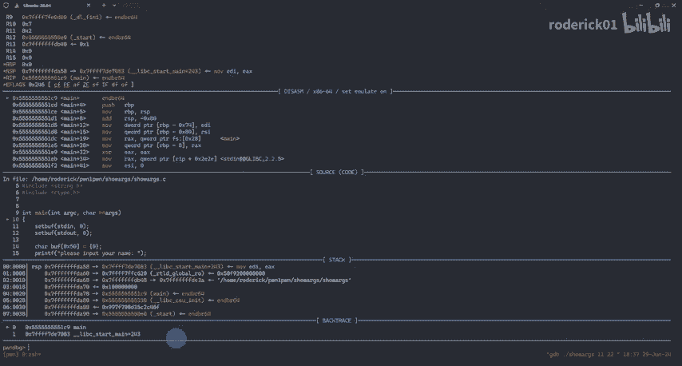

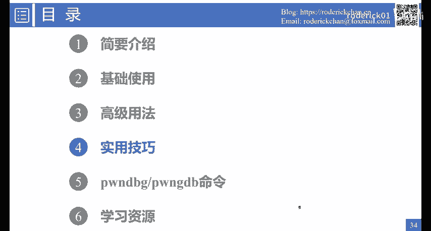

以下是多个能提升调试效率的高级命令：

*   **`display`**：每次程序暂停时自动打印指定表达式或寄存器的值。例如，`display /x $rax`。使用 `undisplay <编号>` 取消。
*   **`dprintf`**：动态打印。允许在不修改源码的情况下，在程序执行时插入打印点。例如，`dprintf printf, “\n[DEBUG] printf called\n”`。它不会修改二进制文件，无需重新编译。
*   **`set`**：修改变量、内存或寄存器的值。
    *   设置内存：`set {int}0x7fffffffe3a0 = 0xdeadbeef`
    *   设置寄存器：`set $rax = 0`
    *   跳转执行：`set $pc = 0x4005a0`
*   **`checkpoint`**：检查点（快照）功能。
    *   `checkpoint`：在当前执行点创建快照。
    *   `info checkpoints`：查看所有快照。
    *   `restart <快照ID>`：恢复到指定快照。
    *   `delete checkpoint <快照ID>`：删除快照。

**命令演示摘要**：
*   `display /x $rax` 后，每次单步执行都会显示RAX寄存器的值。
*   `dprintf printf, “\nEnd of printf\n”` 会在每次 `printf` 调用后打印提示信息。
*   `set {short*}0x7fffffffe3a0 = 0xdead` 修改指定地址的两个字节。
*   使用 `checkpoint` 创建快照，执行若干步后，用 `restart 1` 可以回退到快照点，非常适合反复测试某段代码。

## 实用调试技巧

前面我们介绍了基本命令和一些高级的调试命令。但是GDB还有很多有趣的功能等着我们去探索。在这一章中，我会介绍一些常用的使用技巧。

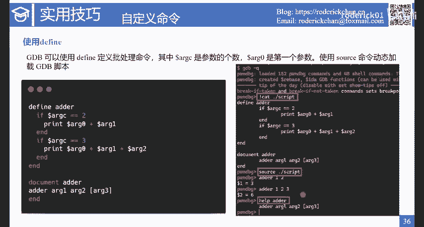

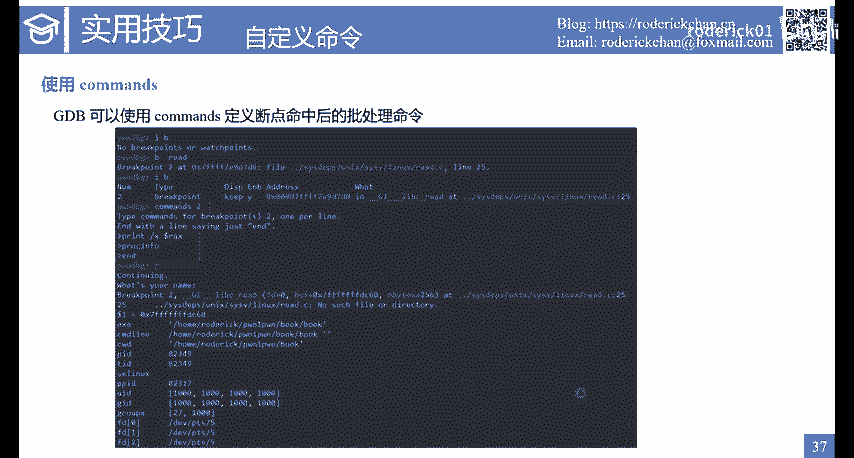

### 分离输入输出

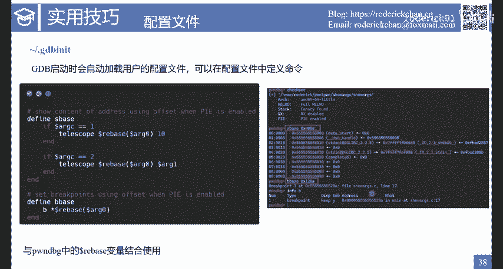

默认情况下，GDB和程序的输入输出共享同一个终端。可以使用 `-tty` 选项或 `tty` 命令将它们分离。
```
gdb -tty /dev/pts/5 ./program
```
或在GDB中：
```
tty /dev/pts/5
```
这常用于调试像 `qemu` 这样具有交互界面的程序，可以防止按 `Ctrl+C` 时直接退出 `qemu` 而非进入GDB。

### 自定义命令与脚本

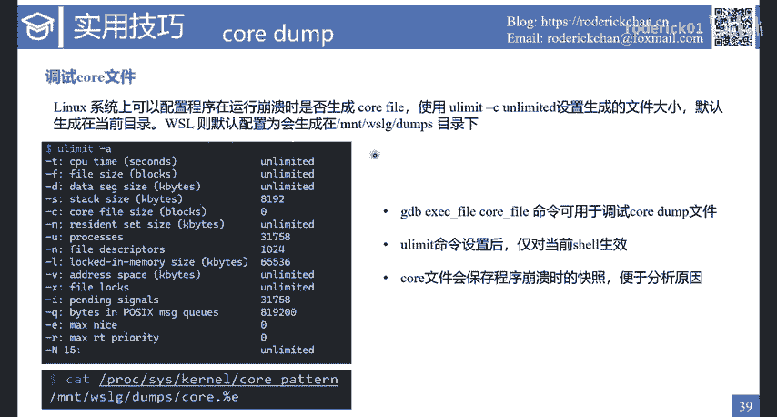

GDB支持使用 `define` 定义批处理命令，类似于编写脚本。
```
define adder
    print $arg0 + $arg1
end
document adder
    Usage: adder <num1> <num2>
end
```
其中 `$argc` 是参数个数，`$arg0`, `$arg1`... 是具体参数。使用 `document` 可以为自定义命令添加帮助说明。

可以将命令定义写入 `~/.gdbinit` 文件，GDB启动时会自动加载。也可以使用 `source <脚本文件>` 命令动态加载。

一个实用的自定义命令例子（用于PIE程序）：
```
define bbase
    break *($base + $arg0)
end
define showbase
    x/gx $base + $arg0
end
```
这里 `$base` 是程序加载的基地址（在 `pwndbg` 等插件中可用）。`bbase 0x4000` 就可以在相对地址 `0x4000` 处下断点。

与 `define` 类似的还有 `commands`，用于定义断点命中后自动执行的一系列命令。
```
commands <断点ID>
    print $rax
    info proc
end
```

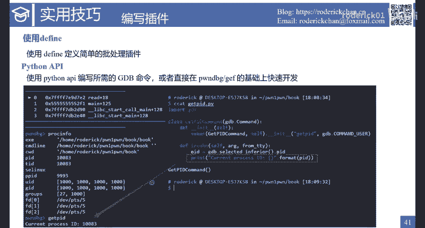

### 调试Core Dump文件

Core Dump是程序崩溃时的内存快照。首先确保系统允许生成Core文件：
```
ulimit -c unlimited
```
在WSL中，Core文件默认生成在 `/mnt/wslg/dumps/` 目录。使用GDB调试Core文件：
```
gdb ./program core
```
加载后，使用 `bt` 命令查看崩溃时的调用栈，可以快速定位问题。例如，栈溢出时可以看到栈帧被特定字符（如 `0x61616161`，即 ‘aaaa’）覆盖。

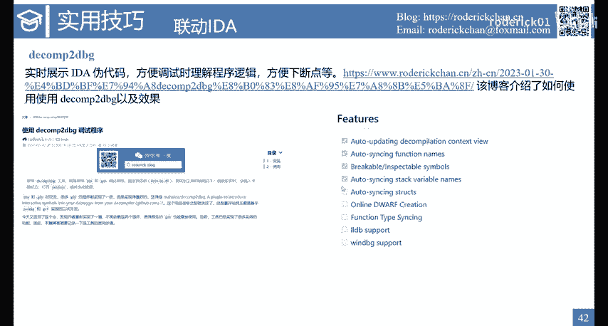

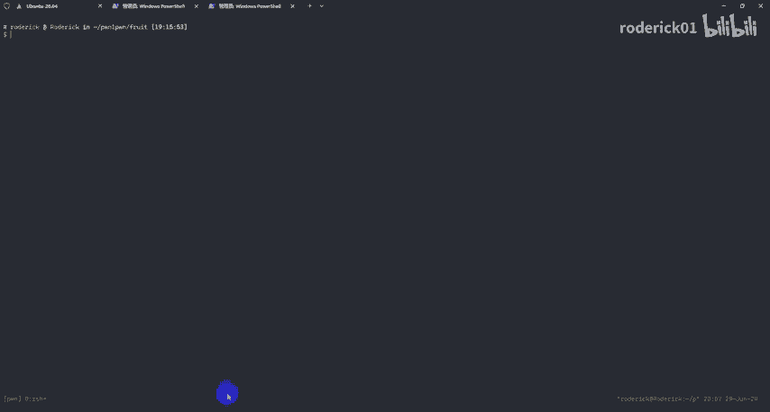

### Python扩展与插件

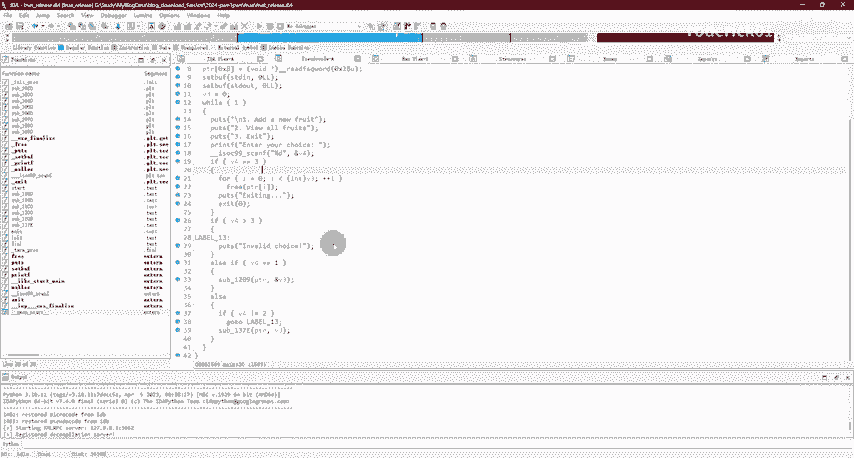

GDB提供了Python API，可以编写功能强大的扩展插件。编写一个简单命令的步骤如下：
1.  导入 `gdb` 模块。
2.  定义一个继承自 `gdb.Command` 的类。
3.  在 `invoke` 方法中实现命令逻辑。
4.  实例化这个类。

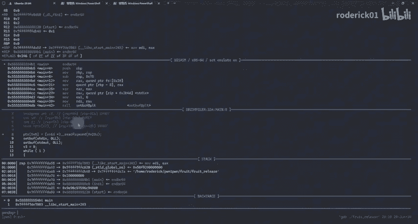

例如，一个获取当前进程ID的命令：
```python
import gdb
class GetPIDCommand(gdb.Command):
    def __init__(self):
        super().__init__("getpid", gdb.COMMAND_USER)
    def invoke(self, arg, from_tty):
        pid = gdb.selected_inferior().pid
        print(f"Process PID: {pid}")
GetPIDCommand()
```
保存为 `getpid.py`，在GDB中用 `source getpid.py` 加载，即可使用 `getpid` 命令。

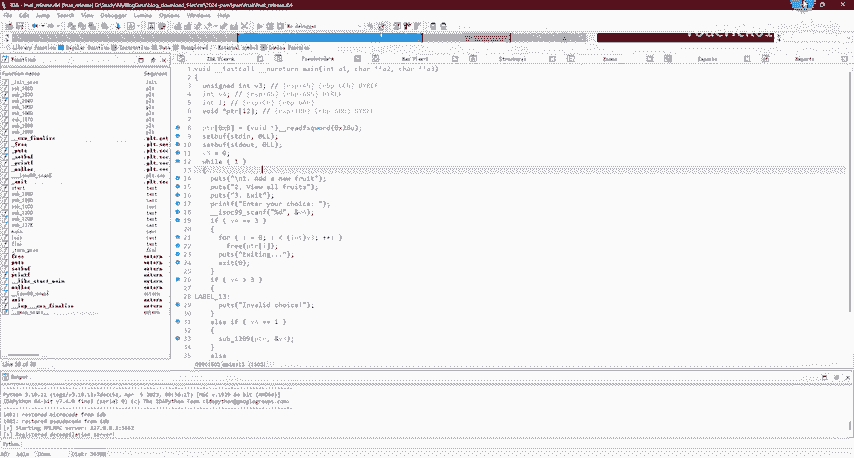

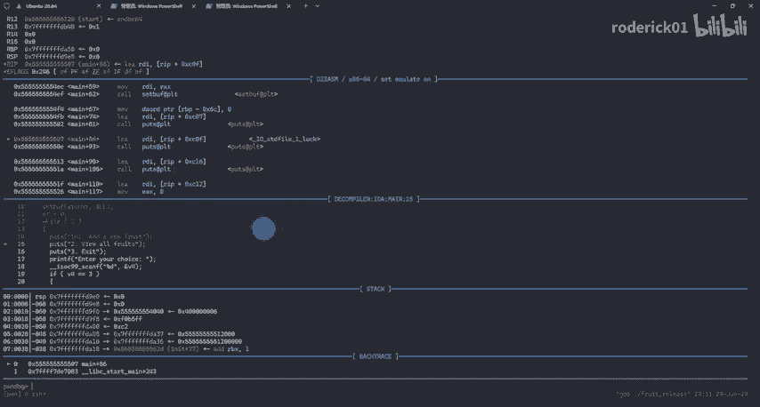

基于此，社区开发了如 `pwndbg`、`gef` 等优秀插件，封装了大量实用命令和API。还有像 `decomp2gdb` 这样的插件，能将IDA的反汇编结果实时同步到GDB界面，极大提升逆向调试效率。

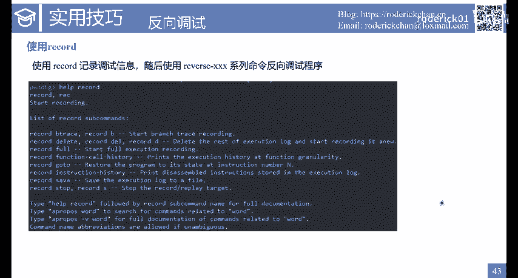

### 反向调试

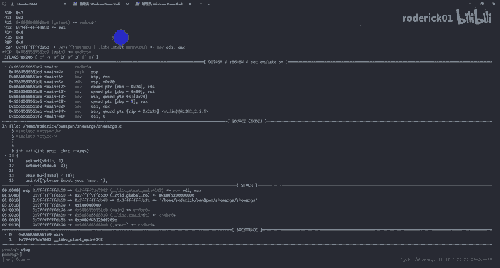

GDB支持反向调试，允许程序“倒着走”。核心命令是 `record`。
```
record full
```
执行此命令后，GDB会开始记录每一步的调试状态。之后可以使用 `reverse-stepi`（缩写 `rsi`）或 `reverse-continue`（缩写 `rc`）等命令让程序反向执行。这提供了比 `checkpoint` 更细粒度的回退功能，非常适合定位难以复现的Bug。

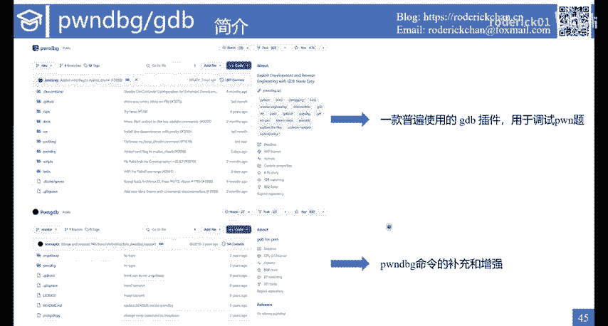

## 高效插件：Pwndbg 与 Pwngdb

本节将介绍 `pwndbg` 和 `pwngdb` 这两个极受欢迎的GDB插件。`pwndbg` 专注于二进制漏洞利用调试，而 `pwngdb` 是其命令的补充和增强，特别是堆、IO_FILE相关的命令。

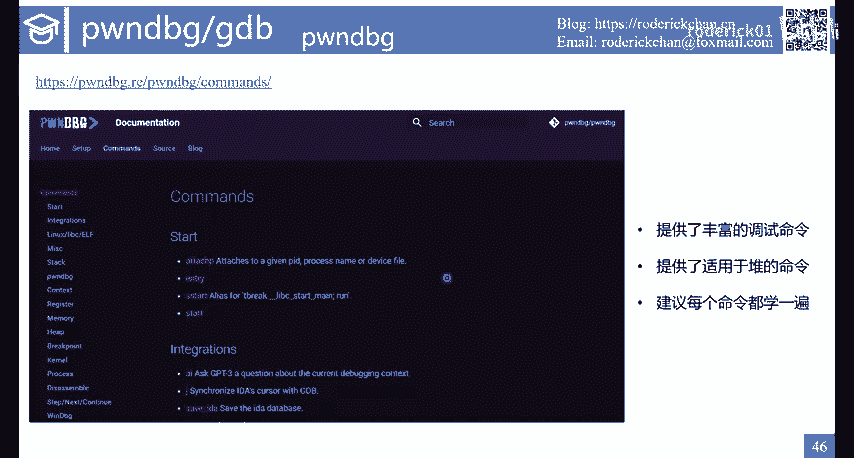

建议阅读 `pwndbg` 的官方文档，系统地学习每个命令。以下是一些代表性命令的简介：

*   **`entry`**：启动程序并停在用户程序的入口点（`_start`），而非动态链接器的起点。
*   **`rop`**：使用 `ROPgadget` 工具搜索gadget。例如 `rop “pop rdi”`。
*   **`got`**：查看程序的GOT表。`got -a` 显示所有GOT条目（包括libc等）。
*   **`sigreturn`**：辅助SROP利用，检查伪造的 `sigcontext` 结构体是否正确。
*   **`stack`**：以更清晰的格式打印栈内存。例如 `stack 20` 打印20个条目。
*   **`context watch`**：在GDB界面中添加一个窗口，持续监视指定表达式（如 `$rax+$rbx`）的值。
*   **`p2p`**：用于地址泄露。例如 `p2p stack` 查找栈上指向libc的指针；`p2p libc stack` 查找libc中指向栈的指针。
*   **`mp_`**：打印堆管理器的 `mp_` 结构体信息，对于堆利用很有帮助。

`pwngdb` 提供了一些进阶命令，但部分功能已被 `pwndbg` 集成，可按需安装使用。

## 学习资源

要精通GDB，理论结合实践至关重要。以下推荐两份核心资源：

1.  **《100个GDB小技巧》**：一份总结了GDB常用操作和技巧的简明文档，非常适合快速查阅和入门。
2.  **官方手册《Debugging with GDB》**：超过900页的完整指南，涵盖了GDB的所有原理和命令，是深入学习的权威资料。可以在GNU官网找到在线版或下载PDF。

学习命令行工具的关键在于“熟能生巧”。掌握几十个常用命令，在遇到复杂需求时知道如何查阅文档或利用社区资源（如ChatGPT），就能应对绝大多数调试场景。

## 总结

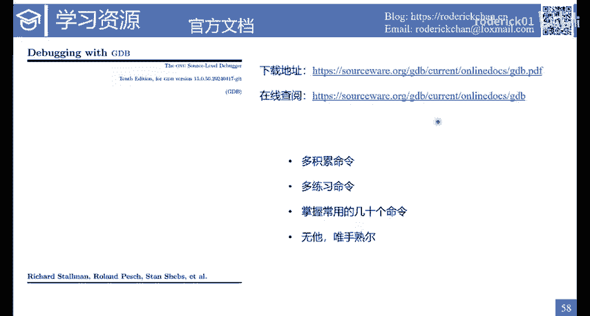

本节课中我们一起学习了GDB的高级调试功能，包括多进程、多线程调试，信号处理，内存/寄存器修改，以及反向调试。我们还探索了分离IO、自定义脚本、调试Core文件、使用Python扩展和 `pwndbg` 插件等实用技巧，并介绍了相关的学习资源。熟练运用这些工具和技巧，将极大地提升你在二进制安全分析和漏洞利用中的调试效率。