# Linux渗透测试基础：01：文件管理与查找命令实战

在本节课中，我们将学习如何解决一个在渗透测试或日常运维中可能遇到的常见问题：因误操作导致大量文件解压到错误目录后，如何高效地清理这些文件。我们将重点掌握 `find` 命令的进阶用法，特别是基于时间属性查找文件，并结合 `-exec` 参数执行删除操作。同时，我们也会回顾正确的文件解压方法。

## 概述：问题场景与解决思路

在操作一个名为“备份.rar”的压缩文件时，如果使用了不恰当的 `unrar` 命令参数（例如 `unrar e`），会导致压缩包内的所有文件被直接解压到当前目录，与现有文件混杂在一起，造成管理混乱。

观察发现，误解压出来的文件其修改时间（例如2013年）远早于我们当前系统上的其他文件。因此，一个高效的清理思路是：**利用 `find` 命令，根据文件的修改时间筛选出这些老旧文件，然后批量删除**。

## 核心步骤详解

### 第一步：识别问题与准备环境

首先，我们遇到了文件解压混乱的问题。错误地使用 `unrar e 备份.rar` 命令后，所有文件都被释放到了当前目录下。

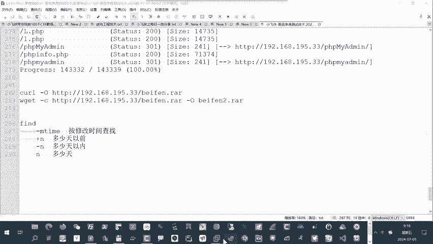

为了模拟这个场景并进行清理，我们需要先找到这些时间戳异常的文件。可以使用 `ls -l` 命令查看文件的详细属性，确认它们的修改日期。

### 第二步：掌握 `find` 命令的时间查找功能

`find` 命令的 `-mtime` 选项可以根据文件的修改时间进行查找。其参数格式和含义如下：

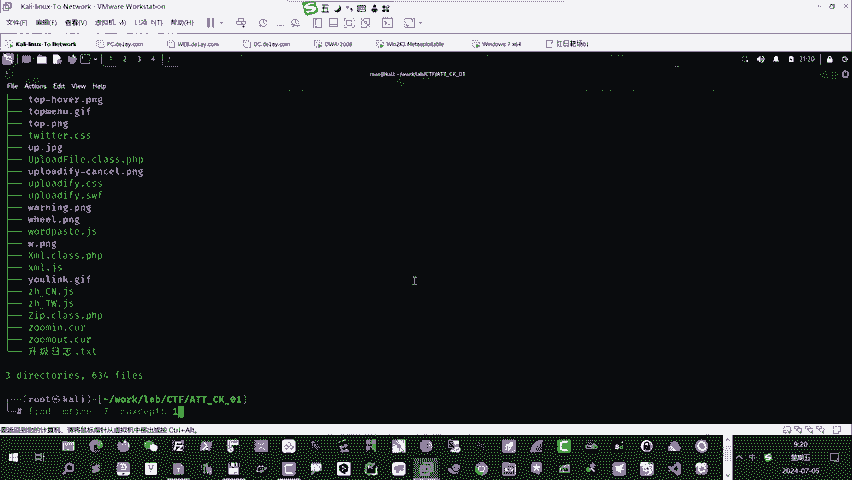

*   **`-mtime +n`**: 查找在 **n * 24小时以前** 被修改过的文件。
*   **`-mtime -n`**: 查找在 **n * 24小时以内** 被修改过的文件。
*   **`-mtime n`**: 查找在正好 **n * 24小时** 前被修改过的文件。

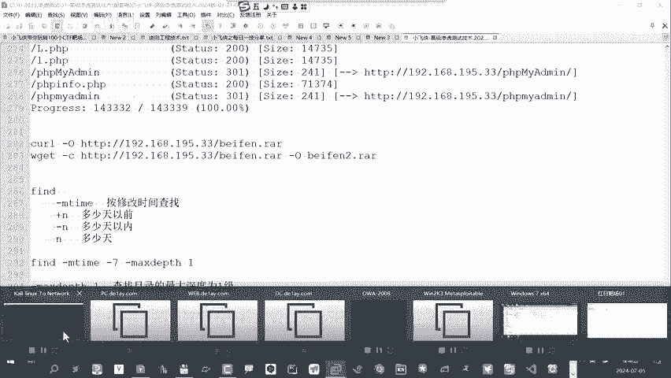

例如，假设误解压的文件都是7天前的，我们可以使用 `find . -mtime +7` 来查找。

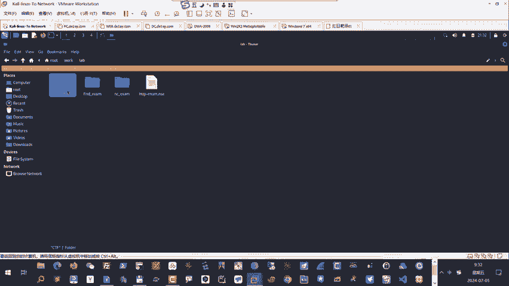

### 第三步：控制查找深度

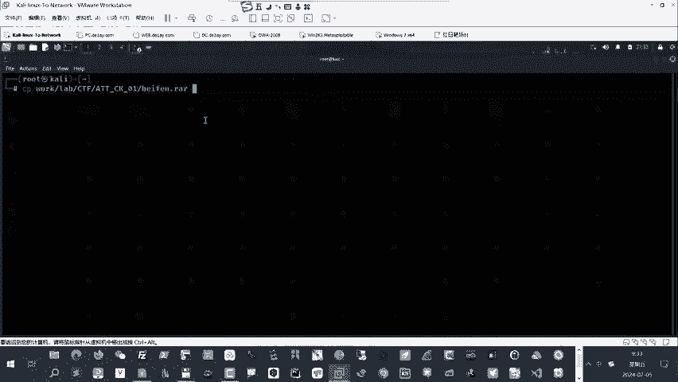

默认情况下，`find` 命令会递归查找所有子目录。如果只想在当前目录（一级目录）下查找，可以使用 `-maxdepth` 选项来限制搜索深度。

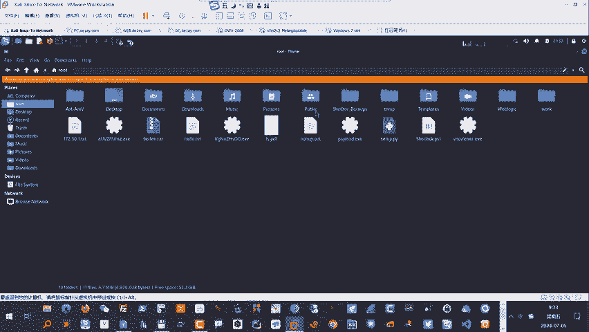

**命令示例**:
```bash
find . -maxdepth 1 -mtime +7
```
这条命令表示：在当前目录（`.`）下，最大搜索深度为1（即不进入子目录），查找修改时间在7天以前的文件。

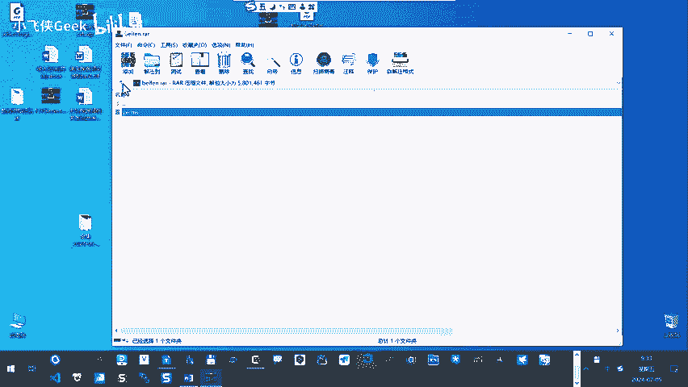

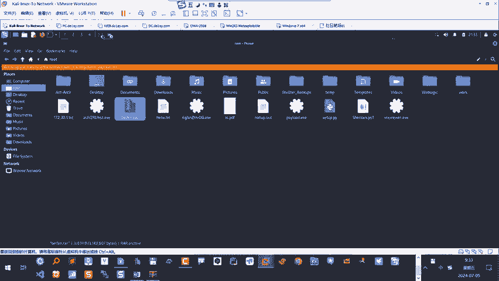

如果不加 `-maxdepth 1`，`find` 会列出当前目录及所有子目录中符合条件的结果，这可能不是我们想要的效果。

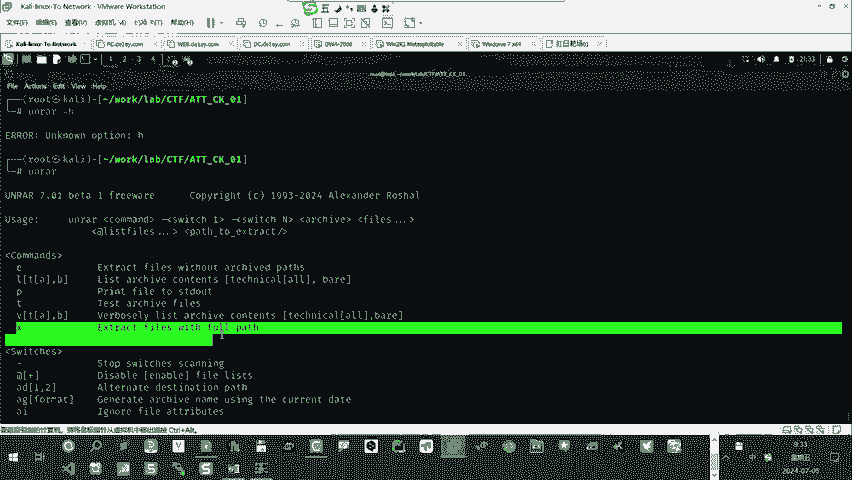

### 第四步：组合查找与删除操作

找到目标文件后，我们可以使用 `-exec` 参数来对每一个找到的文件执行指定的命令。

以下是删除操作的核心命令组合：
```bash
find . -maxdepth 1 -mtime +7 -exec rm -f {} \;
```
*   `find . -maxdepth 1 -mtime +7`: 查找当前目录下7天前的文件。
*   `-exec rm -f {} \;`: 对每个找到的文件执行 `rm -f`（强制删除）命令。`{}` 是一个占位符，代表 `find` 找到的每个文件名。

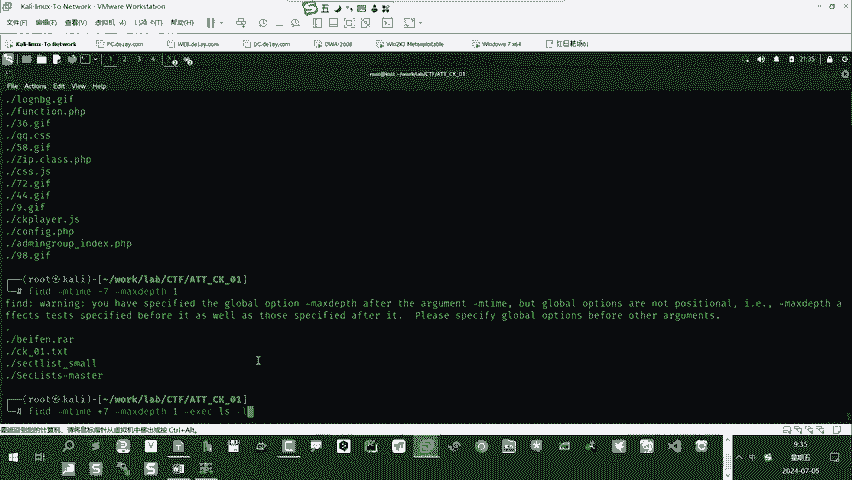

**安全提示**：在执行删除命令前，强烈建议先用 `-exec ls -l {} \;` 预览一下找到的文件列表，确认无误后再替换为 `rm` 命令。

### 第五步：学习正确的解压方法

为了避免未来再次出现此类问题，我们需要知道如何正确地解压保留目录结构的压缩包。

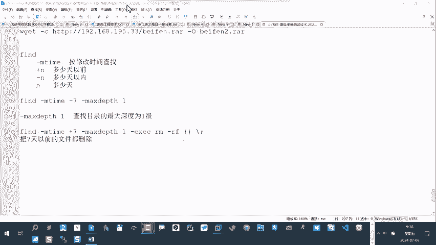

对于 `unrar` 工具，应该使用 `x` 命令而非 `e` 命令：
```bash
unrar x 备份.rar
```
*   `x` 命令：解压文件并**保持压缩包内的目录结构**。
*   `e` 命令：解压文件到**当前目录**，忽略内部目录结构。

使用 `x` 命令后，文件会被解压到一个与压缩包同名的目录中，管理起来更加清晰。

## 总结

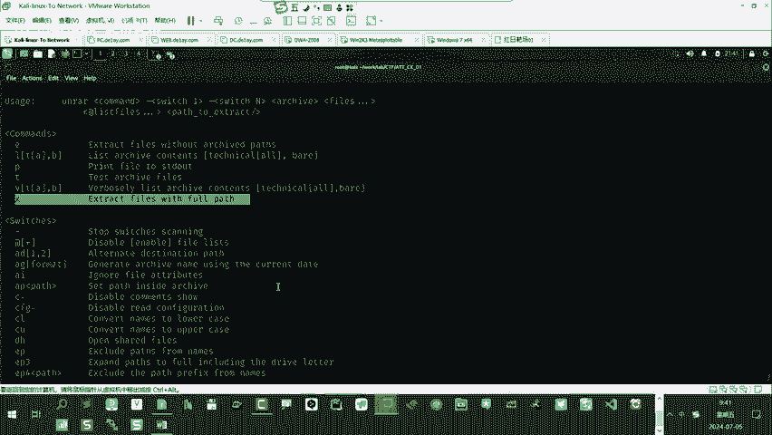

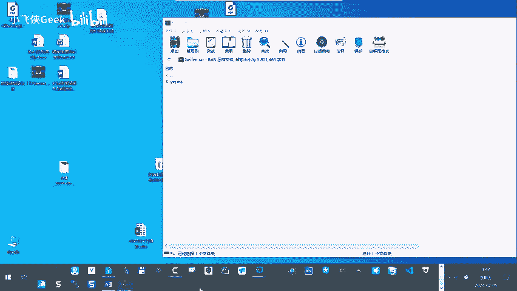

本节课我们一起学习了如何利用 `find` 命令解决因误操作导致的文件清理难题。核心要点包括：

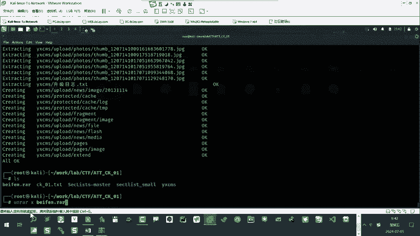

1.  **问题定位**：通过文件时间属性差异（如 `ls -l`）来区分需要清理的目标。
2.  **时间查找**：使用 `find -mtime` 基于修改时间筛选文件，理解 `+n`、`-n` 和 `n` 的区别。
3.  **深度控制**：使用 `-maxdepth` 选项限制 `find` 命令的搜索范围，避免不必要的递归。
4.  **批量操作**：结合 `-exec` 参数，对查找结果执行如 `rm` 之类的批量命令。
5.  **正确解压**：掌握 `unrar x` 与 `unrar e` 的区别，始终使用 `x` 命令来保持压缩包的目录结构。

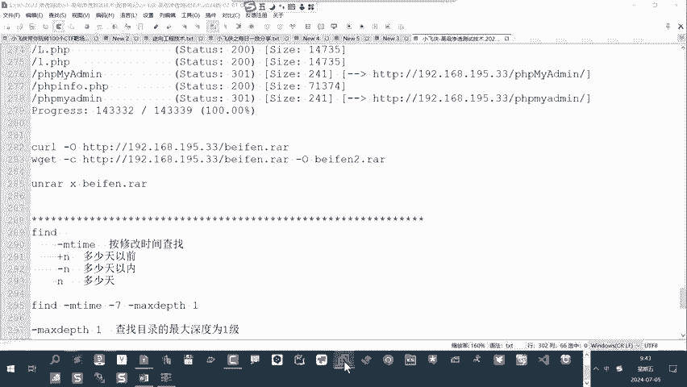

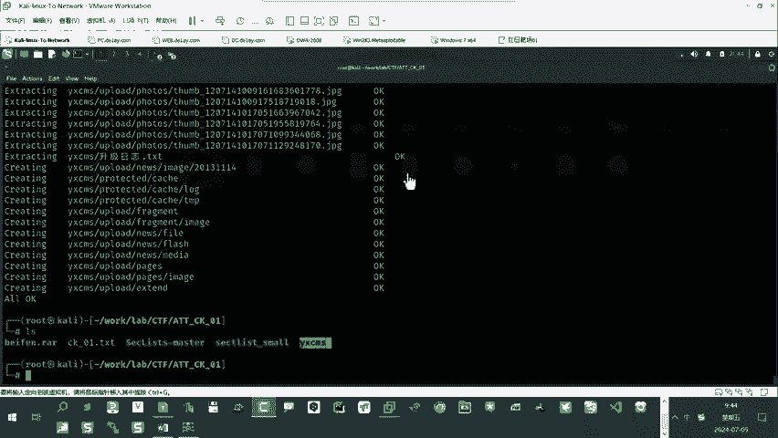

通过这个案例，你将 `find` 命令从一个简单的查找工具，升级为了一个能够基于复杂条件（如时间、深度）进行自动化文件管理的有力武器，这在后续的渗透测试环境搭建、日志清理等场景中都非常实用。