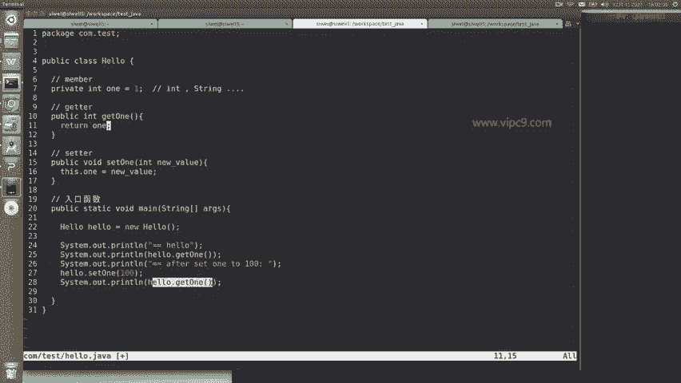
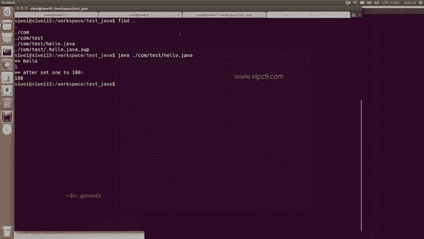
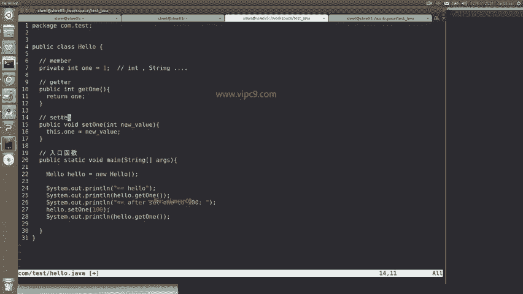

# Android逆向-基础篇：P10：章节3-3：Java语法-Class、Method与Member 🧩

在本节课中，我们将学习Java类、方法及成员变量的基本概念。通过分析一个简单的代码示例，我们将理解如何定义类、声明成员变量、编写方法（包括getter和setter），以及如何创建类的实例并调用其方法。

---

下面我们看一下红框中的内容。红框当中，`one`是一个成员变量，这个成员变量是属于`Hello`类的。可以看到，`class`从第6行的大括号开始，到第31行的大括号为止，这里面都是属于`Hello`这个类的。

在`Hello`类中，第7行声明了一个成员变量。它之所以是一个变量，是因为可以通过等号来赋值。这个变量的类型是`int`，`int`是`integer`的缩写，是一个基本类型。在Java中，类型分为`int`、`String`等，这些都是基本类型。

接下来，我们看看类中的方法。以下是两个方法：`getOne`和`setOne`。

*   `getOne`：这是一个getter方法，用于获取`one`变量的值。它不需要任何参数，因此括号内为空。
*   `setOne`：这是一个setter方法，用于设置`one`变量的值。它需要一个参数`newValue`，其类型为`int`，与成员变量`one`的类型一致。方法体中的`this.one = newValue;`语句，使用`this`关键字指向当前`Hello`类的实例，并将参数值赋给成员变量`one`。

下面这个`main`函数是一个特殊的入口函数。当我们通过`java`命令运行程序时，会首先从这个入口函数开始执行。

在`main`函数中，第22行首先声明了`Hello`类的一个实例。记住，`new Hello()`会创建一个实例。然后，代码先打印出`hello`，接着打印调用`getOne`方法得到的结果（初始值应为1），之后调用`setOne`方法将`one`的值设置为100，并再次打印`getOne`的结果。

我们来看一下运行结果。



在这里，我们使用`java`命令运行程序。

```
java Hello
```

可以看到，输出结果一开始是1，之后变成了100。




以上就是一个最简单的关于类、成员和方法的示例。下一节中，我们将学习`if`条件判断和循环语句。




---


本节课中，我们一起学习了Java中类、成员变量和方法的基本结构。我们了解了如何定义一个类，如何在类中声明`int`类型的成员变量，以及如何编写`getter`和`setter`方法来访问和修改这个变量。最后，我们通过`main`入口函数创建了类的实例，并演示了方法的调用过程，看到了成员变量值的变化。