# Android逆向-基础篇：P11：3-4-Java语法-循环和条件判断 🔄

在本节课中，我们将要学习Java编程语言中的两个核心控制结构：循环和条件判断。理解这些概念对于分析Android应用的逻辑流程至关重要。

## 概述 📋

循环用于重复执行一段代码，而条件判断则用于根据不同的条件执行不同的代码分支。它们是构建程序逻辑的基础。

## 循环结构

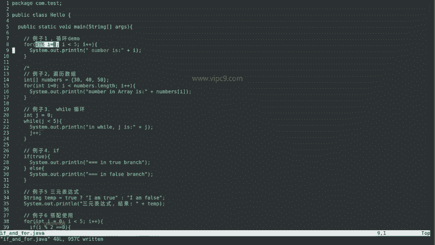

上一节我们介绍了变量和数据类型，本节中我们来看看如何使用循环来高效地处理重复性任务。

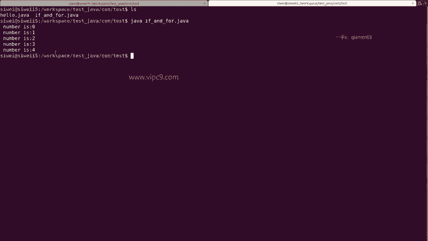

### For循环

以下是一个基本的`for`循环示例。它包含三个部分：初始化、条件判断和迭代。

```java
for (int i = 0; i < 5; i++) {
    System.out.println(i);
}
```
*   **初始化 (`int i = 0`)**: 在循环开始时执行一次，声明并初始化循环变量。
*   **条件判断 (`i < 5`)**: 在每次循环迭代前进行判断。如果结果为`true`，则执行循环体内的代码。
*   **迭代 (`i++`)**: 在每次循环体执行完毕后执行，通常用于更新循环变量。

运行上述代码，控制台会依次打印数字0到4。

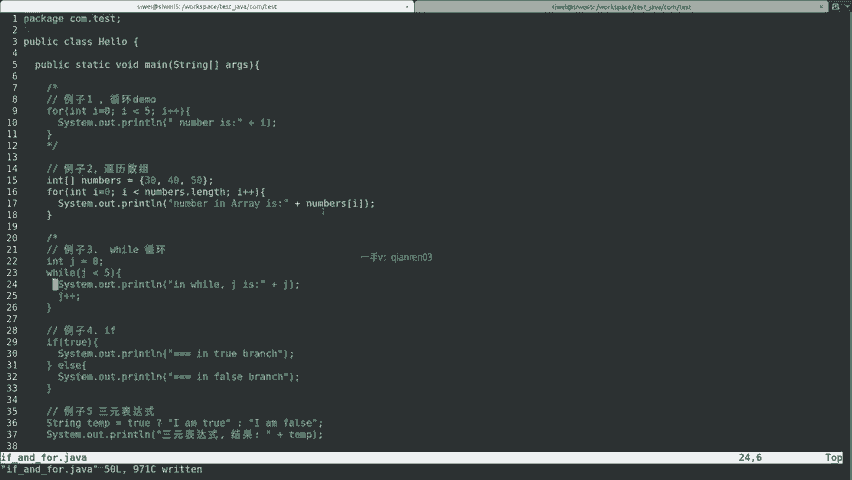

---

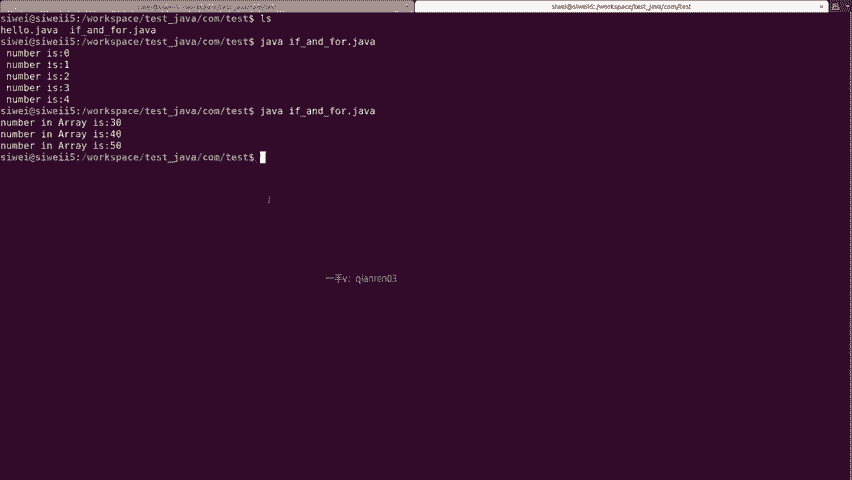

### 使用For循环遍历数组

循环常用于遍历数组等集合。以下是遍历数组的示例：

```java
int[] numbers = {30, 40, 50};
for (int i = 0; i < numbers.length; i++) {
    System.out.println(numbers[i]);
}
```
代码中，`numbers[i]`表示访问数组`numbers`的第`i`个元素。循环会依次打印出数组中的所有元素：30, 40, 50。

---

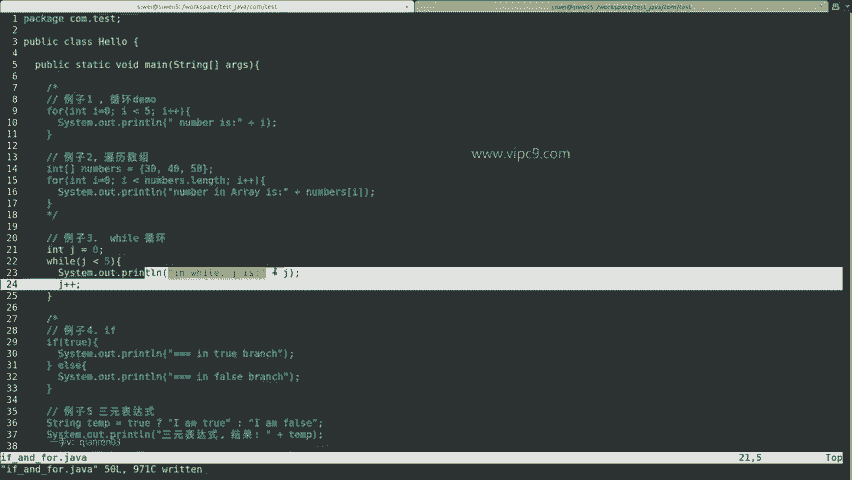

### While循环

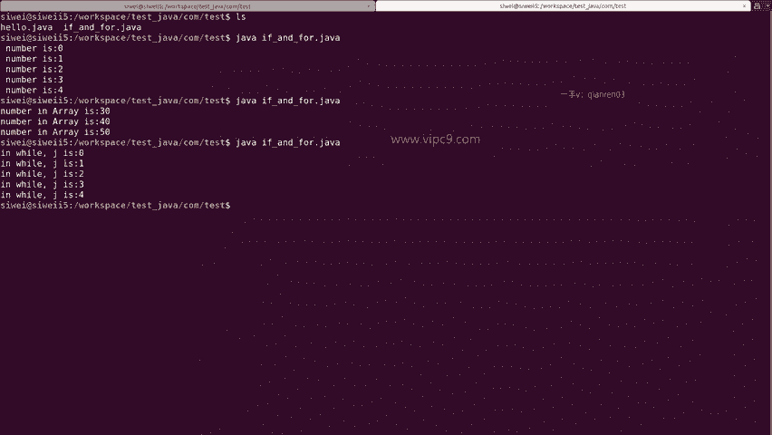

`while`循环是另一种循环结构，其功能与`for`循环等价。

```java
int j = 0;
while (j < 5) {
    System.out.println(j);
    j++;
}
```
*   **初始化 (`int j = 0`)**: 在循环开始前定义并初始化变量。
*   **条件判断 (`j < 5`)**: 在每次循环迭代前检查条件，若为`true`则执行循环体。
*   **迭代 (`j++`)**: 在循环体内部手动更新变量。

运行此代码，同样会打印数字0到4。`while`循环可以看作是`for`循环的另一种写法，将初始化、条件和迭代步骤分开。

## 条件判断结构

掌握了循环之后，我们来看看如何让程序根据不同的条件做出决策。

### If-Else语句

`if-else`语句是最基本的条件判断结构。

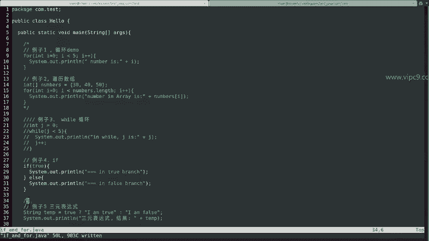

```java
if (true) {
    System.out.println("in true branch");
} else {
    System.out.println("in false branch");
}
```
*   `if`后面的括号内是判断条件。
*   如果条件为`true`，则执行紧随其后的代码块。
*   如果条件为`false`，则执行`else`后面的代码块。

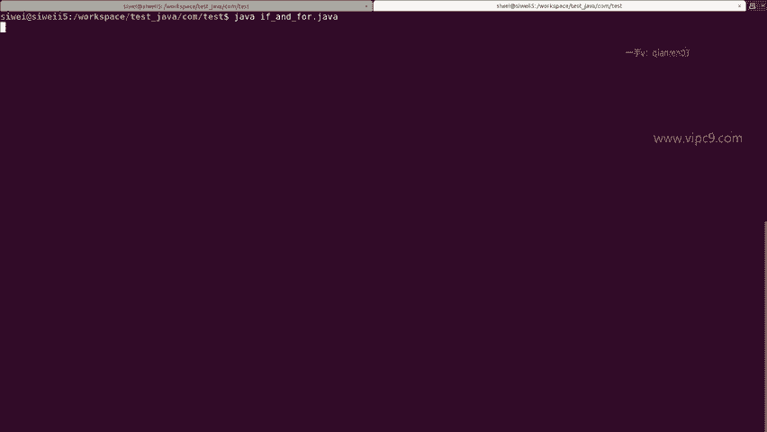

还可以使用`else if`来添加更多的分支条件。运行上面的例子，因为条件为`true`，所以会输出“in true branch”。

---

### 三元表达式

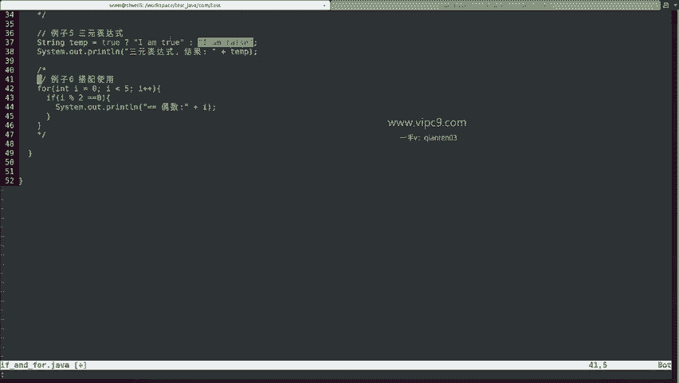

三元表达式是一种简洁的条件赋值方式。

```java
String result = true ? "ternary expression is true" : "ternary expression is false";
System.out.println(result);
```
其语法为：`条件 ? 表达式1 : 表达式2`。
*   如果`条件`为`true`，则整个表达式的结果为`表达式1`。
*   如果`条件`为`false`，则结果为`表达式2`。

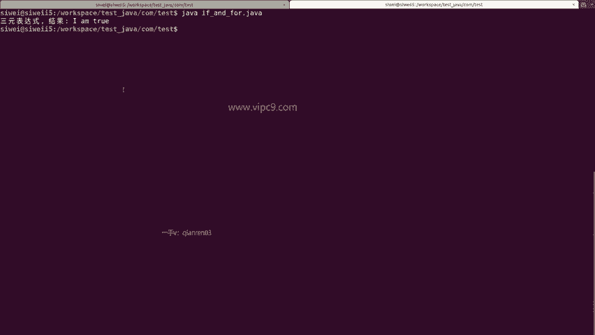

上面的代码会输出“ternary expression is true”。

## 循环与条件判断的结合使用

在实际编程中，循环和条件判断经常结合使用。以下是一个示例，在循环中判断数字的奇偶性：

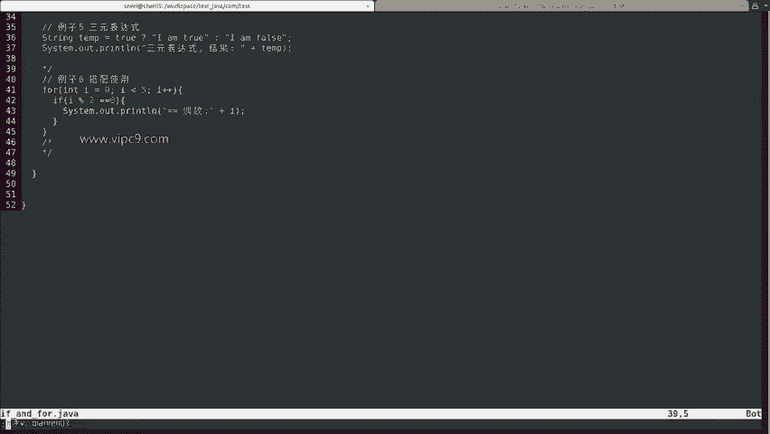

```java
for (int i = 0; i < 5; i++) {
    if (i % 2 == 0) {
        System.out.println(i + " is even");
    }
}
```
这段代码会遍历0到4的数字，并使用`if`语句判断`i % 2 == 0`（即`i`除以2的余数是否为0）。如果条件成立，说明是偶数，则将其打印出来。运行后会输出：0, 2, 4。

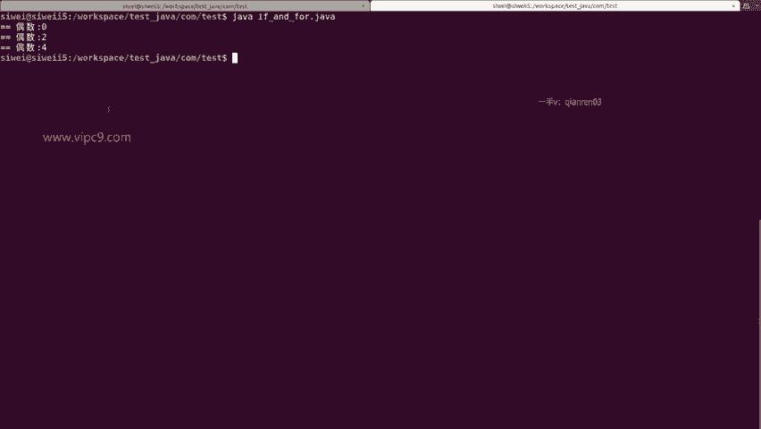

## 总结 🎯

本节课中我们一起学习了Java的循环和条件判断。
*   **循环**：我们介绍了`for`循环和`while`循环，它们用于重复执行代码块，例如遍历数组。
*   **条件判断**：我们学习了`if-else`语句和三元表达式，它们让程序能够根据不同的条件执行不同的逻辑路径。
*   **结合使用**：通过一个例子，我们看到了如何将循环和条件判断嵌套使用，以实现更复杂的逻辑控制。

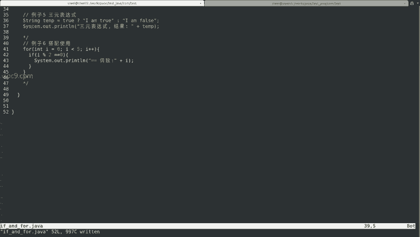

理解这些基础控制结构是进行Android逆向分析的关键一步，因为它们构成了应用程序逻辑的骨架。