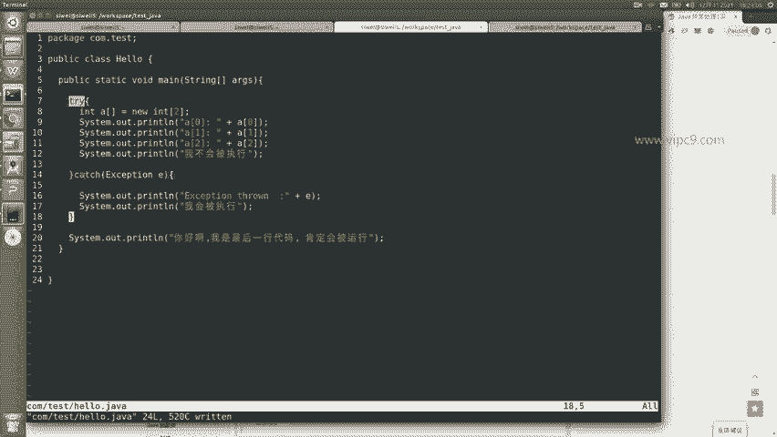
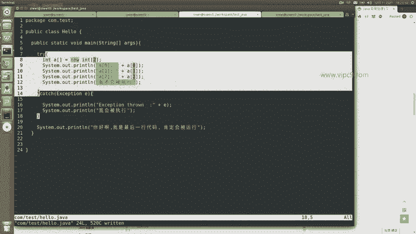
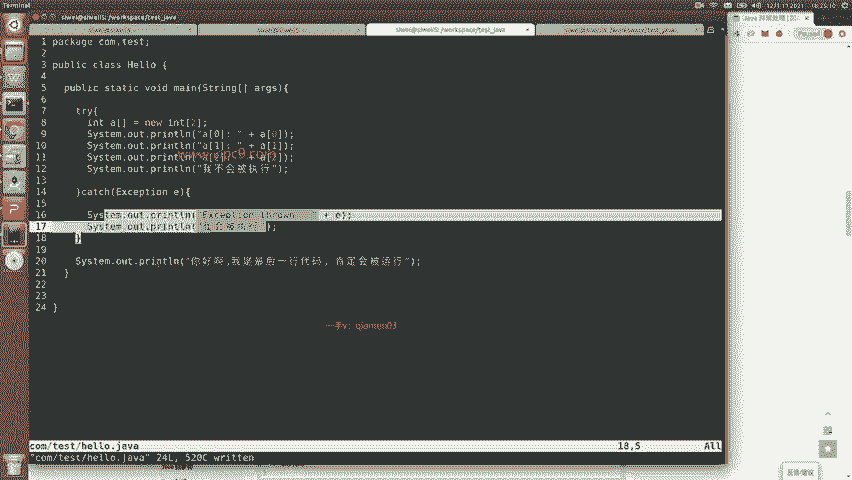
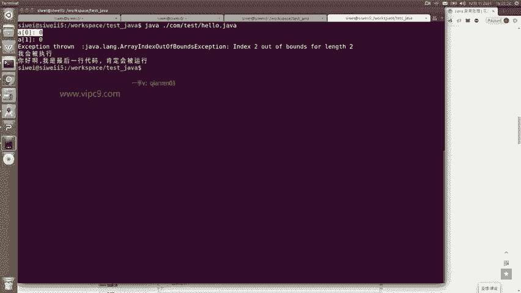
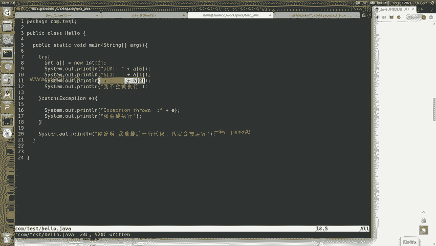
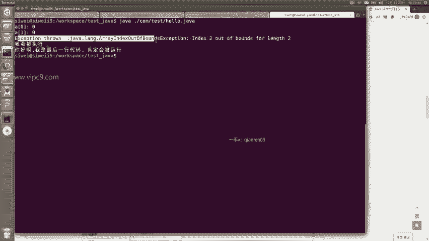
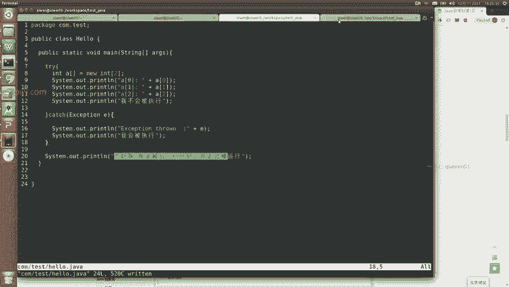
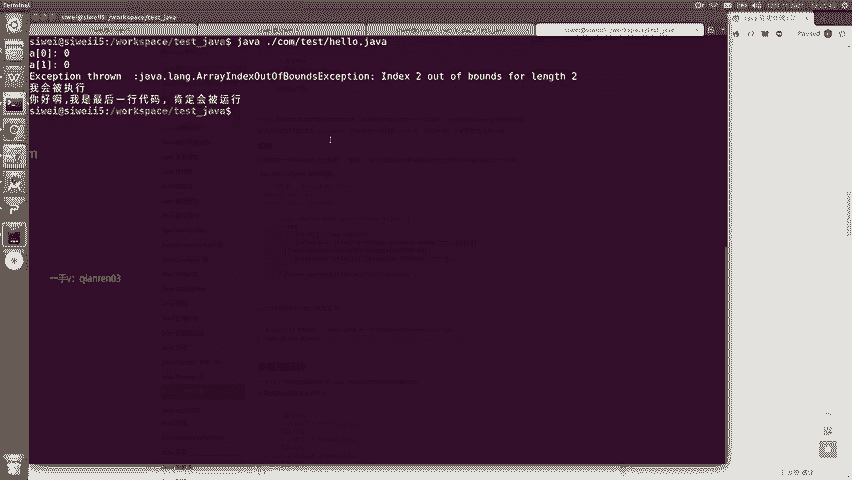

# Android逆向-基础篇：P12：3-5-Java语法try-catch 🛡️

在本节课中，我们将要学习Java编程语言中的一个重要概念——异常处理，具体来说就是`try-catch`语句块。它的核心目的是让程序能够优雅地处理运行时可能发生的错误，而不是直接崩溃。这对于编写健壮的代码至关重要。



## 概述：什么是异常处理？

上一节我们介绍了Java的基本语法结构。本节中我们来看看如何处理程序运行中的意外情况。Java中的错误主要分为编译时错误和运行时异常。编译时错误在代码编译阶段就会被发现并阻止程序运行。而运行时异常则是在程序执行过程中才可能发生的错误，`try-catch`机制正是为了处理这类问题而设计的。

## `try-catch`的基本原理



`try-catch`语句块的结构如下：

```java
try {
    // 可能抛出异常的代码
} catch (ExceptionType e) {
    // 处理异常的代码
}
// 后续代码
```

其执行流程是：程序首先尝试执行`try`块中的语句。如果`try`块中的代码一切正常，执行完毕后会跳过`catch`块，直接继续执行后面的代码。然而，一旦`try`块中的代码发生了错误（即抛出了异常），程序的控制流会立即跳转到对应的`catch`块中执行异常处理代码。执行完`catch`块后，程序会继续执行`try-catch`结构之后的语句，从而保证了程序不会因为一个局部错误而完全中断。

## 代码示例与分析

为了更好地理解，让我们通过一个具体的例子来演示`try-catch`的工作过程。

以下是一个示例程序：



```java
public class TryCatchDemo {
    public static void main(String[] args) {
        int[] arr = new int[2]; // 声明一个长度为2的整数数组
        arr[0] = 90;
        arr[1] = 11;

        try {
            System.out.println("数组第0个元素: " + arr[0]); // 正常执行
            System.out.println("数组第1个元素: " + arr[1]); // 正常执行
            System.out.println("数组第2个元素: " + arr[2]); // 这里会抛出异常
            System.out.println("这行不会被执行"); // 此行代码不会执行
        } catch (ArrayIndexOutOfBoundsException e) {
            System.out.println("捕获到异常: " + e);
            System.out.println("你好啊，异常已被处理");
        }

        System.out.println("程序继续执行...");
    }
}
```



我们来逐步分析这段代码的执行逻辑：

1.  **初始化数组**：程序首先声明并初始化了一个长度为2的数组`arr`，并为其前两个元素赋值（90和11）。这里`arr[2]`是不存在的，因为数组索引从0开始，有效索引是0和1。
2.  **进入try块**：
    *   成功打印`arr[0]`和`arr[1]`的值。
    *   当尝试执行`System.out.println(“数组第2个元素: ” + arr[2]);`时，由于访问了不存在的数组索引`2`，程序会抛出一个`ArrayIndexOutOfBoundsException`（数组索引越界异常）。
3.  **异常捕获与处理**：异常抛出后，程序立即跳出`try`块，因此`System.out.println(“这行不会被执行”);`这行代码**永远不会被执行**。程序转而执行匹配的`catch`块，打印出异常信息和处理提示。
4.  **继续执行**：`catch`块执行完毕后，程序继续执行`try-catch`结构之后的语句，即打印“程序继续执行…”。



根据这个逻辑，该程序的输出结果将是：



```
数组第0个元素: 90
数组第1个元素: 11
捕获到异常: java.lang.ArrayIndexOutOfBoundsException: Index 2 out of bounds for length 2
你好啊，异常已被处理
程序继续执行...
```



可以看到，尽管程序中发生了错误，但通过`try-catch`机制，我们捕获并处理了这个异常，使得程序能够继续运行下去，而不是中途崩溃。

## 总结



本节课中我们一起学习了Java的`try-catch`异常处理机制。我们了解到它的核心作用是**捕获和处理运行时异常**，保证程序的健壮性。关键点在于：`try`块包含可能出错的代码，`catch`块用于捕获并处理特定类型的异常。当`try`块发生异常时，控制流会立即跳转到对应的`catch`块，`try`块中异常点之后的代码将被跳过。熟练掌握`try-catch`是编写可靠Java程序的基础。