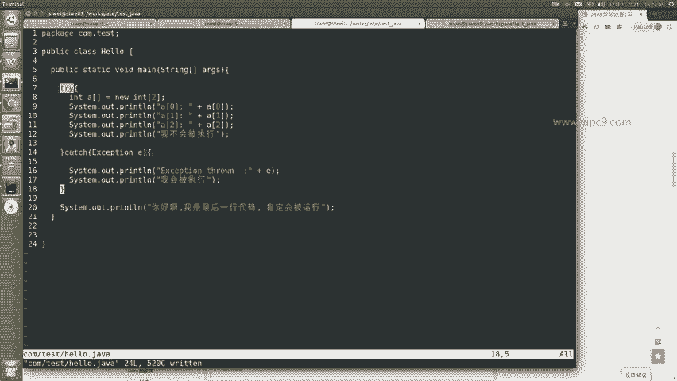
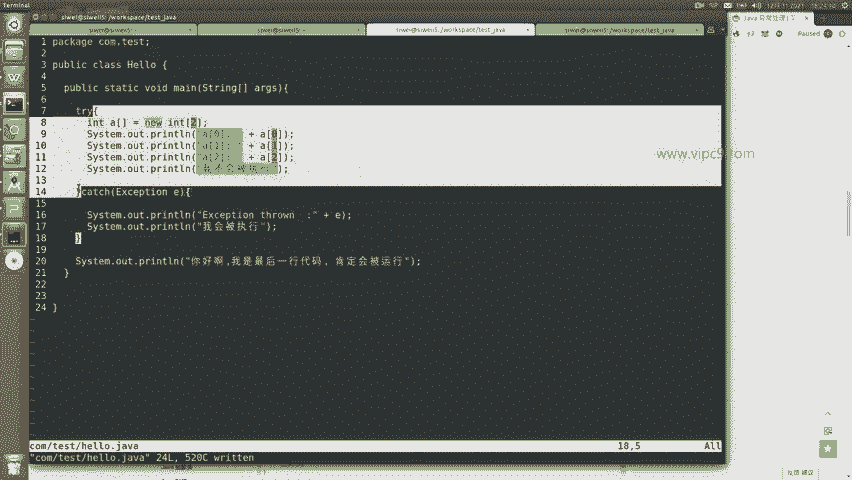
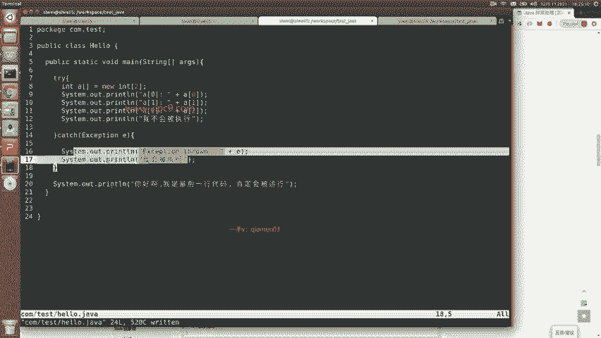
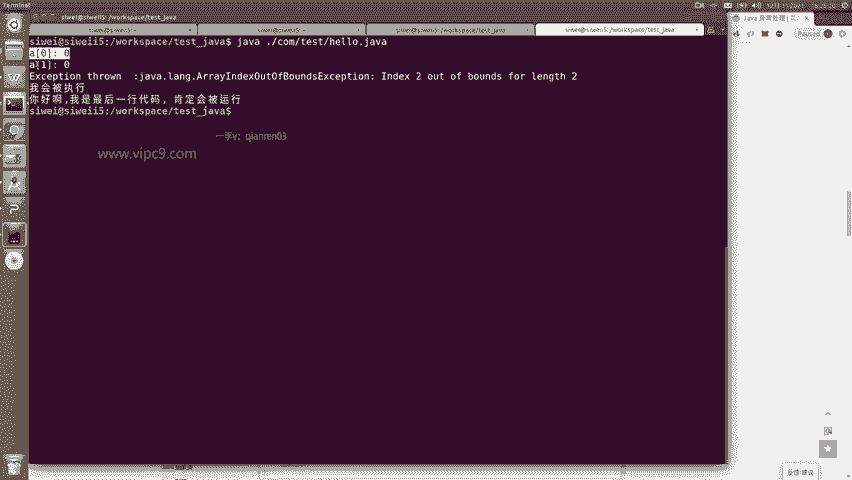
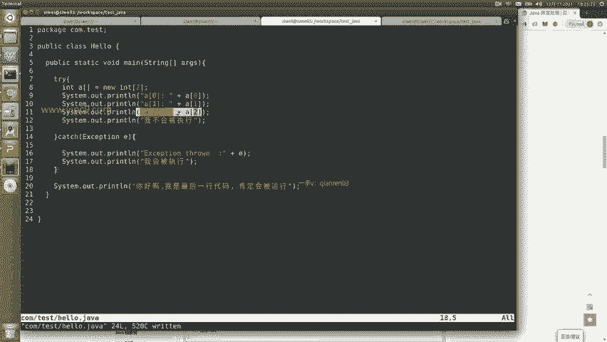
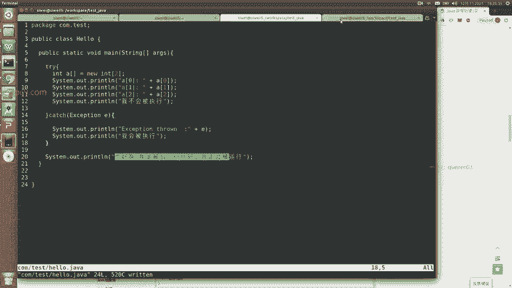
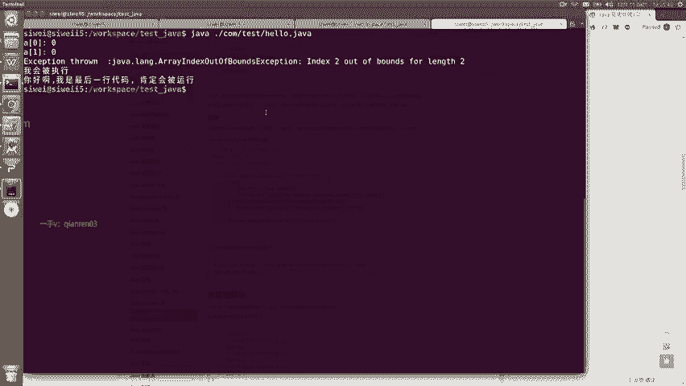

# Android逆向-基础篇 - P12：章节3-5-java语法try-catch - 1e0y_s - BV15jhbeCEQk

下面我们看这个例子是try catch。try catch它的目的是为了让java代码能够处理运行时产生的异常。那么java的这个异常基本都是运行时的。因为编译时的错误呢，在编译的时候就会被看到。

那么在这里我们看一下，就是try正常来说会运行try里面的语句。一旦try里面的语句发生了错误啊，就会被catch捕获。然后这个时候控制流就开始走catch这个代码段里面的这个内容之后呢，再运行后面的。

所以说第八行先声明了一个数组，那么这个数组很有意思，它的长度是只有二的。然后90和11。开始打印这个数组的内容。那么这里会涉及到一些类型转换，我们就不说了啊。这里java做了自动的类型转换啊。

int啊给它跟字符串放在一起打印出来。那么第零个数组啊可以打印，第一个数组可以打印。但是到了第二个这个数组的元素的时候就会发现这个数组我们声明的时候只声明的长度是二啊，那么到三的时候就会报错啊。

报错之后呢，正常来说，这一行就不会被执行。😊，然后呢，在这里被捕获，捕货之后再打印这两行，最后再打印这一行。所以说我们看一下。

嗯，可以看到先是打了第零个元素，然后打了第一个元素。

那么到这里的时候就报错了，所以说我不会被执行。这里我们没有看到。然后呢打印出的这个exception啊，这个exception是一个具体的内容。

然后后面我会被执行，你好啊，这些都执行了。

所以说呢这个就是java语法的try和cach。

