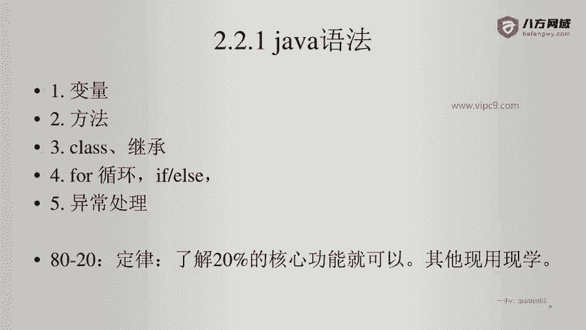
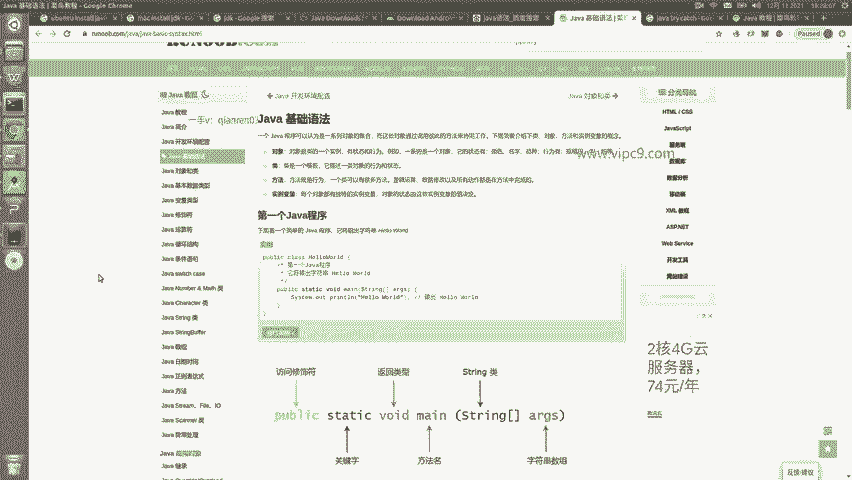
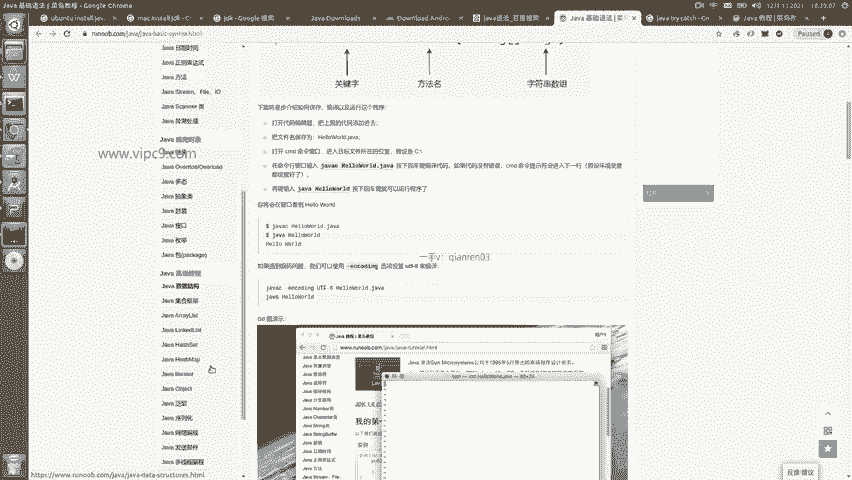
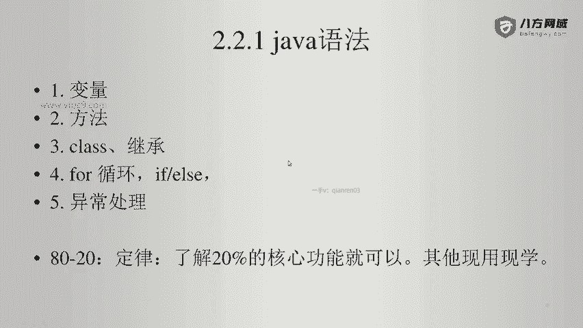

# Android逆向-基础篇：P13：章节3-6：Java语法总结 📚

在本节课中，我们将对之前学习的Java语法知识进行总结，并为你指明后续的学习方向。掌握这些核心内容，将帮助你顺利阅读和修改逆向工程中遇到的Java代码。

## 课程概述

本次Java语法急速入门课程的目标，是让你能够读懂已有的Java代码，并能在其基础上进行简单修改。这对于Android逆向工程来说已经足够。许多语法细节并未在本课程中展开，因为Java拥有海量的学习资源，你可以根据需要随时查阅。

## 学习建议：按需学习



上一节我们介绍了Java的基础语法，本节中我们来看看如何高效地继续学习。关键在于“用到哪块，就学哪块”，无需一开始就试图掌握所有内容。因为很多知识在逆向工程中可能用不到，例如Java Applet这类早已过时的技术。



以下是建议你重点学习或回顾的几个核心领域：
*   **基础语法**：变量、运算符、控制流等。
*   **对象和类**：面向对象编程的基础。
*   **数据类型**：基本类型和引用类型。
*   **异常处理**：`try-catch-finally`语句块。
*   **继承与多态**：理解类之间的关系和行为。

至于其他更高级或特定领域的主题，在逆向入门阶段可以暂时搁置。

## 核心概念回顾

为了巩固理解，我们回顾两个贯穿始终的核心概念：

1.  **面向对象**：Java是面向对象的语言，代码围绕`类`和`对象`组织。一个类可以看作蓝图，而对象是根据蓝图创建的具体实例。定义类的基本结构如下：
    ```java
    public class ClassName {
        // 字段（属性）
        private int field;
        // 方法（行为）
        public void methodName() {
            // 方法体
        }
    }
    ```

2.  **方法调用**：执行特定功能的代码块。调用方法是程序运行的核心。格式通常为：`objectName.methodName(parameters);` 或 `ClassName.staticMethodName(parameters);`。



## 总结

本节课中我们一起学习了Java语法的学习策略和核心要点。记住，逆向工程的学习是实践驱动的，遇到不理解的代码片段时，再有针对性地去查阅相关语法知识，是最高效的方法。你的目标不是成为Java开发专家，而是建立能够支撑逆向分析的代码阅读和修改能力。



好的，Java语法部分就总结到这里。