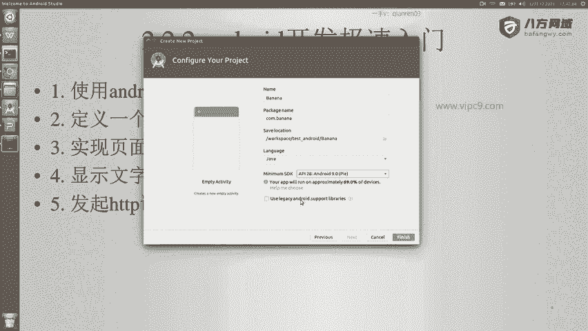
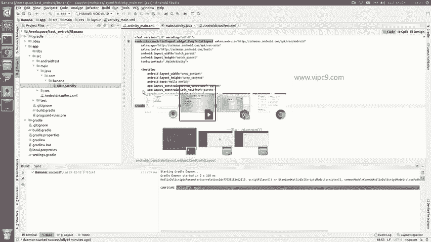
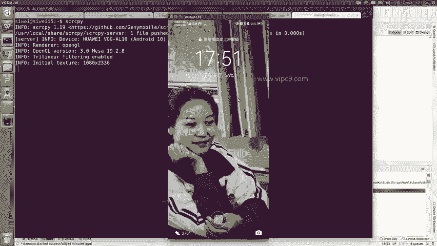
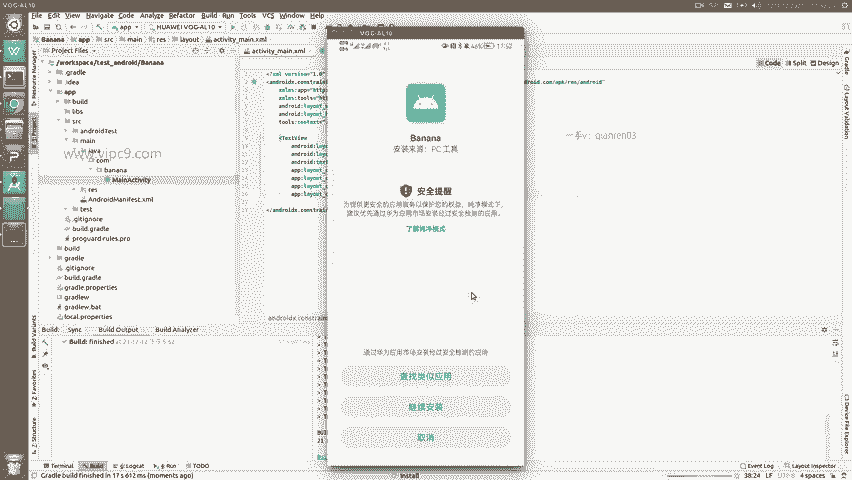
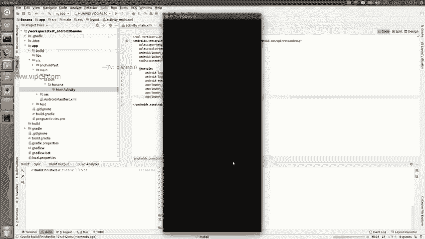
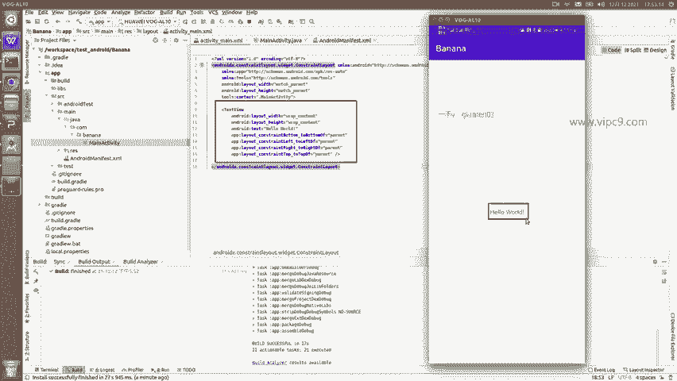

# Android逆向-基础篇：P14：章节3-7-创建项目并运行

在本节课中，我们将学习安卓开发的极速入门。我们的目标是进行逆向工程，因此只需了解最基本的开发流程即可。课程将分为几个核心步骤，从创建项目到实现基础功能。

## 🚀 创建并运行项目

首先，我们需要使用Android Studio来创建并运行一个项目。

打开Android Studio，选择“Start a new Android Studio project”来创建一个新项目。

在项目创建向导中，选择“Phone and Tablet”作为目标设备。然后，选择“Empty Activity”模板，这为我们提供了一个干净的起点。

点击“Next”。为项目命名，例如“Banana”。设置包名，例如“com.banana”。选择项目的保存路径。在语言选项中，选择“Java”。将“Minimum SDK”设置为API 28（Android 9），这可以支持大约70%的设备。

最后，点击“Finish”。Android Studio将自动生成项目文件并开始构建。

## 📁 项目结构解析

构建完成后，我们来了解一下项目的基本结构。

在Android Studio的“Project”视图中，选择“Project Files”模式，可以看到真实的文件目录。核心文件夹是`app`，其下的`src/main/java`目录存放所有的Java源代码文件。

打开`MainActivity.java`文件。这个类继承了`AppCompatActivity`，在安卓中，每个页面通常都是一个Activity。`onCreate`方法在页面打开时自动运行，其中`setContentView(R.layout.activity_main)`这行代码指定了该Activity要渲染的布局文件。

## 🎨 理解布局与视图

接下来，我们看看布局文件是如何定义页面内容的。

按住Ctrl键并点击`R.layout.activity_main`中的`activity_main`，可以打开对应的布局文件`activity_main.xml`。

在布局文件中，可以看到一个`TextView`控件，它负责显示文本。其`android:text`属性被设置为“Hello World!”。这就是我们将在应用中看到的文字。

## 📱 运行应用

现在，让我们将应用运行到设备上。

确保你的安卓手机已通过USB连接并启用了调试模式。在Android Studio中，点击工具栏的“Run ‘app’”按钮（或使用快捷键Shift+F10）。

Gradle构建工具将开始编译、打包应用。构建完成后，应用会自动安装到你的手机上。在手机上确认安装后，即可打开应用。

应用打开后，屏幕上将显示“Hello World!”。这表明我们成功创建并运行了一个最基本的安卓应用。

## 📝 本节总结

本节课中，我们一起学习了安卓开发的入门步骤。我们使用Android Studio创建了一个新项目，了解了项目的基本结构，查看了Activity与布局文件的关系，并成功在设备上运行了应用。这个过程涵盖了开发一个简单安卓应用的核心流程，为后续的逆向工程学习打下了基础。