# Android逆向-基础篇：P15：章节3-8-页面之间跳转 🚀

在本节课中，我们将学习如何修改一个Android应用的页面，并实现两个页面之间的相互跳转。我们将从修改现有页面的文字和添加按钮开始，然后创建第二个页面，最后通过编写代码实现点击按钮在两个页面间切换的功能。

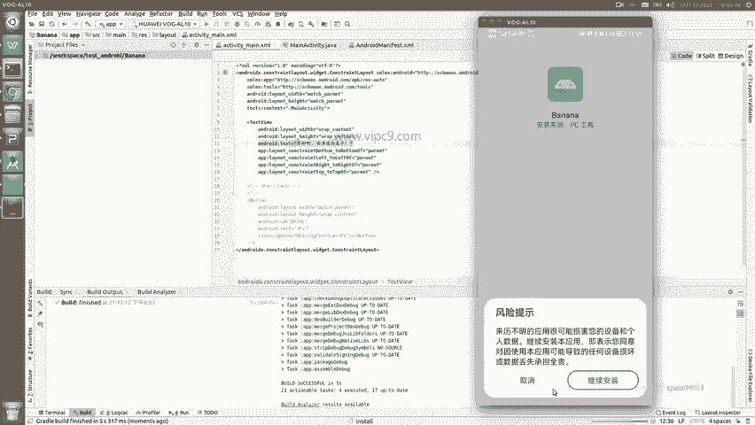

---

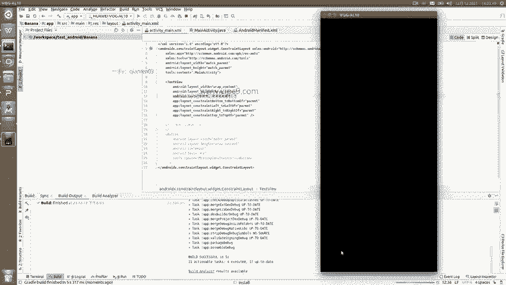

## 修改第一个页面

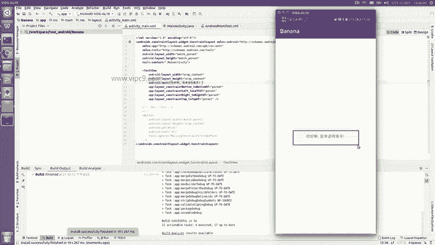

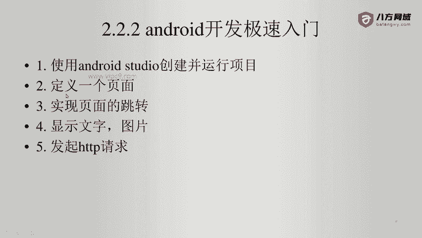

首先，我们对默认的“Hello World”页面进行修改。当前页面只显示“Hello World”，我们将修改其文字并添加一个按钮。

1.  将“Hello World”文字修改为“你好啊，安卓逆向高手”。
2.  在布局文件 `activity_main.xml` 中添加一个按钮。

以下是修改后的布局文件核心代码片段：

```xml
<TextView
    android:layout_width="wrap_content"
    android:layout_height="wrap_content"
    android:text="你好啊，安卓逆向高手" />

<Button
    android:id="@+id/go_to_second_activity"
    android:layout_width="wrap_content"
    android:layout_height="wrap_content"
    android:text="Go to Second Activity" />
```

修改完成后，保存文件并运行应用（快捷键 `Shift + F10`）。Android应用在修改代码或资源文件后通常需要重启以生效。现在，第一个页面的修改已经完成。

---

## 理解页面结构与入口

在创建第二个页面之前，我们先理解一下Android应用的基本结构。

*   **Activity**：一个Activity代表应用中的一个屏幕（页面）。我们看到的第一个页面由 `MainActivity` 类控制。
*   **布局文件**：每个Activity对应一个XML布局文件，用于定义页面的视觉元素。`MainActivity` 对应的布局文件是 `activity_main.xml`。
*   **应用清单**：`AndroidManifest.xml` 文件定义了应用的入口Activity。其中包含 `<intent-filter>` 且 `action` 为 `android.intent.action.MAIN`、`category` 为 `android.intent.category.LAUNCHER` 的Activity就是应用启动时显示的页面。

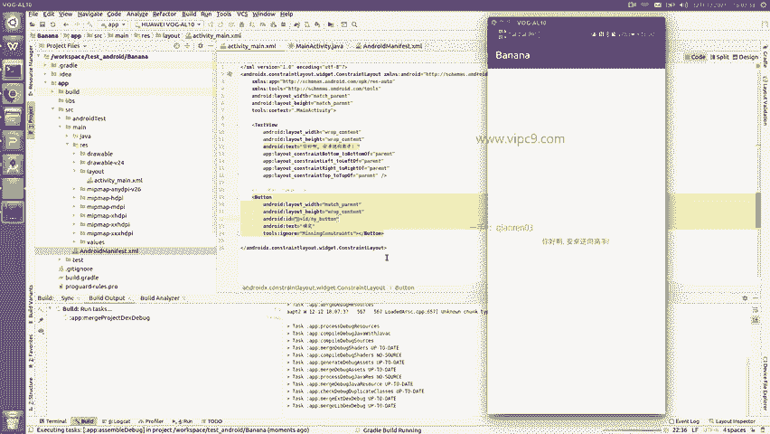

打开 `AndroidManifest.xml`，可以看到 `MainActivity` 被设置为启动入口。

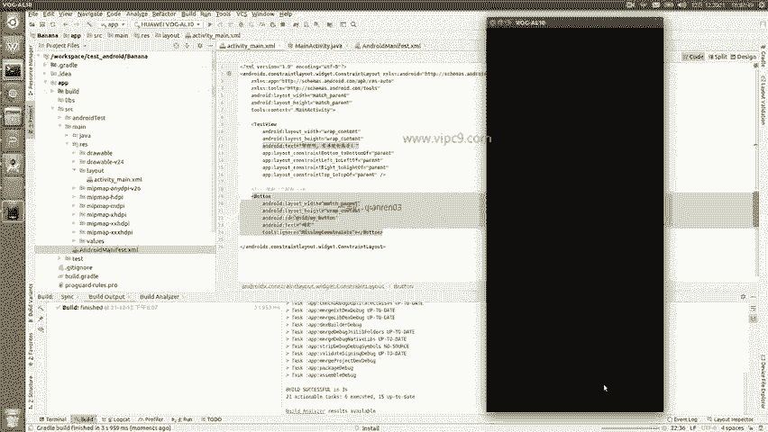

---

## 创建第二个页面

接下来，我们创建第二个页面。

1.  **创建新的Activity类**：在Java代码目录中，复制 `MainActivity` 并重命名为 `SecondActivity`。
2.  **创建对应的布局文件**：在 `res/layout/` 目录下，复制 `activity_main.xml` 并重命名为 `activity_second.xml`。修改其中的文字，并添加一个用于返回的按钮。

`activity_second.xml` 的核心代码片段如下：

```xml
<TextView
    android:layout_width="wrap_content"
    android:layout_height="wrap_content"
    android:text="我是第二个Activity页面" />

<Button
    android:id="@+id/go_to_main_activity"
    android:layout_width="wrap_content"
    android:layout_height="wrap_content"
    android:text="回到第一个页面" />
```

3.  **在清单文件中注册**：必须在 `AndroidManifest.xml` 文件的 `<application>` 节点内注册 `SecondActivity`，应用才能识别它。

注册代码如下：
```xml
<activity android:name=".SecondActivity" />
```

完成以上步骤后，运行应用。虽然现在还看不到第二个页面，但代码没有报错，说明第二个页面已成功创建。

---

## 实现页面跳转逻辑

现在，我们为两个页面的按钮添加点击事件，实现跳转功能。

页面跳转的核心是 **Intent** 对象。Intent用于在组件（如Activity）之间传递信息和启动新组件。

**跳转的基本公式如下：**
```java
Intent intent = new Intent(当前Activity.this, 目标Activity.class);
startActivity(intent);
```

### 在 MainActivity 中实现跳转

1.  让 `MainActivity` 实现 `View.OnClickListener` 接口。
2.  在 `onCreate` 方法中，通过 `findViewById` 找到按钮，并为其设置点击监听器 `setOnClickListener(this)`。
3.  在 `onClick` 方法中，判断被点击的按钮ID，如果是“跳转到第二个页面”的按钮，则创建指向 `SecondActivity` 的Intent并启动。

核心代码片段：
```java
public class MainActivity extends AppCompatActivity implements View.OnClickListener {
    @Override
    protected void onCreate(Bundle savedInstanceState) {
        super.onCreate(savedInstanceState);
        setContentView(R.layout.activity_main);
        Button button = findViewById(R.id.go_to_second_activity);
        button.setOnClickListener(this);
    }

    @Override
    public void onClick(View v) {
        if (v.getId() == R.id.go_to_second_activity) {
            Intent intent = new Intent(MainActivity.this, SecondActivity.class);
            startActivity(intent);
        }
    }
}
```

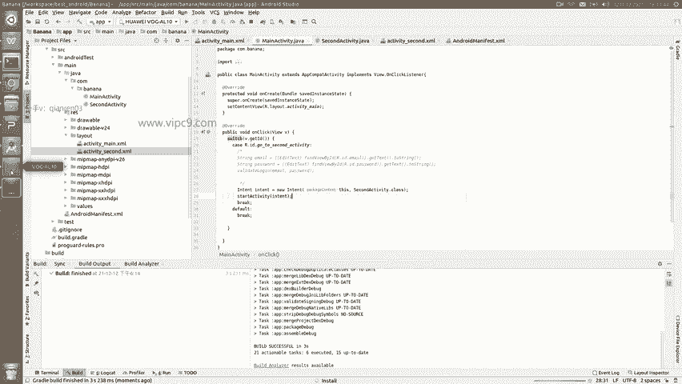

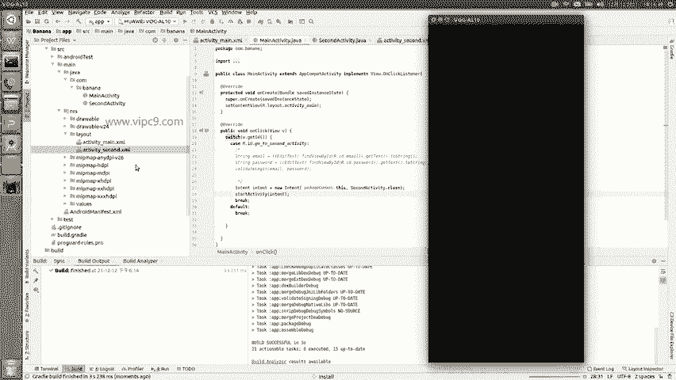

### 在 SecondActivity 中实现返回

在 `SecondActivity` 中重复类似的过程，实现点击按钮跳转回 `MainActivity`。

1.  实现 `View.OnClickListener` 接口。
2.  找到“返回”按钮并设置监听器。
3.  在 `onClick` 方法中，创建指向 `MainActivity` 的Intent并启动。

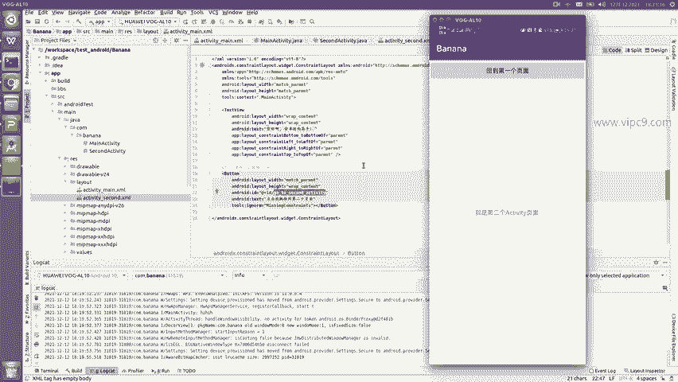

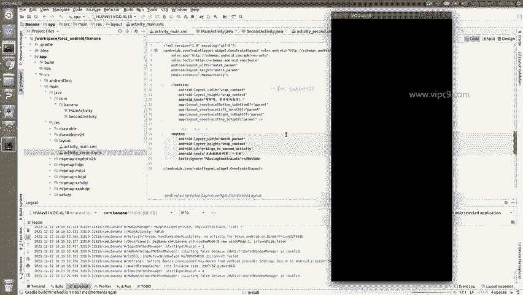

核心代码片段：
```java
public class SecondActivity extends AppCompatActivity implements View.OnClickListener {
    @Override
    protected void onCreate(Bundle savedInstanceState) {
        super.onCreate(savedInstanceState);
        setContentView(R.layout.activity_second);
        Button backButton = findViewById(R.id.go_to_main_activity);
        backButton.setOnClickListener(this);
    }

    @Override
    public void onClick(View v) {
        if (v.getId() == R.id.go_to_main_activity) {
            Intent intent = new Intent(SecondActivity.this, MainActivity.class);
            startActivity(intent);
        }
    }
}
```

---

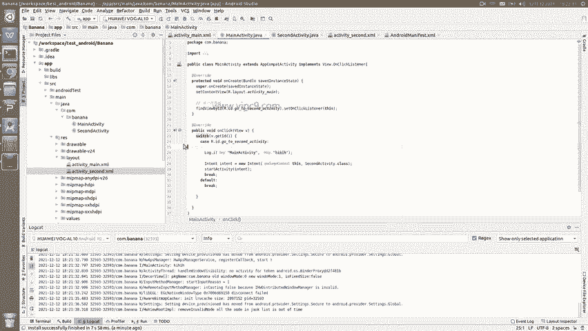

## 测试与总结

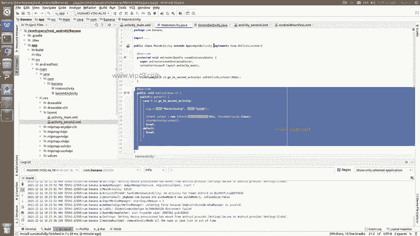

完成所有代码后，再次运行应用。

1.  首先看到修改后的第一个页面，上面有文字和新按钮。
2.  点击 **“Go to Second Activity”** 按钮，应用会跳转到第二个页面。
3.  在第二个页面，点击 **“回到第一个页面”** 按钮，应用又会跳转回第一个页面。

至此，我们成功实现了Android应用中两个页面之间的相互跳转。

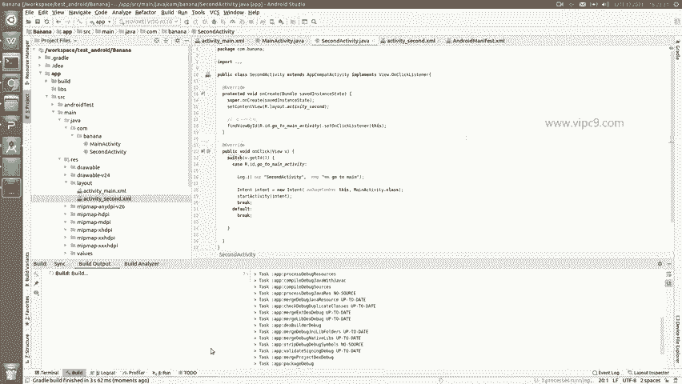

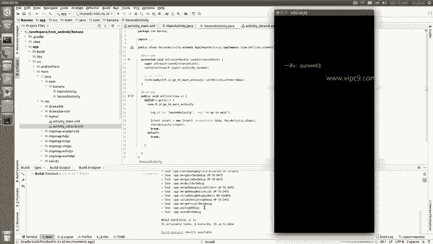

**本节课中我们一起学习了：**
1.  如何修改现有Activity的界面元素（文字、按钮）。
2.  Android应用的基本结构：Activity、布局文件、清单文件。
3.  如何创建新的Activity及其布局文件。
4.  使用 **Intent** 和 **startActivity()** 方法实现页面跳转的核心流程。
5.  通过实现 `OnClickListener` 接口和处理按钮点击事件来触发跳转。

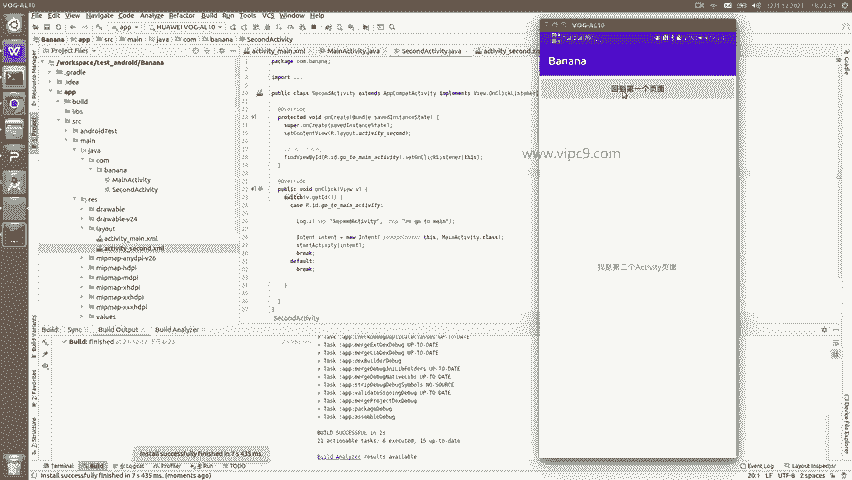

掌握页面跳转是Android应用开发的基础，也是后续进行逆向分析时理解应用流程的关键一步。