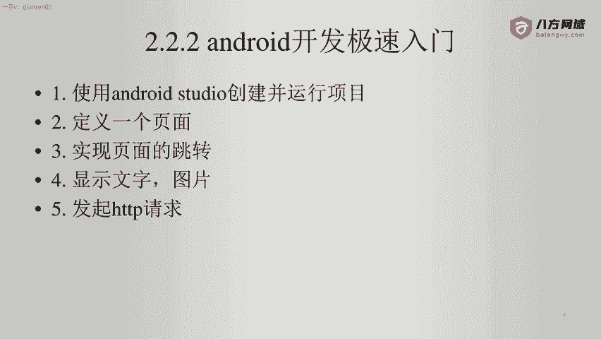
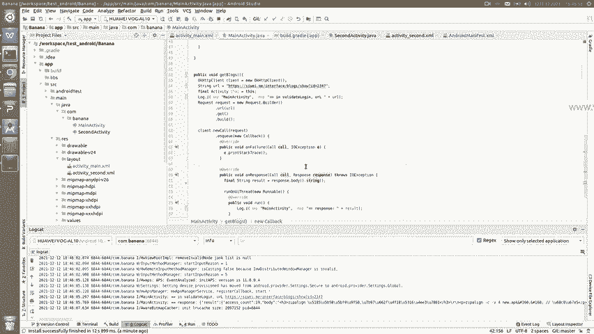
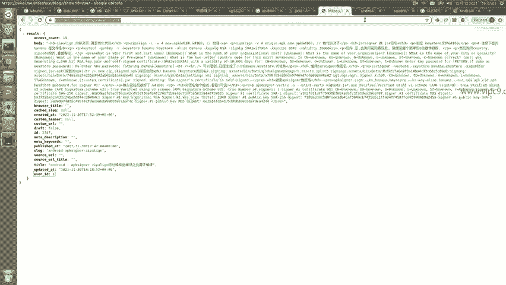
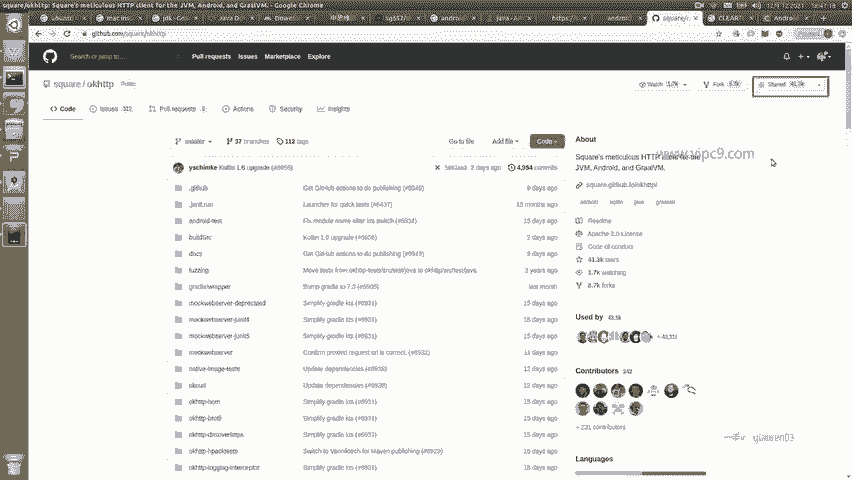
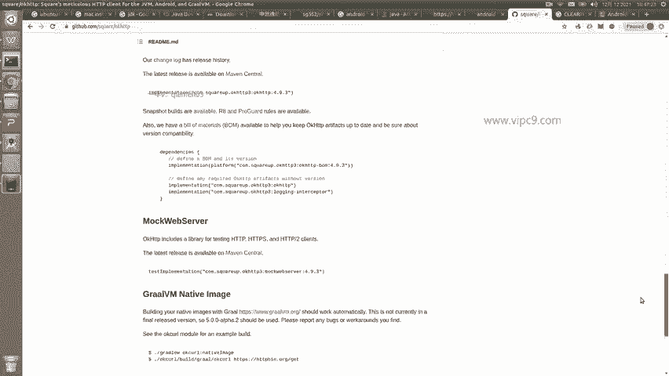
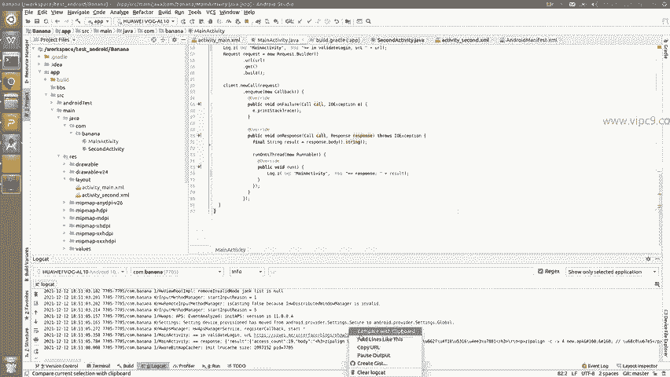
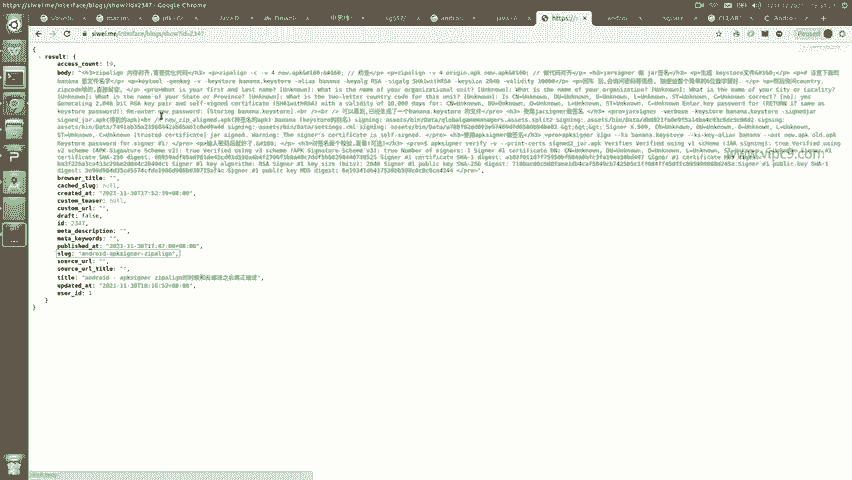
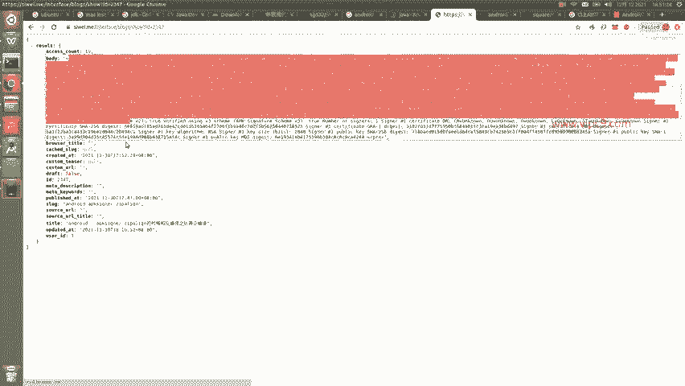
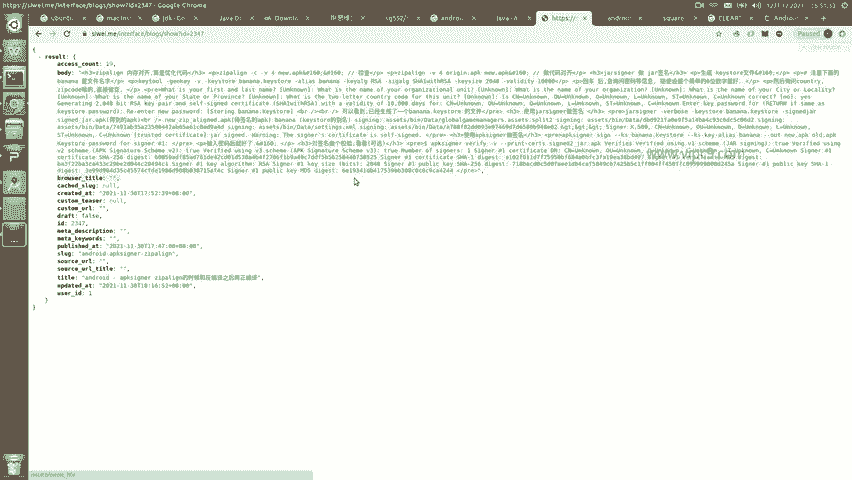
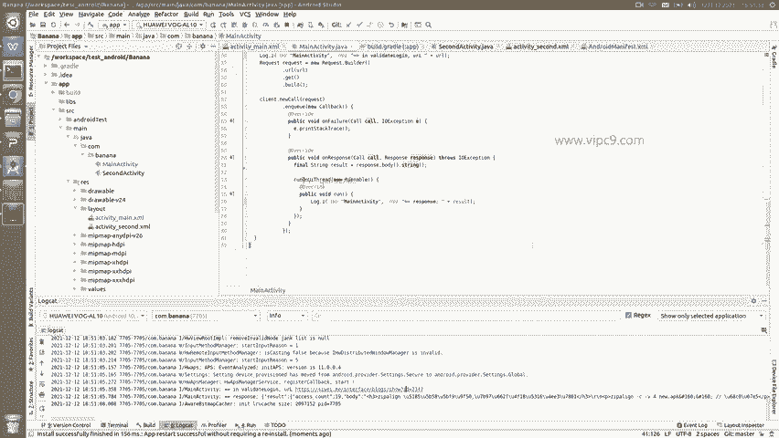

# Android逆向-基础篇：P16：章节3-9：发起HTTP请求 📡







在本节课中，我们将学习如何在Android应用中发起HTTP网络请求。这是与远程服务器进行数据交互的基础，也是后续进行网络协议分析的重要前提。

上一节我们介绍了应用的基本界面交互，本节中我们来看看如何让应用连接网络并获取数据。





## 概述
我们将使用一个名为OKHTTP的第三方库来发起HTTP请求。OKHTTP是目前Android生态中广泛使用且功能强大的网络请求组件。

## 配置项目依赖
首先，我们需要在项目中引入OKHTTP库。

以下是具体步骤：
1.  打开项目中的 `app/build.gradle` 文件。
2.  在 `dependencies` 代码块中添加以下依赖项：
    ```gradle
    implementation 'com.squareup.okhttp3:okhttp:4.9.0'
    ```
3.  添加完成后，点击Android Studio右上角出现的“Sync Now”按钮，同步项目以下载该库。

## 申请网络权限
Android应用访问网络需要相应的权限。

请在 `AndroidManifest.xml` 文件的 `<manifest>` 标签内添加以下权限声明：
```xml
<uses-permission android:name="android.permission.INTERNET" />
```

## 创建界面与事件
我们在布局文件中添加一个按钮，用于触发网络请求。

在 `activity_main.xml` 中，添加一个ID为 `get_blog` 的按钮，其文本可以设置为“点击我查询远程接口”。

接下来，在对应的 `MainActivity` 中，我们需要为这个按钮设置点击监听器。

以下是核心代码逻辑：
```kotlin
// 根据按钮ID找到控件
val getBlogButton: Button = findViewById(R.id.get_blog)
// 设置点击监听器
getBlogButton.setOnClickListener(this)

// 在全局的点击事件处理方法中
override fun onClick(v: View?) {
    when (v?.id) {
        R.id.get_blog -> {
            getBlog() // 调用发起网络请求的方法
        }
    }
}
```

## 发起HTTP GET请求
现在，我们来实现核心的 `getBlog()` 方法，该方法使用OKHTTP库发起一个GET请求。



以下是方法的具体实现：
```kotlin
private fun getBlog() {
    // 1. 创建OkHttpClient实例
    val client = OkHttpClient()

    // 2. 构建请求地址（URL）
    val url = "https://api.example.com/blog" // 请替换为实际的接口地址

    // 3. 构建Request请求对象
    val request = Request.Builder()
        .url(url)
        .get() // 声明此为GET请求
        .build()

    // 4. 创建Call对象并加入队列执行（异步）
    client.newCall(request).enqueue(object : Callback {
        // 请求失败的回调
        override fun onFailure(call: Call, e: IOException) {
            Log.e("NETWORK", "Request Failed", e)
        }

        // 请求成功的回调
        override fun onResponse(call: Call, response: Response) {
            // 获取响应体字符串
            val responseBody = response.body?.string()
            Log.d("NETWORK", "Response: $responseBody")
        }
    })
}
```
**代码说明**：
*   `OkHttpClient()`： 创建HTTP客户端实例。
*   `Request.Builder()`： 用于构建请求，其中 `.get()` 方法指定了HTTP方法为GET。
*   `client.newCall(request).enqueue(...)`： 这是关键步骤，它将请求加入队列异步执行，并通过回调返回结果。
*   `onFailure`： 在网络错误或请求失败时被调用。
*   `onResponse`： 在服务器成功返回响应时被调用，我们可以通过 `response.body?.string()` 获取返回的数据（通常是JSON或HTML格式）。

运行应用并点击按钮后，你可以在Android Studio的Logcat窗口中看到打印出的网络响应日志。







## 总结
本节课中我们一起学习了在Android应用中发起HTTP请求的完整流程。
1.  我们引入了强大的 **OKHTTP** 第三方库。
2.  我们为应用添加了访问网络的 **权限**。
3.  我们创建了按钮并通过 **事件监听** 触发网络操作。
4.  我们使用 **异步调用** 的方式发起了一个 **HTTP GET** 请求，并成功在日志中打印了服务器的返回结果。



掌握基础的HTTP请求发起是进行网络通信分析和逆向工程的重要一步。