# Android逆向-基础篇：P17：3-10：解析HTTP结果 📡

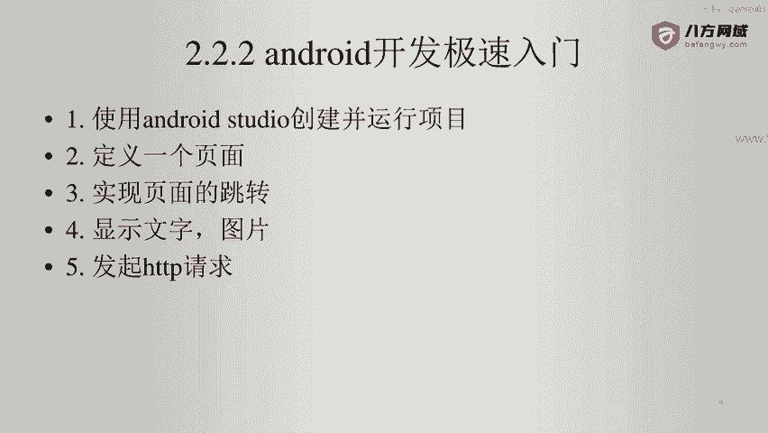

在本节课中，我们将学习如何在Android应用中解析HTTP请求返回的JSON数据，并将其内容展示在应用界面上。这是一个连接网络请求与UI显示的关键步骤。

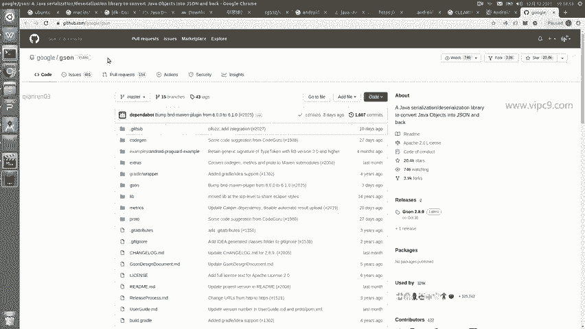

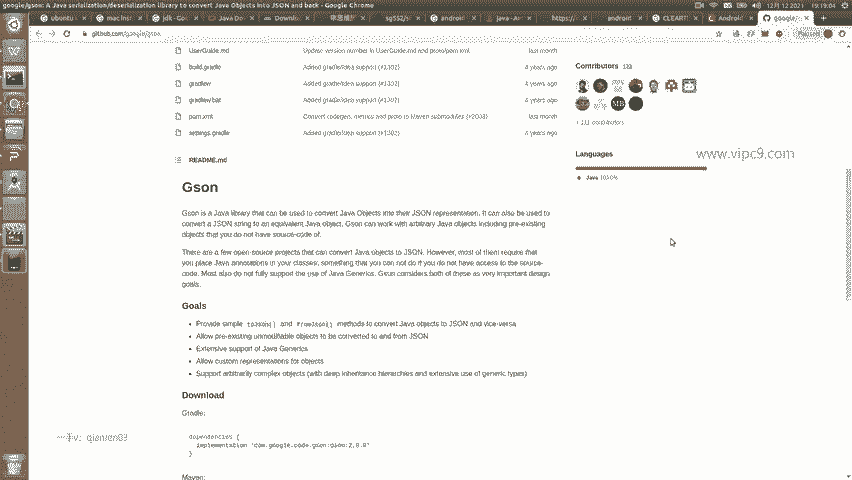

上一节我们介绍了如何发起HTTP请求，本节中我们来看看如何处理和解析请求返回的数据。

## 引入JSON解析库

为了解析JSON格式的数据，我们需要使用一个库。这里我们使用Gson，它是Android开发中一个常用的JSON解析库。

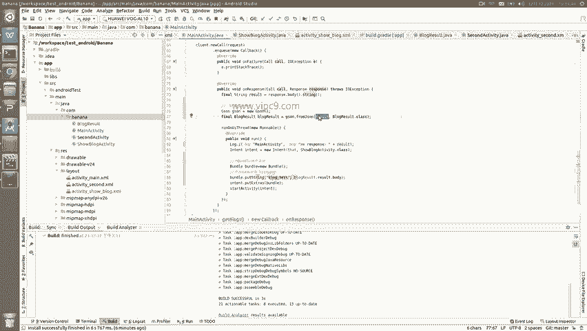

以下是引入Gson库的步骤：

1.  打开项目中的 `build.gradle` 文件。
2.  在 `dependencies` 部分添加以下依赖项：
    ```gradle
    implementation 'com.google.code.gson:gson:2.8.6'
    ```
3.  添加完成后，点击同步按钮以下载和配置该库。

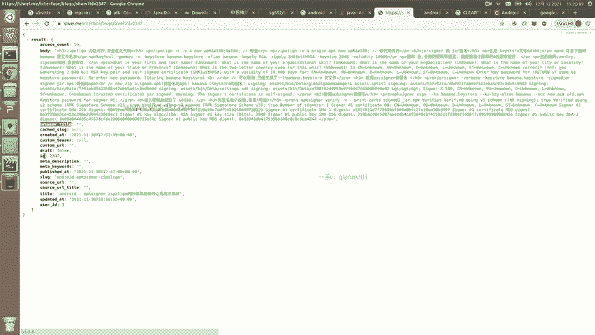

## 解析HTTP响应数据

现在，我们来到发起HTTP请求的代码位置（例如第75行），对返回的结果进行解析。

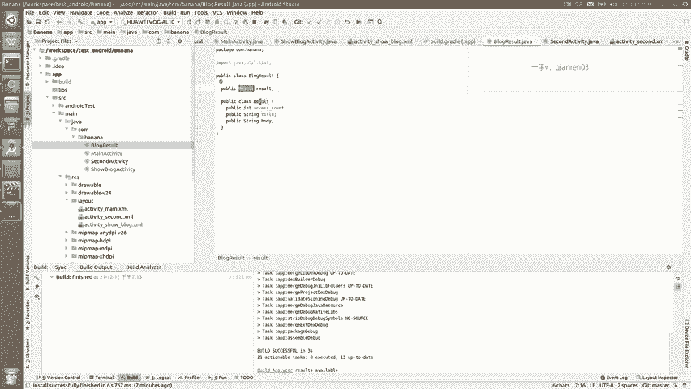

解析的核心代码如下：
```java
// 创建Gson实例
Gson gson = new Gson();
// 使用fromJson方法将JSON字符串转换为Java对象
BlogResult blogResult = gson.fromJson(result, BlogResult.class);
```
这段代码的含义是：首先创建一个Gson实例，然后调用 `fromJson` 方法，将HTTP请求返回的字符串 `result` 转换成一个 `BlogResult` 类型的Java对象。

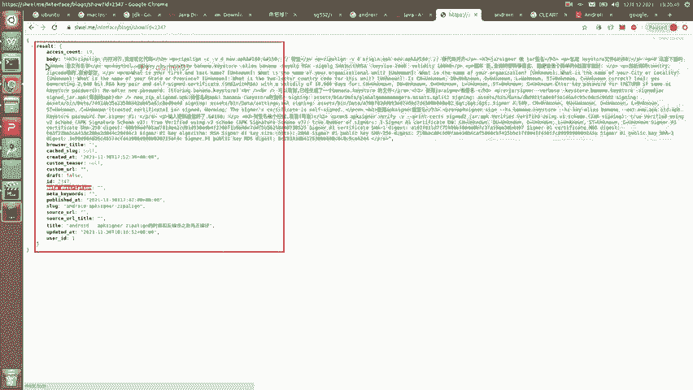

需要注意的是，服务器返回的JSON数据结构通常具有层次。例如，本例中的数据结构如下：
```json
{
  "result": {
    "browser_title": "...",
    "id": "...",
    "body": "..."
    // ... 其他字段
  }
}
```
最外层是一个名为 `result` 的键，其值又是一个包含多个键（如 `browser_title`, `id`, `body` 等）的对象。

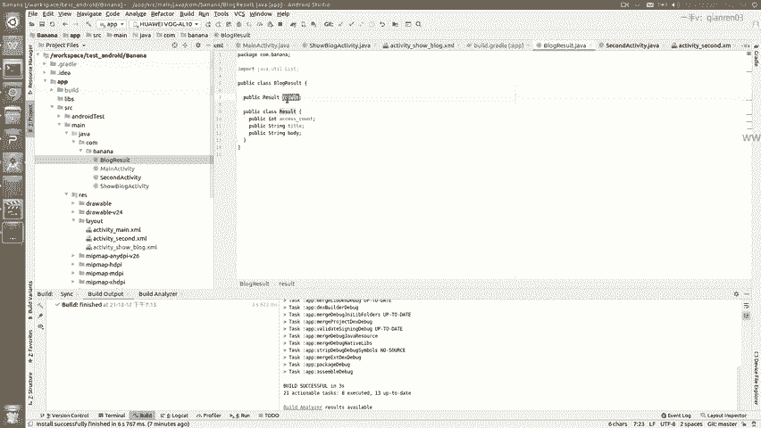

## 创建对应的数据类

Gson解析要求我们预先定义与JSON结构对应的Java类。我已经创建好了一个名为 `BlogResult` 的类。

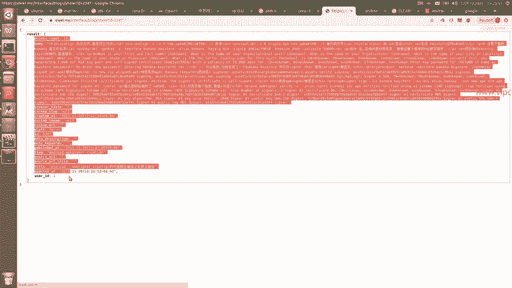

这个类的结构如下：
```java
public class BlogResult {
    private ResultBean result;

    public static class ResultBean {
        private String body;
        private String browser_title;
        private String id;
        // ... 其他字段的Getter和Setter方法
    }
    // ... Getter和Setter方法
}
```
-   `BlogResult` 类中的 `result` 成员对应JSON最外层的 `result` 键。
-   `ResultBean` 内部类中的各个成员（如 `body`, `browser_title`）则对应内层对象的各个键。
-   在本演示中，我们只关心并定义了部分字段，实际开发中应根据需要定义所有字段。

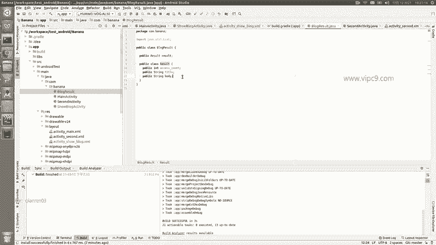

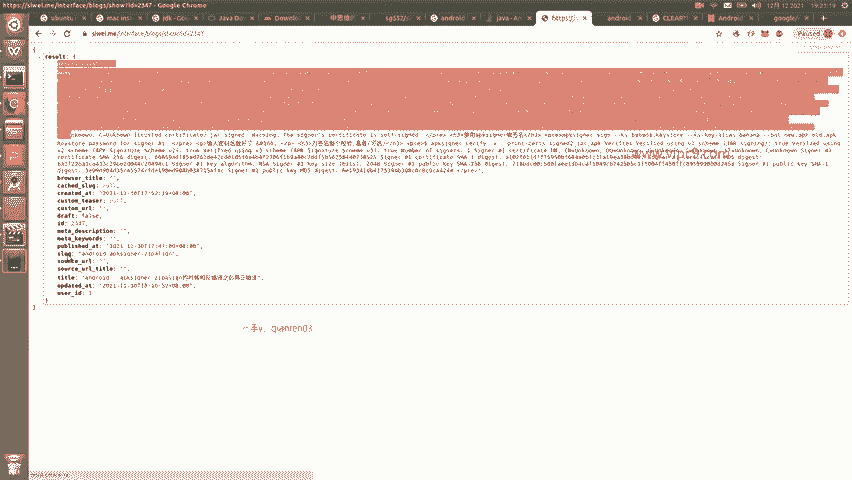

## 在Activity中显示解析结果

我们的目标是将解析出的内容显示在应用的Activity页面上。假设页面上有一个ID为 `blog_text` 的TextView。

在目标Activity中，我们需要编写代码来接收并显示数据：

```java
// 1. 从Intent中获取传递过来的数据
Bundle bundle = getIntent().getExtras();
if (bundle != null) {
    String blogContent = bundle.getString("blog_text");

    // 2. 找到页面上的TextView组件
    TextView textView = findViewById(R.id.blog_text);

    // 3. 将解析出的内容设置给TextView
    textView.setText(blogContent);
}
```
这段代码首先从启动该Activity的Intent中获取一个Bundle，然后从中取出键为 `"blog_text"` 的字符串数据，最后将这个字符串设置为TextView的显示文本。

## 传递数据并启动Activity

那么，数据是如何传递过来的呢？我们需要在发起网络请求并解析完成后，启动目标Activity并携带数据。

在发起请求的地方（如MainActivity），添加如下代码：

```java
// 1. 创建指向目标Activity的Intent
Intent intent = new Intent(MainActivity.this, BlogActivity.class);

// 2. 创建Bundle并存入要传递的数据
Bundle bundle = new Bundle();
// 数据来源于解析后的对象：blogResult.result.body
bundle.putString("blog_text", blogResult.getResult().getBody());

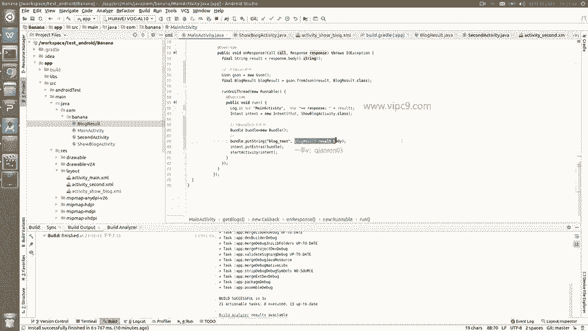

// 3. 将Bundle附加到Intent上
intent.putExtras(bundle);

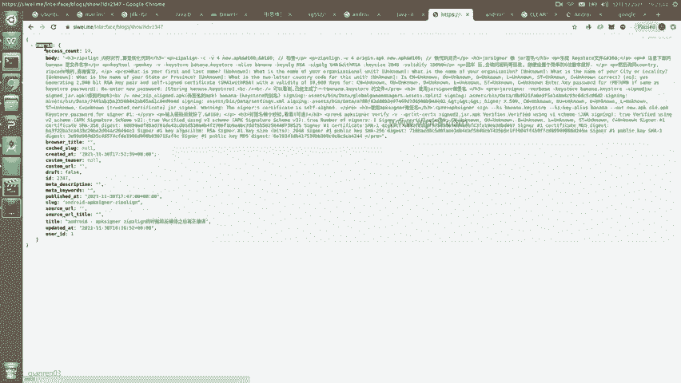

// 4. 启动目标Activity
startActivity(intent);
```
关键点在于 `blogResult.getResult().getBody()`，它获取了我们从JSON中解析出的正文内容，并将其作为参数传递。

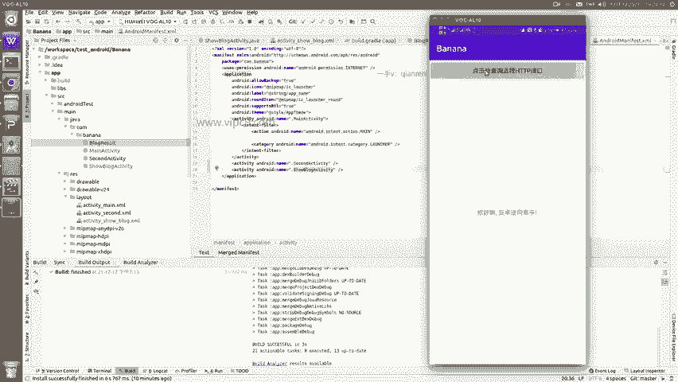

最后，请确保在 `AndroidManifest.xml` 文件中，目标Activity（如 `BlogActivity`）已被正确声明且可见。

## 运行与验证

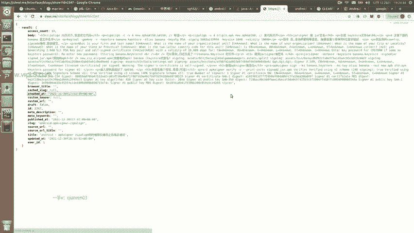

完成以上步骤后，运行应用。点击触发HTTP请求的按钮，应用会请求数据、解析JSON，然后跳转到一个新的页面，并将远程获取的博客正文内容（示例中为“内存对齐算是优化代码”）显示出来。

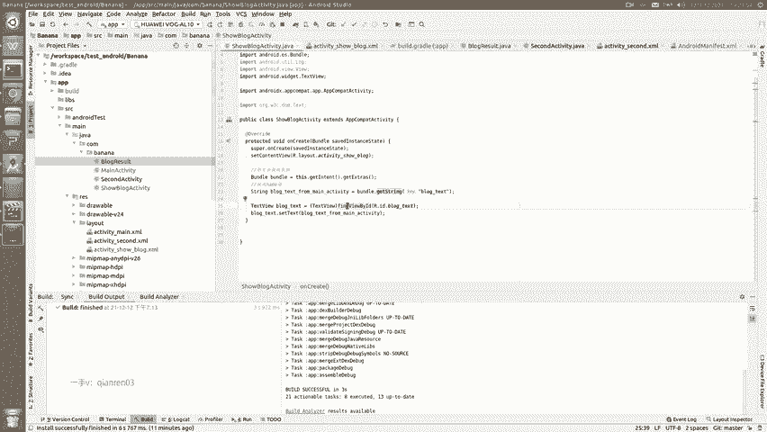

本节课中我们一起学习了使用Gson库解析HTTP返回的JSON数据，定义了对应的数据模型类，并通过Intent在Activity之间传递解析结果，最终将网络数据成功渲染到应用界面，完成了一个从网络到UI的完整数据流。