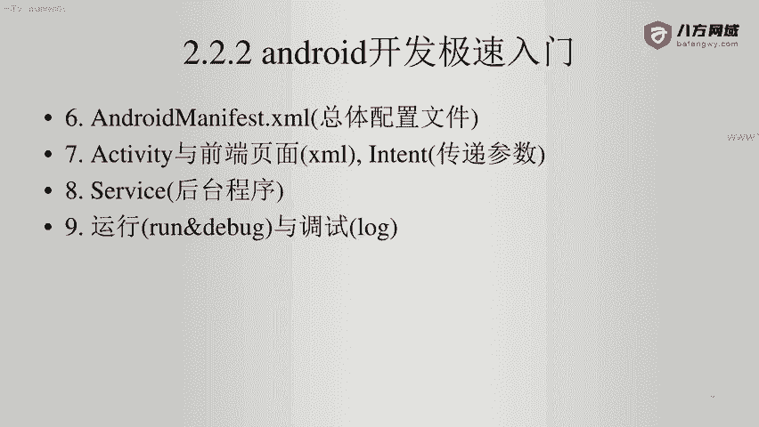
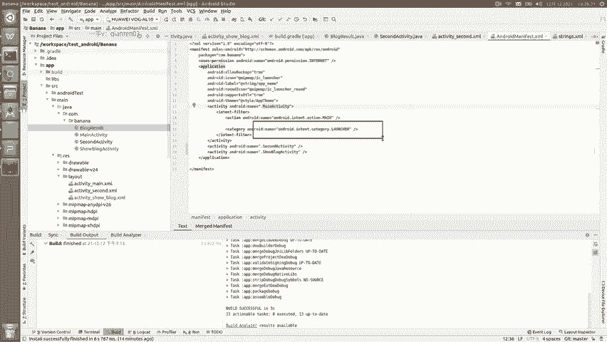
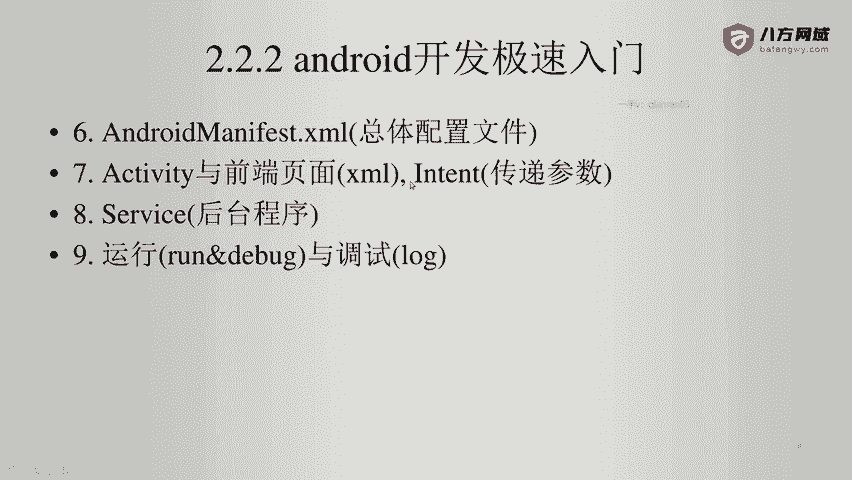
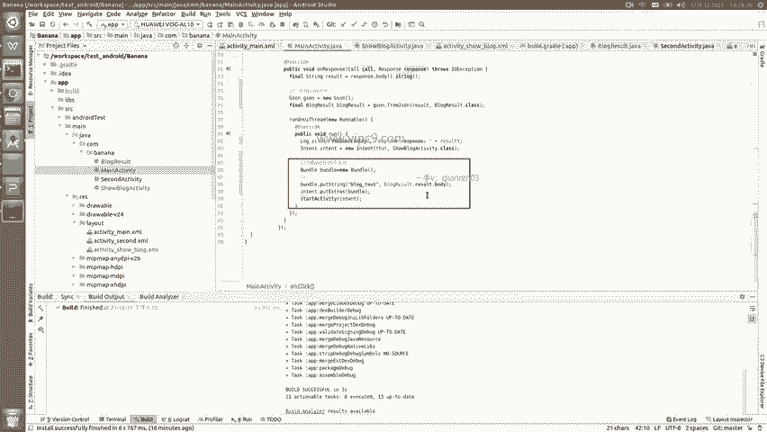
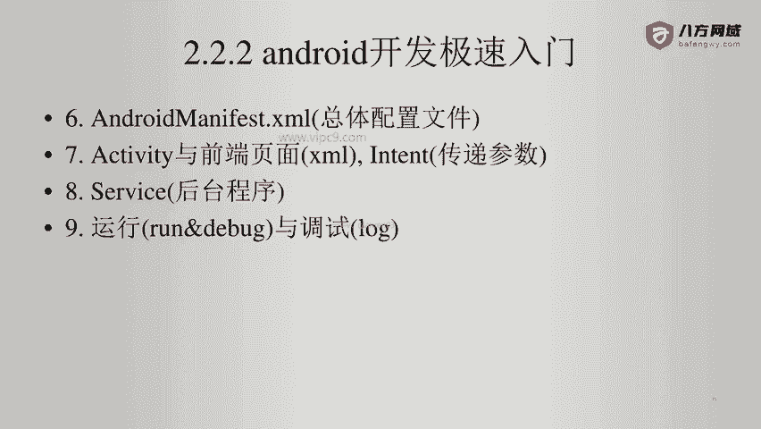

Android逆向-基础篇：3-11：AndroidManifest详解 📄

在本节课中，我们将要学习Android应用的核心配置文件——`AndroidManifest.xml`。这个文件定义了应用的基本信息、权限、组件（如Activity）及其入口点，是理解应用结构和进行逆向分析的基础。

下面我们来看一个典型的`AndroidManifest.xml`文件是什么样子。

这个文件的清爽版就是长这样。我们可以看到，文件顶部先是一些声明，这些声明通常没有太大的实际意义。其中唯一有意义的是`package`的名字。

`package`的名字对于安卓应用非常重要，它决定了应用在设备中的进程名称，以及应用的内部标识。例如，这个应用的内部名字就叫做`com.banana`。在涉及应用自动更新时，系统会依赖包名进行识别，如果包名改变，则无法完成更新。

接下来，我们看看文件中的具体内容。

以下是`AndroidManifest.xml`中的关键部分解析：

*   **权限声明**：第四行代码 `uses-permission android:name="android.permission.INTERNET"` 为当前应用申请了网络访问权限。
*   **Application标签**：第五行开始的 `application` 标签内，声明了应用的所有组件。其中 `icon` 属性定义了应用的图标，`label` 属性定义了应用显示的名称。在开发工具中，按住Ctrl键并点击这些属性值，可以直接进行修改。
*   **Activity声明**：在 `application` 标签内部，声明了该应用包含的所有Activity（活动页面）。本例中声明了3个Activity。例如，`com.banana.MainActivity` 就是一个Activity的完整类名。
*   **程序入口**：在Activity声明中，最重要的属性是 `android.intent.category.LAUNCHER`。带有此标签的Activity被指定为程序的启动入口。

上一节我们介绍了`AndroidManifest.xml`的基本结构，本节中我们来看看Activity与前端页面的关系。

原则上，每一个Activity都会对应一个XML布局文件。因为Activity的主要目的是为了展示用户界面，其内部编写的是控制页面逻辑的代码，而页面的视觉布局则通过XML文件进行描述，实现了逻辑与表现的分离。

不同的Activity之间如何进行跳转呢？这是通过`Intent`（意图）对象实现的。

以下是Activity跳转的基本方法：

*   **创建Intent**：使用代码 `Intent intent = new Intent(CurrentActivity.this, TargetActivity.class);` 创建一个Intent对象。它需要两个参数：当前Activity的上下文和目标Activity的类。
*   **启动Activity**：调用 `startActivity(intent);` 方法，即可实现页面跳转。
*   **传递参数**：如果需要向目标Activity传递额外数据，可以通过 `intent.putExtra("key", value);` 方法，将数据放入`Bundle`中一并传递。

关于`Intent`和`Bundle`使用的更多细节，大家可以查阅官方开发文档以获取更深入的信息。

本节课中我们一起学习了`AndroidManifest.xml`配置文件。我们了解了它的核心作用，包括定义应用包名、声明权限、注册应用组件（特别是作为入口的Activity），并初步认识了Activity与XML布局文件的关系，以及通过`Intent`实现页面跳转和参数传递的基本机制。掌握这些内容是进行Android应用分析和逆向工程的重要第一步。