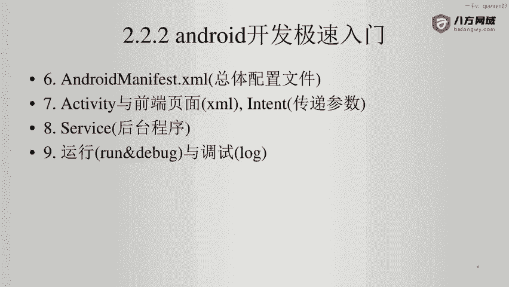
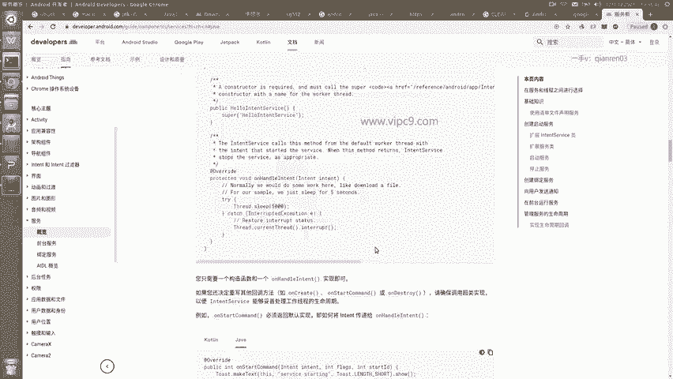
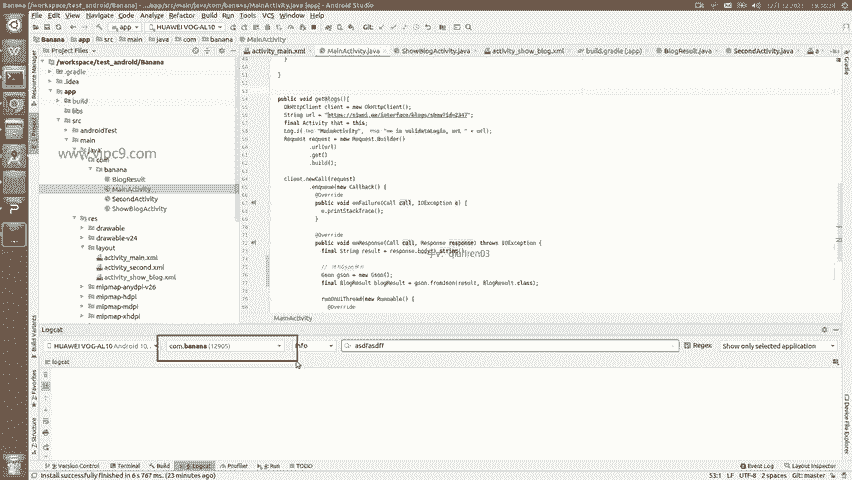
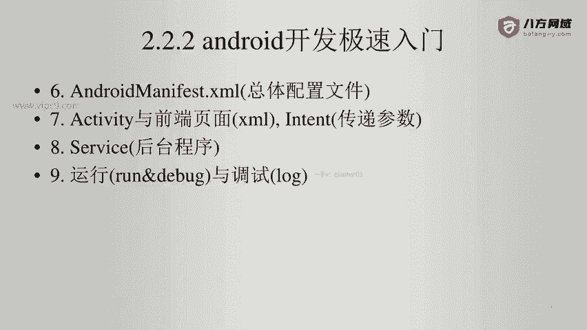

# Android逆向-基础篇：P19：3-12：Service与运行调试 🛠️

在本节课中，我们将学习Android应用中的Service组件，以及如何在Android Studio中进行运行和调试操作。Service是Android四大组件之一，理解其概念对于分析应用后台行为至关重要。



## Service组件介绍

上一节我们介绍了Activity，本节中我们来看看Service。Service是Android官方定义的一种应用组件，用于在后台执行长时间运行的操作，且不提供用户界面。这与每个Activity都对应一个可视化页面的特性有显著区别。

在分析应用时，虽然我们可能不需要编写Service，但必须能够识别和理解它。例如，当你打开一个应用的 `AndroidManifest.xml` 文件时，如果看到以下格式的内容，就表明该应用在后台注册并运行了Service。

```xml
<service android:name=".MyService" />
```

看到这样的声明，我们就可以推断出这个应用一定在后台执行某些任务。以下是Service的两种主要启动方式：

*   **`startService()`**: 用于启动一个Service来执行单独的操作，不直接与组件通信。
*   **`bindService()`**: 用于将组件（如Activity）绑定到Service，进行交互和通信。

## 运行与调试应用



了解了Service的基本概念后，我们来看看如何在开发环境中运行和调试一个Android应用。这部分操作在Android逆向工程中常用于验证分析和动态测试。

### 运行应用

运行应用非常简单。在Android Studio中，点击工具栏上的 **Run** 按钮（绿色三角形），然后选择目标设备即可启动应用。在开发过程中，通常会大量使用快捷键 **Shift + F10** 来快速运行当前项目。

### 调试与查看日志

调试应用和分析其行为主要依赖于查看日志。日志信息会显示在Android Studio底部的 **Logcat** 面板中。


Logcat会根据日志的等级（如Verbose, Debug, Info, Warn, Error）显示不同内容。你可以通过顶部的搜索框过滤特定的日志信息。



一个关键技巧是，必须通过下拉菜单选择当前正在调试的应用的**包名**。如果不进行筛选，Logcat会显示设备上所有进程的日志，信息量会非常庞大，导致难以找到需要的内容。





---

本节课中我们一起学习了Android Service组件的定义和作用，它能让我们识别应用的后台行为。同时，我们也掌握了在Android Studio中运行应用以及通过Logcat查看和过滤日志的基本方法，这是进行动态分析和调试的基础技能。