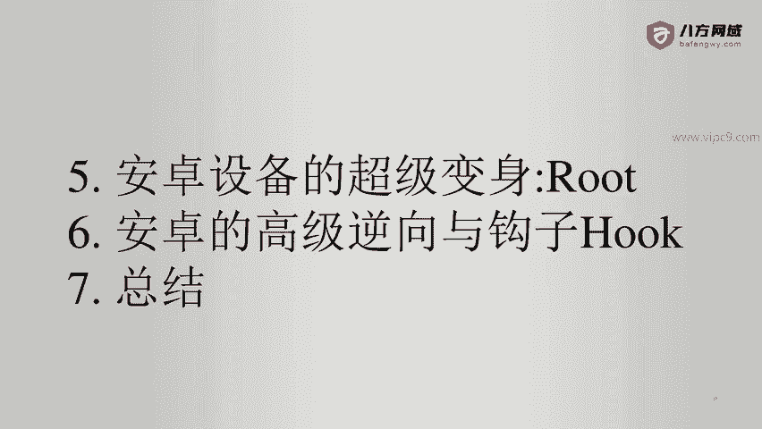
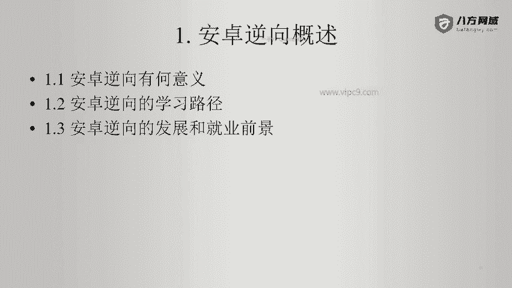

# Android逆向-基础篇：P1：安卓逆向概述

在本节课中，我们将要学习安卓逆向工程的入门知识，了解其基本概念、学习路径以及行业前景。

## 概述

安卓逆向工程是安全领域的重要分支，它涉及分析已编译的安卓应用程序，以理解其工作原理、发现潜在漏洞或进行安全防护。掌握这项技能对于从事移动安全、渗透测试或应用加固都至关重要。

上一节我们介绍了课程的整体结构，本节中我们来看看安卓逆向的概述部分。

## 安卓逆向的意义

在2012年之前，互联网应用主要以Web形式存在。2012年之后，大中型互联网公司普遍开发了手机App，包括安卓端和苹果端。后来还出现了小程序和H5应用。

因此，当前的互联网项目通常分为两部分：一是提供服务的API端，其客户端包括苹果App、安卓App和小程序等；二是传统的Web页面。

对于攻击方（红队）而言，安卓逆向可以将目标系统的所有接口暴露出来，从而发现更多的攻击面。因此，安卓逆向是进行正面渗透测试的一种有效方式，可以视为正面攻击的入口。

对于防守方（蓝队）或公司安全团队而言，安卓逆向同样意义重大。通过逆向分析自己的应用，防守方能够发现自身的薄弱环节和不足之处。例如，检查接口是否缺乏签名验证等安全措施。安全无小事，提前通过逆向进行防护评估至关重要。

## 安卓逆向的学习路径

如果想深入学习逆向，必须先掌握正向开发知识。不理解正向开发，逆向工程将难以深入。

以下是安卓正向开发需要掌握的技能树：

1.  **Java语法**：这是理解反编译后代码的基础。
2.  **安卓开发基础**：需要了解安卓框架的核心组件，例如 `Activity`、`Service` 等。
3.  **开发工具**：主要是官方推荐的 Android Studio 集成开发环境。
4.  **项目构建工具**：Gradle，它是安卓项目的自动化构建工具。
5.  **调试桥**：ADB（Android Debug Bridge），它是连接电脑与安卓设备的桥梁，包含一系列常用命令。
6.  **测试环境**：安卓虚拟机或实体机，用于运行和测试应用。
7.  **应用打包**：了解应用的编译和打包流程。
8.  **应用加固与发布**：了解应用上线前的加固保护措施和发布流程。

掌握了正向开发基础后，才能更顺利地进行逆向工程学习。

## 安卓逆向的发展与就业前景

安卓逆向是安全领域无法绕过的一个技术点。在安全岗位的面试中，大部分都会涉及安卓逆向相关问题，因为现代应用几乎都离不开安卓App。

当前市面上存在的许多安全漏洞，往往出现在App的接口（API）上。由于开发人员普遍缺乏系统的安全编码培训，导致接口层成为脆弱点。因此，安卓逆向既是攻击者突破系统的重要手段，也是防守者需要重点防护的对象。

就业前景方面，只要能够熟练掌握安卓逆向技术，能够分析市面上大多数未进行高强度加固的App，找到一份收入可观、前景良好的安全工作是比较容易的。

---

本节课中我们一起学习了安卓逆向工程的基本概述。我们了解了学习安卓逆向的重要意义，明确了必须先掌握正向开发的学习路径，并认识了该领域良好的发展前景。从下一章开始，我们将正式进入安卓正向开发基础的学习。