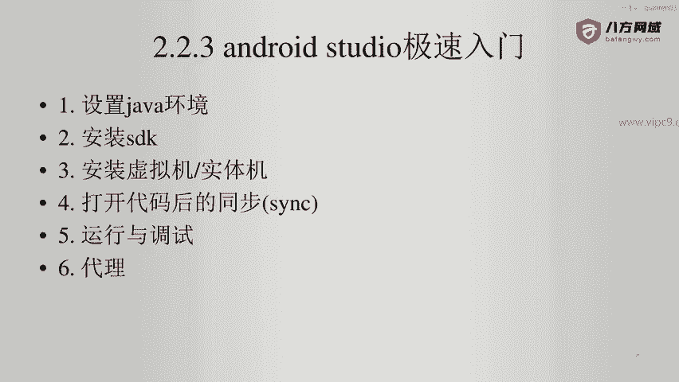
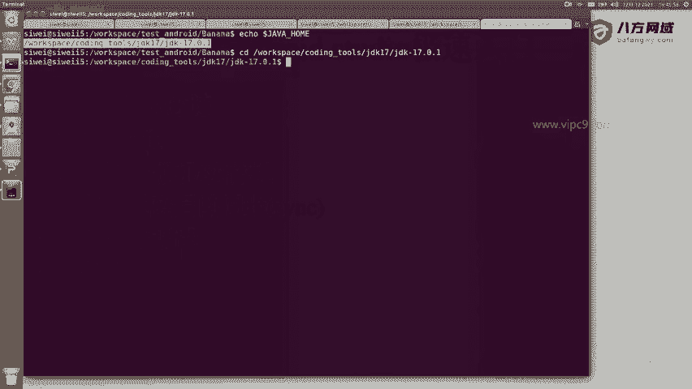
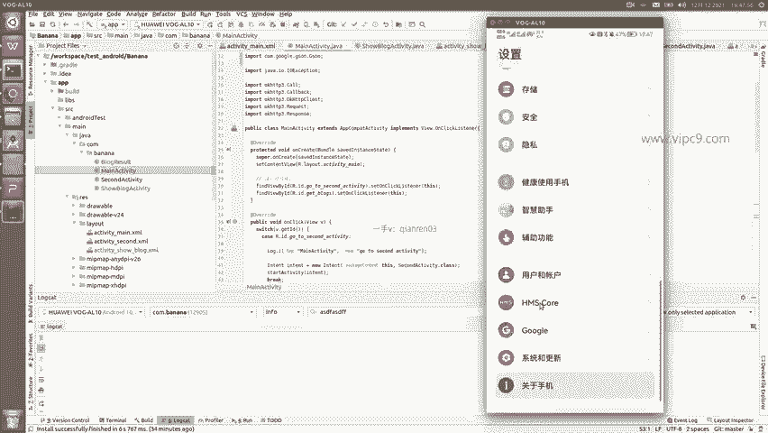
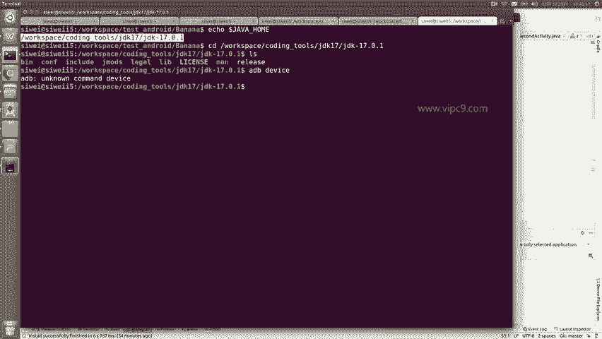
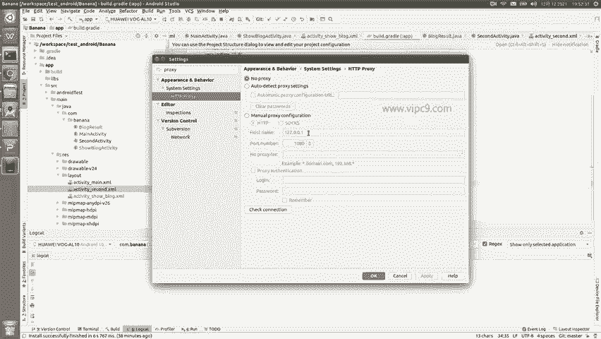
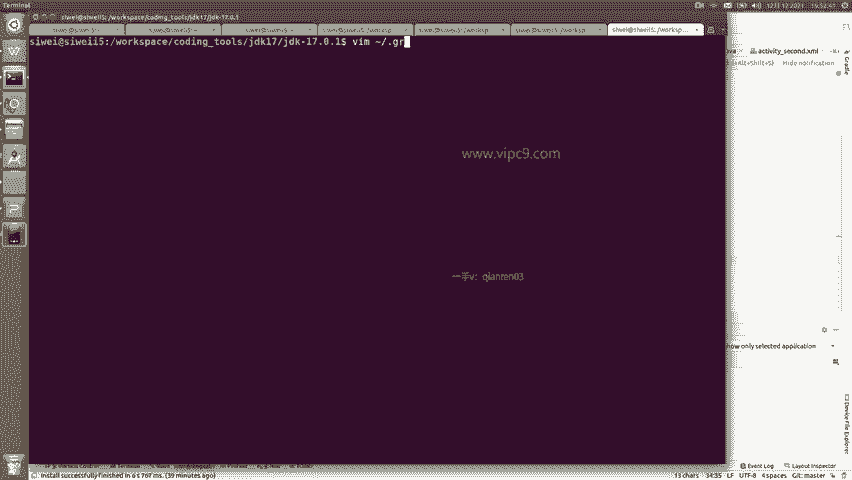
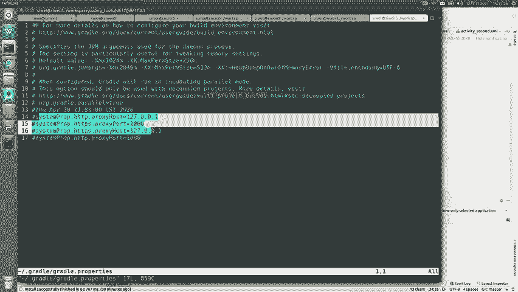
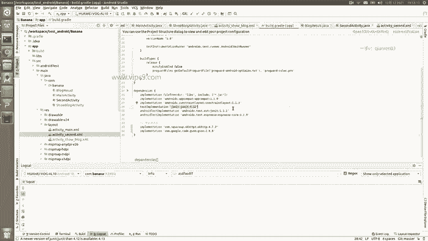

# Android逆向-基础篇：P20：3-13：Android Studio急速入门 🚀



在本节课中，我们将学习Android Studio的快速入门，并对之前的内容进行总结。我们将涵盖从环境配置到项目运行的关键步骤，确保初学者能够顺利搭建开发环境。



## 概述
本节教程旨在指导你快速配置Android Studio开发环境，包括Java环境、SDK安装、设备连接以及项目同步与运行。掌握这些基础是进行Android应用开发和逆向分析的前提。

---

### 配置Java环境
首先，需要设置Java开发环境。下载Java压缩包后，必须配置一个名为`JAVA_HOME`的系统环境变量。这样，任何Java程序都能正确找到Java运行时。

**核心概念：设置环境变量**
在系统环境变量中，添加一个名为`JAVA_HOME`的变量，其值为你的JDK安装路径。

---



### 安装Android SDK
接下来，需要安装Android SDK。在Android Studio中，通过 **Tools > SDK Manager** 可以进入SDK管理界面。在这里，你可以下载所需的特定Android版本。同时，可以为SDK指定一个自定义的安装位置。



---

### 设置虚拟机与实体机
没有设备或模拟器，开发工作将无法进行。点击 **Tools > AVD Manager** 可以管理安卓虚拟机列表。你可以在此创建、修改、启动或停止虚拟机。

虚拟机软件有多种选择：
*   **官方AVD**：Android Studio自带的模拟器，支持全面的API版本。
*   **Genymotion**：一款流行的第三方安卓模拟器。
*   **雷电模拟器等**：国内常见的模拟器，但通常内置的Android版本较低（如仅限Android 7）。

对于实体机调试，需要将安卓设备通过数据线连接到电脑。请确保：
1.  使用高质量的数据传输线，而非仅能充电的线缆。
2.  在设备的系统设置中，开启“开发者选项”和“USB调试”模式。

连接成功后，可以在终端使用ADB命令检查设备：
```bash
adb devices
```
该命令将列出当前连接的所有安卓设备。

---

### 同步与运行项目
当你打开或下载一个项目后，首要步骤是同步项目依赖。点击 **File > Sync Project with Gradle Files**。这个操作会将项目所需的第三方库下载到本地。

项目同步完成后，即可进行运行和调试：
*   **运行**：点击工具栏的 **Run** 按钮。
*   **调试**：使用下方调试窗口的相关功能进行代码调试。

为了提高开发效率，建议熟悉并使用快捷键。例如：
*   `Alt + 6`：切换显示/隐藏“问题”窗口。
*   `Ctrl + E`：显示最近打开的文件列表。

IDE左侧的项目视图有多种模式，可以根据个人喜好选择：
*   **Project**：显示经典的、简洁的文件夹结构。
*   **Android**：默认视图，按Android项目结构组织。
*   **Packages**：按包名显示。
*   **Project Files**：显示与实际操作系统文件夹完全一致的结构，提供最直接的文件控制感。

在编辑XML布局文件时，右上角提供了“Design”视图进行可视化设计。但需注意，此处的预览效果可能因Android Studio版本或设备差异，与实体机运行效果略有不同。

---

### 配置代理服务器
在同步项目（Sync Project）时，Gradle可能需要从Google服务器下载依赖。如果遇到网络访问问题，可以通过配置代理服务器解决。



有两种主要配置方式：
1.  **通过IDE设置**：在 **File > Settings**（或Mac上的 **Android Studio > Preferences**）中，搜索“proxy”，然后在 **HTTP Proxy** 部分手动设置代理地址和端口。推荐使用HTTP/HTTPS代理。
    > **注意**：此设置界面可能不支持SOCKS5代理。



2.  **通过配置文件（优先级更高）**：在用户主目录（`~`）下，找到或创建 `gradle.properties` 文件（Windows和Mac路径类似）。在此文件中添加代理配置，例如：
    ```
    systemProp.http.proxyHost=your.proxy.host
    systemProp.http.proxyPort=your.proxy.port
    systemProp.https.proxyHost=your.proxy.host
    systemProp.https.proxyPort=your.proxy.port
    ```
    此方法的配置优先级高于在IDE中的设置。网络问题通常不会一直存在，无需过度担心。



---



## 总结
本节课我们一起学习了Android Studio的快速入门。我们掌握了配置Java环境、安装Android SDK、设置虚拟机与连接实体机的方法。同时，也了解了如何同步项目、运行调试、使用高效视图与快捷键，并解决了可能遇到的网络代理配置问题。这些是开始Android应用开发和逆向分析的基础，请务必熟练掌握。