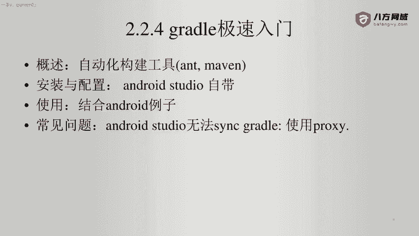
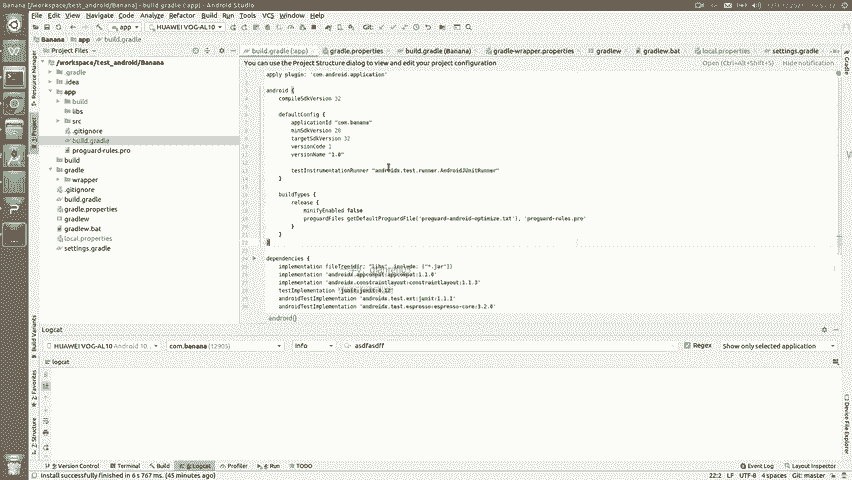

# Android逆向-基础篇：P21：3-14-gradle极速入门

## 📚 概述
在本节课中，我们将要学习Gradle的基础知识。Gradle是Android开发中广泛使用的自动化构建工具。对于逆向工程而言，理解Gradle文件的结构和含义至关重要，它能帮助我们分析项目的依赖和构建配置。

## 🛠️ Gradle是什么？
Gradle是一个自动化构建工具，其功能类似于Java开发中的Ant或Maven。在Android开发领域，Gradle的应用最为普遍。

## 📁 Gradle在Android项目中的体现
下面我们来看一个具体的Android项目示例，了解Gradle文件是如何组织的。

以下是项目根目录下常见的Gradle相关文件：

*   **`.gradle` 目录**：此目录由Android Studio自动生成和管理，用于存放Gradle运行时的缓存和下载的依赖文件，通常无需手动修改。
*   **`build.gradle` (Project级别)**：此文件配置整个项目的构建脚本。我们原则上不应改动此文件。
    *   它定义了项目使用的代码仓库，例如Google和JCenter。
    *   它声明了项目级的Gradle插件依赖。
*   **`gradle.properties`**：此文件用于配置Gradle运行时的属性，例如为Gradle守护进程分配的JVM堆内存大小。
*   **`gradlew` 与 `gradlew.bat`**：这是Gradle包装器（Wrapper）的启动脚本，允许我们在没有预先安装Gradle的系统上使用指定版本的Gradle进行构建。对于日常分析，我们可以暂时忽略它们。
*   **`settings.gradle`**：此文件定义了项目的模块结构。我们原则上也不要改动它。
    *   它指明了根项目的名称。
    *   它通过 `include` 语句声明了项目包含哪些模块，例如 `:app` 模块对应项目中的 `app` 文件夹。

## 🧩 模块级Gradle配置
上一节我们介绍了项目级的Gradle文件，本节中我们来看看模块级的配置。在Android项目中，每个模块（如 `app` 模块）都拥有自己的 `build.gradle` 文件，它负责配置该模块的具体构建细节。

以下是模块级 `build.gradle` 文件的核心内容解析：

*   **插件应用**：文件首行通过 `plugins` 块或 `apply plugin` 语句应用必要的插件，例如Android应用插件。
*   **Android配置块**：在 `android {}` 代码块中，定义了模块的Android特定配置。
    *   `compileSdk`：指定编译此模块时使用的Android SDK版本。
    *   `applicationId`：定义应用程序的包名（package name）。
    *   `minSdk`：指定应用支持的最低Android版本。
    *   `targetSdk`：指定应用目标运行的Android版本。
*   **构建类型**：在 `buildTypes {}` 代码块中，可以配置不同构建类型（如 `debug` 和 `release`）的参数。例如，发布版本通常会启用代码混淆。
*   **依赖管理**：在 `dependencies {}` 代码块中，声明了该模块所依赖的所有库。
    *   例如，`implementation 'com.squareup.okhttp3:okhttp:4.9.3'` 表示引入OkHttp库用于网络请求。
    *   例如，`implementation 'com.google.code.gson:gson:2.8.9'` 表示引入Gson库用于JSON解析。

## 🎯 总结
本节课中我们一起学习了Gradle的基础知识。我们了解到Gradle是一个构建工具，并重点分析了Android项目中的关键Gradle文件：项目级的 `build.gradle` 和 `settings.gradle`，以及模块级的 `build.gradle`。对于逆向工程而言，核心目标是能够读懂这些Gradle配置，从而理解项目的结构、依赖的第三方库以及基本的构建选项，这为我们后续的静态分析打下坚实基础。